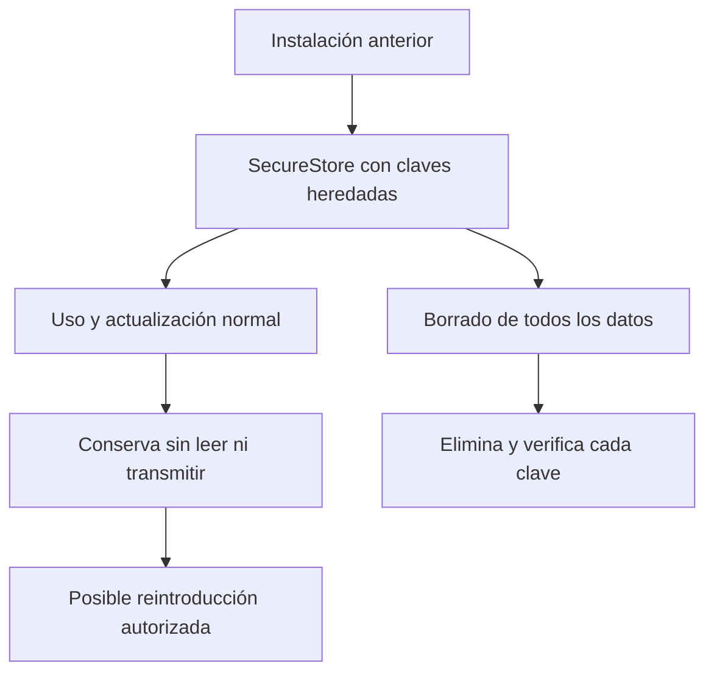
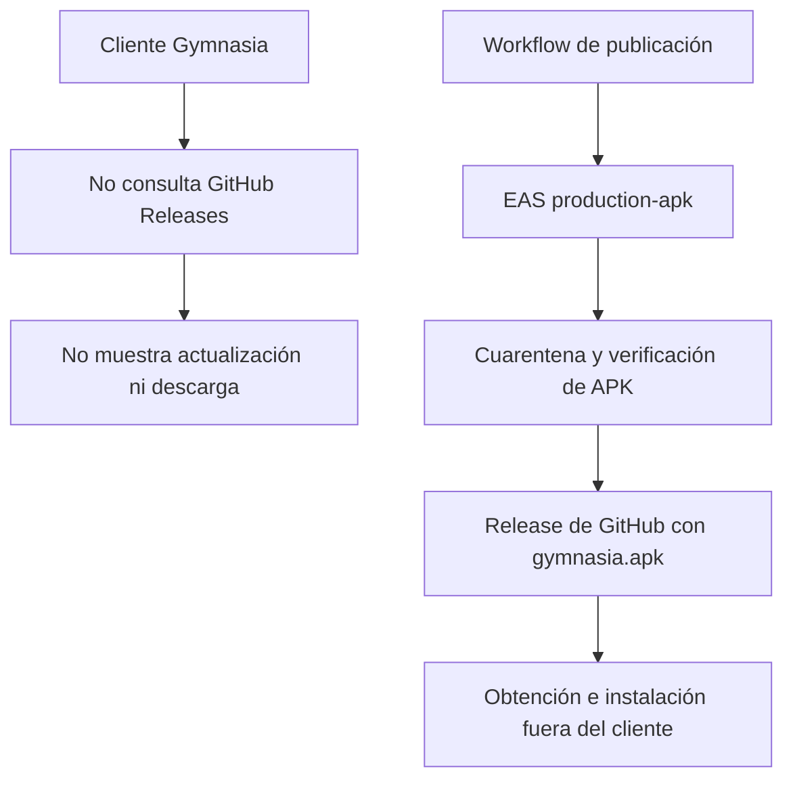

# Integraciones VivaGym y actualizaciones

Gymnasia no necesita VivaGym ni un servicio de actualización para arrancar, navegar o conservar sus dominios locales. Ambas superficies están **retiradas del runtime**: VivaGym es una referencia histórica aislada y las releases de APK son artefactos externos que el cliente no descubre, descarga ni instala. Esta separación evita que una integración de tercero o el canal de distribución se conviertan en una dependencia obligatoria del producto local-first. Véase también [Arquitectura local-first](../architecture/overview.md), [Shell de aplicaciones móviles y web](../mobile/application-shell.md) y [Compilación, publicación y pruebas](../operations/build-release-and-testing.md).

## Estado actual y frontera de VivaGym

No hay pestaña de Ajustes, flujo de autenticación, endpoint de MyVitale, petición de QR ni componente de QR activos. El contrato recorre las fuentes TypeScript/TSX de runtime —excluyendo pruebas y scripts— y rechaza los símbolos, host, rutas HTTP, textos de interfaz y la dependencia `react-native-qrcode-svg`; además comprueba que dicha dependencia no está declarada. Por tanto, la mera existencia de nombres heredados no autoriza una conexión ni el envío de credenciales.



*Figura 1. Las credenciales históricas se conservan pasivamente hasta un borrado total; no forman parte del flujo actual de VivaGym.*

### Credenciales heredadas y ciclo de vida

La lista cerrada `RETAINED_LEGACY_SECURE_STORE_KEYS` contiene únicamente `vivagym.email` y `vivagym.password`. Una versión anterior pudo haberlas escrito en SecureStore. La aplicación retirada no las lee ni las escribe durante la hidratación: `clearLegacyStorageData` elimina marcas de AsyncStorage y prefijos de claves de proveedores antiguos, pero no consume esas dos claves.

El ámbito de las claves sigue las variantes de la aplicación. Production usa la clave literal; Development y Staging añaden el *namespace* de su variante mediante `scopedSecureStoreKey`. Esto impide que los espacios de almacenamiento de variantes no productivas se confundan con Production; no equivale a migrar credenciales entre identificadores de aplicación.

La acción de borrado parcial de actividad conserva estas credenciales. En el borrado `all-personal`, `LOCAL_SECURE_DATA_MANIFEST` las incorpora como destinos literales: para cada una se ejecuta `SecureStore.deleteItemAsync` y después `SecureStore.getItemAsync` debe devolver `null`. Si SecureStore no está disponible en una plataforma nativa, el borrado total se informa como incompleto en vez de declarar eliminado un secreto que no pudo comprobarse. El borrado ejecuta las tareas en paralelo con timeout por destino y devuelve un informe completo o incompleto; los fallos distinguen borrado, verificación y timeout, para que la UI pueda ofrecer recuperación en vez de asumir atomicidad.

### Referencia histórica, no contrato de producción

`docs/research/GYM-6-vivagym-qr.md` describe una investigación anterior sobre MyVitale, autenticación y QR. El propio documento declara que la integración está retirada y que no describe funcionalidad incluida; debe tratarse como contexto histórico y no como especificación para copiar protocolos, secretos, endpoints o flujos al cliente.

Una reintroducción segura sería un trabajo de integración nuevo: necesita autorización y revisión de términos, un límite de módulo explícito, diseño de almacenamiento y borrado, controles para peticiones y QR sensibles, tratamiento de errores/cancelación/concurrencia y declaraciones de privacidad/tienda actualizadas. Debe añadir pruebas que demuestren el comportamiento habilitado y no limitarse a eliminar los tests de retirada.

## Actualizaciones: cliente sin actualizador propio

`App.tsx` no conserva servicio, estado, comprobación manual, pestaña de Ajustes, diálogo ni enlace para comparar versiones o abrir una descarga de APK. En particular, el contrato rechaza `releases/latest` y los identificadores/textos del actualizador anterior. La única marca `gymnasia.mobile.lastUpdateCheck` permanece en `LEGACY_STORAGE_KEYS` y en el manifiesto de datos locales para eliminarla al arrancar y durante un borrado total; no se vuelve a escribir ni condiciona ninguna solicitud.

El permiso Android `REQUEST_INSTALL_PACKAGES` no está declarado y sí figura en `blockedPermissions`. La política y sus pruebas exigen ambas condiciones; el comprobador también recorre los manifests de dependencias y falla ante contribuciones bloqueadas no reconocidas. `blockedPermissions` es la barrera de configuración frente al *manifest merger*, mientras que el escaneo evita que una nueva contribución pase desapercibida. Esta defensa no impide que una persona instale manualmente un APK que haya obtenido fuera de la aplicación; impide que **Gymnasia** solicite instalar paquetes externos.



*Figura 2. La publicación de APK es un proceso externo; no hay flujo de actualización desde el runtime de la app hacia una release.*

## Publicación manual de APK de Production

El workflow `.github/workflows/build-apk.yml` se activa manualmente o tras cambios elegibles bajo `apps/mobile/` en `main`; excluye scripts, documentación, recursos públicos y tests. Serializa transacciones en el grupo `android-production-release`. No ofrece un selector de perfil: la validación de fuente y el envío a EAS usan `production-apk`. Ese perfil extiende `production`, fija `APP_ENV=production`, habilita el incremento automático y añade `android.buildType: apk`; la variante resultante usa el identificador `com.maximofn.gymnasia`, canal `Production` y modo BYOK.

El pipeline no publica inmediatamente un binario sin verificar. Selecciona una transacción durable y valida el commit y versión exactos antes de crear o recuperar un borrador de release. Después adopta o envía un único build EAS, lo reconcilia hasta un estado terminal y descarga el APK a una ruta de cuarentena. `verify:production-artifact` recibe el artefacto, su MIME, evidencia de fuente, snapshot de política y metadatos de EAS. Solo entonces adjunta `gymnasia.apk` y las evidencias al borrador, comprueba identidad, tamaño, MIME, hashes y cadena de evidencia, y publica la release.

Existe un perfil `production` para AAB y una entrada de `submit` de Production en `eas.json`, pero son rutas distintas del workflow de APK. Hay una inconsistencia documental que debe corregirse al modificar esta zona: el texto explicativo de `REQUEST_INSTALL_PACKAGES` en `scripts/android-permissions/policy.json` dice que Production se actualiza exclusivamente por Google Play, mientras que el workflow ejecutable publica expresamente `gymnasia.apk` en GitHub. El comportamiento operativo verificable es el workflow; ninguno de los dos mecanismos reintroduce comprobación, descarga o instalación automática dentro del cliente.

## Contratos ejecutables y validación enfocada

Las pruebas separan ausencia de integración de referencias históricas:

- `apps/mobile/agent/vivagymRemoval.contract.test.ts` bloquea la superficie VivaGym del runtime y la dependencia QR, restringe las dos claves heredadas y exige que solo el borrado total las consuma; también comprueba que las declaraciones públicas no anuncien VivaGym.
- `apps/mobile/agent/updateRemoval.contract.test.ts` bloquea símbolos, UI y consulta de releases del actualizador, exige limpiar la marca heredada y confirma que el workflow mantiene la publicación manual con `production-apk`.
- `apps/mobile/scripts/development-provider.e2e.mjs` exporta Development, navega por Chat y Ajustes y falla si aparece la pestaña VivaGym o si se solicita MyVitale, GitHub Releases o un proveedor real en modo falso.
- `apps/mobile/scripts/update-removal.e2e.mjs` exporta Production, vacía `localStorage`, intercepta GitHub y verifica que Inicio y Ajustes no muestren la interfaz retirada ni soliciten `https://api.github.com/repos/maximofn/gymnasia/releases/latest`.
- `scripts/android-permissions/permissions.test.mjs` comprueba el bloqueo de `REQUEST_INSTALL_PACKAGES`; el workflow incorpora además las puertas `verify:production-source` y `verify:production-artifact` antes de publicar el APK.

Para modificar estas fronteras, ejecute al menos:

```bash
npm --workspace apps/mobile run test:deterministic
npm run test:agent:e2e
npm run test:update-removal:e2e
npm run test:android-permissions
```

Un cambio en publicación de Production debe además pasar las verificaciones de fuente y artefacto que invoca el workflow. Una prueba web no demuestra el manifest fusionado ni el comportamiento de instalación de un dispositivo Android; la inspección del artefacto de Production sigue siendo la barrera para permisos, identidad y cadena de evidencia.
