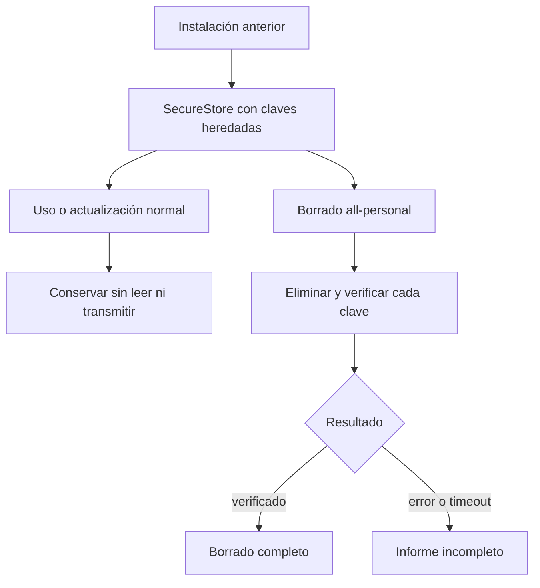
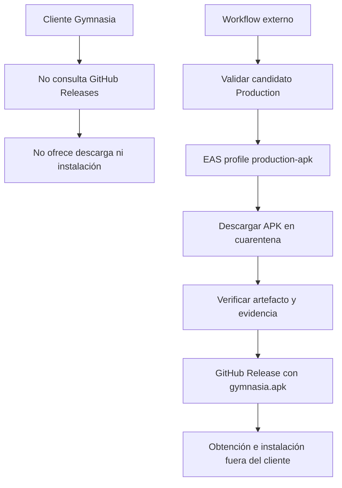

# VivaGym y actualizaciones

Gymnasia no necesita VivaGym ni un servicio de actualización para arrancar, navegar o conservar sus dominios locales. Ambas superficies están **retiradas del runtime**: VivaGym solo deja datos heredados cuidadosamente acotados y una release de APK es un artefacto externo que el cliente no descubre, descarga ni instala. Esta separación conserva el límite local-first: una integración de tercero o el canal de distribución no se convierten en dependencia del producto. Véanse también [Arquitectura local-first](../architecture/overview.md), [Shell de aplicación, plataformas y navegación](../mobile/application-shell.md), [Permisos Android y fiabilidad de avisos](../operations/android-permissions.md) y [Build, release y estrategia de validación](../operations/build-release-and-testing.md).

## VivaGym: superficie retirada y datos conservados

El contrato de retirada recorre las fuentes TypeScript/TSX de runtime, excluyendo pruebas y scripts, y rechaza la interfaz y el protocolo de VivaGym: identificadores, host MyVitale, rutas de autenticación y QR, textos de UI y `react-native-qrcode-svg`. Además, `package.json` no declara esa dependencia. En consecuencia, no hay pestaña de Ajustes, autenticación, solicitud de QR ni flujo actual que lea o transmita credenciales VivaGym.



*Figura 1. Las credenciales heredadas no participan en el runtime; el borrado total es la única ruta que las consume.*

### Ciclo de vida de las credenciales heredadas

`RETAINED_LEGACY_SECURE_STORE_KEYS` es una lista cerrada de `vivagym.email` y `vivagym.password`. Una versión anterior pudo haberlas escrito; el runtime retirado no las lee ni escribe. La lista solo se importa en `storage/localDataDeletion.ts`, donde entra en `LOCAL_SECURE_DATA_MANIFEST` como destino literal: el borrado de actividad las preserva y `all-personal` las marca para eliminar.

El constructor de tareas de borrado usa las claves con ámbito de la variante mediante `scopedSecureStoreKey`. Production conserva la clave base; Development y Staging usan su *namespace*. Por ello, el manejo de una instalación de prueba no se confunde con el de Production y tampoco migra secretos entre identificadores de aplicación.

Para cada destino seguro disponible, `App.tsx` ejecuta `SecureStore.deleteItemAsync` y comprueba con `SecureStore.getItemAsync` que el resultado sea `null`. Cada operación de borrado o verificación tiene un timeout de cinco segundos. El informe contiene los destinos completados y los fallos; si SecureStore no está disponible en una plataforma nativa, se añade expresamente un fallo y el resultado es `incomplete`, en vez de afirmar que una credencial fue eliminada. La interfaz debe respetar esa degradación y ofrecer recuperación o reintento, no asumir atomicidad.

> La conservación pasiva no es una autorización para restaurar VivaGym. Reintroducirla exige una integración nueva con autorización, revisión de términos y privacidad, diseño de secreto y borrado, límites explícitos de red/QR y pruebas del comportamiento habilitado. Eliminar los contratos de retirada no constituye una implementación segura.

## Actualizaciones: no existe un actualizador en el cliente

El contrato de retirada prohíbe en `App.tsx` el servicio, estado, acciones, UI y consulta a `/releases/latest` del actualizador anterior. La E2E de Production exporta la app web sin estado, visita Inicio y Configuración, intercepta GitHub y falla si aparece UI retirada o se solicita `https://api.github.com/repos/maximofn/gymnasia/releases/latest`. La E2E de Development también comprueba la ausencia de pestaña VivaGym y de solicitudes tanto a MyVitale como a GitHub Releases.

Solo subsiste `gymnasia.mobile.lastUpdateCheck` como dato de compatibilidad. Está en `LEGACY_STORAGE_KEYS`, se elimina mediante `AsyncStorage.multiRemove` al arrancar una instalación existente y figura en el manifiesto de borrado total; no se vuelve a escribir ni controla una petición. No convierta esa literal histórica en una señal de que haya comprobación de versión activa.



*Figura 2. La release APK es una operación externa y verificada, sin ruta de actualización desde el runtime.*

### Permiso de instalación: defensa declarativa y de artefacto

`REQUEST_INSTALL_PACKAGES` no está en `expo.android.permissions` y está en `expo.android.blockedPermissions`; la misma prohibición aparece en `scripts/android-permissions/policy.json`. La prueba confirma ambos lados y el evaluador revisa los manifests instalados para detectar contribuciones de dependencias. Esta defensa evita que Gymnasia recupere la capacidad de solicitar instalaciones de paquetes externos por configuración o *manifest merger*.

El escaneo del checkout no sustituye la verificación de release: sin manifests instalados informa `scanner-empty`, y el verificador del artefacto inspecciona el manifest fusionado del APK/AAB frente a la política. El bloqueo no impide que una persona instale manualmente un APK obtenido fuera de la app; impide que el **cliente** actúe como instalador.

## Publicación externa del APK de Production

`.github/workflows/build-apk.yml` se activa por cambios empaquetados de `apps/mobile` en `main` —con exclusiones para scripts, documentación, público y tests— o manualmente. La entrada manual permite `reconcile`, `retry-failed` o `supersede-failed`; las dos últimas requieren versión objetivo y motivo en el selector de transacción. La concurrencia `android-production-release` no cancela una ejecución en curso.

El workflow selecciona primero la transacción durable más antigua y valida el SHA y la versión exactos mediante `verify:production-source --profile production-apk --artifact-type apk`. Si procede construir, trabaja bajo el environment protegido `Production`, crea un borrador de GitHub antes de EAS y conserva en él la transacción, evidencia de fuente y snapshot/bundle de política. Puede adoptar **un único** build EAS que coincida en perfil, versión, commit y mensaje; de otro modo envía `eas build --platform android --profile production-apk`. Si EAS termina en error, cancelación o expira la espera, la transacción retiene el build ID para reconciliarla: reintentar o sustituir no es automático.

`production-apk` extiende el perfil EAS `production`: fija `APP_ENV=production`, hereda el incremento automático y fuerza `android.buildType: apk`. `app.config.ts` deriva para esa variante el identificador `com.maximofn.gymnasia`, canal `Production`, namespace de almacenamiento de Production y modo BYOK. El perfil `production` sin esa extensión y su sección `submit` son rutas distintas; no deben confundirse con la publicación de APK que realiza este workflow.

Cuando EAS devuelve un artefacto terminado, el workflow lo descarga a una ruta de cuarentena y exige MIME HTTP. `verify:production-artifact` recibe el APK, el nombre publicado, MIME, evidencia de fuente, snapshot de política y metadatos de EAS; solo si pasa mueve el binario a `gymnasia.apk`, marca validada la transacción y adjunta APK y evidencia al borrador. Antes de publicarlo, vuelve a verificar que el borrador apunta al commit elegido, que el asset cumple MIME y límites de tamaño, y que hashes, tamaños y cadena de evidencias coinciden. Finalmente quita el estado draft y lo marca latest.

La política de permisos contiene texto histórico que menciona una actualización exclusiva por Google Play para justificar `REQUEST_INSTALL_PACKAGES`; no debe leerse como descripción del flujo ejecutable actual. El workflow anterior publica expresamente `gymnasia.apk` en GitHub. La invariante de producto es más estrecha: ningún canal de distribución reintroduce consulta, descarga o instalación automática **desde la app**.

## Contratos y validación focalizada

Los controles cubren fronteras diferentes:

- `apps/mobile/agent/vivagymRemoval.contract.test.ts` bloquea la superficie VivaGym y la dependencia QR, restringe las dos claves heredadas, exige que solo el borrado total las consuma y comprueba que las declaraciones públicas no anuncien la integración.
- `apps/mobile/agent/updateRemoval.contract.test.ts` bloquea el actualizador, exige retirar su marca heredada al arrancar y confirma que el workflow sigue siendo publicación manual Production con `production-apk` y release durable.
- `apps/mobile/scripts/development-provider.e2e.mjs` y `apps/mobile/scripts/update-removal.e2e.mjs` observan en bundles web las ausencias de UI y red. Son controles de runtime web; no prueban SecureStore nativo ni el manifest Android fusionado.
- `scripts/android-permissions/permissions.test.mjs` prueba política, configuraciones y vivacidad del escáner. La verificación de artefacto del workflow es la barrera posterior al *manifest merger*.

Antes de modificar retirada, datos heredados, permisos o publicación, ejecute al menos:

```bash
npm --workspace apps/mobile run test:deterministic
npm run test:agent:e2e
npm run test:update-removal:e2e
npm run check:android-permissions
npm run test:android-permissions
```

Un cambio del workflow o de un artefacto Production debe además recorrer sus gates de fuente y artefacto en CI. Una E2E web verde no acredita borrado en SecureStore, permisos fusionados ni comportamiento de instalación en Android; para esos límites se necesita la verificación del APK y una prueba nativa representativa.
