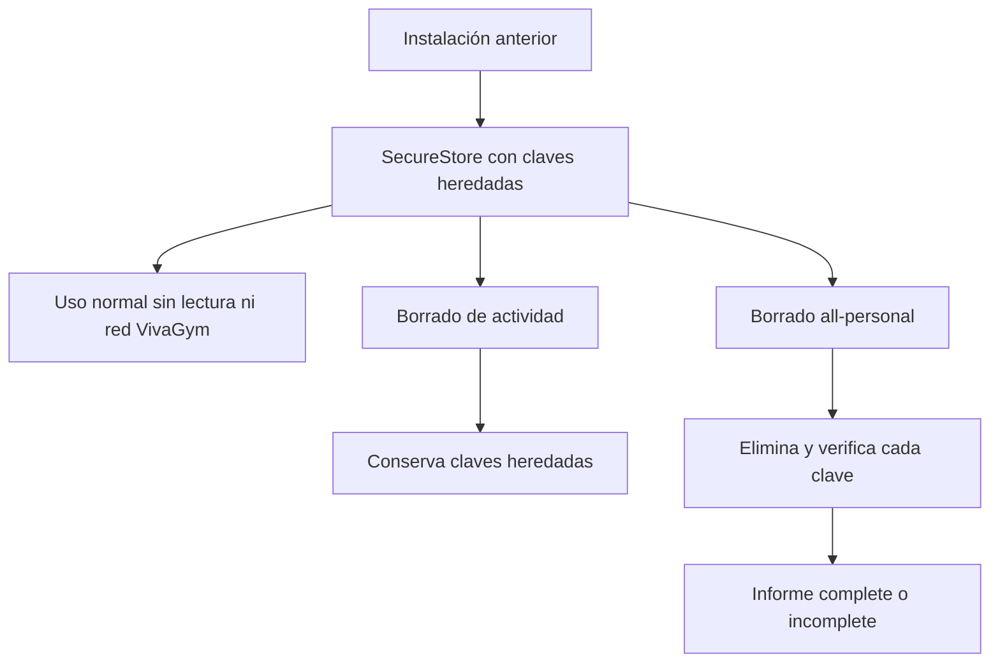
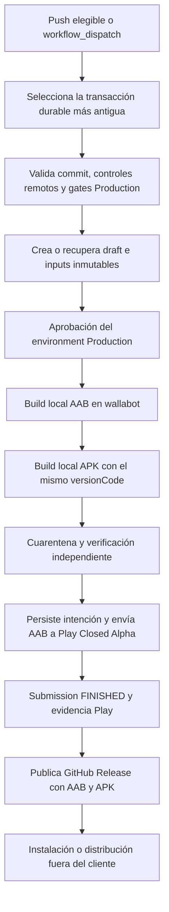

# VivaGym y actualizaciones de distribución

Gymnasia mantiene tres contratos separados que no deben confundirse:

1. **VivaGym no forma parte del runtime.** No hay autenticación, red, QR ni interfaz activa para esa integración.
2. **Dos claves históricas de VivaGym se conservan solo para poder borrarlas.** Su presencia en el manifiesto de eliminación no reactiva la integración.
3. **El cliente no contiene un actualizador de APK.** La compilación, verificación, promoción a la pista cerrada `alpha` de Google Play y publicación de binarios en GitHub ocurren fuera de la aplicación.

Esta separación evita interpretar residuos de migración o infraestructura de distribución como capacidades del cliente. Para el estado local general, véase [Estado local, persistencia y copias](../mobile/local-state-and-backup.md); para permisos y controles de release, [Permisos Android](../operations/android-permissions.md) y [Build, release y pruebas](../operations/build-release-and-testing.md).

## VivaGym: retirada, no integración latente

El contrato `vivagymRemoval.contract.test.ts` recorre las fuentes TypeScript y TSX del runtime, omitiendo pruebas, scripts, `public`, `dist` y `node_modules`. Rechaza los símbolos del antiguo protocolo, el host `vivagym.myvitale.com`, las rutas OAuth y QR, el texto de interfaz y `react-native-qrcode-svg`; también exige que esa dependencia no aparezca en `package.json`. Por tanto, no hay pestaña, autenticación, solicitud de QR ni tráfico MyVitale en la aplicación actual.

Los documentos o investigaciones anteriores sobre MyVitale y QR son contexto histórico, no una especificación de producción. Reintroducir VivaGym sería una integración nueva: requeriría autorización y revisión de términos y privacidad, límites explícitos de red y almacenamiento, borrado, controles de QR y pruebas positivas. Quitar el contrato de ausencia, por sí solo, no satisface esos requisitos.

### Claves heredadas y borrado explícito

`RETAINED_LEGACY_SECURE_STORE_KEYS` es una lista cerrada con `vivagym.email` y `vivagym.password`. El runtime retirado no las consulta ni las actualiza. `LOCAL_SECURE_DATA_MANIFEST` las clasifica como `activity: "preserve"` y `full: "delete"`: borrar actividad no las toca, mientras que el borrado `all-personal` crea destinos de SecureStore que eliminan y después comprueban cada clave.

```mermaid
flowchart TD
    OldInstall["Instalación anterior"] --> SecureStore["SecureStore con claves heredadas"]
    SecureStore --> NormalUse["Uso normal sin lectura ni red VivaGym"]
    SecureStore --> ActivityDelete["Borrado de actividad"]
    ActivityDelete --> Preserve["Conserva claves heredadas"]
    SecureStore --> FullDelete["Borrado all-personal"]
    FullDelete --> DeleteVerify["Elimina y verifica cada clave"]
    DeleteVerify --> Report["Informe complete o incomplete"]
```

*Las claves históricas permanecen pasivas hasta un borrado total explícito y verificable.*

El ejecutor de borrado lanza los destinos en paralelo. Para cada uno aplica timeout independiente a la eliminación y a la verificación, omite la verificación si falló la eliminación y clasifica el resultado como `delete`, `verify` o `timeout`. El informe solo es `complete` cuando todos los destinos concluyen y verifican; en otro caso conserva los fallos y los destinos completados para informar o reintentar sin afirmar un borrado que no pudo comprobarse.

Las claves seguras se delimitan además por variante: Production usa la clave base y Development o Staging aplican su namespace. Esto separa ámbitos de almacenamiento; no migra ni comparte las credenciales entre identificadores de aplicación.

## Ausencia del actualizador dentro del cliente

`updateRemoval.contract.test.ts` impide que `App.tsx` recupere el servicio, estado, acciones, textos, navegación o endpoint `/releases/latest` del antiguo actualizador. La marca `gymnasia.mobile.lastUpdateCheck` subsiste únicamente en inventarios de datos heredados: al arrancar, `clearLegacyStorageData` la pasa a `AsyncStorage.multiRemove`, y el borrado total también la clasifica como eliminable. No provoca una comprobación de versión.

Android tampoco declara `REQUEST_INSTALL_PACKAGES`: `app.json` lo incluye en `blockedPermissions`, y la política de permisos y sus pruebas evitan que configuración o dependencias lo reintroduzcan. El verificador de artefactos vuelve a inspeccionar los permisos del manifest fusionado. El límite es preciso: una persona puede obtener e instalar externamente `gymnasia.apk`, pero Gymnasia no solicita permiso para descargar o instalar otros paquetes.

## Distribución Android externa vigente

El workflow `.github/workflows/build-apk.yml` produce **dos artefactos de la misma versión**:

- `gymnasia.aab`, perfil `production`, se envía por path mediante EAS Submit a Google Play, pista cerrada `alpha`, con `releaseStatus: completed`.
- `gymnasia.apk`, perfil `production-apk`, se adjunta a la misma GitHub Release para instalación directa externa.

Esto no crea un canal de actualización en runtime: la app no consulta GitHub Releases ni descarga o instala el APK.

```mermaid
flowchart TD
    Trigger["Push elegible o workflow_dispatch"] --> Select["Selecciona la transacción durable más antigua"]
    Select --> Source["Valida commit, controles remotos y gates Production"]
    Source --> Draft["Crea o recupera draft e inputs inmutables"]
    Draft --> Approval["Aprobación del environment Production"]
    Approval --> BuildAAB["Build local AAB en wallabot"]
    BuildAAB --> BuildAPK["Build local APK con el mismo versionCode"]
    BuildAPK --> Quarantine["Cuarentena y verificación independiente"]
    Quarantine --> PlayIntent["Persiste intención y envía AAB a Play Closed Alpha"]
    PlayIntent --> PlayDone["Submission FINISHED y evidencia Play"]
    PlayDone --> Publish["Publica GitHub Release con AAB y APK"]
    Publish --> External["Instalación o distribución fuera del cliente"]
```

*La release permanece como borrador hasta validar ambos binarios y completar la promoción a Play Closed Alpha.*

### Triggers, cola y operaciones manuales

El workflow se activa con `workflow_dispatch` o con cambios elegibles de `apps/mobile/**` en `main`; excluye scripts, Markdown, recursos públicos y pruebas TypeScript. Solo opera en `maximofn/gymnasia` y `refs/heads/main`. El grupo `android-production-release`, con `cancel-in-progress: false`, serializa las ejecuciones y evita cancelar una transacción en curso.

La selección siempre atiende primero la transacción pendiente de menor versión semántica. Las operaciones manuales son:

- `reconcile`: crea una transacción para la versión actual, reanuda la más antigua o verifica una release ya publicada;
- `retry-failed`: reabre solo una transacción `failed` y exige un motivo;
- `supersede-failed`: marca como sustituida una transacción fallida, exige motivo y que `main` declare una versión posterior;
- `adopt-submission`: enlaza manualmente un `submission_id` cuando Play pudo aceptar una petición pero EAS no devolvió su identidad.

`target_version` puede identificar la transacción que se pretende operar, pero, si se proporciona, debe coincidir con la más antigua; no permite saltarse la cola. Tras una publicación o sustitución, `enqueue-next` dispara otra reconciliación si `main` ya contiene una versión posterior.

### Fuente, borrador e inputs inmutables

`validate-production` hace checkout del commit de la transacción y genera una única `ProductionSourceEvidenceV2` para los targets `production` AAB y `production-apk` APK. Verifica repositorio, rama, ascendencia desde `main`, limpieza, versión, ruleset, environments, PR y checks requeridos; después ejecuta los gates Production y falla si estos modifican el checkout.

Antes de compilar, el workflow crea o recupera un draft durable. En una transacción nueva fija el snapshot y bundle de política, la evidencia de fuente y una referencia de `versionCode` basada en `PLAY_VERSION_CODE_FLOOR` y la última evidencia APK publicada. En una reanudación restaura esos inputs en vez de recalcularlos. `local-controller.mjs` guarda su SHA-256 en cada intento, impide duplicar un intento aún activo y hace que el runner vuelva a comprobar todos los hashes.

### Build local AAB y APK

`compile-android` es el único job autoalojado y el único asociado al environment `Production`; la aprobación desbloquea `EXPO_TOKEN`. Se ejecuta en el runner Linux x64 `wallabot` dentro de una VM desechable, sin permisos de escritura sobre contenidos. `run-local-build.mjs` exige commit, versión, inputs, herramienta y aislamiento exactos, y ejecuta `eas build --local --non-interactive --freeze-credentials` para cada pata reservada.

El orden es deliberado: primero `production` genera el AAB y reserva por `autoIncrement` el siguiente `versionCode` remoto; después `production-apk`, con `autoIncrement: false`, genera el APK reutilizando ese código. No se crea una build EAS cloud. Cada resultado lleva metadatos `wallabot-local` con intento, commit, perfil, versión, toolchain, SHA-256 y tamaño. Los binarios se transfieren como no confiables al job de verificación y checkout, logs privados y material temporal se eliminan al terminar.

### Cuarentena y verificación de artefactos

El job `verify-artifacts` recupera los resultados en `/tmp/quarantine`, los enlaza con sus intentos terminados y verifica AAB y APK por separado. `verify-artifact.mjs` inspecciona configuración embebida, manifest, identidad de paquete, versión y SDK, certificado, permisos, sonidos, tamaño, SHA-256 y MIME contra política, evidencia de fuente y snapshot. Para el AAB valida además la firma y estructura con un `bundletool` cuyo binario y versión están fijados; para el APK usa `apkanalyzer`, `apksigner` y `aapt2`.

Cada `ProductionArtifactEvidenceV2` incluye resultado, commit y hash de evidencia de fuente, perfil, identidad del intento local y toolchain, metadatos del binario, snapshot de política, herramientas y violaciones. La evidencia se escribe incluso cuando hay violaciones y después el comando falla. Solo artefactos aprobados pasan a `validated`; ambos deben tener el mismo `versionCode`, y el del AAB debe superar el máximo entre el suelo declarado de Play y la última publicación conocida.

El draft debe seguir apuntando al commit fuente y contener los digests esperados de `gymnasia.aab`, `gymnasia.apk` y sus evidencias antes de contactar Play.

### Envío a Play y publicación final

Después de validar ambos binarios, el job usa el environment de GitHub `Play Internal` (nombre de protección) para promover a la pista cerrada `alpha` y registra durablemente una intención ligada al SHA-256 del AAB y al `versionCode` **antes** de ejecutar EAS Submit. Solo sube el AAB local validado mediante `--path`; no adopta una build cloud. Persiste el submission ID, espera su estado terminal y únicamente acepta `FINISHED`. Un submission fallido conocido se reintenta por su ID sin volver a subir el AAB.

Si la petición pudo llegar a EAS pero no devolvió ID, la pata Play queda `uncertain`: el workflow se niega a repetir automáticamente la subida. Una persona debe reconciliarla y usar `adopt-submission` con el ID exacto. Esta regla evita duplicar envíos a Play.

La transacción V2 mantiene patas independientes `aab`, `apk` y `play`. Los binarios recorren `prepared`, `building`, `built` y `validated`; Play recorre intención, submission observado y validación. Cualquier pata fallida lleva la transacción global a `failed`; reintentar o sustituir requiere una operación manual motivada. El historial de transiciones y el draft se conservan para reanudar sin cambiar commit ni inputs.

La GitHub Release solo deja de ser draft cuando la transacción global es `validated`, Play tiene evidencia `FINISHED` para `alpha / completed`, y la release conserva commit, MIME, tamaños y cadena de hashes de AAB, APK, fuente, Play y evidencias. La publicación final incluye ambos binarios, aunque el artefacto instalable directamente es `gymnasia.apk` y el AAB es exactamente el enviado a la pista cerrada `alpha`.

### Contradicción de política que sigue vigente

La justificación de `REQUEST_INSTALL_PACKAGES` en `scripts/android-permissions/policy.json` afirma que Production se actualiza exclusivamente mediante Google Play. La ruta ejecutable publica también `gymnasia.apk` en GitHub para instalación directa. Esa frase de política es, por tanto, más restrictiva que la distribución vigente y debería corregirse al modificar la política. No cambia el contrato de runtime: ni la pista `alpha` de Play ni GitHub Releases habilitan al cliente para comprobar, descargar o instalar APK automáticamente.

## Contratos y validación focalizada

| Cambio o riesgo | Comprobación | Qué acredita |
| --- | --- | --- |
| Reaparición de VivaGym, MyVitale, QR o dependencia QR | `npm run test:deterministic` | Ausencia de protocolo e interfaz, lista cerrada de claves y consumo limitado al borrado total. |
| Reaparición del actualizador | `npm run test:deterministic` | Ausencia de servicio, UI y endpoint, y limpieza de la marca heredada. |
| Superficies o peticiones retiradas en web | `npm run test:agent:e2e` y `npm run test:update-removal:e2e` | Development y Production no muestran controles retirados ni contactan MyVitale o GitHub Releases. |
| Permisos o plugins Android | `npm run check:android-permissions && npm run test:android-permissions` | Coherencia entre configuración y política y detección de permisos aportados por dependencias; no sustituye la inspección del binario. |
| Fuente y artefactos Production | `npm run verify:production-source` y `npm run verify:production-artifact` | Correspondencia del candidato exacto y de cada binario con identidad, política, snapshot, toolchain y evidencia. |
| Controlador y workflow de release | `npm run test:production-release` | Cola, estados V2, intentos locales, `versionCode` común, envío por path, manejo de incertidumbre y publicación posterior a Play. |

Las E2E demuestran ausencia observable de interfaz y red, pero no prueban permisos del manifest ni instalación en dispositivo. Del mismo modo, los contratos del workflow prueban estructura y orden del proceso; una release real debe superar tanto la validación de fuente como la inspección de los dos binarios y la reconciliación de Play.
