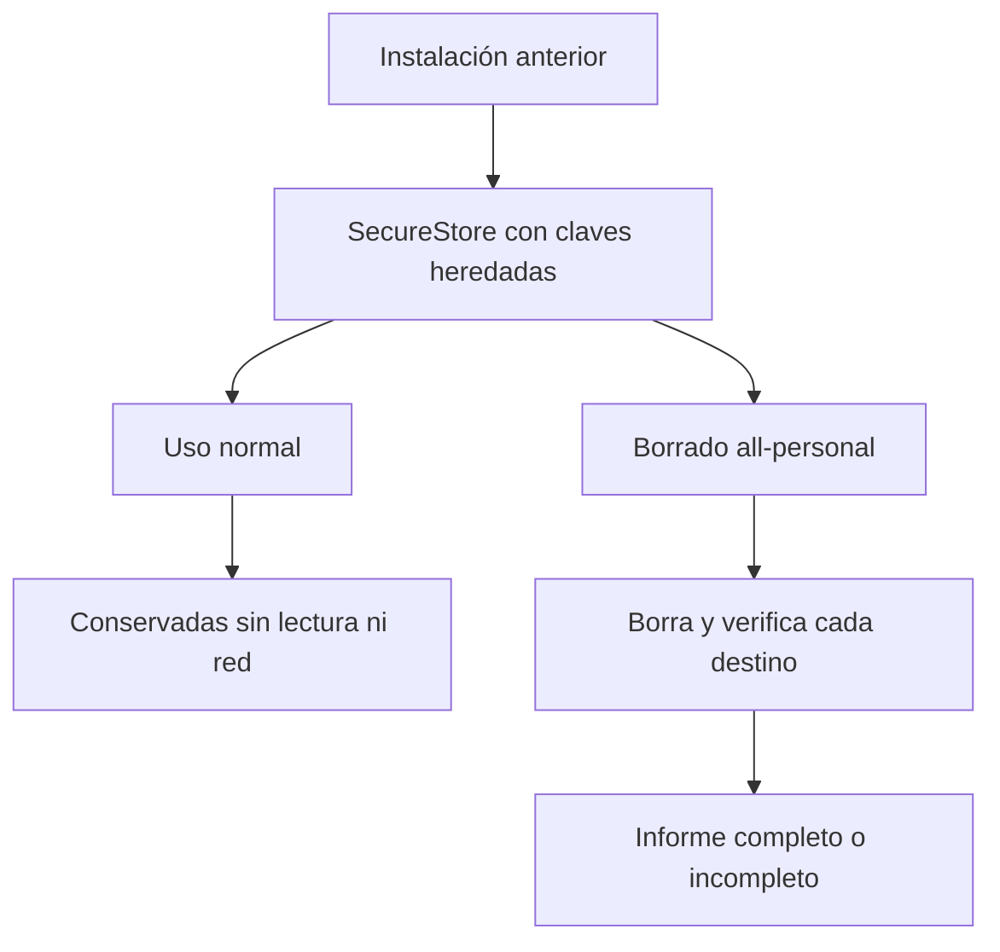
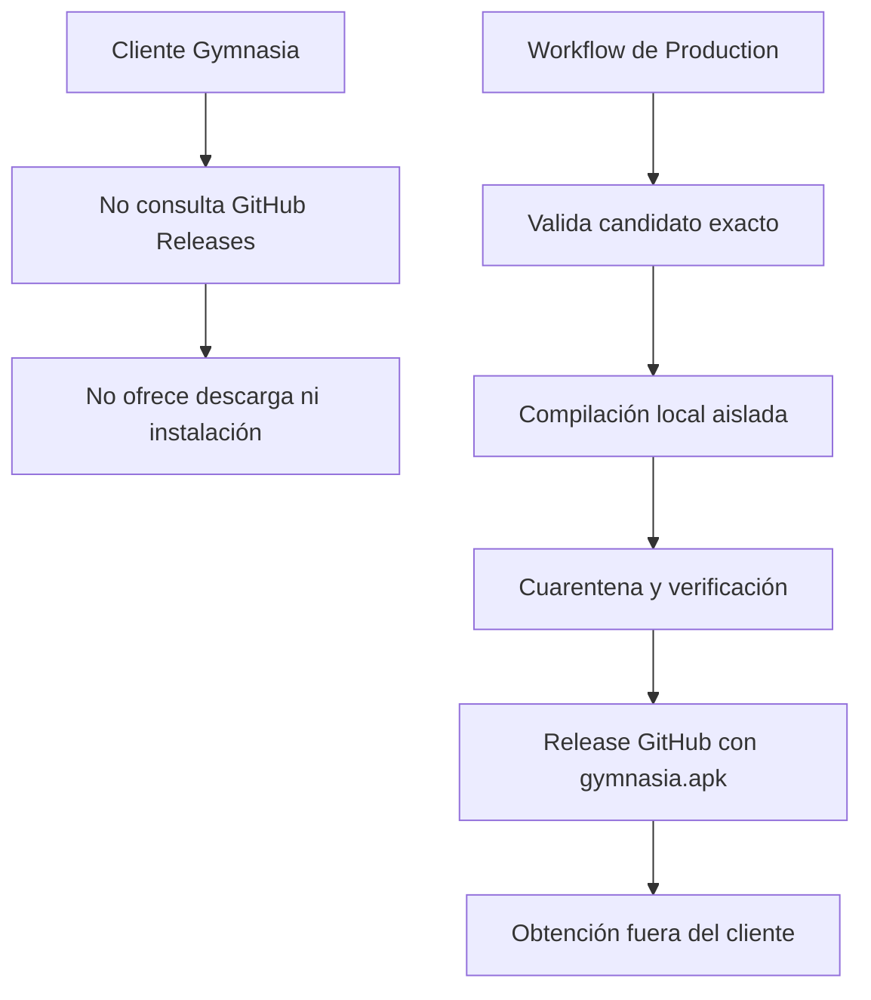

# Integraciones retirables y actualizaciones

Gymnasia no depende de VivaGym ni de un actualizador de APK para iniciar, navegar o conservar sus dominios locales. Ambas son superficies **retiradas del runtime**: VivaGym queda como dato histórico aislado, y la distribución Android ocurre fuera del cliente mediante una cadena de release protegida. Esta página distingue esas ausencias deliberadas de las integraciones activas del producto y describe las puertas que han de pasar antes de publicar. Véanse también [Shell de aplicaciones móviles y web](../mobile/application-shell.md), [Permisos Android y fiabilidad de avisos](../operations/android-permissions.md) y [Build, release y estrategia de validación](../operations/build-release-and-testing.md).

## VivaGym: retirada, no integración latente

No hay pestaña de Ajustes, autenticación, endpoint de MyVitale, petición de QR ni componente QR de VivaGym en el runtime. El contrato `vivagymRemoval.contract.test.ts` recorre las fuentes TypeScript/TSX de la app, excluyendo pruebas y scripts, y rechaza símbolos del protocolo, host, rutas OAuth/QR, copia de interfaz y `react-native-qrcode-svg`; además exige que la dependencia no figure en `package.json`. En consecuencia, los nombres heredados no habilitan una conexión ni el manejo de credenciales.

La investigación anterior de MyVitale o QR debe tratarse como contexto histórico, no como especificación de producción. Reintroducir VivaGym sería una integración nueva: requiere autorización, revisión de términos y privacidad, un límite de módulo y almacenamiento explícitos, borrado, controles de red y QR, y pruebas positivas del flujo habilitado. Eliminar el contrato de retirada no acredita ninguno de esos requisitos.

### Credenciales heredadas

La única lista retenida es `RETAINED_LEGACY_SECURE_STORE_KEYS`, con `vivagym.email` y `vivagym.password`. La app retirada no las lee ni escribe durante el uso normal. Las consume exclusivamente los destinos de `LOCAL_SECURE_DATA_MANIFEST` en el borrado total (`all-personal`); el borrado de actividad las conserva.

```mermaid
flowchart TD
    OldInstall["Instalación anterior"] --> SecureStore["SecureStore con claves heredadas"]
    SecureStore --> NormalUse["Uso normal"]
    NormalUse --> Retained["Conservadas sin lectura ni red"]
    SecureStore --> FullDelete["Borrado all-personal"]
    FullDelete --> DeleteVerify["Borra y verifica cada destino"]
    DeleteVerify --> Report["Informe completo o incompleto"]
```

*Las credenciales históricas son pasivas hasta un borrado total explícito; no pertenecen al flujo VivaGym actual.*

Cada tarea de borrado tiene timeout, fase de borrado y verificación. Los destinos se ejecutan en paralelo; el resultado solo es `complete` si todos terminan y verifican correctamente, y los fallos se clasifican como `delete`, `verify` o `timeout`. Así la interfaz puede informar una eliminación incompleta sin afirmar que un secreto inaccesible ya se eliminó.

Las claves de SecureStore se delimitan por variante: Production conserva la clave base y Development/Staging usan la clave con namespace. Esto separa ámbitos de almacenamiento; no migra ni comparte credenciales entre identificadores de aplicación.

## Sin actualizador dentro del cliente

`updateRemoval.contract.test.ts` impide que `App.tsx` recupere el servicio, estado, acciones, textos, pestaña de Ajustes o URL `/releases/latest` del actualizador. La marca `gymnasia.mobile.lastUpdateCheck` subsiste únicamente como dato heredado que se elimina al arrancar mediante `AsyncStorage.multiRemove` y en el borrado total; no desencadena comprobaciones de versión.

Android tampoco declara `REQUEST_INSTALL_PACKAGES`: figura en `blockedPermissions`, y los controles contrastan `app.json`, la política y los manifests de dependencias. El bloqueo reduce el riesgo de que el manifest merger reintroduzca la capacidad de instalar paquetes externos; el verificador de release inspecciona después el manifiesto fusionado del APK. Esto no impide que una persona instale manualmente un APK obtenido fuera de Gymnasia, sino que impide que **Gymnasia** solicite hacerlo.

```mermaid
flowchart TD
    Client["Cliente Gymnasia"] --> NoCheck["No consulta GitHub Releases"]
    NoCheck --> NoInstall["No ofrece descarga ni instalación"]
    Workflow["Workflow de Production"] --> Source["Valida candidato exacto"]
    Source --> LocalBuild["Compilación local aislada"]
    LocalBuild --> Artifact["Cuarentena y verificación"]
    Artifact --> Release["Release GitHub con gymnasia.apk"]
    Release --> External["Obtención fuera del cliente"]
```

*La distribución del APK es una operación externa y validada; no crea un canal de actualización en el runtime.*

## Publicación de APK Production

El workflow `.github/workflows/build-apk.yml` se ejecuta mediante `workflow_dispatch` o tras cambios elegibles bajo `apps/mobile/` en `main`; excluye scripts, documentación, recursos públicos y tests. El grupo `android-production-release`, sin cancelación en curso, serializa transacciones. La operación manual admite `reconcile`, `retry-failed` y `supersede-failed`; las dos últimas requieren versión objetivo y motivo.

La transacción durable identifica versión, commit fuente, perfil `production-apk` y artefacto APK. Antes de compilar, el workflow valida el checkout exacto y ejecuta los gates Production, conserva evidencia de fuente y crea o recupera el borrador de release. En una transacción nueva captura además el snapshot y bundle de política; en una reanudación restaura los inputs inmutables del borrador.

La compilación **no adopta ni envía un build EAS remoto**. `compile-android` ejecuta un build local en un runner autoalojado y VM desechable, con el SHA validado y los inputs comprobados. `run-local-build.mjs` usa `eas build --local --profile production-apk --freeze-credentials`, produce `gymnasia.apk` y metadatos ligados al intento local; no puede enviar una build remota ni publicar. El APK y los metadatos se transfieren como artefacto no confiable a un job independiente de verificación, y el material de compilación se borra al finalizar el job.

El perfil `production-apk` extiende `production`, fija `APP_ENV=production`, activa el incremento de versión y fuerza `android.buildType: apk`. La política de release fija además identidad Android, canal `Production`, modo BYOK, SDK objetivo y certificado esperado. El perfil `production` para AAB y `submit.production` existen en `eas.json`, pero no son la ruta de este workflow de APK.

### Cuarentena, evidencia y publicación

`verify-and-release` descarga exactamente el APK y `local-build-metadata.json` a cuarentena, exige que no haya enlaces simbólicos ni archivos adicionales y liga el resultado al intento de la transacción. Solo entonces `verify-artifact.mjs` inspecciona el archivo: extrae configuración embebida, manifiesto, certificado, recursos de sonido, permisos, tamaño, SHA-256 y MIME, y los evalúa contra la política, evidencia de fuente y snapshot de política. Una violación deja evidencia con resultado `failed` y detiene la publicación.

Tras una verificación aprobada, el workflow guarda los hashes y tamaño en la transacción, adjunta APK y evidencias al borrador y consulta la release de GitHub. Antes de hacerla pública exige que siga siendo borrador, que apunte al commit fuente, que el MIME y tamaño se ajusten a política y que los digests de APK, transacción, evidencia de artefacto, evidencia de fuente e inputs inmutables formen la cadena esperada. Solo entonces publica la release inmutable con `gymnasia.apk`. Si falla o se cancela durante compilación/verificación, conserva el borrador y registra un fallo que exige reintento manual motivado.

La explicación de `REQUEST_INSTALL_PACKAGES` en `scripts/android-permissions/policy.json` dice que Production se actualiza exclusivamente por Google Play, mientras que el workflow ejecutable publica `gymnasia.apk` en GitHub. Es una contradicción documental que debe corregirse al tocar esta política. No altera el límite relevante: ninguna de esas rutas habilita al cliente para comprobar, descargar o instalar APK automáticamente.

## Contratos y validación focalizada

| Cambio o riesgo | Comprobación | Qué acredita |
| --- | --- | --- |
| Reaparición de VivaGym, MyVitale, QR o dependencia QR | `npm run test:deterministic` | El contrato de ausencia, la lista cerrada de claves y el uso limitado al borrado total. |
| Reaparición del actualizador | `npm run test:deterministic` | Ausencia de servicio, UI, endpoint y limpieza de la marca heredada. |
| Superficies o peticiones retiradas en web | `npm run test:agent:e2e` y `npm run test:update-removal:e2e` | Development no muestra VivaGym ni contacta MyVitale o Releases; Production, con `localStorage` vacío, no muestra controles retirados ni consulta la URL histórica de Releases. |
| Permisos o plugins Android | `npm run check:android-permissions && npm run test:android-permissions` | Coherencia de configuración y política, y detección de aportaciones de dependencias; no sustituye el manifest fusionado. |
| Controlador de release | `npm run test:production-release` | Transiciones, inputs inmutables y contratos del proceso de publicación. |

La validación web es una señal observable de ausencia de interfaz y red, no una prueba del manifest Android ni de instalación en dispositivo. Para una publicación, `verify:production-source` vuelve a ejecutar los gates sobre el candidato exacto y `verify:production-artifact` verifica el binario de cuarentena; ambas puertas son necesarias antes de hacer pública la release.
