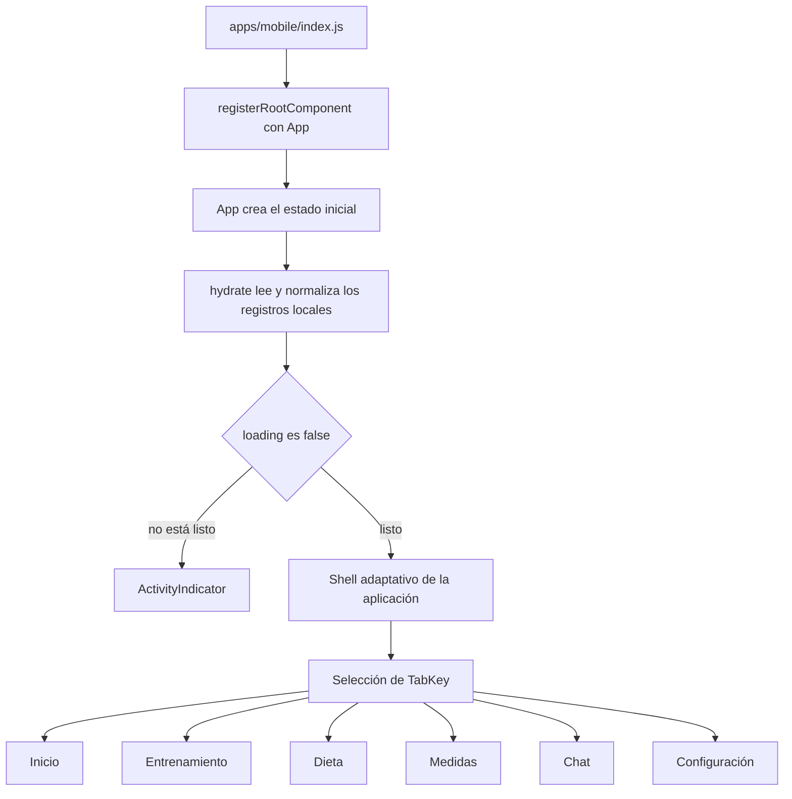
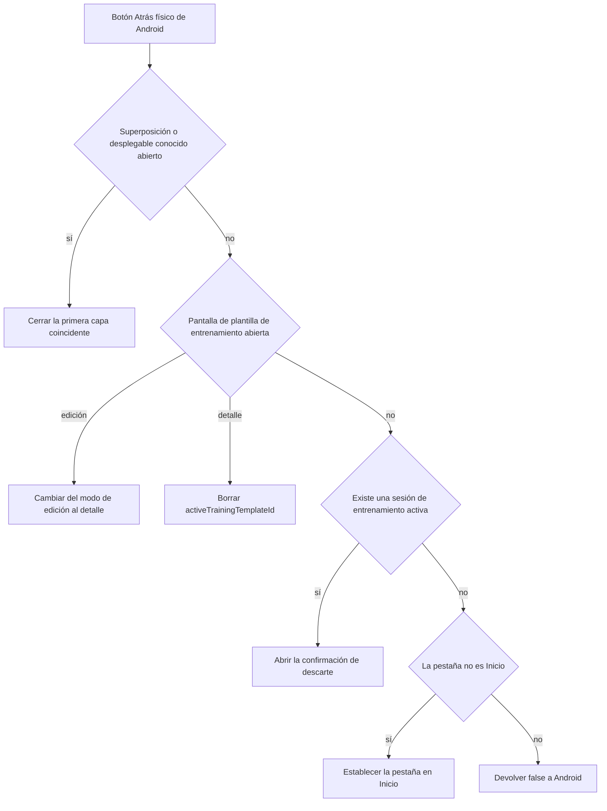

# Shell de aplicaciones móviles y web

El shell de la aplicación se implementa directamente en `apps/mobile/App.tsx::App`. No es un framework de enrutamiento: `App` controla la pestaña de nivel superior seleccionada, el estado de dominio, los indicadores de pantallas anidadas, las superposiciones, la hidratación, los efectos de persistencia y casi toda la renderización de pantallas en un único componente. `apps/mobile/index.js` es el único punto de arranque de JavaScript y llama a `registerRootComponent(App)`.

Esta página describe el shell compartido y los límites de enrutamiento. El comportamiento de dominio se explica en [Entrenamiento](training.md), [Dieta y estimación de alimentos](diet-and-food-estimation.md), [Mediciones](measurements.md) y [Tiempo de ejecución del agente](../agent/runtime.md); los detalles de persistencia se explican en [Estado local y copia de seguridad](local-state-and-backup.md).

## Estados del shell y puntos de entrada

El tipo exacto de ruta de nivel superior es:

```ts
type TabKey = "home" | "training" | "diet" | "measures" | "chat" | "settings";
```

`App` comienza con `tab === "home"`, `loading === true`, `isHydrated === false` y un `LocalStore` procedente de `createInitialStore()`. `tabLabel` asigna las claves a `Home`, `Rutinas`, `Dieta`, `Medidas`, `Chat` y `Configuración`. No hay ninguna tabla de rutas URL, pila de navegación ni asignación de enlaces profundos a pantallas en el árbol de React; la navegación consiste en asignar estado mediante `setTab`, además de indicadores anidados como `activeTrainingTemplateId`, `activeTrainingTemplateMode`, `activeWorkoutSession`, `settingsTab` y valores booleanos/objetos de modales.



*Figura 1. Arranque, puerta de hidratación y enrutamiento de nivel superior basado en estado en `apps/mobile/index.js` y `apps/mobile/App.tsx::App`.*

El encabezado y los controles de pestañas se renderizan antes de la rama de contenido de `loading`, pero el cuerpo se sustituye por un `ActivityIndicator` centrado hasta que finaliza la hidratación. Los efectos que conservan los registros controlados por el shell están protegidos por separado mediante `isHydrated`; esta distinción evita que se escriban los valores predeterminados iniciales mientras las lecturas están en curso.

## Navegación adaptativa

`App` calcula:

```ts
const isDesktopWeb = Platform.OS === "web" && viewportWidth >= 960;
```

En la web, a partir de 960 píxeles CSS, `DesktopSidebar` renderiza una columna de navegación fija de 246 píxeles y el contenedor de contenido se limita a `maxWidth: 1440`. Por debajo de ese umbral, y en plataformas nativas independientemente del ancho, el shell utiliza la franja horizontal de pestañas del encabezado.

Ambos controles exponen los mismos seis valores de `TabKey` y llaman al mismo establecedor de estado `setTab`:

| Superficie | Símbolo/selector de prueba | Comportamiento |
|---|---|---|
| Web de escritorio | `DesktopSidebar`; `desktop-nav-${key}` | Icono más `tabLabel(key)`, borde/fondo activo, barra lateral de 246 píxeles |
| Web móvil/estrecha | asignación en línea en `App`; `nav-tab-${key}` | Seis botones del mismo ancho; configuración solo muestra un icono, pero conserva `accessibilityLabel` |

Se trata de un cambio de presentación, no de dos enrutadores. Redimensionar la interfaz a uno u otro lado de los 960 píxeles conserva `tab` y todo el estado anidado en memoria porque solo cambia el control de navegación. El manifiesto de la aplicación sigue declarando orientación vertical para plataformas nativas (`apps/mobile/app.json::expo.orientation`), y la actividad generada de Android también tiene `android:screenOrientation="portrait"`.

El helper de Playwright `clickNavTab` de `apps/mobile/scripts/train-usability.e2e.mjs` reconoce ambos selectores, lo que constituye el contrato ejecutable más claro para la navegación adaptativa. De forma predeterminada, ese flujo utiliza un viewport de 390 píxeles, pero admite `TRAIN_E2E_VIEWPORT_WIDTH`; los anchos iguales o superiores a 960 reciben un viewport de 900 píxeles de alto y ejercitan el selector de escritorio.

## Composición de pantallas

Después de las ramas de hidratación/carga y del esqueleto global opcional, el shell envuelve el contenido en `KeyboardAvoidingView`. Chat tiene una rama específica para desplazamiento/entrada; las demás pestañas comparten el `Animated.ScrollView` principal. Dieta conecta su evento de desplazamiento animado y compensa un encabezado contraíble medido por separado. Configuración añade una barra de subpestañas con desplazamiento horizontal encima del contenido compartido. Entrenamiento puede ocultar el encabezado genérico mientras una pantalla de plantilla o una sesión activa proporciona su propio contexto.

| `TabKey` | Responsabilidad del shell | Enrutamiento/estado anidado |
|---|---|---|
| `home` | Derivar tarjetas del panel, entrenamiento destacado, saludo, finalización semanal, racha y resúmenes de mediciones y dieta | La acción principal continúa una sesión activa, inicia una plantilla destacada ejecutable o crea una rutina |
| `training` | Elegir la presentación de lista, detalle, edición o sesión activa y el título contextual | `activeTrainingTemplateId`, `activeTrainingTemplateMode`, `activeWorkoutSession`; consulta [Entrenamiento](training.md) |
| `diet` | Controlar la fecha seleccionada, el encabezado contraíble y las superposiciones de edición/copia/estimación | Indicadores de dieta y estimación; consulta [Dieta y estimación de alimentos](diet-and-food-estimation.md) |
| `measures` | Controlar los desplegables de período/métrica del panel, la pantalla de entrada, la expansión del historial y la superposición de fotos | Indicadores de medición; consulta [Mediciones](measurements.md) |
| `chat` | Controlar la selección del hilo, los mensajes, la entrada, la expansión del razonamiento, el desplazamiento con el teclado y la explicación de BYOK | Ciclo de vida del agente respaldado por el proveedor; consulta [Tiempo de ejecución del agente](../agent/runtime.md) |
| `settings` | Enrutar entre 14 secciones de configuración y alojar los controles de restablecimiento/proveedor | `SettingsTabKey`, registros de detalle, desplegables de proveedor y estado de copia de seguridad/actualización/VivaGym |

`headerTitle` se deriva en lugar de conservarse. Entrenamiento resuelve `Sesión Activa`, `Editar Rutina`, `Detalle Rutina` o `Mis Rutinas`; todas las demás pantallas que no son Inicio utilizan `tabLabel(tab)`. Inicio renderiza `Gymnasia` directamente.

## Derivaciones y acciones de Inicio

Inicio es un modelo de lectura sobre el estado controlado por otros dominios. No tiene un registro duradero independiente.

- `homeFeaturedTemplate` prefiere la plantilla de `activeWorkoutSession`; de lo contrario, selecciona la primera plantilla aceptada por `templateHasRunnableSeries`, recurriendo a la primera plantilla o a `null`.
- `homeFeaturedExercises` muestra como máximo tres ejercicios. Combina los datos almacenados de los ejercicios con `findRepoExerciseMatch`, metadatos inferidos de músculo/categoría e imágenes del repositorio, al tiempo que conserva los URI de imágenes personalizadas ajenas al repositorio.
- `calculateWorkoutStreak` convierte los valores válidos de `WorkoutSessionSummary.finished_at` en claves de día local, comienza hoy si se completó o ayer en caso contrario y cuenta hacia atrás los días completados consecutivos. Varios entrenamientos en un mismo día cuentan una sola vez; las fechas no válidas se ignoran.
- `buildHomeWeekProgress` crea entradas de lunes a domingo con las etiquetas `L`, `M`, `X`, `J`, `V`, `S`, `D`, marca la finalización a partir del mismo conjunto de claves de día local e identifica el día actual.
- `homeWeekCompletedCount` cuenta las entradas completadas en esa proyección de siete días.
- La etiqueta de la acción principal es `Continuar entrenamiento` cuando existe una sesión, `Iniciar entrenamiento` cuando la plantilla destacada es ejecutable y `Crear rutina` en los demás casos.
- El cambio de peso es la diferencia redondeada entre las mediciones de peso utilizables más reciente y anterior; si el historial es insuficiente, se renderiza `Sin histórico`.

Dado que las claves de fecha se basan en la conversión local de `Date`, las rachas y la ubicación semanal pueden cambiar cuando las marcas de tiempo persistentes se consultan después de cambiar de zona horaria. Este es el comportamiento actual, no una invariante UTC.

## Control de la configuración

`SettingsTabKey` es una segunda unión de rutas basada en estado. `SETTINGS_TAB_OPTIONS` define su orden visible y sus etiquetas:

1. `diet` — Dieta
2. `provider` — Proveedor IA
3. `memory` — Memoria
4. `training` — Entreno
5. `foods` — Alimentos
6. `products` — Productos comerciales
7. `personalFoods` — Alimentos personales
8. `measures` — Medidas
9. `preferences` — Preferencias
10. `notifications` — Notificaciones
11. `backup` — Copia de seguridad
12. `vivagym` — VivaGym
13. `updates` — Actualizaciones
14. `traces` — Trazas

La barra mide los anchos del viewport y del contenido, y mantiene `settingsTabsCanScrollLeft` y `settingsTabsCanScrollRight`; al pulsar las flechas, se desplaza 160 píxeles. Seleccionar una sección también borra los detalles seleccionados de ejercicio/alimento/alimento personal y cierra el formulario de alimentos personales y el chat de IA. Algunas secciones activan efectos: entrar en `memory` llama de forma diferida a `loadMemoryFields`, y entrar en `vivagym` carga las credenciales o actualiza un QR guardado.

Configuración es una superficie de integración, no un límite de servicio independiente. Los registros de proveedor siguen formando parte del estado controlado por el shell, Memoria y los alimentos personales utilizan almacenes independientes, y las funciones de copia de seguridad/actualizaciones/VivaGym tienen su propio estado asíncrono de interfaz. Consulta [Configuración del proveedor](../agent/provider-configuration.md), [Estado local y copia de seguridad](local-state-and-backup.md) y [VivaGym y actualizaciones](../integrations/vivagym-and-updates.md).

### Control compartido de Memoria

La pantalla de configuración de Memoria y las herramientas del agente controlan conjuntamente el mismo registro `gymnasia.mobile.personal_data.v1` de `{ key, description, value }[]`. Al entrar en la sección Memoria, se llama de forma diferida a `loadMemoryFields` una vez por cada `App` montada; las ediciones de campos modifican primero el valor `memoryFields` de la pantalla, mientras que desenfocar/confirmar, añadir y eliminar llaman a `savePersonalData`. La función `save_personal_data` del agente sustituye ese mismo array almacenado, y sus lectores de lista/descripción/valor cargan la clave directamente. No existe ninguna suscripción que propague las escrituras del agente a un valor `memoryFields` ya cargado, por lo que la vista de configuración abierta puede quedar obsoleta y una confirmación posterior en la interfaz puede sobrescribir una actualización del agente. A la inversa, las escrituras de la interfaz son visibles de inmediato para la siguiente lectura del agente porque esos lectores cargan el almacenamiento en lugar del estado de la pantalla.

La exportación de la copia de seguridad también carga este registro directamente. Una importación confirmada escribe el valor `personalData` importado de forma directa y usa `[]` de manera predeterminada si el valor no existe o no es un array, pero no actualiza ni invalida `memoryFields`/`memoryLoaded`. Si Memoria ya se había cargado, su copia visible en memoria puede conservar el estado anterior a la importación y posteriormente sobrescribir el registro importado. `resetLocalData` no borra ninguna de las dos copias. El contrato completo de almacenamiento e importación se encuentra en [Estado local y copia de seguridad](local-state-and-backup.md#copropiedad-en-memoria).

### Semántica del restablecimiento

`resetLocalData` sustituye `store` por `createInitialStore()`, reconstruye el estado de borrador/estado/visibilidad del proveedor, cierra los desplegables del proveedor, vuelve a Inicio, selecciona el hilo inicial si existe y borra la interfaz de la sesión de entrenamiento activa/anterior. A continuación, los efectos normales de persistencia guardan el almacén sustituto y eliminan cualquier sesión activa ausente.

La etiqueta `Restablecer datos locales` es más amplia que el alcance directo de la función. `resetLocalData` **no** restablece por sí misma `userPrefs` (incluidas las opciones de notificación), `personalFoods`, los campos de Memoria almacenados o cargados, los metadatos de copia de seguridad, las trazas, las credenciales seguras de VivaGym, las cachés ni todas las superposiciones abiertas. El código que necesite borrar por completo el dispositivo no debe llamar a esta función y asumir que todos los artefactos locales han desaparecido; utiliza el inventario de almacenamiento de [Estado local y copia de seguridad](local-state-and-backup.md) para definir y probar un comportamiento más amplio.

### Control de la configuración de notificaciones

Configuración → Notificaciones edita `userPrefs.notifications`, no el estado de entrenamiento. Los cuatro campos exactos son `enabled`, `sound`, `vibrate` y `soundKey`; los valores predeterminados y los efectos en tiempo de ejecución se documentan en [Entrenamiento](training.md#preferencias-de-notificación-y-efectos-exactos), mientras que el comportamiento de persistencia/importación/restablecimiento se documenta en [Estado local y copia de seguridad](local-state-and-backup.md#propiedad-de-las-notificaciones). La fila de alarmas exactas de Android abre la configuración del sistema operativo y no es una preferencia almacenada.

### Panel de trazas y límite de privacidad

`TracePanel` solo se monta para la sección Trazas y llama a `getTraces`, que carga de forma diferida el búfer a nivel de módulo desde `gymnasia_debug_traces`. Actualizar repite esa API de lectura, pero, una vez cargada, devuelve el búfer actual en memoria en lugar de volver a leer AsyncStorage. El panel da formato a todas las entradas con plataforma, hora de generación, marcas de tiempo ISO, etiquetas, mensajes y `data` serializado como JSON. **Copiar trazas** escribe ese volcado completo en texto sin formato en el portapapeles del sistema e ignora los errores de copia; no censura, comparte, sube ni crea un archivo. Después de la copia, la conservación y el acceso al portapapeles quedan bajo el control del sistema operativo y de otras aplicaciones.

**Borrar** espera a `clearTraces`, vacía el búfer del módulo, elimina la clave de AsyncStorage y después borra el estado del panel; los errores de eliminación del almacenamiento se silencian dentro de `clearTraces`, por lo que la interfaz puede aparecer vacía sin confirmación duradera. El restablecimiento y la copia de seguridad no borran, exportan ni importan trazas. Los productores de trazas incluyen el ciclo de vida de la aplicación, la programación/cancelación de descansos, la entrega/pulsación de notificaciones, las acciones de permisos/configuración y los errores; se permite cualquier `data`, por lo que quienes realizan las llamadas no deben introducir allí credenciales ni contenido personal. Consulta [Estado local y copia de seguridad](local-state-and-backup.md#carga-copia-borrado-y-privacidad-de-las-trazas).

## Ciclo de vida del botón Atrás de Android

`App` registra `BackHandler.addEventListener("hardwareBackPress", ...)` en Android. El controlador consume las pulsaciones de Atrás siguiendo un orden de prioridad estricto:



*Figura 2. Orden en el código fuente de la política del botón Atrás físico de Android en `App`.*

La capa 1 comprueba las superposiciones conocidas en el orden del código fuente: finalización del entrenamiento, confirmación de descarte, estimador de alimentos, información sobre grasa corporal, formulario de ejercicio personalizado, selector de ejercicios, chat de IA/formulario de alimentos personales, entrada de mediciones, explicación de BYOK, eliminación del proveedor, selectores de copia/fecha de dieta, historial de mediciones y, por último, desplegables de proveedor/modelo/panel/entrenamiento. Solo se cierra el primer estado coincidente.

La capa 2 retrocede de la edición de entrenamiento al detalle y, después, del detalle a la lista. La capa 3 nunca cierra silenciosamente un entrenamiento activo; abre la confirmación de descarte. La capa 4 envía cualquier pestaña distinta de Inicio a Inicio. Solo al pulsar Atrás desde Inicio sin ninguna capa gestionada se devuelve `false`, lo que permite el comportamiento de la actividad de Android. `apps/mobile/android/app/src/main/java/com/maximofn/gymnasia/MainActivity.kt::invokeDefaultOnBackPressed` mueve las actividades raíz a segundo plano en Android R y versiones anteriores cuando es posible, y delega en el comportamiento de la plataforma en Android S y versiones posteriores.

El efecto no tiene un array de dependencias, por lo que React elimina y vuelve a registrar el listener después de cada renderización. Esto mantiene actualizado el cierre léxico, pero añade una rotación de suscripciones evitable. Además, la política es una lista explícita: una superposición nueva no reconoce el botón Atrás hasta que se añade con la prioridad correcta.

## Hidratación y preparación del shell

El efecto `hydrate`, que solo se ejecuta durante el montaje, realiza la transición crítica de inicio del shell:

1. marcar la carga y borrar el error visible;
2. detectar la disponibilidad de SecureStore y borrar los datos heredados;
3. leer simultáneamente el almacén principal, las claves seguras del proveedor, la sesión activa, la instantánea de la plantilla anterior a la sesión y las preferencias del usuario;
4. si el almacén principal no está presente durante el desarrollo web, leer opcionalmente el espejo de archivos de desarrollo;
5. normalizar el almacén, combinar las claves de API seguras y normalizar la sesión de entrenamiento activa con respecto a las plantillas;
6. volver a escribir el estado local normalizado/censurado y las claves seguras;
7. confirmar `store`, la sesión/instantánea, las preferencias y las selecciones de gráficos;
8. en `finally`, establecer `loading` en false e `isHydrated` en true, incluso después de un fallo capturado.

Tras quedar preparado, los efectos buscan actualizaciones, cargan repositorios remotos de ejercicios/alimentos/productos/recetas, cargan los alimentos personales y los metadatos de copia de seguridad, ejecutan la migración de grasa corporal, inicializan los borradores del proveedor, crean un hilo de chat nuevo para el inicio y habilitan los efectos de persistencia. La rama `catch` muestra `No se pudo cargar almacenamiento local.` o el mensaje lanzado, pero el shell abandona de todos modos el indicador de carga y renderiza con cualquier estado inicial que haya sobrevivido. Esto favorece la disponibilidad frente a un fallo de inicio definitivo y puede hacer que un inicio con el almacén dañado parezca una aplicación vacía/predeterminada.

### Invariantes de preparación

- `loading === true` impide renderizar el cuerpo de dominio, mientras que `isHydrated === false` impide los efectos de escritura duradera.
- Ningún efecto de persistencia del almacén principal, las preferencias, los alimentos personales o la sesión activa puede eliminar su protección `isHydrated` sin sustituir la protección contra sobrescrituras durante el inicio.
- El indicador `ignore` evita que una `App` desmontada confirme el estado de hidratación.
- Una sesión hidratada solo se acepta a través de `normalizeWorkoutSession(..., mergedStore.templates)`.
- El estado de navegación está en memoria y no se restaura como ruta; cada inicio comienza en Inicio.

## Validación y cobertura de pruebas

El shell no dispone de un conjunto específico de pruebas unitarias/de componentes de React. `apps/mobile/vitest.config.mts` solo incluye `agent/**/*.test.ts`, por lo que `TabKey`, las derivaciones de fechas de Inicio, el cambio adaptativo, el enrutamiento de configuración, la interfaz de hidratación y la prioridad del botón Atrás de Android no se prueban directamente mediante pruebas unitarias.

La cobertura ejecutable existente es indirecta:

- `apps/mobile/scripts/train-usability.e2e.mjs` navega mediante `nav-tab-*` o `desktop-nav-*`, abre `Configuración`, invoca `Restablecer datos locales`, verifica el estado de entrenamiento vacío y cubre los flujos anidados de navegación/sesión de entrenamiento.
- `apps/mobile/scripts/agent-chat.e2e.mjs` inicializa `gymnasia.mobile.local.v3`, abre `nav-tab-chat` en un viewport de 390 por 844 y valida la renderización del chat, además de un recorrido de ida y vuelta simulado entre proveedor y herramienta.
- `.github/workflows/agent-tests.yml` comprueba los tipos de `apps/mobile` y ejecuta pruebas deterministas del agente, pero no invoca ninguno de los scripts de Playwright.

Validación recomendada para cambios en el shell:

```bash
npm --workspace apps/mobile exec tsc --noEmit
npm --workspace apps/mobile run build:web
npm run test:train:e2e
npm run test:agent:e2e
```

Para cambios adaptativos, ejecuta las pruebas E2E de entrenamiento una vez por debajo de 960 píxeles y otra vez con `TRAIN_E2E_VIEWPORT_WIDTH=960` o más. El botón Atrás de Android, la adaptación del teclado nativo, las superposiciones de notificaciones y la hidratación tras reiniciar el proceso requieren una prueba en un dispositivo/emulador nativo, ya que Playwright en el navegador no puede validar `BackHandler` ni el comportamiento de las actividades de Android.

## Riesgos y reglas de extensión

- **Acoplamiento entre estado y enrutador:** añadir un destino de nivel superior requiere actualizar `TabKey`, `tabLabel`, `DesktopSidebar`, la asignación de navegación estrecha, las ramas de renderización de encabezado/cuerpo, las suposiciones del esqueleto de carga y las pruebas. No existe ningún registro de rutas impuesto por el compilador más allá de la unión y las asignaciones.
- **Desviación de la prioridad de superposiciones:** las superposiciones/desplegables nuevos deben añadirse al controlador del botón Atrás de Android en el orden z previsto y cerrarse explícitamente cuando desaparezca su pestaña/registro principal.
- **Incompatibilidad adaptativa:** el umbral de escritorio solo existe para la web. No asumas que una tableta ancha recibe `DesktopSidebar`; la configuración nativa actual se mantiene en vertical y utiliza la navegación estrecha.
- **Ambigüedad ante fallos de hidratación:** los errores de inicio se renderizan junto al estado inicial/predeterminado después de `finally`. Las acciones destructivas deben deshabilitarse o contextualizarse claramente si pasa a ser necesario distinguir entre «vacío» y «no se pudo cargar».
- **Inicio abarca varios dominios:** cambiar las marcas de tiempo de entrenamiento, el orden de las mediciones, la normalización de plantillas, las reglas de imágenes del repositorio o los objetivos de dieta puede alterar Inicio sin editar su rama de renderización.
- **El restablecimiento es parcial:** conserva la distinción entre restablecer `LocalStore` y borrar todos los almacenes independientes/sensibles.
- **Radio de impacto del componente grande:** `App.tsx` ocupa más de un megabyte y controla dominios no relacionados. Extraer una pantalla debe conservar el control del estado por parte del shell, las protecciones de hidratación, los identificadores de prueba, la semántica del botón Atrás de Android y los límites de prioridad local, en lugar de introducir una supuesta capa de servidor/enrutador.