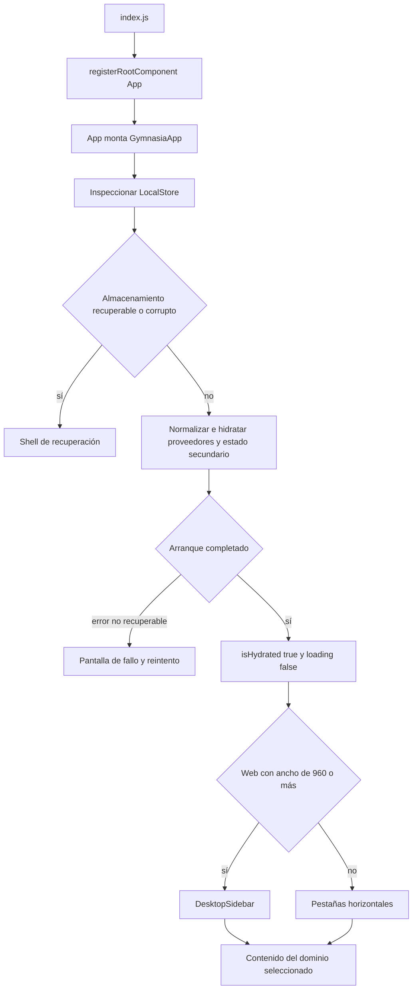
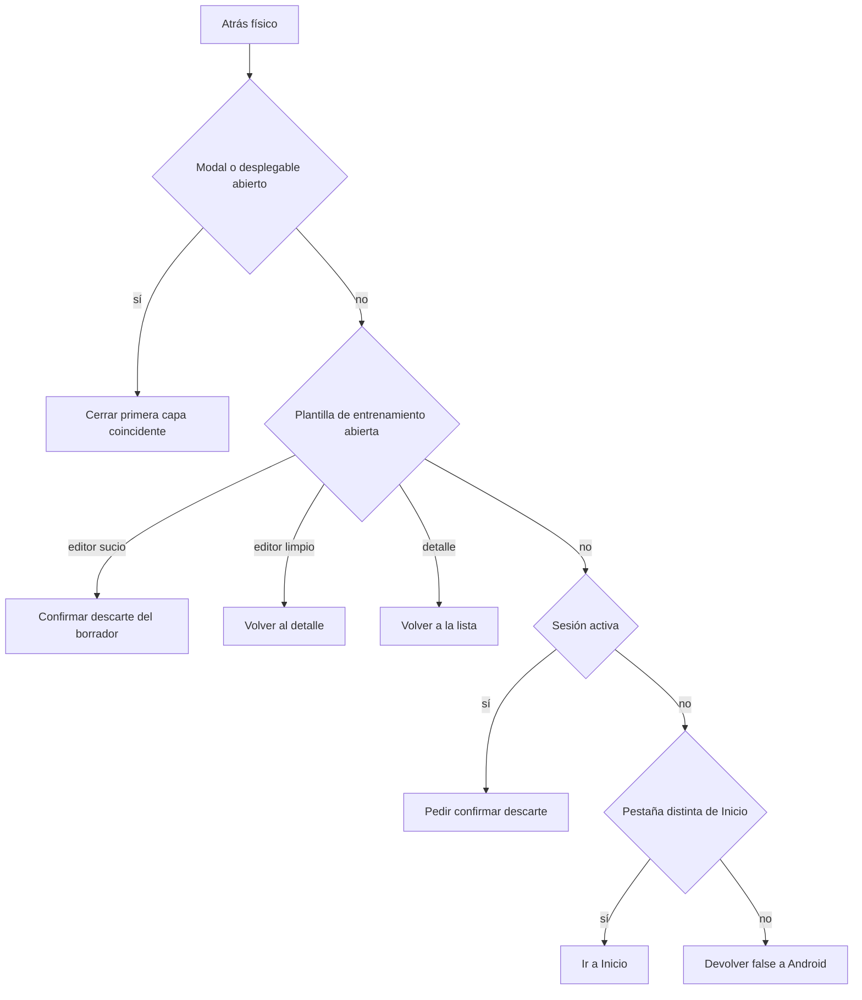

# Shell de aplicación, plataformas y navegación

`apps/mobile/index.js` registra `App` con `registerRootComponent`. El componente exportado no es un enrutador URL: remonta `GymnasiaApp` al aumentar una generación después de un borrado local, mientras `GymnasiaApp` concentra el estado de navegación, hidratación, integración de dominios y renderizado global. Por tanto, `App.tsx` es la superficie de integración del cliente local-first, no una capa de servicio ni el lugar para definir toda la UI de entrenamiento, dieta, medidas o agente.

Los contratos de cada dominio están en [Entrenamiento](training.md), [Dieta y estimación de alimentos](diet-and-food-estimation.md), [Mediciones](measurements.md) y [Estado local y copia de seguridad](local-state-and-backup.md). Esta página explica los límites que deben mantenerse al cambiar su composición.

## Arranque, hidratación y elección de shell

Al montar, `GymnasiaApp` parte de `createInitialStore()`, `tab: "home"`, `loading: true` e `isHydrated: false`; inmediatamente ejecuta `runLocalStoreHydration`. Esta rutina inspecciona primero el agregado local y, si es válido o reparable, normaliza el almacén, hidrata la configuración de proveedores y las claves según la plataforma, confirma la representación canónica y luego carga el estado secundario —sesión activa, instantáneas/borradores de sesión, preferencias, salud de alarmas y consentimiento— antes de publicar el estado React.



*El flujo distingue la recuperación protectora de la hidratación normal y elige únicamente la presentación de navegación después de que el shell sea utilizable.*

La interfaz ordinaria sigue mostrando encabezado y navegación mientras `loading` sustituye el cuerpo por un `ActivityIndicator`. En cambio, las salidas de recuperación y de fallo de arranque sustituyen por completo el shell ordinario. `isHydrated` es la barrera separada para los efectos que escriben el agregado: no se debe retirar sin otra protección contra sobrescribir valores iniciales antes de que termine la lectura.

Tras la hidratación se cargan catálogos y alimentos personales de forma asíncrona; sus fallos se registran en consola y no bloquean el shell. La migración de fotos de medidas también se degrada específicamente en web: si encuentra fotos heredadas, informa que el navegador no puede garantizar su disponibilidad tras cerrarse y recomienda exportar una copia.

## Recuperación antes que sobrescritura

La inspección del almacén puede devolver un resultado `recoverable` o `corrupt`. En ambos casos, `GymnasiaApp` conserva `isHydrated: false`, deja de cargar y monta `LocalStoreRecoveryScreen`; no continúa hacia las pantallas de dominio ni intenta normalizar/escribir encima del payload problemático. La pantalla ofrece:

- **Recuperar última copia**, solo si hay una instantánea verificada; restaura la instantánea y vuelve a ejecutar la hidratación.
- **Guardar copia dañada**, disponible cuando existe el payload original; advierte que la exportación puede incluir datos de salud, conversaciones y, en web, claves de IA.
- **Volver a intentarlo**, para volver a inspeccionar después de una reparación externa.
- **Descartar estos datos y empezar de cero**, detrás de una confirmación. Reinicia el agregado afectado y elimina la sesión y sus instantáneas/borrador dependientes, pero conserva preferencias, memoria personal y configuraciones válidas de proveedores.

Los detalles técnicos de la pantalla muestran rutas y códigos de incidencias, no valores del usuario. Si la hidratación lanza fuera de esas rutas recuperables, se monta `LocalStoreStartupFailureScreen`: comunica que el arranque se detuvo para no guardar encima y solo permite reintentar. Este cambio de shell es una garantía operativa importante: un error de lectura no debe presentarse como una aplicación vacía lista para persistir.

La prueba de navegador `storage-recovery.e2e.mjs` cubre que el JSON roto queda intacto y exportable, que los detalles no filtran un valor privado, que reintento y restauración eliminan la cuarentena solo después de recuperar datos válidos y que el descarte preserva las particiones ajenas al agregado. Consulte [Estado local y copia de seguridad](local-state-and-backup.md) para formatos, cuarentena e invariantes de almacenamiento.

## Navegación controlada por estado

La ruta principal es una unión interna, no una URL ni una pila. `apps/mobile/shell/shellRegistry.ts` es el registro único de los seis destinos y de sus dos presentaciones; `TabKey` se deriva de sus claves:

```ts
type TabKey = (typeof TAB_DESTINATIONS)[number]["key"];
```

Los controles cambian `tab` con `setTab`; las pantallas secundarias se expresan con estado local, por ejemplo la plantilla y modo de entrenamiento activo, una sesión activa, el selector de fecha de dieta, modales y `SettingsTabKey`. La navegación no se restaura como una ruta al reiniciar: una instancia normal comienza en Inicio, excepto la instancia remontada para informar un borrado incompleto, que abre Configuración.

| Pestaña | Papel del shell | Límite de dominio |
|---|---|---|
| `home` | Proyecta resúmenes y acciones a partir de entrenamiento, dieta y medidas; no tiene un registro persistente propio. | [Entrenamiento](training.md), [Dieta y estimación de alimentos](diet-and-food-estimation.md), [Mediciones](measurements.md) |
| `training` | Elige lista, detalle, edición o sesión activa y ajusta el título contextual. | [Entrenamiento](training.md) |
| `diet` | Aloja la fecha, encabezado contraíble y superposiciones de edición, copia y estimación. | [Dieta y estimación de alimentos](diet-and-food-estimation.md) |
| `measures` | Aloja filtros de panel, entrada, historial y fotos. | [Mediciones](measurements.md) |
| `chat` | Mantiene hilo, mensajes, entrada y estados de envío; el proveedor y su política quedan en módulos del agente. | Tiempo de ejecución y configuración del agente |
| `settings` | Enruta secciones de configuración e integra proveedores, memoria, datos, notificaciones y trazas. | [Estado local y copia de seguridad](local-state-and-backup.md) |

Cada destino declara etiquetas compacta y completa, iconos, layouts y los `testID` de ambas barras. Añadir una pestaña exige ampliar ese registro y el renderizado de su pantalla; los controles de navegación se derivan automáticamente. Extraer una pantalla de este componente grande debe preservar la barrera de hidratación, la propiedad local del estado y la política de regreso de Android.

### Presentación adaptable, no dos navegadores

`isDesktopWeb` solo es verdadero para `Platform.OS === "web"` y ancho de viewport de al menos 960 píxeles. En ese caso se monta `DesktopSidebar`, de 246 píxeles, con los seis destinos y selectores `desktop-nav-${key}`; el contenido tiene `maxWidth: 1440`. En web estrecha y en **todas** las plataformas nativas se muestra una banda horizontal con los mismos destinos y `nav-tab-${key}`. Cambiar el ancho solo intercambia el control visual, por lo que conserva `tab` y el estado anidado en memoria.

No se debe inferir que una tableta nativa obtiene la barra lateral: el criterio exige web y el manifiesto Expo fija la orientación general en vertical, aunque iOS declara soporte de tabletas. `tabLabel` usa `Gymnasia Coach` para chat; en la banda compacta `mobileTabLabel` lo acorta a `Coach` y Configuración se muestra como icono conservando su etiqueta de accesibilidad.

## Regreso de Android y capas efímeras

En Android, un efecto instala una sola vez un listener de `BackHandler`. Un `ref` actualizado durante cada render ofrece al listener el estado y los handlers actuales sin volver a suscribirlo. `SHELL_BACK_LAYERS` mantiene el inventario de las superficies globales, rutas anidadas y menús contextuales que participan en esa política; cada una declara prioridad única, ámbito, propietario, comportamiento y `testID`:



*La política consume Atrás por capas antes de delegar en la actividad nativa desde Inicio.*

`resolveShellBackCommand` es puro: recibe un `Record<ShellLayerId, boolean>`, el estado de plantilla/sesión y la pestaña, elige la capa activa de mayor prioridad y devuelve una única orden simbólica. `App.tsx` mantiene mapas exhaustivos de estado y handlers, de modo que TypeScript obliga a integrar cualquier identificador nuevo en ambos lados. Las capas incluyen conflictos y borrados de entrenamiento, importación, finalización o descarte de sesión, detalles de ejercicio, fotos ampliadas, selector de tipo de serie, estimación de alimentos, selectores de fecha, formularios, menús y desplegables. Durante un borrado de datos, Atrás queda consumido en vez de abandonar la operación. Una sesión activa nunca se cierra silenciosamente: abre su confirmación de descarte.

Los `Modal` nativos y las pantallas de recuperación/arranque también están inventariados en `SYSTEM_OWNED_SHELL_SURFACES`, pero no entran en el resolutor global. React Native entrega el cierre de un `Modal` a su `onRequestClose` y no al listener global; las pantallas de arranque delegan en el sistema. Una superficie nueva no adquiere semántica de Atrás hasta que se registra con la prioridad visual y el propietario correctos.

## Notificaciones, alarmas y degradaciones observables

El shell instala un `Notifications.setNotificationHandler` a nivel de módulo. Para una notificación de fin de descanso en primer plano, muestra banner y reproduce sonido salvo que detecte que acaba de sonar la alerta interna equivalente; incluso el duplicado queda en lista y se traza. Al iniciar una sesión, intenta preparar audio y solicitar permiso de notificaciones. En Android crea el canal local `rest_end_alert` con importancia máxima, sonido, vibración y visibilidad pública; los errores se trazan, sin bloquear el entrenamiento.

Mientras un descanso está activo, al pasar la app a segundo plano agenda una notificación de fecha y antes cancela las previamente programadas. El payload conserva `expectedAt`; listeners de recepción y pulsación registran evidencia de entrega y calculan retraso. Si el temporizador termina, la alerta en la app solo se suprime con evidencia de entrega; si no la hay, puede actuar como respaldo dentro de una ventana relevante. Así, la programación es una ayuda local observable, no una garantía de que Android haya despertado o entregado la alarma a tiempo.

`app.json` declara los permisos Android `FOREGROUND_SERVICE`, `WAKE_LOCK`, `VIBRATE`, `RECEIVE_BOOT_COMPLETED` y `SCHEDULE_EXACT_ALARM`, y bloquea `USE_EXACT_ALARM` junto con permisos no requeridos. La preferencia almacenada de notificaciones controla si se agenda, sonido, vibración y sonido seleccionado; no concede permisos del sistema. La pantalla de configuración puede abrir `REQUEST_SCHEDULE_EXACT_ALARM` en Android, por lo que el usuario y el sistema operativo siguen siendo la autoridad para alarmas exactas. Véase [Validación de permisos Android publicables](../operations/android-permissions.md) para la política de entrega y [Entrenamiento](training.md) para la semántica funcional de descansos.

## Configuración Expo, variantes y aislamiento

`app.config.ts` requiere `APP_ENV` y rechaza valores fuera de `development`, `staging` y `production`. Deriva nombre, application ID, canal de política, espacio de nombres de almacenamiento y modo de proveedor para inyectarlos en `expo.extra`; desarrollo usa `fake` por defecto y admite `DEV_PROVIDER_MODE=byok`, mientras staging y producción son BYOK. También inyecta candidato y SHA-256 de la política integrada y un endpoint de incidencias: desarrollo queda sin endpoint salvo override, staging y producción usan el endpoint HTTPS definido.

En ejecución, `runtimeEnvironment.ts` valida que `Constants.expoConfig.extra` sea coherente, incluyendo versión de configuración, canal, espacio de nombres, modo de proveedor y metadatos de política. Una configuración ausente, híbrida o con metadatos inválidos lanza en vez de elegir valores parciales. Las claves de almacenamiento no productivas se prefijan por espacio de nombres; producción conserva las claves canónicas y excluye prefijos de desarrollo/staging. Esto permite instalar variantes sin que compartan el estado local.

`app.json` aporta iconos, splash, estilo claro, plugins de SecureStore, AV, fuentes y notificaciones con cinco recursos de sonido; la web usa Metro. Los perfiles EAS asocian development, staging y production con el `APP_ENV` correspondiente, y los perfiles staging/production-apk construyen APK Android cuando se solicita.

## Validación enfocada

No hay una suite de componentes dedicada a todo `App.tsx`; valide de forma proporcional los límites modificados:

```bash
npm --workspace apps/mobile exec tsc --noEmit
npm --workspace apps/mobile run build:web
npm run test:shell:e2e
npm run test:storage-recovery:e2e
```

La E2E de shell recorre los seis destinos y varias capas reproducibles con viewports de 390 y 960 píxeles; las E2E de cada dominio completan los recorridos que requieren datos específicos. Para permisos, configuración Expo, notificaciones, `BackHandler`, sonido o alarmas, la exportación web no basta: ejecute el control de permisos aplicable y pruebe una compilación nativa en un dispositivo/emulador, verificando concesión/denegación y comportamiento en segundo plano.
