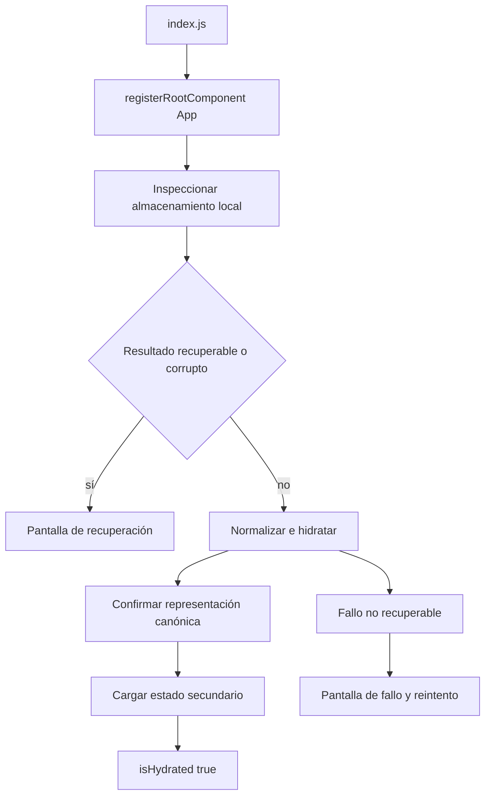
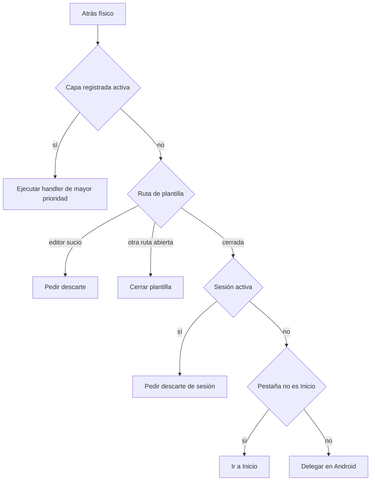

# Shell de aplicación, plataformas y navegación

`apps/mobile/index.js` registra `App` mediante `registerRootComponent`. `App` mantiene una generación de runtime: después de un restablecimiento local remonta `GymnasiaApp` con una `key` nueva y conserva su resultado. La instancia nueva abre Configuración si el borrado fue incompleto; en los demás arranques empieza en Inicio.

`GymnasiaApp` es el punto de composición local-first: conecta almacenamiento, controladores de dominio, pantallas y superficies globales. No debe convertirse en un segundo lugar para implementar reglas de entrenamiento, dieta o medidas: entrega a cada pantalla el modelo y las acciones de su controlador.

## Arranque protegido e hidratación

El runtime comienza con `createInitialStore()`, `loading: true` e `isHydrated: false`, y ejecuta `runLocalStoreHydration`. Primero inspecciona el agregado local, antes de normalizarlo o publicar estado React. Un resultado `recoverable` o `corrupt` deja la hidratación desactivada, detiene la carga y reemplaza el shell por `LocalStoreRecoveryScreen`. Una excepción que no puede convertirse en cuarentena muestra `LocalStoreStartupFailureScreen`, que solo permite reintentar. Así la aplicación no aparenta tener un almacén vacío ni escribe sobre datos no comprobados.



*El arranque distingue la cuarentena protectora de la ruta que puede publicar y persistir el estado normalizado.*

En la ruta normal, el shell carga claves y configuración de proveedor según plataforma, confirma el agregado canónico y solo después lee sesión activa, instantánea y borrador de sesión, preferencias, salud de alarmas y consentimiento. Los fallos de SecureStore o de datos secundarios se comunican como no fatales cuando es posible; no invalidan automáticamente el agregado principal. Finalmente reemplaza los runtimes y estados React, habilita `isHydrated` y refresca diagnósticos de notificaciones.

`isHydrated` es también una barrera de escritura: los efectos de persistencia del agregado, sesión y borrador retornan mientras sea falso. Si un `commit` es ambiguo o queda bloqueado, el shell se deshidrata e inspecciona otra vez antes de admitir escrituras. Mantenga esta barrera al extraer pantallas o controladores.

### Recuperación deliberada

La pantalla de recuperación no expone valores del usuario en sus detalles; lista rutas y códigos de incidencia. Sus acciones son:

- **Recuperar última copia**, disponible solo con una instantánea verificada; restaura y vuelve a hidratar.
- **Guardar copia dañada**, disponible si hay payload; solicita contraseña y exporta el contenido cifrado.
- **Volver a intentarlo**, que inspecciona de nuevo sin respetar una cuarentena previa para aceptar una reparación externa.
- **Descartar estos datos y empezar de cero**, protegido por confirmación.

Al descartar, `discardAffected` escribe un `createInitialStore()` con las claves de proveedor actuales —o las predeterminadas— y elimina sesión activa, instantánea de plantilla y borrador de sesión. No borra las particiones de datos personales ni preferencias. La E2E de recuperación comprueba que un JSON roto no cambia hasta una acción explícita, que la exportación está cifrada, que los detalles no filtran un valor privado y que reintento, restauración y descarte solo eliminan la cuarentena por una ruta válida.

## Navegación: un estado, dos presentaciones

No hay rutas URL ni una pila principal. `TAB_DESTINATIONS` es el registro único de `TabKey`: `home`, `training`, `diet`, `measures`, `chat` y `settings`. `tab` es estado React y tanto controles como accesos internos lo cambian con `setTab`. Las vistas secundarias —detalle o editor de rutina, sesión, selectores, modales y secciones de Configuración— mantienen estado de pantalla o de controlador; no son URL restaurables.

El registro contiene etiqueta, icono y `testID` para ambos formatos. `usesDesktopNavigation` activa escritorio únicamente cuando `Platform.OS === "web"` y el viewport mide al menos 960 píxeles. En ese caso `App` monta `DesktopSidebar`; en web estrecha y en iOS/Android monta la banda de `AppHeader`. Ambos reciben el mismo `tab` y `onTabChange`, de modo que un cambio de ancho sustituye el control visual sin reiniciar la pestaña ni su estado anidado.

| Formato | Registro visual | Selectores |
|---|---|---|
| Escritorio web | Barra lateral de 246 px con los seis destinos. | `desktop-nav-${key}` |
| Compacto, web estrecha y nativo | Banda horizontal en el encabezado con los mismos destinos. | `nav-tab-${key}` |

Para añadir una pestaña, actualice `TAB_DESTINATIONS`, el tipo derivado y el renderizado de contenido; no duplique listas en las barras. La E2E recorre los seis destinos a 390 y 960 px, verifica qué selectores aparecen, y comprueba que al cerrar capas de dieta, medidas y Configuración se conserva el estado subyacente.

## Atrás de Android y propiedad de superficies

`SHELL_BACK_LAYERS` registra toda superficie que pertenece al `BackHandler`: identificador, alcance, prioridad única descendente, `testID`, propietario y comportamiento. `App.tsx` construye de forma exhaustiva tanto el mapa de visibilidad como el de handlers delegados a controladores, y `resolveShellBackCommand` toma la primera capa activa siguiendo el orden del registro. Hay una única suscripción Android; su callback estable consulta un `ref` actualizado en cada render, por lo que usa el estado y handlers vigentes sin volver a suscribirse.



*Las capas visuales prevalecen sobre rutas anidadas, sesión y pestaña; solo Inicio sin una superficie administrada devuelve el control al sistema.*

Los `Modal` nativos y las pantallas de recuperación/fallo están en `SYSTEM_OWNED_SHELL_SURFACES`: React Native gestiona `onRequestClose` de los modales y las pantallas de inicio delegan en el sistema, así que no intervienen en el resolutor global. Al introducir una superficie, añádala al registro con dueño y prioridad si debe responder a Atrás, implemente su visibilidad y handler exhaustivos en `App.tsx`, y aplique su `testID`; renderizarla sin ese contrato deja una ruta de cierre inconsistente.

## Sesión, avisos locales y retorno a primer plano

Al iniciar una sesión se solicita permiso de notificaciones y, en Android, se crea o consulta el canal local `rest_end_alert` con importancia máxima, sonido, vibración, visibilidad pública y `bypassDnd`. Los errores se trazan y no impiden entrenar. El shell prepara el aviso de descanso al entrar en un descanso programable, todavía en primer plano: cancela avisos previos, valida que sesión y preferencias sigan coincidiendo y programa una notificación de fecha cuyo payload contiene el instante esperado. Al pasar a segundo plano persiste el reloj conciliado y conserva el aviso armado si aún aplica; de lo contrario lo cancela.

En primer plano, el temporizador reproduce la alerta interna al acabar el descanso. El `setNotificationHandler` suprime banner y sonido de una notificación de descanso recibida en primer plano para evitar duplicados, aunque otras notificaciones pueden mostrarse y sonar. Listeners de recepción y pulsación, y al volver al foreground la bandeja y última respuesta, aportan evidencia de entrega y registran el retraso respecto de `expected_at_ms`. Esa evidencia decide si reproducir la alerta interna recuperada dentro de la ventana de respaldo: la programación local no garantiza que el SO despierte ni entregue puntualmente.

## Límites de módulos y plataformas

El shell es la capa `app` y es el integrador autorizado de controladores, pantallas, persistencia, plataformas y dominios. La política en `scripts/mobile-boundaries/policy.json` impone una dirección de dependencias y exige que los consumidores entre capas importen las entradas públicas declaradas. Por ejemplo, las pantallas pueden consumir controladores y módulos de dominio permitidos, pero los controladores no pueden importar pantallas; los dominios de entrenamiento, dieta y medidas no pueden importar React, React Native ni Expo; y los controladores no pueden importar APIs de UI o Expo directamente.

`check.mjs` analiza imports estáticos, reexports, `require` e imports dinámicos con el compilador TypeScript. Informa imports no resueltos, módulos sin clasificar, dependencias entre capas no permitidas, accesos a módulos privados, imports externos prohibidos, excepciones heredadas ya sin uso y ciclos locales. Una infracción hace fallar el comando. Al mover lógica fuera de `App.tsx`, el destino adecuado es normalmente un controlador para orquestación de pantalla, un módulo de dominio puro para reglas, o `platform/` para adaptar una API de dispositivo; exponga lo necesario mediante la entrada pública de la capa, no mediante una importación profunda.

## Variantes Expo, permisos y aislamiento

`app.config.ts` exige `APP_ENV` y acepta solo `development`, `staging` o `production`. Cada variante recibe nombre, identificadores iOS/Android, canal de política y espacio de nombres. Desarrollo usa proveedor `fake` por defecto y puede cambiar a `byok` mediante `DEV_PROVIDER_MODE`; staging y producción son siempre `byok`. La configuración inyecta estos valores, versión de configuración y metadatos de política en `expo.extra`; el endpoint de incidencias está vacío por defecto en desarrollo y es HTTPS en staging/producción.

Al arrancar, `resolveRuntimeEnvironment` rechaza extras ausentes, híbridos o incompatibles y metadatos de política inválidos. Las claves de AsyncStorage y SecureStore no productivas se prefijan con su espacio de nombres; producción mantiene las claves canónicas y excluye prefijos de desarrollo/staging. Las instalaciones de prueba no comparten estado local con producción.

El manifiesto base fija orientación vertical, soporta tabletas en iOS y declara en Android `WAKE_LOCK`, `VIBRATE`, `RECEIVE_BOOT_COMPLETED` y `SCHEDULE_EXACT_ALARM`; bloquea `USE_EXACT_ALARM`, instalación de paquetes, micrófono y ventanas superpuestas. `app.config.ts` añade dinámicamente `expo-notifications` con sonidos empaquetados. No declara permiso de servicio en primer plano. Los perfiles EAS aportan `APP_ENV`; staging y `production-apk` solicitan APK Android.

## Validación enfocada

Use controles proporcionales al límite modificado:

```bash
npm --workspace apps/mobile exec tsc --noEmit
npm --workspace apps/mobile run build:web
npm run check:mobile-boundaries
npm run test:mobile-boundaries
npm run test:shell:e2e
npm run test:storage-recovery:e2e
```

`shellRegistry.test.ts` comprueba destinos, frontera de 960 px, prioridades y selectores únicos, resolución determinista de todas las combinaciones de capas y los fallbacks plantilla/sesión/pestaña/sistema. `shellRegistry.contract.test.ts` fija una sola suscripción de `BackHandler`, estado y handler exhaustivos, los cierres canónicos y la separación de modales nativos. Las pruebas del analizador de límites usan fixtures para cubrir entradas públicas, imports dinámicos, APIs prohibidas y ciclos.

Para cambiar permisos, canales, audio o alarmas, la exportación web no basta: valide una compilación nativa con permisos concedidos y denegados y una transición real entre segundo plano y primer plano.
