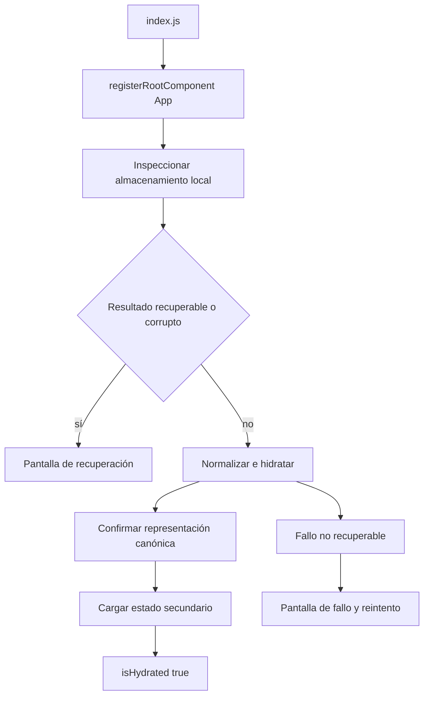
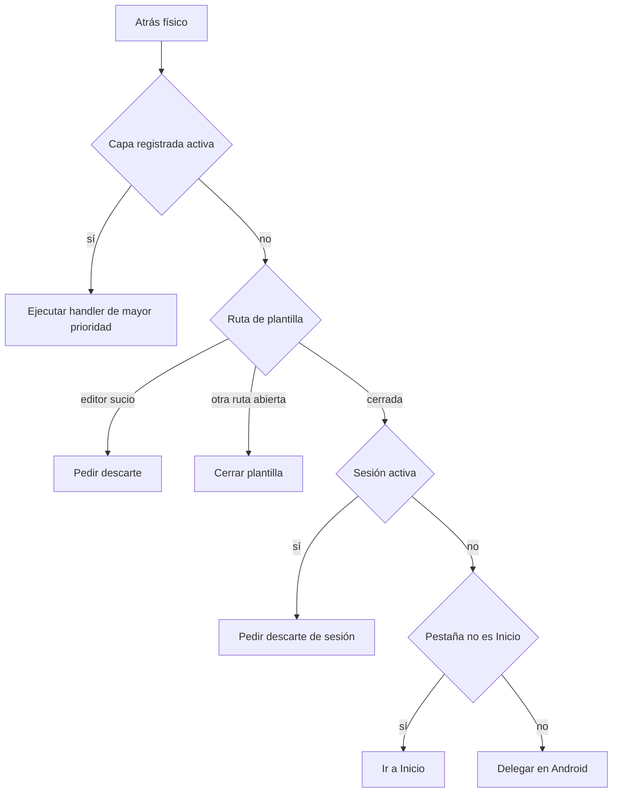

# Shell de aplicación, plataformas y navegación

`apps/mobile/index.js` registra el componente `App` mediante `registerRootComponent`. `App` mantiene una generación de runtime: tras un borrado local remonta `GymnasiaApp` con una `key` nueva y conserva el resultado del borrado. La instancia nueva abre Configuración si aquel resultado fue incompleto; en cualquier otro arranque la pestaña inicial es Inicio. `GymnasiaApp` es la composición local-first del cliente: reúne estado de pantalla, almacenamiento, controladores de dominio y superficies globales, pero no sustituye los límites propios de entrenamiento, dieta, medidas o agente.

## Arranque protegido e hidratación

El runtime comienza con `createInitialStore()`, `loading: true` e `isHydrated: false` y ejecuta `runLocalStoreHydration`. Primero inspecciona el agregado local, antes de normalizarlo o de publicar estado React. Un resultado `recoverable` o `corrupt` deja `isHydrated` desactivado, detiene el indicador de carga y reemplaza todo el shell por `LocalStoreRecoveryScreen`. Una excepción que no puede transformarse en cuarentena muestra `LocalStoreStartupFailureScreen`, que solo ofrece reintento. En ambos casos la aplicación no se presenta como vacía ni persiste sobre datos sin comprobar.



*El arranque separa la cuarentena protectora de la ruta que puede publicar y persistir el estado normalizado.*

En la ruta normal, el shell carga las claves y configuración de proveedor según plataforma, confirma la representación canónica del agregado y solo después lee sesión activa, instantánea y borrador de sesión, preferencias, salud de alarmas y consentimiento. Los fallos del almacenamiento seguro, de una instantánea o de datos secundarios se comunican como error no fatal cuando es posible; no invalidan automáticamente el agregado principal. Al final reemplaza los runtimes y estados React, habilita `isHydrated` y refresca diagnósticos de notificaciones.

`isHydrated` es también una barrera de escritura: los efectos de persistencia del agregado, sesión y borrador retornan mientras sea falso. Si un `commit` posterior resulta ambiguo o bloqueado, el shell vuelve a deshidratarse e inspecciona de nuevo antes de permitir más escrituras. No retire esa barrera al extraer pantallas o controladores.

### Recuperación deliberada

La pantalla de recuperación no muestra valores del usuario en sus detalles; lista rutas y códigos de incidencias. Sus acciones son:

- **Recuperar última copia**, disponible únicamente con una instantánea verificada; restaura y vuelve a hidratar.
- **Guardar copia dañada**, disponible si se conserva el payload; solicita una contraseña y exporta el contenido cifrado.
- **Volver a intentarlo**, que repite la inspección sin respetar una cuarentena anterior para aceptar una reparación externa.
- **Descartar estos datos y empezar de cero**, protegido por confirmación.

Al descartar, `discardAffected` escribe un `createInitialStore()` (con las claves de proveedor actualmente cargadas, o las predeterminadas) y elimina la sesión activa, su instantánea de plantilla y su borrador. No borra las particiones de datos personales ni preferencias. La E2E de recuperación comprueba que un JSON roto permanece intacto hasta una acción explícita, que la exportación está cifrada, que los detalles omiten un valor privado, y que reintento, restauración y descarte eliminan la cuarentena solamente tras una ruta válida.

## Navegación: un estado, dos presentaciones

No hay rutas URL ni una pila de navegación principal. `TAB_DESTINATIONS` es el registro único de `TabKey` y define los seis destinos: `home`, `training`, `diet`, `measures`, `chat` y `settings`; `tab` es estado React y tanto los controles como los accesos internos lo cambian con `setTab`. Las vistas secundarias —por ejemplo detalle/editor de rutina, sesión, selector de fecha, modales y secciones de configuración— mantienen su propio estado/controlador, no una URL restaurable.

El registro también define las etiquetas, iconos y `testID` de ambos formatos. `usesDesktopNavigation` activa escritorio exclusivamente para `Platform.OS === "web"` con viewport de al menos 960 píxeles. Entonces `App` monta `DesktopSidebar`; en web estrecha y en iOS/Android, incluso con pantalla grande, `AppHeader` monta la banda horizontal. Ambas invocan el mismo `onTabChange`, así que un cambio de ancho intercambia el control visual sin reiniciar `tab` ni el estado anidado.

| Formato | Registro visual | Selectores |
|---|---|---|
| Escritorio web | Barra lateral de 246 px con los seis destinos. | `desktop-nav-${key}` |
| Compacto (web estrecha y nativo) | Banda horizontal en el encabezado con los mismos destinos. | `nav-tab-${key}` |

Añadir una pestaña requiere actualizar `TAB_DESTINATIONS` y el renderizado de contenido; las dos barras se derivan del registro. Las pruebas de `shellRegistry` fijan los destinos, la frontera de 960 px, la unicidad de selectores y que Android/iOS nunca reciban la presentación de escritorio por su ancho.

## Atrás de Android y propiedad de superficies

`SHELL_BACK_LAYERS` registra las capas que pertenecen al `BackHandler`: identificador, alcance, prioridad única descendente, `testID`, propietario y comportamiento. `App.tsx` construye de forma exhaustiva el mapa de visibilidad y el de handlers, y `resolveShellBackCommand` selecciona la primera capa activa por el orden de ese registro. Un listener Android estable consulta un `ref` actualizado en cada render, por lo que lee el estado y los handlers actuales sin volver a suscribirse.



*Las capas visuales prevalecen sobre rutas anidadas, sesión y pestaña; solo Inicio sin superficie administrada devuelve el control al sistema.*

Los `Modal` nativos y las pantallas de recuperación/fallo figuran aparte en `SYSTEM_OWNED_SHELL_SURFACES`: React Native gestiona el `onRequestClose` de los modales y las pantallas de inicio delegan en el sistema, por lo que no participan en el resolutor global. Al crear una superficie, registre su propietario y prioridad si debe responder a Atrás; no basta con renderizarla.

## Sesión, avisos locales y retorno a primer plano

Al iniciar una sesión se solicita permiso de notificaciones y, en Android, se crea/consulta el canal local `rest_end_alert` con importancia máxima, sonido, vibración, visibilidad pública y `bypassDnd`. Los errores se trazan y no impiden continuar con el entrenamiento. El shell prepara el aviso de descanso al entrar en un descanso programable —mientras todavía está en primer plano—: cancela los avisos de descanso anteriores, valida que sesión y preferencias sigan coincidiendo, y programa una notificación de fecha con el payload que contiene el instante esperado. Al pasar a segundo plano, persiste el reloj conciliado y conserva el aviso ya armado si sigue siendo aplicable; en caso contrario lo cancela.

En primer plano, el temporizador reproduce la alerta interna al terminar el descanso. El `setNotificationHandler` de módulo suprime banner y sonido de una notificación de descanso recibida en primer plano para evitar duplicados, aunque otras notificaciones sí pueden mostrarse y sonar. Los listeners de recepción y pulsación, y al volver al foreground la comprobación de bandeja y última respuesta, aportan evidencia de entrega y registran el retraso respecto de `expected_at_ms`. Esa evidencia decide si se reproduce la alerta interna recuperada dentro de la ventana de respaldo: la programación local no garantiza que el sistema despierte o entregue puntualmente.

## Variantes Expo, permisos y aislamiento

`app.config.ts` exige `APP_ENV` y acepta solo `development`, `staging` o `production`. A cada variante le asigna nombre, identificadores iOS/Android, canal de política y espacio de nombres. Desarrollo usa proveedor `fake` por defecto y puede cambiar a `byok` con `DEV_PROVIDER_MODE`; staging y producción son siempre `byok`. La configuración inyecta estos valores, versión de configuración y metadatos de política en `expo.extra`; también configura el endpoint de incidencias, vacío por defecto en desarrollo y HTTPS en staging/producción.

Al iniciar, `resolveRuntimeEnvironment` rechaza extras ausentes, híbridos o incompatibles y metadatos de política inválidos. Las claves de AsyncStorage y SecureStore no productivas se prefijan con el espacio de nombres; producción conserva las claves canónicas y excluye los prefijos de desarrollo/staging. Así, las instalaciones de prueba no comparten estado local con producción.

El manifiesto base fija orientación vertical, soporta tabletas en iOS y declara en Android `WAKE_LOCK`, `VIBRATE`, `RECEIVE_BOOT_COMPLETED` y `SCHEDULE_EXACT_ALARM`; bloquea explícitamente `USE_EXACT_ALARM`, instalación de paquetes, micrófono y ventanas superpuestas. El plugin `expo-notifications` se añade dinámicamente por `app.config.ts` y recibe los archivos de sonido empaquetados. No declara un permiso de servicio en primer plano. Los perfiles EAS suministran el `APP_ENV` correspondiente; staging y `production-apk` solicitan APK Android.

## Validación enfocada

Use controles proporcionales al límite modificado:

```bash
npm --workspace apps/mobile exec tsc --noEmit
npm --workspace apps/mobile run build:web
npm run test:shell:e2e
npm run test:storage-recovery:e2e
```

Además de la E2E de recuperación, `shellRegistry.test.ts` prueba el orden determinista de capas, los fallbacks plantilla/sesión/pestaña/sistema y que el callback Android estable consulte el valor nuevo del `ref`. Para cambios en permisos, canales, audio o alarmas, la exportación web no es suficiente: valide una compilación nativa con permisos concedidos y denegados, y una transición real a segundo plano/primer plano.
