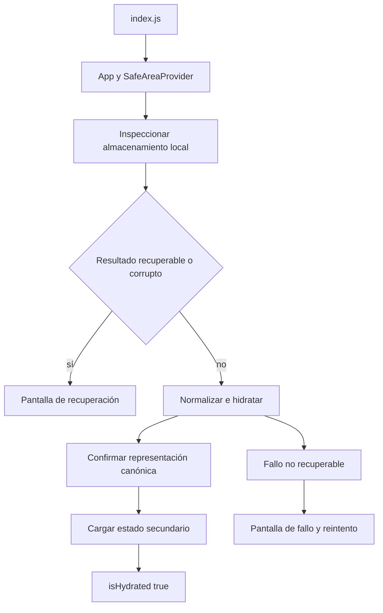
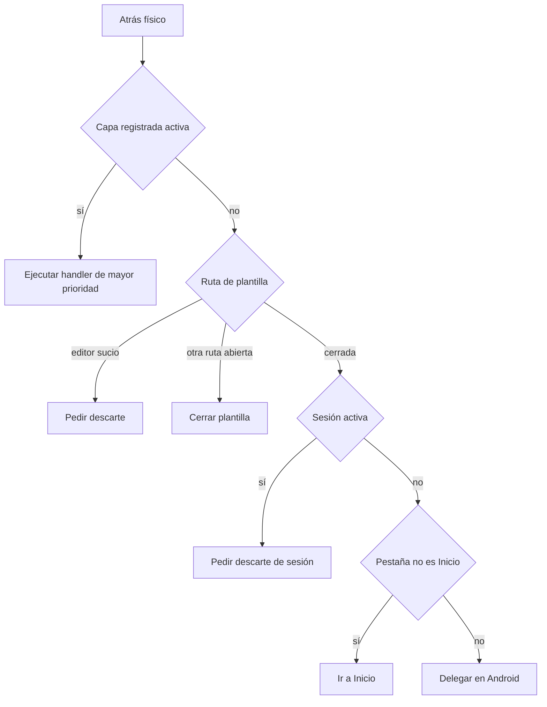

# Shell y navegación de la aplicación móvil

`apps/mobile/index.js` registra `App` mediante `registerRootComponent`. `App` conserva una generación de runtime y, después de un borrado local, remonta `GymnasiaApp` con una `key` nueva y el resultado del borrado. Por ello, `GymnasiaApp` concentra la composición del shell local-first —estado de pantalla, almacenamiento, controladores y superficies globales— sin reemplazar los límites de cada dominio.

## Arranque protegido e hidratación

El runtime parte de `createInitialStore()`, `loading: true` e `isHydrated: false`, y ejecuta `runLocalStoreHydration` al montar. Antes de normalizar o publicar estado React inspecciona el agregado local. Un resultado `recoverable` o `corrupt` mantiene `isHydrated` en falso y sustituye el shell por `LocalStoreRecoveryScreen`; un error que no puede pasar a cuarentena muestra `LocalStoreStartupFailureScreen`, que solo permite reintentar. La aplicación no se presenta como vacía ni persiste sobre un agregado sin comprobar.


```mermaid
flowchart TD
    Entry["index.js"] --> Root["App y SafeAreaProvider"]
    Root --> Inspect["Inspeccionar almacenamiento local"]
    Inspect --> Quarantine{"Resultado recuperable o corrupto"}
    Quarantine -->|"sí"| Recovery["Pantalla de recuperación"]
    Quarantine -->|"no"| Normalize["Normalizar e hidratar"]
    Normalize --> Commit["Confirmar representación canónica"]
    Commit --> Secondary["Cargar estado secundario"]
    Secondary --> Ready["isHydrated true"]
    Normalize --> Failure["Fallo no recuperable"]
    Failure --> Retry["Pantalla de fallo y reintento"]
```

*El arranque separa la cuarentena protectora de la ruta que puede publicar y persistir el estado normalizado.*

En la ruta válida, el shell carga y migra las claves de proveedor según plataforma, confirma la representación canónica del agregado y solo después lee sesión activa, instantánea y borrador de sesión, preferencias, salud de alarmas y consentimiento. Los fallos del almacén seguro o de datos secundarios se comunican como no fatales cuando es posible; no invalidan automáticamente el agregado principal. Al final reemplaza los runtimes y estados React, habilita `isHydrated` y refresca los diagnósticos de notificaciones.

`isHydrated` es una barrera de escritura: la persistencia del agregado, de la sesión y de su borrador retorna mientras sea falso. Si un `commit` es ambiguo o queda bloqueado, el shell se deshidrata e inspecciona de nuevo antes de permitir más escrituras. No retire esta barrera al extraer una pantalla o controlador.

### Recuperación deliberada

La pantalla de recuperación no muestra valores del usuario en sus detalles; lista rutas y códigos de incidencias. Sus acciones son:

- **Recuperar última copia**, solo si hay una instantánea verificada; restaura y vuelve a hidratar.
- **Guardar copia dañada**, si se conserva el payload; solicita contraseña y exporta contenido cifrado.
- **Volver a intentarlo**, que inspecciona de nuevo sin respetar una cuarentena previa para aceptar una reparación externa.
- **Descartar estos datos y empezar de cero**, protegido por confirmación.

Al descartar, `discardAffected` escribe un `createInitialStore()` con las claves de proveedor cargadas —o las predeterminadas— y elimina la sesión activa, su instantánea de plantilla y su borrador. No borra las particiones de datos personales ni preferencias. La E2E de recuperación comprueba que un JSON roto permanece intacto hasta una acción explícita, que la exportación está cifrada, que los detalles omiten valores privados y que reintento, restauración y descarte solo eliminan la cuarentena por una ruta válida.

## Insets y superficie raíz

`App` envuelve exactamente una instancia de `GymnasiaApp` en `SafeAreaProvider`; la superficie normal de `GymnasiaApp` es un `SafeAreaView` de `react-native-safe-area-context`. Esto es necesario para los insets bajo edge-to-edge de Android: no se debe importar `SafeAreaView` desde `react-native` ni compensar `StatusBar.currentHeight` manualmente, porque duplicaría el margen del contenedor raíz.

Los `Modal` nativos se dibujan fuera de ese contenedor, así que cada uno debe aplicar su propio `SafeAreaView` de la misma biblioteca. El contrato estático enumera los modales nativos actuales —informe de IA, recuperación local y contraseña de copia— y falla si aparece el import del core, una compensación manual o más de un proveedor raíz.

## Navegación: un estado, dos presentaciones

No hay rutas URL ni una pila principal restaurable. `TAB_DESTINATIONS` es el registro único de `TabKey`: `home`, `training`, `diet`, `measures`, `chat` y `settings`. `tab` es estado React; comienza en Inicio y comienza en Configuración únicamente cuando un restablecimiento por borrado informa estado `incomplete`. El renderizado de `App` selecciona la pantalla de cada pestaña y las vistas secundarias —detalle/editor de rutina, sesión, selectores y overlays— conservan su estado/controlador propio.

La página Inicio no reproduce reglas de navegación: `useHomeController` recibe los destinos desde el shell. Su acción primaria abre Entrenamiento si hay una sesión activa o no existe plantilla ejecutable; solo inicia la primera plantilla ejecutable cuando no hay sesión activa. Así la tarjeta de Inicio comparte el mismo `setTab("training")` y el arranque de sesión que el resto del shell.

El registro de destinos también define etiquetas, iconos y `testID` de ambos formatos. `usesDesktopNavigation` habilita escritorio exclusivamente en `Platform.OS === "web"` con viewport de al menos 960 px. En ese caso se monta `DesktopSidebar`; en web estrecha y en iOS/Android, incluso con pantalla grande, `AppHeader` monta la banda horizontal. Ambos invocan el mismo `onTabChange`, por lo que cambiar el ancho intercambia el control visual sin reiniciar `tab` ni el estado anidado.

| Formato | Registro visual | Selectores |
|---|---|---|
| Escritorio web | Barra lateral de 246 px con los seis destinos. | `desktop-nav-${key}` |
| Compacto, web estrecha y nativo | Banda horizontal en el encabezado con los mismos destinos. | `nav-tab-${key}` |

Añadir una pestaña exige actualizar `TAB_DESTINATIONS` **y** el renderizado de contenido de `App`; las dos barras se derivan del registro. Las pruebas de `shellRegistry` fijan destinos, frontera de 960 px, selectores únicos y que Android/iOS nunca reciban escritorio por su ancho.

## Atrás de Android y propiedad de superficies

`SHELL_BACK_LAYERS` registra las capas que pertenecen a `BackHandler`: identificador, alcance, prioridad única descendente, `testID`, propietario y comportamiento. `App.tsx` construye de forma exhaustiva el mapa de visibilidad y el de handlers desde controladores y estado local. `resolveShellBackCommand` elige la primera capa activa según el orden del registro. Existe una sola suscripción Android, estable, que consulta un `ref` actualizado en cada render y por tanto usa el estado y handler actuales sin resuscribirse.


```mermaid
flowchart TD
    Back["Atrás físico"] --> Layer{"Capa registrada activa"}
    Layer -->|"sí"| Close["Ejecutar handler de mayor prioridad"]
    Layer -->|"no"| Template{"Ruta de plantilla"}
    Template -->|"editor sucio"| Draft["Pedir descarte"]
    Template -->|"otra ruta abierta"| TemplateClose["Cerrar plantilla"]
    Template -->|"cerrada"| Session{"Sesión activa"}
    Session -->|"sí"| Discard["Pedir descarte de sesión"]
    Session -->|"no"| Tab{"Pestaña no es Inicio"}
    Tab -->|"sí"| Home["Ir a Inicio"]
    Tab -->|"no"| System["Delegar en Android"]
```

*Las capas visuales prevalecen sobre rutas anidadas, sesión y pestaña; solo Inicio sin superficie administrada devuelve el control al sistema.*

Los `Modal` nativos y las pantallas de recuperación/fallo figuran por separado en `SYSTEM_OWNED_SHELL_SURFACES`: React Native gestiona `onRequestClose` de los modales y las pantallas de arranque delegan en el sistema; no participan en el resolvedor global. Al crear una superficie, regístrela con propietario y prioridad si debe responder a Atrás; renderizarla no basta.

## Sesión, avisos locales y retorno a primer plano

Al iniciar una sesión se solicita permiso de notificaciones y, en Android, se crea o consulta el canal local `rest_end_alert` con importancia máxima, sonido, vibración, visibilidad pública y `bypassDnd`. Los errores se trazan y no impiden continuar con el entrenamiento. El shell prepara el aviso de descanso al entrar en un descanso programable: cancela avisos anteriores, valida sesión y preferencias y programa una notificación fechada con el instante esperado. Al pasar a segundo plano persiste el reloj conciliado y conserva el aviso armado solo si sigue siendo aplicable.

En primer plano, el temporizador reproduce la alerta interna al terminar el descanso. El `setNotificationHandler` suprime banner y sonido de una notificación de descanso recibida en primer plano para evitar duplicados. Los listeners, la bandeja y la última respuesta aportan evidencia de entrega y el retraso respecto de `expected_at_ms`; esa evidencia decide si se reproduce la alerta interna recuperada en la ventana de respaldo.

## Variantes Expo, permisos y aislamiento

`app.config.ts` exige `APP_ENV` y acepta `development`, `staging` o `production`. Cada variante recibe nombre, identificadores iOS/Android, canal de política y espacio de nombres. Desarrollo usa proveedor `fake` por defecto y puede cambiar a `byok` con `DEV_PROVIDER_MODE`; staging y producción usan `byok`. La configuración inyecta esos valores, versión de configuración y metadatos de política en `expo.extra`, y configura el endpoint de incidencias.

Al arrancar, `resolveRuntimeEnvironment` rechaza extras ausentes, híbridos o incompatibles y metadatos de política inválidos. AsyncStorage y SecureStore no productivos se prefijan con el espacio de nombres; producción conserva claves canónicas. Así las instalaciones de prueba no comparten estado local con producción.

El manifiesto declara `WAKE_LOCK`, `VIBRATE`, `RECEIVE_BOOT_COMPLETED` y `SCHEDULE_EXACT_ALARM` en Android, y bloquea explícitamente `USE_EXACT_ALARM`, instalación de paquetes, micrófono y ventanas superpuestas. `app.config.ts` añade dinámicamente `expo-notifications` con sonidos empaquetados. No se declara permiso de servicio en primer plano.

## Validación enfocada

Use controles proporcionales al límite modificado:

```bash
npm --workspace apps/mobile exec tsc --noEmit
npm --workspace apps/mobile run test:deterministic -- shell/shellRegistry.test.ts shell/shellRegistry.contract.test.ts shell/safeArea.contract.test.ts
npm --workspace apps/mobile run build:web
npm --workspace apps/mobile run test:storage-recovery:e2e
```

`shellRegistry.test.ts` cubre destinos, prioridad determinista y los fallbacks plantilla/sesión/pestaña/sistema, incluso mediante propiedades sobre combinaciones de capas. `shellRegistry.contract.test.ts` exige una suscripción estable, estados y handlers exhaustivos y `testID` para cada superficie. `safeArea.contract.test.ts` es estática: cubre todos los fuentes de la app y protege los insets de Android. Para cambios en permisos, canales, audio o alarmas, la exportación web no basta: valide una compilación nativa con permisos concedidos y denegados y una transición real a segundo plano/primer plano.
