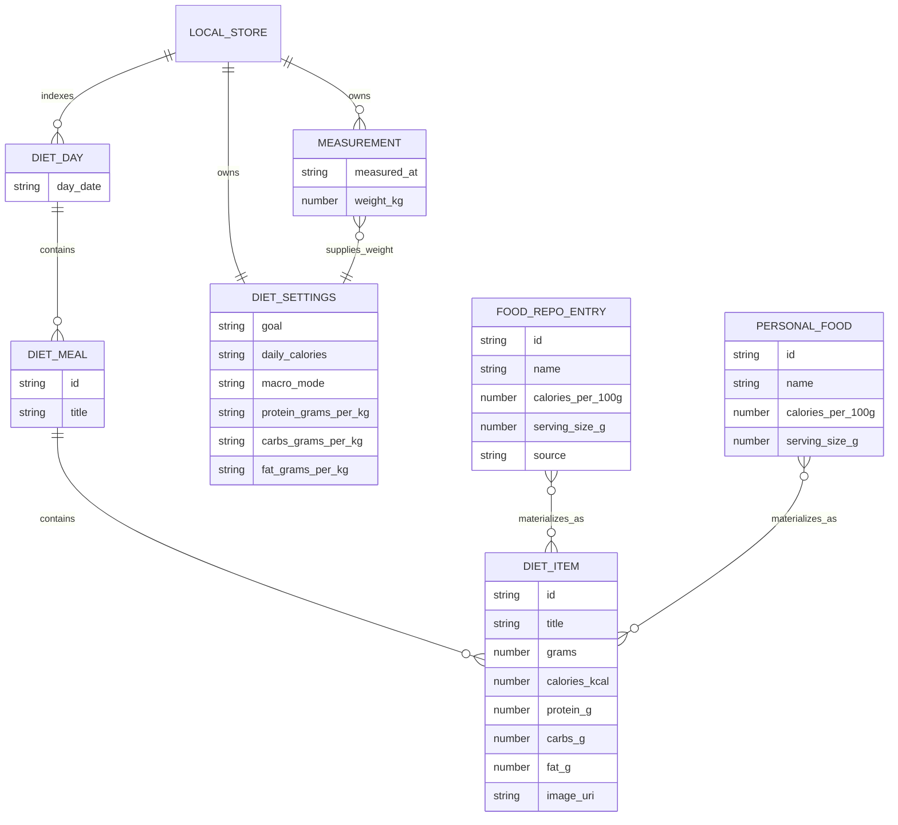

# Dieta y estimación de alimentos

La función de dieta de Gymnasia es un registro diario de alimentos con enfoque local-first implementado principalmente en `apps/mobile/App.tsx`. Un día contiene comidas con nombre, cada comida contiene totales nutricionales ya ajustados a las porciones, y la interfaz deriva el progreso diario de calorías y macronutrientes sumando esos elementos. Las entradas del repositorio de alimentos son un catálogo independiente por cada 100 gramos que se utiliza para crear elementos del registro; no están vinculadas al registro mediante claves foráneas. El mismo estado `dietByDate` puede modificarse desde la interfaz de dieta, el estimador de alimentos mediante IA y el agente general de chat, pero esas rutas de escritura **no** aplican reglas idénticas.

La función tiene cuatro límites importantes:

- `LocalStore.dietByDate` y `LocalStore.dietSettings` se conservan junto con el almacén principal de la aplicación.
- Los catálogos remotos de alimentos, productos comerciales y recetas se obtienen y almacenan en caché, y después se combinan en memoria como `foodsRepo`.
- Los alimentos personales utilizan una clave de AsyncStorage independiente y participan en la búsqueda manual, la búsqueda del agente y la copia de seguridad.
- Las llamadas a proveedores y OpenFoodFacts son pasos externos de enriquecimiento. Su salida se aplana en valores `DietItem` ordinarios, sin metadatos duraderos de procedencia o confianza.

## Esquemas e invariantes del dominio

### Datos de dieta registrados

Los tipos canónicos de la interfaz son `DietItem`, `DietMeal` y `DietDay` en `apps/mobile/App.tsx`:

| Tipo | Campos | Semántica |
| --- | --- | --- |
| `DietItem` | `id`, `title`, `grams`, `calories_kcal`, `protein_g`, `carbs_g`, `fat_g`, `image_uri` opcional | Los valores nutricionales son totales de la porción registrada, no valores por cada 100 g. |
| `DietMeal` | `id`, `title`, `items` | Una comida agrupa elementos. La interfaz utiliza normalmente una categoría canónica como título. |
| `DietDay` | `day_date`, `meals` | Se almacena en `LocalStore.dietByDate[date]`, normalmente utilizando el mismo valor `YYYY-MM-DD` para la clave del mapa y `day_date`. |

Las cinco categorías de comidas de la interfaz, en orden de visualización, son `Desayuno`, `Almuerzo`, `Comida`, `Merienda` y `Cena` (`DietMealCategory` y `DIET_MEAL_CATEGORIES`). `orderedDietMeals` crea comidas vacías virtuales para las categorías ausentes, de modo que la pantalla siempre muestre las cinco, pero esos registros virtuales no se conservan hasta que se añade un elemento. `sortDietMealsByCategory` coloca primero las categorías canónicas y ordena después los títulos no canónicos.



*La jerarquía de dieta almacenada y las entradas del catálogo y las mediciones a partir de las cuales se derivan las porciones registradas y los objetivos.*

`normalizeDietByDate` es el límite de hidratación. Esta función:

- acepta un mapa de objetos y, en caso contrario, devuelve `{}`;
- recurre a la clave del mapa cuando falta `day_date`;
- genera los ID de elementos y comidas que faltan;
- sustituye un título de elemento vacío por `"Comida"` y un título de comida vacío por `"Comida N"`;
- procesa cadenas numéricas, valores no válidos y valores negativos mediante `normalizeDietNonNegativeNumber`, redondeando los valores aceptados a un decimal y convirtiendo los valores no válidos en cero.

No valida el formato de fecha, elimina comidas duplicadas, impone nombres canónicos de comidas ni garantiza la concordancia entre la clave original del mapa y `day_date`. Si dos entradas de origen se normalizan al mismo `day_date`, la última entrada sobrescribe la anterior.

### Esquema del catálogo de alimentos y de los alimentos personales

`FoodRepoEntry` es el contrato reutilizable del catálogo. Sus campos relevantes son `id`, `name`, `category`, calorías/proteínas/carbohidratos/grasas/fibra por cada 100 g, `serving_size_g`, `serving_description`, datos de imagen opcionales y `source` opcional. Los cargadores remotos anotan las entradas como `alimento`, `producto_comercial` o `receta`. `sendMessage` añade los alimentos personales al repositorio combinado del agente, pero los constructores de alimentos personales no establecen `source: "personal"`; como `search_foods` asigna de forma predeterminada `alimento` cuando falta el origen, el filtro anunciado `source: "personal"` no selecciona las entradas personales ordinarias. Las búsquedas por nombre, categoría y nutrientes sí pueden devolverlas.

Una entrada del catálogo es una plantilla, no una referencia activa. Al crear un `DietItem`, se copian y escalan sus valores nutricionales. Las ediciones posteriores de un alimento personal o las actualizaciones de un repositorio remoto no reescriben el historial de dieta existente.

Los alimentos personales se gestionan en Ajustes → Alimentos personales:

- El formulario solo exige un nombre que no esté en blanco. Los campos numéricos utilizan `Number(value) || 0`; el tamaño de la porción toma de forma predeterminada el valor `100` cuando es cero, está en blanco o no es válido.
- El `MiniChat` de IA utiliza `FOOD_AI_SYSTEM_PROMPT`, solicita confirmación, extrae un bloque JSON y asigna los mismos campos con una coerción numérica igualmente permisiva.
- Las entradas pueden buscarse por nombre o categoría, visualizarse, editarse conservando su ID y eliminarse.
- `loadPersonalFoods` ejecuta directamente `JSON.parse` sobre el valor independiente y devuelve `[]` en caso de error. No realiza ninguna normalización por elemento ni validación del esquema.

## Flujos de trabajo de comidas

### Búsqueda y conversión de porciones

El editor de dieta ofrece búsqueda, entrada directa mediante formulario y estimación por IA. La búsqueda tiene en cuenta los repositorios remotos combinados y los alimentos personales. `findFoodInRepo` normaliza mayúsculas y minúsculas, espacios en blanco y acentos, busca primero una coincidencia exacta de nombre y después utiliza coincidencias bidireccionales de subcadenas. Esto facilita las coincidencias, pero introduce ambigüedad: gana la primera coincidencia parcial y no se conserva ningún ID del repositorio en el elemento de registro resultante.

Para una coincidencia del repositorio con una cantidad de gramos positiva, tanto la ruta del formulario como la ruta de guardado del estimador calculan:

- `ratio = grams / 100`;
- las calorías como kcal enteras redondeadas;
- las proteínas, los carbohidratos y las grasas redondeados a un decimal;
- un URI de imagen seleccionado a partir de la URL base de imágenes de alimentos, productos o recetas.

Al editar un elemento existente, `mealPerGramRef` captura sus totales actuales divididos entre los gramos. Al cambiar los gramos, las calorías y los macronutrientes se vuelven a escalar a partir de esa instantánea. Este estado es efímero y exclusivo de la interfaz; se restablece cuando el editor se cierra o cambia de contexto.

### Adición, edición, eliminación y copia manuales

`addMeal` requiere una categoría canónica seleccionada y una cantidad positiva de calorías. Las entradas explícitas de macronutrientes deben ser no negativas, pero los macronutrientes en blanco se convierten en cero. Los gramos pueden ser cero o dejarse en blanco. Si la coincidencia por título encuentra una entrada del repositorio y los gramos son positivos, los valores del repositorio sobrescriben los campos de calorías y macronutrientes introducidos manualmente. De lo contrario, se guardan los totales introducidos; la ausencia de una coincidencia en el repositorio también activa `createGitHubFoodIssue` con `food_type: "manual"`.

Al añadir, el día y la comida se crean de forma diferida. La edición conserva el ID existente del elemento y actualiza el título, los gramos, las calorías y los macronutrientes. Cabe destacar que la combinación de edición manual no actualiza ni borra `image_uri`, por lo que cambiar un elemento respaldado por el repositorio a otro nombre puede conservar su imagen anterior. Al eliminar el último elemento, se elimina la comida, pero se conserva una entrada `DietDay` vacía en `dietByDate`.

Aunque la ruta manual de alimento desconocido llama a `createGitHubFoodIssue`, la escritura de incidencias está deshabilitada intencionadamente: el valor `GITHUB_FOOD_ISSUE_TOKEN` del cliente estático es una constante vacía, por lo que la función auxiliar devuelve el control antes de `fetch`. La llamada se realiza sin esperar el resultado, incluso si posteriormente se añade un escritor de confianza. La creación o edición de la comida ya ha actualizado el estado de React y su efecto normal de persistencia de `LocalStore` es independiente del éxito, el error o la finalización de la incidencia; no se almacena ningún ID de incidencia en `DietItem`.

El flujo de repetición puede copiar la misma categoría del día anterior o de otra fecha seleccionada. Muestra una vista previa de los elementos de origen, rechaza la copia desde la fecha actual, clona cada elemento con un nuevo ID y añade los clones a la comida de destino. No combina duplicados ni reemplaza la comida de destino.

Los totales diarios son reducciones simples mediante `sumDayCalories` y `sumDayMacroGrams`. El panel de inicio utiliza la suma de calorías de hoy; la pantalla Dieta utiliza la fecha seleccionada.

## Objetivos y dependencia de las mediciones

`DietSettings` almacena cadenas porque los ajustes se editan como texto. Contiene:

- objetivo: `bulk`, `cut` o `maintain`;
- nivel de actividad, sexo, altura y fecha de nacimiento opcionales;
- `daily_calories`;
- modo de macronutrientes: `manual_calories` o `protein_by_weight`;
- asignaciones calóricas para carbohidratos, proteínas y grasas en el modo manual;
- valores en gramos por kilogramo para proteínas, carbohidratos y grasas en el modo basado en el peso.

Los valores predeterminados son mantenimiento, sin objetivo calórico, modo manual, asignaciones manuales en blanco, proteínas `1.5 g/kg` y proporciones de carbohidratos y grasas en blanco. `normalizeDietSettings` restringe las enumeraciones y normaliza el texto numérico. El objetivo calórico puede introducirse directamente o calcularse bajo demanda: la acción **Calcular** requiere peso, altura y fecha de nacimiento, calcula la TMB de Mifflin–St Jeor (`10 × kg + 6.25 × cm − 5 × age`, más `5` para hombres o `−161` para mujeres), aplica los multiplicadores de actividad `1.55`, `1.725` o `1.9` y después aplica los multiplicadores de objetivo `0.8` para definición, `1.2` para volumen o `1` para mantenimiento. Redondea el resultado en `daily_calories`; cambiar posteriormente las entradas del perfil no vuelve a calcularlo automáticamente.

En el modo manual, los gramos objetivo se derivan utilizando 4 kcal/g para las proteínas y los carbohidratos, y 9 kcal/g para las grasas. En el modo basado en el peso, la aplicación toma la primera medición con un valor `weight_kg` no nulo del array de mediciones ya ordenado y la multiplica por cada valor configurado de g/kg. Por tanto, el orden de las mediciones es un requisito implícito de corrección; consulte [Mediciones](measurements.md).

Cuando se configuran exactamente dos macronutrientes en g/kg y están disponibles tanto el peso corporal como las calorías diarias, la interfaz puede completar la proporción ausente a partir de las calorías restantes. También muestra indicaciones de máximo para cada proporción. El cálculo limita a cero el remanente calórico ausente, pero no impide que las calorías configuradas para los macronutrientes superen el objetivo diario. Por consiguiente, los valores de calorías restantes pueden ser negativos.

Al cambiar del modo basado en el peso al modo manual, las calorías calculadas de los macronutrientes se copian en los campos manuales solo cuando existe un peso positivo y al menos un valor de g/kg. La edición de cualquiera de las representaciones también puede sincronizar la otra cuando el peso está disponible. Estas son instantáneas: registrar un nuevo peso cambia inmediatamente los objetivos del modo basado en el peso, pero no reescribe retroactivamente las asignaciones manuales de calorías existentes.

## Flujo del estimador mediante IA, el proveedor y los códigos de barras

El estimador de alimentos es un modal específico y está separado del agente general de orientación. Acepta texto y hasta seis imágenes en base64, transmite el contenido y el razonamiento del asistente y solo permite guardar después de que exista una respuesta de un LLM y se haya seleccionado una categoría de comida.

La resolución del proveedor respeta primero `store.foodAIProvider` cuando ese proveedor tiene una clave de API. Después tiene en cuenta el proveedor seleccionado en el modal y, por último, recurre a `google`, `openai`, `anthropic`, en ese orden. Este mecanismo alternativo no consulta `is_active`. OpenAI utiliza Responses, Google utiliza `streamGenerateContent` y Anthropic utiliza Messages; el tráfico de Anthropic desde navegadores pasa por el proxy configurado. La estimación de imágenes con Anthropic se rechaza explícitamente en la web, aunque la estimación de solo texto con Anthropic puede utilizar el proxy.

<!-- openwiki: mermaid parse failed and this diagram was converted to a text fence so it does not break rendering. Fix the diagram source and restore the mermaid fence. Parser error: Parse error on line 14: ...gits Tool->>OFF: GET product by Expecting '+', '-', '()', 'ACTOR', got 'off' -->
```text
sequenceDiagram
    actor User
    participant UI as Estimator Modal
    participant Provider as Model Provider
    participant Tool as Barcode Handler
    participant OFF as OpenFoodFacts
    participant Extractor as Structured Extraction
    participant Store as Local Store

    User->>UI: Add text or images
    UI->>Provider: Conversation and first-turn images
    alt Barcode tool requested
        Provider->>Tool: scan_barcode with digits
        Tool->>OFF: GET product by barcode
        OFF-->>Tool: Product and nutrients
        Tool-->>Provider: JSON or controlled error text
        Provider-->>UI: Revised estimate
    else No barcode tool
        Provider-->>UI: Visual or textual estimate
    end
    User->>UI: Add to selected meal
    UI->>Extractor: Conversation summary and nutrition schema
    Extractor-->>UI: Structured nutrition object
    UI->>UI: Prefer repository values when matched
    UI->>Store: Add item or update existing item
```

*El estimador realiza una estimación conversacional, una consulta opcional del código de barras y una segunda extracción estructurada antes de confirmar un elemento ordinario de dieta.*

`callFoodEstimatorAPI` adjunta las imágenes únicamente al último mensaje del usuario y deja de reenviarlas después de la primera respuesta correcta del LLM. Cada proveedor puede ejecutar hasta cinco rondas de continuación de la herramienta de código de barras. La operación externa de envío realiza hasta tres reintentos ante errores de red, tiempo de espera, sobrecarga y limitación de frecuencia, con demoras crecientes.

`scan_barcode` elimina los espacios en blanco y realiza una solicitud a la API v2 de OpenFoodFacts. La herramienta devuelve como JSON la identidad del producto, la información de la porción, nutrientes seleccionados por cada 100 g y por porción, ingredientes y Nutri-Score. Los errores HTTP y los productos ausentes se devuelven al modelo como texto en lugar de lanzarse como excepciones. Los valores de OpenFoodFacts no se conservan directamente; el proveedor los interpreta y la llamada estructurada posterior vuelve a extraer los totales.

Al guardar se invoca `requestStructuredNutritionJSON`, una segunda solicitud no transmitida al proveedor con los campos obligatorios `dish_name`, `grams`, calorías, tres macronutrientes y `food_type`. OpenAI utiliza un esquema JSON estricto, Anthropic fuerza una herramienta `extract_nutrition` y Google utiliza un esquema de respuesta sin `additionalProperties`. La comprobación en tiempo de ejecución posterior al análisis es limitada: solo se requieren un nombre de plato que se evalúe como verdadero y una cantidad de calorías no nula. Los valores negativos, no finitos, de tipo incorrecto o inverosímiles no se rechazan de forma exhaustiva.

Si el nombre extraído coincide con una entrada del repositorio y los gramos son positivos, los datos nutricionales del repositorio sustituyen la estimación. De lo contrario, se almacenan los totales extraídos. Las recetas y los productos comerciales desconocidos llegan al mismo enlace deshabilitado `createGitHubFoodIssue`; como la constante del token está vacía, actualmente no se realiza ninguna solicitud a GitHub. Los alimentos básicos genéricos no lo invocan. Una referencia local de la sesión registra si se ejecutó `scan_barcode` y fuerza que la clasificación de la posible incidencia sea `producto_comercial`, sobrescribiendo a un modelo de extracción que lo etiquete como alimento genérico. La referencia se restablece para cada nueva sesión del estimador y no se conserva. La persistencia del guardado del estimador sigue siendo independiente: el elemento ordinario de dieta se confirma aunque el escritor no realice ninguna operación.

## Semántica de la interfaz frente a la del agente general

El agente de orientación expone `search_foods`, `read_meal_foods` y `add_meal_food` desde el catálogo canónico de herramientas de `apps/mobile/agent/toolDefinitions.ts`. El prompt del sistema indica al modelo que primero busque, elimine ambigüedades entre los resultados, escale los datos nutricionales por cada 100 gramos y después añada el elemento. Esa secuencia sirve de orientación para el modelo, pero no es una transacción impuesta por el ejecutor.

| Aspecto | Interfaz de dieta y estimador | Herramientas del agente general |
| --- | --- | --- |
| Nombres de comidas | La interfaz selecciona una de las cinco categorías canónicas. | El esquema describe los cinco nombres, pero el ejecutor acepta cualquier cadena que no esté vacía y realiza comparaciones sin distinguir entre mayúsculas y minúsculas. |
| Validación nutricional | Las calorías manuales deben ser positivas; los macronutrientes explícitos deben ser no negativos. La hidratación limita posteriormente los valores no válidos y negativos. | `add_meal_food` aplica `Number(value) || 0`; los valores finitos negativos siguen siendo negativos hasta una normalización de hidratación futura. Los campos obligatorios dentro de la cadena JSON no se imponen en tiempo de ejecución. |
| Uso del catálogo | La interfaz realiza su propia coincidencia y puede sustituir los totales introducidos o estimados por valores escalados del repositorio. | `search_foods` devuelve como máximo 15 entradas filtradas y ordenadas; `add_meal_food` confía en los totales proporcionados por el modelo y no verifica que haya habido una búsqueda anterior ni un ID del repositorio. |
| Imágenes y procedencia | Las rutas del repositorio pueden rellenar `image_uri`; el estimador registra el uso del código de barras solo en memoria. | `ToolDietItem` no tiene `image_uri` ni ID de origen. |
| Orden | La interfaz utiliza el orden canónico, con los títulos desconocidos al final. | Una comida recién creada se ordena mediante `indexOf`; los títulos desconocidos tienen `-1` y pueden aparecer antes que las comidas canónicas. Las comidas existentes no se vuelven a ordenar. |
| Lecturas | La interfaz utiliza el estado actual de React para la fecha seleccionada. | `read_meal_foods` lee la instantánea del almacén del contexto de herramientas y devuelve JSON con claves en español, sin ID ni imágenes. |
| Escrituras | Las actualizaciones funcionales de React conservan el estado simultáneo. | `add_meal_food` también utiliza una función de actualización cuando `setStore` está disponible, pero devuelve su cadena de éxito antes de que finalice la persistencia en AsyncStorage. |

El agente recibe los alimentos remotos y personales combinados como `foodsRepo`. La búsqueda admite filtros normalizados por nombre, categoría y origen, rangos de macronutrientes y ordenación nutricional, con la salvedad de la anotación ausente del origen personal indicada anteriormente. Los esquemas específicos para OpenAI, Anthropic y Google del catálogo de herramientas se generan a partir de una definición canónica y se someten a pruebas de contrato, pero el campo anidado `data` sigue siendo una cadena opaca que contiene JSON.

## Riesgos de persistencia y procedencia

Los registros y los ajustes de dieta se encuentran dentro del `LocalStore` principal y se guardan después de la hidratación en la clave principal de AsyncStorage; en las compilaciones web de desarrollo, el mismo almacén completo también se replica mediante `/dev-store`. Los alimentos personales se cargan y guardan de forma independiente en `gymnasia.mobile.personal_foods.v1`. La versión 1 del esquema de copia de seguridad incluye tanto el almacén principal depurado como `personalFoods`, y los restaura por separado.

Modos de fallo e invariantes importantes:

1. **Pérdida de imágenes al reiniciar o importar.** `normalizeDietByDate` reconstruye `DietItem` sin copiar `image_uri`. Una imagen del repositorio puede mostrarse inmediatamente después de añadirla, pero desaparecer tras la hidratación o la importación de una copia de seguridad.
2. **Ausencia de origen duradero.** Un `DietItem` no almacena el ID/origen del repositorio ni el proveedor, modelo, código de barras, nivel de confianza, supuestos o respuesta sin procesar de OpenFoodFacts del estimador. La auditoría y el recálculo determinista son imposibles después del aplanamiento.
3. **La persistencia dividida no es atómica.** El estado principal de dieta y los alimentos personales utilizan efectos y claves independientes. La importación de una copia de seguridad actualiza ambos en memoria, tras lo cual efectos independientes los conservan; un cierre inesperado puede dejar una generación mixta.
4. **Los errores de escritura son diferentes.** Los errores del almacén principal muestran un mensaje al usuario. Los guardados de alimentos personales descartan los errores mediante un `catch` vacío, por lo que la interfaz puede parecer actualizada aunque la escritura independiente haya fallado.
5. **La caché del catálogo no es la fuente de autoridad.** Los errores de obtención remota recurren al JSON almacenado en caché o a `[]`. Las entradas de dieta existentes siguen siendo utilizables porque contienen totales copiados, pero las coincidencias y la búsqueda del agente pueden operar silenciosamente sobre catálogos obsoletos o vacíos.
6. **La normalización permisiva puede ocultar daños.** Los datos nutricionales no válidos se convierten en cero durante la hidratación, los ID generados incluyen la hora actual y valores aleatorios, los nombres desconocidos de comidas se conservan y no se comprueban los ID ni las fechas duplicados.
7. **Los escritores de incidencias están deshabilitados y no sirven como almacenamiento de procedencia.** Los alimentos manuales desconocidos y determinadas clasificaciones del estimador llaman a una función auxiliar cuyo token está vacío deliberadamente, por lo que todas las llamadas actuales no realizan ninguna operación. La persistencia de la dieta es independiente de esa función auxiliar; aunque se introduzca un escritor de confianza, su resultado se gestiona sin esperar y no es obligatorio, y no se adjunta ningún identificador de incidencia al elemento.
8. **Los cálculos de objetivos confían en el orden de las mediciones.** El primer peso no nulo se considera el más reciente. Cualquier extensión que modifique las mediciones debe conservar el orden descendente.

## Pruebas y cobertura actual

Las pruebas deterministas específicas están orientadas al agente:

- `agent/toolDefinitions.test.ts` verifica la paridad exacta de nombres entre esquemas y controladores, la igualdad de los esquemas específicos de cada proveedor, los errores de campos obligatorios y tipos en las entradas de herramientas, y 1.000 entradas arbitrarias basadas en propiedades para comprobar que el validador no lance excepciones.
- `agent/toolExecutor.test.ts` verifica una búsqueda pura de alimentos con filtrado y orden descendente por proteínas. También comprueba el comportamiento ante herramientas desconocidas y JSON de mediciones malformado, así como la inyección de dependencias, pero no valida directamente la semántica de `add_meal_food` ni `read_meal_foods`.
- Los conjuntos de análisis de proveedores y bucles de herramientas (`providerPipeline.test.ts`, `providerToolLoop.test.ts` y `sse.test.ts`) cubren la infraestructura general de transmisión, no el bucle de códigos de barras ni la extracción nutricional estructurada del estimador específico.
- `scripts/agent-chat.e2e.mjs` ejercita una continuación determinista de una herramienta de chat de OpenAI, pero su fixture es una lectura de memoria en lugar de una modificación de dieta. Inicializa los ajustes de dieta solo como parte de una estructura válida del almacén.

No existe cobertura automatizada específica para la adición, edición, eliminación o copia manual de comidas; el reescalado de porciones; los cálculos de objetivos; las operaciones CRUD y la persistencia de alimentos personales; la ambigüedad de coincidencias del repositorio; la asignación de OpenFoodFacts; los reintentos del estimador; las tres variantes de salida estructurada; la clasificación por código de barras; las escrituras del estimador en el almacén; ni la conservación de `image_uri`. Estos son los puntos de regresión de mayor valor.

Una matriz mínima de pruebas útil para cambios en la dieta sería:

1. hidratar valores heredados y malformados de `dietByDate` y verificar su normalización;
2. añadir el mismo alimento del catálogo mediante la interfaz y el agente, y documentar explícitamente las diferencias esperadas;
3. probar coincidencias exactas y parciales ambiguas de alimentos, incluidos los acentos y los alimentos personales;
4. probar ambos modos de macronutrientes sin peso, con un peso actual, cambios de peso, exceso de asignación de calorías y autocompletado del macronutriente ausente;
5. simular cada proveedor del estimador para los casos sin herramienta, con herramienta de código de barras, reintento, salida estructurada malformada y rechazo de imágenes de Anthropic en la web;
6. realizar un ciclo completo de un elemento respaldado por el repositorio y un alimento personal mediante AsyncStorage y la importación de una copia de seguridad.

## Puntos de extensión

### Añadir un nutriente a los elementos registrados

Actualice `DietItem`, `ToolDietItem`, `FoodRepoEntry` si el catálogo lo proporciona, `normalizeDietByDate`, todos los constructores de elementos, las combinaciones de copia y edición, la agregación diaria, la compatibilidad de las copias de seguridad, las descripciones y los resultados de las herramientas del agente, los prompts y el esquema estructurado del estimador, y la representación de la interfaz. Decida si el nuevo campo es un total de la porción o un valor por cada 100 gramos; mezclar esas unidades es el principal riesgo del esquema. Añada valores predeterminados de hidratación antes de publicar datos persistentes.

### Añadir o cambiar el nombre de una categoría de comida

Cambie `DietMealCategory`, `DIET_MEAL_CATEGORIES`, `createDietMealExpandedState`, las descripciones del esquema y el texto del prompt del agente, y el orden del ejecutor. Añada un comportamiento de migración o alias antes de cambiar el nombre de un título existente, porque las comidas conservadas y creadas por el agente se identifican mediante el título y no mediante un ID de categoría estable.

### Añadir un origen o repositorio de alimentos

Amplíe el contrato `FoodSource`, la selección del cargador/caché/URL base de imágenes, la composición del repositorio en memoria, los filtros de origen de `search_foods`, la prioridad de las coincidencias, la clasificación de incidencias de contenido y el comportamiento de las copias de seguridad si las entradas pasan a ser propiedad del usuario. Conserve la distinción en tiempo de ejecución entre los valores del catálogo por cada 100 gramos y los totales de las porciones registradas.

### Añadir una herramienta o un proveedor del estimador

Para una herramienta, añada declaraciones equivalentes de OpenAI, Anthropic y Google, procésela en `handleFoodEstimatorToolCall` y conserve la correlación de continuación de cada proveedor. Para un proveedor, implemente la codificación de imágenes, el análisis de la transmisión, la continuación de los resultados de herramientas, la extracción estructurada, el comportamiento de plataforma/CORS, la normalización del modelo, el almacenamiento de claves y la resolución del proveedor. Añada fixtures deterministas antes de habilitar las escrituras en el almacén. El estimador específico duplica actualmente conceptos de bucles de proveedores del agente general; extraer un bucle compartido y tipado reduciría las divergencias, pero la semántica específica de las imágenes y el guardado estructurado del estimador debe seguir siendo explícita.

### Reforzar la persistencia de forma segura

La extensión de procedencia menos disruptiva consiste en añadir a `DietItem` campos opcionales como `catalog_id`, `catalog_source` y un objeto de metadatos del estimador, y después hacer que `normalizeDietByDate` los conserve. No dependa únicamente de una consulta al catálogo: los catálogos remotos pueden cambiar o no estar disponibles, por lo que deben conservarse los totales aplanados de las porciones como instantánea histórica. Si los alimentos personales y el almacén principal deben actualizarse conjuntamente, trasládelos a un único almacén versionado o introduzca un marcador explícito de diario/transacción en lugar de coordinar informalmente efectos independientes.

## Mapa de fuentes

| Aspecto | Símbolos/archivos autoritativos |
| --- | --- |
| Tipos, valores predeterminados, normalización y totales | `apps/mobile/App.tsx`: `DietItem`, `DietMeal`, `DietDay`, `DietSettings`, `createDefaultDietSettings`, `normalizeDietSettings`, `normalizeDietByDate`, `sumDayCalories`, `sumDayMacroGrams` |
| Modificaciones de comidas en la interfaz | `apps/mobile/App.tsx`: `addMeal`, `startEditDietItem`, `deleteDietItem`, `confirmRepeatMeal`, `mealPerGramRef` |
| Objetivos y mediciones | `apps/mobile/App.tsx`: `latestBodyWeightKg`, derivaciones de objetivos de macronutrientes, `setDietMacroMode`, funciones de actualización y autocompletado de macronutrientes |
| Catálogos y alimentos personales | `apps/mobile/App.tsx`: cargadores de repositorios, `findFoodInRepo`, `foodRepoImageUri`, `loadPersonalFoods`, `savePersonalFoods`, interfaz de ajustes de alimentos personales |
| Estimador y código de barras | `apps/mobile/App.tsx`: `FOOD_ESTIMATOR_SYSTEM_PROMPT`, `lookupBarcode`, `handleFoodEstimatorToolCall`, `callFoodEstimatorAPI`, `requestStructuredNutritionJSON`, `addFoodFromEstimatorJSON` |
| Contrato y comportamiento del agente | `apps/mobile/agent/toolDefinitions.ts`, `apps/mobile/agent/toolExecutor.ts` |
| Evidencia determinista | `apps/mobile/agent/toolDefinitions.test.ts`, `apps/mobile/agent/toolExecutor.test.ts`, pruebas de proveedores, `apps/mobile/scripts/agent-chat.e2e.mjs` |