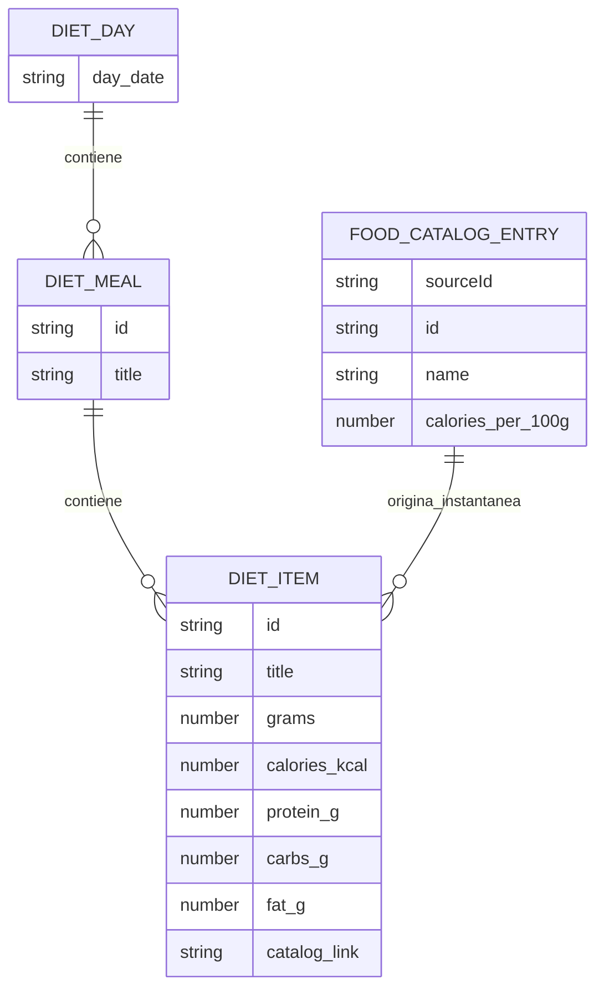
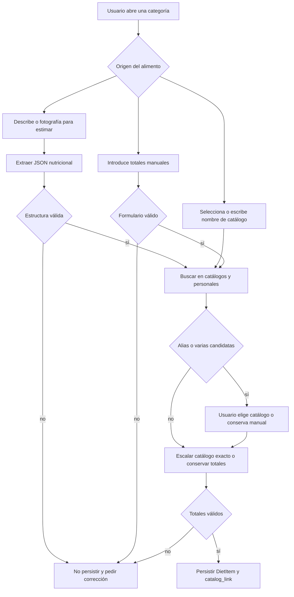

# Dieta y estimación de alimentos

La dieta es un registro local por fecha. Cada elemento guardado contiene una **instantánea de los totales de su porción** —gramos, kcal, proteínas, carbohidratos y grasas— y puede conservar un `catalog_link` que indica si proviene de un catálogo concreto o por qué no se pudo resolver. Esto separa el historial durable de los datos de catálogo, que pueden actualizarse, quedar obsoletos o no estar disponibles. La interfaz de dieta, el estimador y la tool del agente comparten el contrato de validación de `apps/mobile/diet/nutritionContract.ts`.

La IA y OpenFoodFacts son fuentes de ayuda, no fuentes de verdad persistidas: la conversación puede producir una estimación y el código de barras puede aportar datos externos, pero antes de escribir se extrae una estructura, se valida y, si hay coincidencia de catálogo, se prefiere la instantánea calculada desde este. El registro puede seguir utilizándose sin proveedor de IA y con catálogos remotos no disponibles mediante entrada manual.

Véanse [Estado local y copia de seguridad](local-state-and-backup.md) para el almacenamiento e importación; [Catálogos nutricionales y de ejercicios](../content/repositories.md) para la publicación, caché y disponibilidad de catálogos; y [Runtime del agente y herramientas](../agent/runtime.md) y [Configuración BYOK de proveedores](../agent/provider-configuration.md) para el agente y las credenciales.

## Modelo persistido y contrato nutricional

`DietItem` vive dentro de `LocalStore.dietByDate`. Un `DietDay` se indexa por fecha y contiene comidas; una comida agrupa sus `items`. Los nutrientes de `FoodCatalogEntry` se expresan por 100 g, mientras que los de `DietItem` son los totales ya escalados de la cantidad registrada. Esta diferencia de unidades es el invariante principal al añadir nuevos nutrientes o nuevas rutas de escritura.

| Entidad | Campos relevantes | Papel |
| --- | --- | --- |
| `DietItem` | `id`, `title`, `grams`, `calories_kcal`, `protein_g`, `carbs_g`, `fat_g`, `image_uri?`, `catalog_link?` | Instantánea durable de una porción y, opcionalmente, su vínculo de procedencia. |
| `DietMeal` | `id`, `title`, `items` | Agrupa alimentos de una categoría. |
| `DietDay` | `day_date`, `meals` | Registro de un día dentro de `dietByDate`. |
| `FoodCatalogEntry` | ID, nombre, origen, nutrientes por 100 g, porción e imagen opcional | Plantilla remota o personal que permite calcular una porción. |
| `CatalogLink` | `linked` con `{schemaVersion, sourceId, itemId}` o `unresolved` con motivo | Mantiene una referencia versionada o explica que el elemento es manual, estimado externamente, ambiguo o no encontrado. |

Las categorías admitidas son, en orden: `Desayuno`, `Almuerzo`, `Comida`, `Merienda` y `Cena`. `resolveDietMealCategory` normaliza espacios y mayúsculas para resolverlas, pero rechaza una categoría arbitraria. La interfaz muestra y ordena según ese conjunto; la tool del agente también lo exige.



*El catálogo aporta valores por 100 g; el elemento de dieta conserva los totales de la porción y una referencia opcional, no una dependencia activa del catálogo.*

### Validación en la frontera de escritura

`validateNutritionItem` requiere un objeto con nombre no vacío y los cinco números como valores de tipo `number`, finitos y no negativos. Por tanto, se permite registrar agua o cualquier entrada completamente a cero; no se aceptan números negativos, `NaN`, infinitos ni cadenas numéricas en esta frontera. `validateNutritionFormInput` es la adaptación de formulario: acepta texto, convierte coma decimal y campos vacíos a cero, y después aplica los mismos límites. `validateStructuredNutrition` reutiliza esa validación y exige además `food_type` igual a `alimento`, `producto_comercial` o `receta`.

Al hidratar almacenamiento previo, `normalizeDietByDate` recupera la clave de fecha cuando falta `day_date`, crea identificadores ausentes, aplica títulos de reserva, redondea los valores numéricos válidos a un decimal y convierte valores inválidos o negativos en cero. También normaliza `image_uri` y `catalog_link`; no convierte por sí sola una fecha a un formato canónico ni elimina duplicados de comidas.

## Catálogos, búsqueda y alimentos personales

Los catálogos remotos de alimentos, productos comerciales y recetas se cargan como fuentes distintas y quedan etiquetados respectivamente con `gymnasia_foods`, `gymnasia_products` y `gymnasia_recipes`. Cada entrada incluye `sourceId` y el origen visible `alimento`, `producto_comercial` o `receta`. Los alimentos personales son una cuarta fuente privada, `user_personal_foods`, normalizada con `source: "personal"`; se guardan bajo una clave AsyncStorage propia y no tienen URL de catálogo ni imagen remota.

`findFoodInRepo` combina catálogo y alimentos personales y delega en `matchFoodCatalog`. El matcher normaliza Unicode, diacríticos, espacios y mayúsculas; busca primero nombres equivalentes y después una inclusión bidireccional como alias. Ordena los candidatos por origen e ID, por lo que una duplicidad no depende del orden recibido. Una coincidencia única exacta o alias se puede vincular; varias candidatas abren una resolución explícita y nunca se elige una de forma implícita.

Al elegir una entrada, `dietItemFromCatalog` calcula `ratio = grams / 100`, escala kcal y macronutrientes, redondea a un decimal, construye la URL de imagen cuando el origen la admite y escribe un vínculo `linked`. Una entrada personal también puede vincularse, aunque no aporta imagen remota. Una coincidencia ausente se conserva como `unresolvedCatalog("manual")` o `unresolvedCatalog("external_estimate")` según su ruta.

La disponibilidad del catálogo acompaña las búsquedas del agente como `fresh`, `cached`, `stale`, `partial` o `unavailable`, con fuentes y avisos. Una caída de red no borra una caché previamente validada; si no hay datos utilizables, la búsqueda devuelve disponibilidad no disponible y una lista vacía. La interfaz todavía permite guardar manualmente una entrada validada y marcada como no resuelta. No debe inventarse un enlace cuando no se dispone de una referencia o la coincidencia es ambigua.

## Alta y edición de una comida

La pantalla permite formulario manual, selección desde el catálogo y estimación opcional. Todos terminan en `persistDietItem`, que crea el día o la comida si hace falta, reemplaza el elemento al editar conservando su ID, y ordena las comidas por categoría. Borrar el último elemento elimina la comida, aunque puede quedar el día vacío. Copiar una comida desde otra fecha clona los elementos con IDs nuevos y los añade a la categoría de destino; no reemplaza sus elementos existentes.



*Las tres rutas convergen antes de persistir: una sugerencia de IA o un texto de búsqueda no se convierte por sí misma en un registro durable.*

En el formulario, una coincidencia exacta reemplaza los totales escritos por los valores escalados del catálogo. Un alias único o varias candidatas muestran un modal: elegir una candidata crea la instantánea vinculada; conservar el valor manual mantiene el vínculo no resuelto. Cuando no hay resultado, la interfaz propone una incidencia de contenido para revisión, pero la propuesta se encola localmente y no sale a la red hasta que la persona usuaria la confirma mediante el mecanismo de feedback.

Al editar cantidad de un elemento existente, `mealPerGramRef` guarda temporalmente sus totales por gramo para reescalar los campos en la interfaz. No es una regla de persistencia ni una consulta al catálogo: se reinicia al cerrar o cambiar el editor. Si se modifica el nombre manualmente, la ruta de formulario construye el elemento final de nuevo y su vínculo describe el resultado de la nueva resolución.

## Objetivos nutricionales

`DietSettings` conserva texto editable para objetivo, actividad, sexo, altura, fecha de nacimiento, calorías diarias y dos modos de macros:

- `manual_calories` asigna kcal por macro y deriva gramos con 4 kcal/g para proteínas y carbohidratos y 9 kcal/g para grasa.
- `protein_by_weight` multiplica los gramos por kg configurados por el peso corporal actual cuando existe y es positivo.

`evaluateDietPlan` valida que el objetivo calórico, si se configura, sea positivo y que las asignaciones sean finitas y no negativas. Informa tanto `remainingCalories` como `excessCalories`: el remanente se limita a cero cuando hay exceso y el estado es `exceeded`, evitando presentar un remanente negativo como si fuera una meta alcanzable. Sin peso válido, el modo por peso no fabrica gramos ni calorías.

## Estimación asistida por IA y código de barras

El modal del estimador es una conversación distinta del agente general. Requiere una API key utilizable: prioriza `store.foodAIProvider` si está configurado, después el proveedor ya elegido por el modal y, finalmente, la prioridad del estimador. Si no existe proveedor, muestra un error y no intenta la red. Las credenciales BYOK y las particularidades de transporte se documentan en [Configuración BYOK de proveedores](../agent/provider-configuration.md).

Se pueden adjuntar hasta seis imágenes desde biblioteca o cámara; se solicita el permiso correspondiente y se necesita base64 para adjuntarlas. Las imágenes se mandan solo con el último mensaje de usuario y dejan de reenviarse después de una respuesta válida del modelo. OpenAI, Anthropic y Google transmiten texto y razonamiento y pueden ejecutar hasta cinco rondas de la tool `scan_barcode`. En web, Anthropic rechaza explícitamente imágenes en este flujo; la estimación solo textual sigue sus reglas de transporte normales. Las solicitudes de estimación se reintentan hasta tres veces únicamente ante fallos transitorios identificados.

`scan_barcode` elimina espacios del código y consulta `https://world.openfoodfacts.org/api/v2/product/{barcode}.json`. Devuelve al modelo un JSON con identidad, porción, nutrientes por 100 g y por porción, ingredientes y Nutri-Score. Un HTTP fallido o producto inexistente se devuelve como resultado textual controlado para que el modelo pueda continuar o estimar visualmente; no escribe esos datos directamente en la dieta. La sesión recuerda si se usó la herramienta para clasificar una propuesta no encontrada como producto comercial, pero ese indicador no es procedencia persistida.

Al pulsar guardar, `requestStructuredNutritionJSON` hace una segunda solicitud no transmitida para obtener `dish_name`, gramos, kcal, los tres macros y `food_type`. OpenAI usa un esquema JSON estricto, Anthropic fuerza la tool `extract_nutrition` y Google solicita JSON con el mismo schema sin `additionalProperties`. El resultado pasa por `validateStructuredNutrition`; ante un tipo, nombre o número inválido se informa el error, no se persiste nada y la persona puede corregir la conversación. Después se aplica la misma resolución explícita de catálogo que al usar el formulario.

La salida final tiene dos posibilidades claramente distintas:

- **Dato validado y vinculado:** un catálogo exacto o elegido aporta totales recalculados y `catalog_link.status: "linked"`.
- **Estimación validada pero no verificable por catálogo:** se guardan los totales validados producidos por la extracción con `catalog_link.status: "unresolved"` y razón `external_estimate`. No equivale a una medición confirmada de un catálogo.

Si no se encuentra un producto comercial o receta estimado, se crea una propuesta de feedback para confirmación del usuario. La indisponibilidad del proveedor, el fallo de OpenFoodFacts o una respuesta estructurada inválida no bloquean la entrada manual; simplemente impiden usar esa estimación hasta una corrección válida.

## Agente general: lectura, búsqueda y escritura

El runtime del agente expone `search_foods`, `read_meal_foods` y `add_meal_food`. `search_foods` filtra el repositorio combinado por nombre, categoría, origen o rango nutricional, ordena opcionalmente y limita los resultados a 15; devuelve además disponibilidad, avisos y las referencias `source_id`/`item_id`. Así el modelo puede pedir una selección explícita en vez de inferir qué duplicado elegir.

`add_meal_food` acepta una forma `kind: "catalog"` con referencia e `grams`: busca exactamente esa referencia, calcula una instantánea por 100 g y escribe un vínculo `linked` con `linkedBy: "tool"`. La forma manual valida los totales antes de mutar y crea un vínculo no resuelto. La forma heredada basada en nombre se vincula solo ante coincidencia exacta o alias única; si es ambigua devuelve candidatas y `written: false`, sin escribir. La tool usa `commitStore` cuando está disponible y marca su efecto comprometido tras esa persistencia, de acuerdo con la idempotencia y las guardas del runtime.

## Persistencia, procedencia y cambios seguros

Los días y ajustes viven en el almacén principal; los alimentos personales son una partición AsyncStorage independiente. La exportación e importación incluyen los alimentos personales como datos separados del backup, mientras que las credenciales de proveedores no forman parte de él. Consulte [Estado local y copia de seguridad](local-state-and-backup.md) para las garantías y límites de esa operación.

Un `DietItem` conserva los totales históricos y, cuando se conoce, una referencia de catálogo versionada. No conserva la conversación del estimador, imagen original, respuesta cruda de OpenFoodFacts, modelo/proveedor, nivel de confianza ni supuestos de la estimación. Por ello, una entrada `external_estimate` no permite auditar ni recalcular la estimación original después de guardarse. Una extensión que necesite auditoría debe añadir metadatos explícitos y hacer que `normalizeDietByDate`, las copias, constructores, ediciones y herramientas los conserven.

Para añadir un nutriente, actualice conjuntamente el contrato nutricional, `DietItem`, el escalado de `dietItemFromCatalog`, los agregados y la interfaz, el schema del estimador y las tools. Decida siempre si el campo es por 100 g en catálogo o total de porción en dieta. Para añadir una fuente, registre su `sourceId`, parser, caché, procedencia y resolución de imagen; no trate un catálogo remoto como autoridad disponible permanentemente.

## Pruebas focalizadas

`apps/mobile/diet/nutritionContract.test.ts` cubre categorías, conversión de formulario, validación de valores no negativos y finitos, salida estructurada, presupuestos de macros y una propiedad de 1.000 ejecuciones. `apps/mobile/catalogs/matching.test.ts` verifica normalización, estabilidad de ambiguos y alias. `apps/mobile/agent/toolExecutor.test.ts` cubre búsqueda con metadatos de disponibilidad, escritura por referencia, rechazo de ambigüedad, categorías inválidas y nutrientes inválidos.

La prueba de navegador `apps/mobile/scripts/diet-validation.e2e.mjs` exporta la app web, siembra un almacenamiento de desarrollo y comprueba que un objetivo de cero no se persiste, que un exceso de macros se representa sin remanente negativo, que una caloría manual negativa no escribe y que una entrada válida a cero sí se guarda. Desde la raíz se ejecuta con:

```bash
npm run test:diet:e2e
```

Al cambiar el flujo de selección o la caché, añada además casos de catálogo ausente, coincidencia alias única, duplicados entre fuentes, elección de conservar manual, alimento personal y estimación estructurada inválida. Estos casos protegen la distinción esencial entre datos validados persistidos y resultados externos que solo asisten a la decisión.
