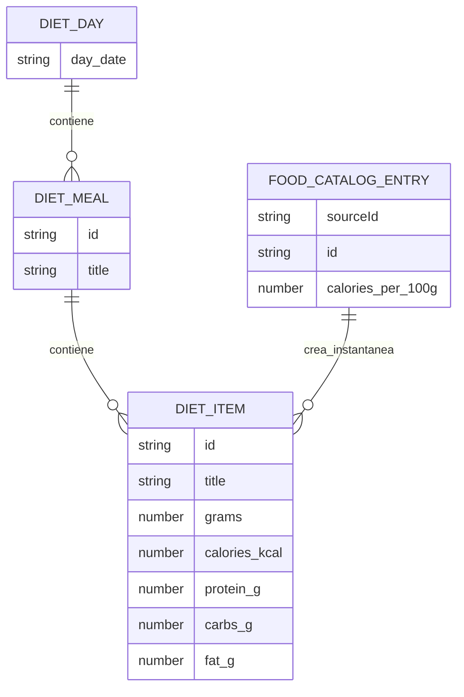
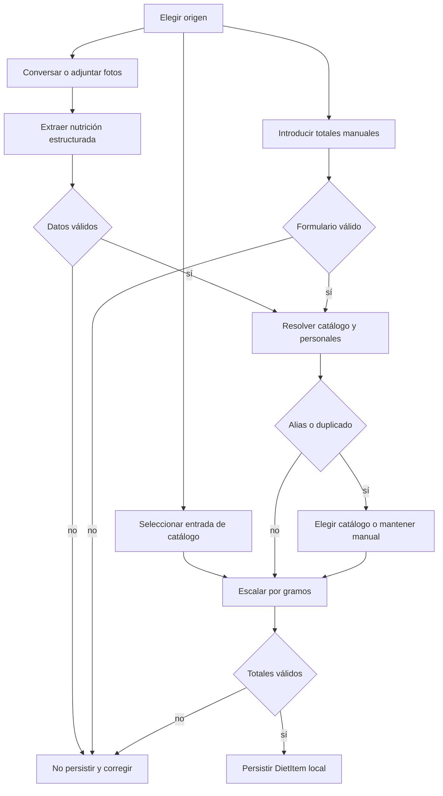
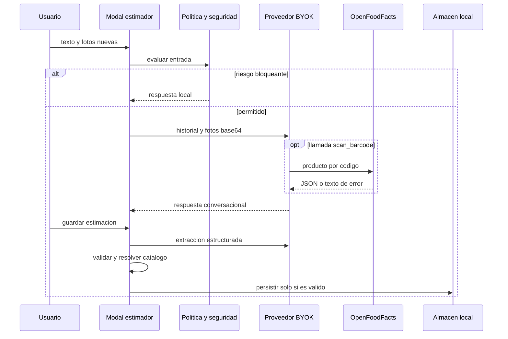

# Dieta y estimación de alimentos

La dieta es **local-first**: el registro durable está en `dietByDate` del almacén local y no depende de que un catálogo remoto, OpenFoodFacts o un proveedor de IA sigan disponibles. Catálogos y estimación son ayudas para construir un elemento; antes de guardar, la aplicación valida números y resuelve —cuando es posible— su procedencia. Esto preserva el histórico como una instantánea de la porción, en vez de una referencia viva que cambie al actualizar un catálogo.

El estimador es un modal y una conversación separados del chat general. Puede enviar texto e imágenes a un proveedor BYOK y consultar OpenFoodFacts mediante una tool del modelo. Esas fronteras de red requieren especial cuidado: una foto en base64, el texto de conversación usado para extraer los datos y un código de barras pueden salir del dispositivo. Ninguna de esas respuestas se escribe por sí sola en la dieta.

Véanse [Estado local y copia de seguridad](local-state-and-backup.md) para el almacenamiento e importación, [Catálogos nutricionales y de ejercicios](../content/repositories.md) para publicación y caché, y [Runtime del agente y herramientas](../agent/runtime.md) para la ejecución de tools del chat general.

## Modelo durable y contratos

`DietItem` está anidado en `DietMeal`, y este en `DietDay`; los días se indexan por fecha en `dietByDate`. Cada elemento guarda los totales de la **porción registrada**. En contraste, un `FoodCatalogEntry` expresa los nutrientes por 100 g. No mezclar estas unidades es el invariante fundamental de las rutas de alta, edición, tool y agregación.

| Entidad | Datos relevantes | Responsabilidad |
| --- | --- | --- |
| `DietItem` | título, gramos, kcal, proteína, carbohidratos, grasa, `image_uri?`, `catalog_link?` | Instantánea durable de una porción. |
| `DietMeal` | id, título, items | Agrupa los elementos de una categoría. |
| `DietDay` | `day_date`, comidas | Registro de una fecha. |
| `FoodCatalogEntry` | `sourceId`, id, nutrientes por 100 g, ración, imagen | Plantilla local/remota desde la que se escala una porción. |
| `CatalogLink` | `linked` con referencia versionada, o `unresolved` con motivo | Explica la procedencia sin convertir el histórico en una consulta de catálogo. |


```mermaid
erDiagram
    DIET_DAY ||--o{ DIET_MEAL : contiene
    DIET_MEAL ||--o{ DIET_ITEM : contiene
    FOOD_CATALOG_ENTRY ||--o{ DIET_ITEM : crea_instantanea

    DIET_DAY {
        string day_date
    }
    DIET_MEAL {
        string id
        string title
    }
    DIET_ITEM {
        string id
        string title
        number grams
        number calories_kcal
        number protein_g
        number carbs_g
        number fat_g
    }
    FOOD_CATALOG_ENTRY {
        string sourceId
        string id
        number calories_per_100g
    }
```

*El catálogo aporta valores por 100 g; el elemento de dieta conserva totales de la porción y un enlace opcional de procedencia.*

Las únicas categorías admitidas son `Desayuno`, `Almuerzo`, `Comida`, `Merienda` y `Cena`. `resolveDietMealCategory` tolera diferencias de espacios y mayúsculas, pero rechaza valores arbitrarios. Esto lo aplican tanto la interfaz como las tools, por lo que una integración no debe crear títulos de comida libres.

### Validación y migración

`validateNutritionItem` exige un nombre no vacío y `grams`, `calories_kcal`, `protein_g`, `carbs_g` y `fat_g` como números finitos no negativos. Cero es válido —por ejemplo, para agua—; no lo son `NaN`, infinitos, negativos ni cadenas en la frontera estructurada. `validateNutritionFormInput` adapta el formulario: recibe texto o números, convierte la coma decimal y toma un campo vacío como cero antes de aplicar el mismo contrato. La salida de una estimación también debe pasar `validateStructuredNutrition`, que añade `food_type` (`alimento`, `producto_comercial` o `receta`).

Al leer datos heredados, `normalizeDietByDate` es tolerante: genera IDs ausentes, añade títulos de reserva, redondea números válidos a un decimal y sustituye valores inválidos o negativos por cero. Normaliza asimismo imagen y enlace de catálogo. No canoniciza las claves de fecha ni deduplica comidas: esos problemas no se arreglan implícitamente durante hidratación.

## Catálogos y resolución de procedencia

Hay tres fuentes remotas de alimentos: `gymnasia_foods`, `gymnasia_products` y `gymnasia_recipes`, asociadas a los orígenes visibles `alimento`, `producto_comercial` y `receta`. Se obtienen desde el repositorio de Gymnasia y se validan y cachean localmente; el baseline de alimentos incluido permite arrancar con datos. Los alimentos personales forman la fuente local privada `user_personal_foods`, sin URL de catálogo ni imagen remota.

La búsqueda de dieta combina las entradas remotas y personales. El matcher normaliza Unicode, diacríticos, espacios y mayúsculas; intenta igualdad antes de inclusión bidireccional (alias). Ordena candidatos por `sourceId` e id. Por tanto, un duplicado no se resuelve por el orden de llegada: se devuelve `ambiguous` y la persona debe elegir una candidata o mantener el valor manual.

Al elegir una entrada, `dietItemFromCatalog` calcula `grams / 100`, escala y redondea kcal y macros, y genera un `catalog_link` `linked` con la referencia versionada y el origen del enlace. Si no se puede vincular, el elemento manual usa `unresolvedCatalog("manual")`; una estimación externa usa `unresolvedCatalog("external_estimate")`. No se debe inventar una referencia para hacer parecer verificado un valor que no lo está.

La caché conserva disponibilidad por fuente y agregada (`fresh`, `cached`, `stale`, `partial` o `unavailable`), fecha, avisos y procedencia. Una actualización remota fallida conserva los datos previos; sin catálogo utilizable, la búsqueda del agente devuelve una lista vacía y metadatos de indisponibilidad. La interfaz todavía puede registrar un elemento manual validado y no resuelto.

`answerCatalogCaloriesLookup` es una vía deliberadamente estrecha del agente: solo reconoce peticiones con la forma «busca … en el catálogo y dime … calorías por 100 g». Devuelve un único resultado, pide desambiguación si hay varios y devuelve `null` para cualquier frase fuera de ese patrón. No es una búsqueda general ni una ruta de escritura.

## Alta, edición y copia local

Formulario, selección de catálogo y estimador terminan en `useDietRuntime`. `persistItem` crea el día o la categoría cuando faltan, conserva el ID del elemento al editar y ordena las comidas por categoría. Al borrar el último elemento desaparece la comida, aunque el día puede permanecer vacío. Copiar una comida de otra fecha clona sus elementos con IDs nuevos y los añade a la categoría de destino; no sustituye lo que ya hubiera allí.


```mermaid
flowchart TD
    Begin["Elegir origen"] --> Catalog["Seleccionar entrada de catálogo"]
    Begin --> Manual["Introducir totales manuales"]
    Begin --> Estimator["Conversar o adjuntar fotos"]
    Estimator --> Structured["Extraer nutrición estructurada"]
    Structured --> ValidStructured{"Datos válidos"}
    ValidStructured -->|"no"| Repair["No persistir y corregir"]
    ValidStructured -->|"sí"| Resolve
    Manual --> ValidForm{"Formulario válido"}
    ValidForm -->|"no"| Repair
    ValidForm -->|"sí"| Resolve["Resolver catálogo y personales"]
    Catalog --> Snapshot["Escalar por gramos"]
    Resolve --> Multiple{"Alias o duplicado"}
    Multiple -->|"sí"| Choice["Elegir catálogo o mantener manual"]
    Multiple -->|"no"| Snapshot
    Choice --> Snapshot
    Snapshot --> FinalValid{"Totales válidos"}
    FinalValid -->|"no"| Repair
    FinalValid -->|"sí"| Store["Persistir DietItem local"]
```

*Las sugerencias externas, el texto libre y un nombre de catálogo no son escrituras: todos pasan por validación y resolución antes de persistir.*

En el formulario, una coincidencia exacta reemplaza los totales escritos por la instantánea del catálogo. Un alias o varias candidatas abren el selector; elegir una crea la instantánea vinculada y conservar manual mantiene el enlace no resuelto. Un elemento no encontrado puede generar una propuesta local de feedback, pero no se envía a la red sin la confirmación que exige ese flujo.

Al editar gramos, `mealPerGramRef` solo conserva temporalmente los totales por gramo para actualizar la vista de formulario. Se reinicia al cerrar o cambiar editor; no vuelve a consultar el catálogo ni altera el significado de los datos ya guardados.

## Objetivos nutricionales

`DietSettings` conserva entradas editables para objetivo, actividad, sexo, altura, fecha de nacimiento, calorías diarias y dos modos de macros. `calculateDailyCalories` corre en el dispositivo: usa Mifflin-St Jeor con peso, altura, edad y sexo, y aplica multiplicadores de actividad y objetivo. Si falta peso, altura o fecha de nacimiento devuelve un mensaje para la pantalla, no una cifra; sexo y actividad ausentes usan masculino y moderado.

`evaluateDietPlan` valida el objetivo diario como positivo cuando se configura y los repartos como finitos y no negativos. En `manual_calories`, convierte kcal a gramos con 4 kcal/g para proteína y carbohidratos y 9 kcal/g para grasa. En `protein_by_weight`, calcula gramos a partir del peso actual solo si éste es finito y positivo. Separa `remainingCalories` de `excessCalories` y limita el remanente a cero cuando se supera el objetivo.

## Estimador: fronteras de proveedor, imágenes y código de barras

Al abrir el modal, la app prioriza `store.foodAIProvider`; si no resuelve una credencial efectiva, intenta el proveedor elegido anteriormente y después la prioridad del estimador. Sin proveedor no llama a la red. La conversación se inicializa de nuevo al abrir, salvo que se reanude el borrador tras configurar un modelo.

Se pueden adjuntar hasta seis fotos de galería o cámara. La app solicita el permiso correspondiente, requiere base64 y envía únicamente las imágenes aún no enviadas con el último mensaje de usuario; tras una respuesta correcta las marca para no reenviarlas en turnos posteriores. `requestFoodEstimate` convierte texto, fotos y prompt de sistema al transporte del proveedor: OpenAI, Anthropic, Google y `custom_openai` tienen formatos distintos. Si el proveedor declara que no admite imágenes, el modal conserva el borrador y ofrece cambiar de modelo.

Antes de enviar, el texto atraviesa la selección de política y la protección de salud; un riesgo bloqueante añade una respuesta local y no llama al modelo. Durante la respuesta, el contenido en streaming pasa por una puerta de seguridad. Los reintentos (máximo tres intentos) se limitan a errores transitorios reconocidos como demanda alta, límite de tasa, red o timeout.


```mermaid
sequenceDiagram
    participant User as Usuario
    participant Modal as Modal estimador
    participant Safety as Politica y seguridad
    participant Provider as Proveedor BYOK
    participant Barcode as OpenFoodFacts
    participant Store as Almacen local

    User->>Modal: texto y fotos nuevas
    Modal->>Safety: evaluar entrada
    alt riesgo bloqueante
        Safety-->>Modal: respuesta local
    else permitido
        Modal->>Provider: historial y fotos base64
        opt llamada scan_barcode
            Provider->>Barcode: producto por codigo
            Barcode-->>Provider: JSON o texto de error
        end
        Provider-->>Modal: respuesta conversacional
        User->>Modal: guardar estimacion
        Modal->>Provider: extraccion estructurada
        Modal->>Modal: validar y resolver catalogo
        Modal->>Store: persistir solo si es valido
    end
```

*La conversación y las fotos pueden cruzar la frontera BYOK; OpenFoodFacts solo devuelve contexto a la ejecución de la tool y el almacén se actualiza al final del flujo validado.*

`scan_barcode` elimina espacios del código y consulta `https://world.openfoodfacts.org/api/v2/product/{barcode}.json`. Para un producto encontrado devuelve al modelo un JSON con identidad comercial, ración, nutrientes por 100 g y por ración, ingredientes y Nutri-Score. Para HTTP no satisfactorio, producto ausente, llamada sin código o tool desconocida devuelve texto controlado. La tool no muta el almacén. OpenAI y Anthropic ejecutan como máximo cinco rondas de tool; Google usa el mismo límite mediante `runGoogleToolLoop`, mientras que `custom_openai` permite una solicitud inicial y hasta cinco continuaciones, y puede continuar sin tools si el servidor las rechaza.

Al guardar, `requestStructuredNutrition` hace una segunda llamada con un resumen textual de la conversación. OpenAI pide JSON Schema estricto; Anthropic fuerza `extract_nutrition`; Google aplica el schema de respuesta y `custom_openai` analiza JSON de texto. Cualquiera de los caminos termina en `validateStructuredNutrition`. Si la estructura es inválida o falla la solicitud, se muestra el error y no se persiste el alimento.

Después se busca el nombre extraído en catálogos y alimentos personales. Una coincidencia exacta sustituye los valores estimados por la instantánea del catálogo. Un alias o ambigüedad exige selección explícita. Sin coincidencia, se conservan los totales estructurados validados con razón `external_estimate`; si el tipo efectivo es producto comercial o receta se deja una propuesta de feedback local. Haber usado `scan_barcode` fuerza ese tipo efectivo a `producto_comercial`, pero no convierte la respuesta de OpenFoodFacts en una entrada de catálogo ni en procedencia persistida.

### Límites de privacidad y extensiones

Tras guardar, `DietItem` no conserva la foto original, la respuesta cruda de OpenFoodFacts, la conversación, el proveedor o modelo, confianza ni supuestos de la IA. En consecuencia, un `external_estimate` no es auditable ni recalculable desde el registro. Una función que requiera auditoría debe definir metadatos explícitos y conservarlos en normalización, copia, edición, constructores, tools y backup; no debe suponer que el modal retiene esa información.

Para añadir un nutriente, cambie conjuntamente el contrato nutricional, `DietItem`, el escalado desde catálogo, agregados/presentación, schema del estimador y tools. Decida explícitamente si el campo es por 100 g o total de porción. Para añadir una fuente de catálogo, incluya parser, validación, caché, procedencia, disponibilidad e imagen; una URL remota no es una autoridad disponible permanentemente.

## Agente general: búsqueda, lectura y escritura

El chat general no usa el modal, pero expone `search_foods`, `read_meal_foods` y `add_meal_food`. `search_foods` opera sobre el repositorio local combinado que recibe el runtime; filtra nombre, categoría, origen y rangos por 100 g, admite ordenación, limita la respuesta a 15 y devuelve disponibilidad, avisos y referencias `source_id`/`item_id`. `read_meal_foods` entrega los totales guardados y las referencias si existen.

`add_meal_food` exige fecha y categoría válida. Su forma `kind: "catalog"` busca exactamente `source_id` e `item_id`, escala por gramos y escribe un `linked` con `linkedBy: "tool"`. La forma `manual` conserva totales explícitos y un enlace no resuelto. El formato heredado por nombre solo se vincula si la coincidencia es única; ante ambigüedad devuelve candidatas y `written: false` sin mutar.

La tool valida el resultado antes de construir IDs o llamar a `commitStore`. Si existe `operationId`, deriva IDs deterministas y registra un recibo para que una repetición no duplique el elemento. Solo marca el efecto como comprometido después de que `commitStore` termine; un fallo de persistencia se trata como resultado indeterminado, no como éxito.

## Pruebas focalizadas

- `apps/mobile/diet/nutritionContract.test.ts` cubre categorías, formulario, números finitos/no negativos, schema estructurado y presupuesto de macros.
- `apps/mobile/catalogs/matching.test.ts` protege la normalización, alias y orden estable de ambigüedades. Las pruebas de runtime de catálogos cubren envelope, hash, caché y degradación de disponibilidad.
- `apps/mobile/agent/foodEstimatorClient.test.ts` cubre el modo fixture sin red, la llamada de barcode sin argumento y la validación final de extracción estructurada.
- `apps/mobile/agent/toolExecutor.test.ts` verifica búsqueda con metadatos, escalado por referencia, rechazo de ambigüedad, ceros válidos y ausencia de mutación ante nutrientes inválidos.
- `apps/mobile/scripts/diet-validation.e2e.mjs` exporta la app web, siembra el estado local y comprueba cálculo, validación de peso/objetivo, exceso de macros y formulario manual a través de una recarga.

Desde la raíz, la prueba E2E se ejecuta con:

```bash
npm run test:diet:e2e
```

Al cambiar este dominio, añada al menos un caso para catálogo ausente, alias único, duplicado entre fuentes, conservación manual, alimento personal y extracción estructurada inválida. Para cambios en proveedor o imágenes, compruebe también que una llamada bloqueada por seguridad no llegue a la red y que una foto ya enviada no se reenvíe en el siguiente turno.
