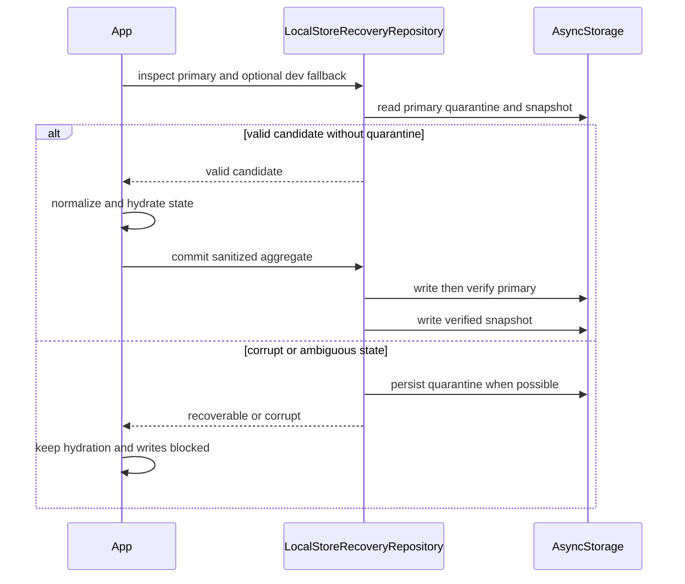

---
okf:
  version: 1
  kind: code-wiki
  status: grounded
  scope: Persistencia local, recuperación, borrado y copia de seguridad en apps/mobile
type: concepto
title: Estado local y copia de seguridad
description: Describe las particiones de persistencia local de Gymnasia, su recuperación ante corrupción, los alcances de borrado y el paquete manual portable. Explica el límite entre datos de usuario, credenciales de proveedores y la caché pública de política firmada anti-retroceso.
summary: Complete persistence map and lifecycle for the local-first Expo app, including storage boundaries, normalization, manual JSON backup, failure modes, and security invariants.
tags: [mobile, persistence, local-storage, secure-storage, backup, hydration, signed-policy]
related:
  - ./application-shell.md
  - ./training.md
  - ./measurements.md
  - ./diet-and-food-estimation.md
  - ../agent/runtime.md
  - ../agent/provider-configuration.md
  - ../agent/signed-policy-lifecycle.md
  - ../architecture/overview.md
  - ../operations/prompt-policy-governance.md
verified:
  - by: openwiki/0.4.3
    at: 2026-09-05T11:27:14.639Z
sources:
  - id: openwiki-source-0c30fc96b9e7c8b57c35473c
    resource: repo://apps/mobile/agent/agentPolicyRuntime.ts
  - id: openwiki-source-a5860dc24336c2fe655bbc75
    resource: repo://apps/mobile/agent/policyContext.ts
  - id: openwiki-source-0d2384426991583d96044996
    resource: repo://apps/mobile/agent/providerConfiguration.ts
  - id: openwiki-source-98e300a08b181f278443549a
    resource: repo://apps/mobile/agent/providerConfigurationPersistence.ts
  - id: openwiki-source-a9edace0149f999b4868ad8d
    resource: repo://apps/mobile/agent/signedPolicyRuntime.ts
  - id: openwiki-source-84be58492f0ea3a94b78df97
    resource: repo://apps/mobile/agent/signedPolicySelection.test.ts
  - id: openwiki-source-12eb5a2ff2aba163c7cf41d3
    resource: repo://apps/mobile/agent/signedPolicySelection.ts
  - id: openwiki-source-9e7ddd51c09caf628a81acad
    resource: repo://apps/mobile/agent/toolOperationLedger.ts
  - id: openwiki-source-929e8e1df23628a3f3848ff8
    resource: repo://apps/mobile/App.tsx
  - id: openwiki-source-e0b23d15e51e3e1d52dd696a
    resource: repo://apps/mobile/backup/backupFormat.ts
  - id: openwiki-source-7385ff07d119a125cc2d0f88
    resource: repo://apps/mobile/persistence/localStoreRecovery.test.ts
  - id: openwiki-source-f6b98cd46b889ff9fc8877c4
    resource: repo://apps/mobile/persistence/localStoreRecovery.ts
  - id: openwiki-source-3c944c63cf864826c8ed237d
    resource: repo://apps/mobile/storage/localDataDeletion.test.ts
  - id: openwiki-source-eb61d67eccd058343c908bca
    resource: repo://apps/mobile/storage/localDataDeletion.ts
generated: { by: "openwiki/0.4.3", at: "2026-09-05T11:27:14.639Z" }
---

# Estado local y copia de seguridad

Gymnasia es **local-first**: el cliente móvil mantiene el estado del producto y ofrece exportación manual; esta página no presupone sincronización ni una copia de seguridad automática gestionada por Gymnasia. La persistencia no es un único documento: separa el agregado de usuario, la sesión activa, preferencias y cachés, el diario de credenciales, el control técnico de operaciones del agente y la caché pública de política firmada. Esta última se conserva deliberadamente incluso al borrar todos los datos: no es información del usuario, sino memoria de seguridad para rechazar una política remota reproducida o más antigua.

## Particiones y límites de propiedad

### Agregado principal y recuperación

`LocalStore` es el agregado general bajo `gymnasia.mobile.local.v3` (con prefijo de entorno aplicado por `scopedStorageKey`). Contiene plantillas e historial de entrenamiento, dieta y sus ajustes, mediciones, hilos y mensajes de chat, metadatos de proveedores y la selección de proveedor de chat o de estimación de alimentos. No debe ser una fuente de secretos: `serializeStoreForAsyncStorage` elimina las `api_key` antes de escribirlo.

La familia de recuperación del agregado es independiente:

| Clave | Finalidad | Tratamiento |
|---|---|---|
| `gymnasia.mobile.local.v3` | Estado principal saneado. | Se valida antes de hidratar y se vuelve a escribir mediante el repositorio de recuperación. |
| `gymnasia.mobile.local.last_good.v1` | Último payload principal validado, con SHA-256 y fecha. | Solo se renueva después de verificar por lectura la escritura del principal. |
| `gymnasia.mobile.local.quarantine.v1` | Payload problemático, causa e incidencias sin exponer nombres o valores desconocidos. | Bloquea escrituras ordinarias hasta restaurar, resolver o descartar. |
| `gymnasia.mobile.training.session.v1` y `gymnasia.mobile.training.session_template_snapshot.v1` | Sesión en curso y su instantánea de plantilla. | Son dependientes del agregado: se eliminan al descartar, borrar o sustituir datos incompatibles. |

El validador migra contenedores raíz ausentes, pero rechaza campos raíz desconocidos, JSON inválido, formas incompatibles y proveedores no admitidos. La normalización semántica posterior también puede poner el estado en cuarentena. Por ello, una lectura válida estructuralmente no autoriza a sobrescribir un payload que haya quedado bloqueado: la cuarentena persiste entre reinicios hasta una resolución explícita.

*La hidratación solo publica el agregado tras una inspección válida; una cuarentena o un commit ambiguo desvía a recuperación en vez de permitir que efectos de React sobrescriban datos.*

Un `commit` serializado comprueba que el principal aún es seguro de reemplazar, escribe, lo relee y valida; solo entonces genera el snapshot. Si la verificación falla, entra en cuarentena y lanza `LocalStoreCommitAmbiguousError`; si falla solo la escritura del snapshot, el principal ya puede contener el nuevo estado y se informa `LocalStoreSnapshotWriteError`. Restaurar el snapshot o resolver el estado actual elimina la cuarentena **después** de un commit verificado. Descartar borra únicamente esta familia y las claves dependientes indicadas, y crea el estado inicial sin tocar particiones independientes.

### Configuración de proveedores y credenciales

La configuración de OpenAI, Anthropic y Google se normaliza para que haya los tres proveedores y exactamente uno activo. El `ProviderConfigurationRepository` es la autoridad de persistencia: mantiene snapshots versionados `committed` y `pending`, serializa operaciones en una cola y nunca promociona automáticamente un `pending` que sobrevivió a un reinicio.

- En web el diario completo reside en AsyncStorage, bajo `gymnasia.mobile.provider_configuration.v1`.
- En plataformas nativas con SecureStore disponible, el diario completo —incluidas claves— es canónico en `gymnasia.mobile.v4.provider_configuration`; AsyncStorage recibe solo su espejo saneado, con `api_key` vacía.
- La primera hidratación puede migrar los valores heredados del agregado y de las claves v3. Tras confirmar el diario, la app elimina las claves v3 migradas. Si no puede crear o usar el repositorio seguro, conserva el estado legible pero no habilita un guardado nativo nuevo que degradaría secretos a texto plano.

Un commit escribe un diario con candidato `pending`, vuelve a comprobar que la operación sigue vigente y publica `committed`; ante error intenta restaurar el snapshot anterior. El estado React se actualiza únicamente después del resultado `committed`, de modo que una edición obsoleta o un fallo no debe publicar el candidato.

### Otras claves locales

El manifiesto ejecutable de borrado es el inventario operativo: además de las claves anteriores incluye Memoria del coach (`gymnasia.mobile.personal_data.v1`), alimentos personales, preferencias de usuario, consentimiento de seguridad sanitaria, salud de alarmas, metadatos de backup, trazas, cachés de catálogos v2/v3 y marcas heredadas. Las cachés de catálogos pueden descargarse de nuevo; las preferencias y Memoria son datos de usuario independientes del agregado.

`gymnasia.mobile.agent.tool_operations.v1` es otra partición técnica: su ledger guarda huellas, nombre de herramienta, resultado y tiempos para impedir que un reintento del proveedor repita una operación con efecto. Está limitado a 256 entradas y usa TTL de siete días; no pertenece al backup portable y se elimina en ambos alcances de borrado.

## Política, prompt y privacidad

La clave `gymnasia.mobile.signed_policy.cache.v1` guarda el registro de política firmada por entorno y canal: secuencia y activación máximas observadas, paquetes activo/anterior/pendiente y estado de comprobación. Es una caché de política pública, no un almacén de conversaciones, datos de salud, preferencias ni credenciales BYOK.

Su persistencia es un control anti-retroceso. Antes de aceptar una política remota verificada, el selector rechaza una secuencia inferior a `highestSequence` o una activación distinta con la misma secuencia; cuando observa una secuencia superior, actualiza el máximo. Si no hay red, puede continuar con la activa verificada, la anterior válida o el snapshot incluido. Una actualización ordinaria queda `pending` durante fondo y turno; se activa al iniciar conversación nueva. Solo una actualización crítica o una activación de rollback puede activarse al comienzo de un turno, y ninguna se activa en segundo plano.

El runtime descarga y verifica el paquete firmado contra raíces confiables, herramientas anunciadas, entorno y canal esperados; además comprueba tipo, tamaño, UTF-8 y digest del bundle remoto. A partir de la selección crea un lease inmutable con prompt, política sanitaria fusionada, contexto público de activación y estado. Las trazas de selección se limitan a metadatos públicos como candidato, secuencia, fuente y código de fallo; no incluyen prompt, mensajes, entrada, salida, datos de salud ni claves.

Este diseño reemplaza la antigua caché de prompt independiente: el prompt que usa el agente procede del bundle firmado o del snapshot incluido, ligado a su activación y a la política sanitaria. Por tanto, **no** se exporta ni se borra como una partición de usuario separada. La retención de `signed_policy.cache.v1` tras «Borrar todos mis datos» evita que un atacante, una caché intermedia o un error de red haga que una instalación recién borrada acepte un paquete firmado pero previamente superado. Borrarla junto con los datos personales destruiría precisamente el máximo de secuencia que hace efectivo el anti-replay.

## Copia de seguridad manual

La exportación actual produce un paquete ZIP `.gymnasia` (`schemaVersion: 2`), no un JSON v1 nuevo. El ZIP contiene `manifest.json` y, cuando existen, JPEG de fotos de progreso. El manifiesto incluye `app`, `type`, versión de esquema, versión de app, fecha, `data` y un inventario `media` con assets, enlaces y omisiones. El importador conserva compatibilidad con el JSON v1, pero rechaza formatos o versiones futuras incompatibles.

`data` contiene un `store` saneado, preferencias normalizadas, alimentos personales y Memoria del coach. La exportación elimina todas las credenciales y campos conocidos sensibles mediante el saneador; las claves de proveedor y el workspace local no salen en el paquete. También quedan fuera la sesión activa y su snapshot, diarios de proveedores, cachés descargables, consentimientos, trazas, metadatos de backup, el ledger de operaciones y la caché de política firmada.

Las fotos sí son portables en v2: antes de empaquetarlas se seleccionan por fecha y se limitan a 500 enlaces, 5 MiB por JPEG, 200 MiB de medios y 220 MiB de paquete. El manifiesto enlaza una medición con un asset identificado por SHA-256; las `photo_uri` de `data.store.measurements` se ponen a `null` para que no se restauren rutas privadas del dispositivo. El importador valida tamaño, rutas internas, relaciones, checksum y JPEG antes de escribir una copia local. Si una foto no puede incluirse o restaurarse, conserva la medición numérica e informa la omisión.

La exportación descarga un `Blob` en web o escribe temporalmente en caché y abre la hoja nativa de compartir; el archivo temporal nativo se elimina en `finally`. Solo al terminar ese flujo actualiza `gymnasia.mobile.backup_meta.v1`; esa fecha indica que el flujo local terminó, no que el usuario guardó el archivo de forma durable.

La selección de un archivo no modifica datos: deja una importación pendiente. Al confirmar, la aplicación vuelve a leer y verificar el ZIP v2 o analiza el JSON v1, normaliza el agregado, conserva las claves y workspace actuales mediante un commit del repositorio de proveedores y luego reemplaza el estado React, preferencias, alimentos personales y Memoria. También reinicia el estado cargado de la pantalla de Memoria y termina la sesión activa para no combinarla con plantillas importadas. Estas particiones tienen escrituras propias: la importación no es una transacción atómica entre React, AsyncStorage, SecureStore y ficheros de fotos.

## Borrado local y riesgos residuales

Hay dos alcances, construidos desde `LOCAL_DATA_MANIFEST` y `LOCAL_SECURE_DATA_MANIFEST`:

| Acción | Qué hace | Qué conserva |
|---|---|---|
| **Borrar actividad y conversaciones** | Reescribe el agregado sin actividad, medidas, dieta histórica ni chats; renueva el snapshot de recuperación y elimina cuarentena, sesión, instantánea, fotos gestionadas y ledger. | Configuración y claves de proveedor, Memoria, alimentos personales, preferencias, consentimientos, cachés, trazas, metadatos y caché de política. |
| **Borrar todos mis datos** | Elimina y verifica el agregado, recuperación, sesiones, configuración y credenciales de proveedores, claves heredadas, datos independientes, cachés, trazas, fotos y ledger. También recorre claves del namespace activo. | Solo `gymnasia.mobile.signed_policy.cache.v1`, por `preserve-security`. |

En ambos casos se cancelan las notificaciones programadas y se descartan las presentadas en nativo. Cada destino se borra y se verifica con un timeout predeterminado de cinco segundos; los destinos se procesan en paralelo y un error, timeout o valor aún presente produce un informe `incomplete` sin ocultar que otros destinos sí terminaron. Un reintento vuelve a ejecutar las tareas. Tras el informe, el runtime se reinicia para descartar referencias en memoria que podrían volver a persistir datos eliminados.

El borrado no alcanza archivos `.gymnasia` exportados ni el destino al que el usuario los comparta, fotos ajenas a la zona privada controlada, permisos o canales del sistema, logs del sistema operativo, copias de seguridad del navegador o Android, ni información ya enviada explícitamente a un proveedor. La exportación de recuperación de un payload en cuarentena tampoco es el backup normal: preserva el original para diagnóstico y puede contener datos sensibles —incluidas claves en web heredadas—, por lo que debe tratarse como archivo confidencial.

## Validación y cambios seguros

Las pruebas enfocadas cubren las invariantes que conviene preservar:

- `persistence/localStoreRecovery.test.ts` comprueba migración idempotente, validación sin filtración de valores, cuarentena duradera, checksum del snapshot, verificación de commit, restauración y descarte limitado.
- `agent/providerConfigurationPersistence.test.ts` cubre diario, saneamiento del espejo nativo, migración, rollback y commits obsoletos o concurrentes.
- `agent/signedPolicySelection.test.ts` cubre migración de caché, activación diferida por boundary, fallback, error de escritura y monotonicidad anti-rollback con pruebas de propiedades.
- `storage/localDataDeletion.test.ts` comprueba borrar/verificar, timeout, reintento y que el manifiesto coincida con el inventario de privacidad; afirma que la caché firmada es la única clave conservada por seguridad.
- `backup/backupFormat.test.ts` valida el paquete portable y las restricciones de medios.

Al añadir persistencia, decida primero si el dato es usuario portable, estado efímero, caché regenerable, secreto o control de seguridad. Actualice el propietario, normalización, manifiestos de los dos alcances y pruebas; no añada secretos al agregado ni a un backup. Si una nueva política necesita estado duradero, mantenga separados sus datos públicos anti-retroceso de prompts, conversaciones y credenciales, y no convierta un borrado de usuario en una oportunidad de retroceso de seguridad.
