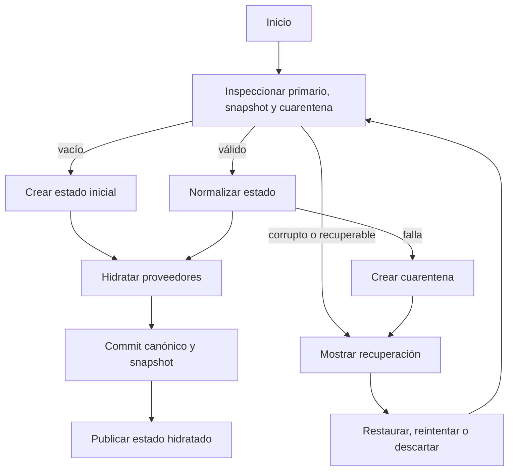
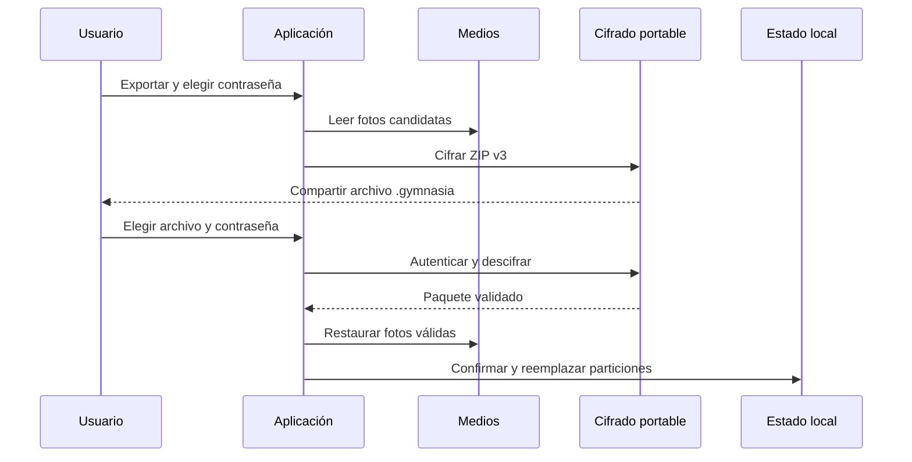

# Estado local, recuperación, borrado y copias

Gymnasia Mobile es *local-first*: el estado de trabajo vive en React y se persiste en el dispositivo. No hay sincronización ni copia remota administrada por la aplicación. Por ello una copia exportada, que puede contener salud, actividad y conversaciones, es responsabilidad de quien la conserva.

La separación de particiones es deliberada:

- `LocalStore` concentra actividad, dieta, mediciones, chats y configuración no secreta de proveedores.
- La configuración de proveedores y las API keys son una frontera distinta; el serializado general elimina las claves y el repositorio especializado las reinyecta desde el almacenamiento apropiado. Véase [Configuración de proveedores](../agent/provider-configuration.md).
- Sesión activa, borradores, memoria personal, alimentos personales, preferencias, trazas, cachés y operaciones del agente tienen ciclos de vida propios.
- Snapshot y cuarentena son artefactos de recuperación, no copias portables de usuario.

## Agregado y frontera de secretos

`LocalStore` contiene `templates`, `workoutHistory`, `dietByDate`, `dietSettings`, `measurements`, `threads`, `messagesByThread`, `keys`, los proveedores seleccionados y `toolOperationReceipts`. `createInitialStore()` crea un único hilo de bienvenida, valores vacíos para la actividad y configuraciones de proveedores predeterminadas. `createActivityResetStore()` conserva ajustes de dieta, proveedores y selección de proveedor, pero reinicia la actividad y los recibos.

Antes de persistir el agregado, `serializeStoreForAsyncStorage()` aplica `stripProviderApiKeys()`. Por tanto, una API key no debe añadirse como campo portable ni suponerse disponible en `gymnasia.mobile.local.v3`; el flujo de hidratación puede fusionar las claves seguras con el estado en memoria.

Los recibos de tools son metadatos de idempotencia, no contenido de conversación ni una auditoría exportable. La validación exige que cada recibo tenga forma verificable. Al exportar una copia se excluyen; al importar se conservan los recibos locales actuales para que un efecto ambiguo anterior no se ejecute de nuevo sobre datos restaurados. El journal de operaciones del agente es otra partición (`gymnasia.mobile.agent.tool_operations.v1`) y tampoco forma parte de la copia portable.

## Validación, hidratación y recuperación

La clave principal es `gymnasia.mobile.local.v3`, y el repositorio de recuperación usa además `gymnasia.mobile.local.last_good.v1` y `gymnasia.mobile.local.quarantine.v1` (con el namespace de entorno aplicado por la aplicación). `LocalStoreRecoveryRepository` serializa inspecciones, commits y resoluciones para que no se intercalen.

*Flujo de arranque: el estado no se publica como hidratado hasta que el agregado se ha inspeccionado y se han tratado los resultados de recuperación.*

La lectura primero migra contenedores raíz ausentes —para formatos antiguos— y después valida. Solo se permiten los campos raíz conocidos; las formas incompatibles, proveedores fuera de `openai`, `anthropic` y `google`, JSON inválido o recibos inválidos se rechazan. Las incidencias usan rutas generales como `$.templates` o `$[unknown]`, sin incluir valores ni nombres desconocidos: los diagnósticos no deben filtrar secretos.

La inspección clasifica el estado como `empty`, `valid`, `recoverable` o `corrupt`. Un snapshot es recuperable solo si su versión, fecha, payload, hash SHA-256 y forma siguen siendo válidos. Una cuarentena válida conserva el payload original y su hash, y actúa como bloqueo durable incluso si un arranque posterior puede leer un primario válido. Un fallo de lectura no se interpreta como almacenamiento vacío.

Un `commit()` valida el JSON candidato y verifica que es seguro sustituir el primario. Escribe el valor, lo relee y exige igualdad exacta y nueva validación antes de actualizar el snapshot. Si esa comprobación falla, deja cuarentena y señala un commit ambiguo; si solo falla la escritura del snapshot, el primario pudo quedar guardado pero se conserva el snapshot anterior y se informa el riesgo. `restoreSnapshot()` vuelve a hacer un commit comprobado antes de borrar la cuarentena. `discardAffected()` elimina la familia gestionada y las claves dependientes indicadas, y crea un agregado inicial sin tocar las particiones independientes.

La pantalla de recuperación permite restaurar el snapshot, reintentar una reparación externa, exportar el payload dañado o descartarlo. El reintento inspecciona deliberadamente sin respetar la cuarentena previa; los demás caminos mantienen su efecto de bloqueo. Si la normalización semántica falla tras una validación estructural correcta, el payload también se pone en cuarentena en vez de repararse especulativamente.

### Exportación de cuarentena

La exportación de recuperación no es un backup de usuario ni se puede importar como tal. Serializa un documento `local-store-recovery` de esquema 1 con la cuarentena y una advertencia de sensibilidad, lo cifra con contraseña y lo comparte o descarga. Puede contener datos personales, conversaciones y, en web, claves de IA que estuvieran en el payload. Su formato de cifrado y la utilidad de inspección se documentan en [Cifrado portable y recuperación](./portable-encryption-and-recovery.md).

## Copias portables de usuario

La exportación actual crea un `.gymnasia` con MIME `application/vnd.gymnasia.encrypted`. El sobre cifrado y autenticado es de esquema 3; su plaintext es un ZIP con `manifest.json` v3 y, opcionalmente, JPEG en `media/<sha256>.jpg`. El manifiesto lleva identidad de aplicación, versión, fecha, los datos portables, assets, enlaces de mediciones y omisiones. Los detalles de KDF, AEAD y límites de contraseña pertenecen a [Cifrado portable y recuperación](./portable-encryption-and-recovery.md).

La compatibilidad es solo de entrada: se aceptan ZIP v2 y JSON v1 heredados, cada uno validado contra su versión. Una exportación nueva nunca genera v1, v2 ni ZIP sin cifrar. La detección usa el prefijo cifrado, firma ZIP o JSON, no solo extensión o MIME, porque los selectores de archivos pueden degradar el tipo.

*El diagrama representa el formato v3; v2 y v1 recorren sus lectores heredados antes de la confirmación común.*

Durante la exportación, `buildBackupData()` elimina recibos de tools y las claves de proveedor; las URI de fotos se sustituyen por assets verificables. La selección de medios deduplica bytes idénticos, prioriza mediciones recientes y registra omisiones sin eliminar la medición numérica. Los límites son 500 fotos y enlaces, 5 MiB por foto, 200 MiB de medios, 8 MiB de manifiesto y 220 MiB de ZIP plaintext. Al leer, se comprueban identidad, versión, rutas permitidas, tamaños, hashes, MIME JPEG y enlaces; un medio faltante, corrupto o no persistible deja `photo_uri` en `null` y produce una advertencia, no invalida la medición.

Seleccionar y desbloquear prepara un `PendingBackupImport`; no escribe todavía. El flujo v3 autentica y descifra antes de analizar el ZIP, pone a cero los buffers cuando puede y elimina la copia temporal nativa al terminar o cancelar.

Al confirmar la restauración, la aplicación normaliza el agregado en modo estricto antes de cambiar React. Conserva API keys locales y el `workspace_id` local de Anthropic, exige primero un commit vigente de configuración de proveedores, normaliza preferencias, reemplaza alimentos y memoria personal e invalida la caché de esa pantalla. Cierra la sesión de entrenamiento activa porque no viaja en la copia y barre fotos huérfanas de forma oportunista.

La restauración no es atómica entre React, `AsyncStorage`, `SecureStore` y el directorio de medios. Un error o interrupción puede dejar particiones ya cambiadas junto con otras pendientes; un cambio de este flujo debe mantener validación previa y manejar el fallo parcial como riesgo de recuperación, no como rollback garantizado.

## Borrado local verificable

`LOCAL_DATA_MANIFEST` y `LOCAL_SECURE_DATA_MANIFEST` son el inventario declarativo de destinos para los alcances `activity` y `all-personal`.

- **Borrar actividad y conversaciones** reescribe `LocalStore` y su snapshot con el reset de actividad; elimina cuarentena, sesión y borradores, fotos propias, ledger del agente y recibos de tools de la memoria personal. Conserva proveedores, preferencias, alimentos personales, campos de memoria y cachés.
- **Borrar todos mis datos** elimina la familia gestionada, configuración y credenciales de proveedores, datos personales, preferencias, alimentos, cachés, trazas y secretos heredados; además recorre claves del namespace activo. La única clave declarada como preservada por seguridad es `gymnasia.mobile.signed_policy.cache.v1`, una caché pública anti-retroceso y no un dato personal.

Cada tarea ejecuta `delete` y después `verify`, con timeout por fase de 5 s. Las tareas se realizan en paralelo: un fallo, timeout o un valor todavía presente da un informe `incomplete`, sin impedir los demás destinos, de modo que el usuario puede reintentar. Antes de construir tareas, la aplicación pone una barrera en la cola de persistencia para esperar escrituras anteriores y evitar que una escritura tardía repueble datos eliminados. Al finalizar, reinicia el runtime; en nativo también cancela y descarta notificaciones y verifica que el directorio de medios esté vacío.

El borrado local no puede eliminar archivos exportados, fotos que no pertenezcan al directorio de la app, permisos o canales del sistema, registros del sistema operativo ni datos ya enviados a proveedores externos.

## Pruebas y cambios seguros

Las pruebas de `persistence/localStoreRecovery.test.ts` cubren migración idempotente, diagnósticos sin valores secretos, cuarentena byte a byte, hash de snapshots, bloqueo persistente, commits ambiguos, fallos de snapshot y descarte selectivo. `persistence/localStoreModel.test.ts` comprueba que el serializado general excluye API keys y que el reset de actividad conserva la configuración que corresponde.

`storage/localDataDeletion.test.ts` prueba que el informe solo es completo tras borrar y verificar todos los destinos, diferencia fallos de borrado y verificación, convierte bloqueos en timeouts reintentables y mantiene el inventario alineado con el manifiesto de privacidad. Los tests de formatos y cifrado de backup cubren v3 y entradas v2/v1, medios y autenticación del sobre portable.

Al añadir estado persistido, decidir primero si es parte del agregado, partición independiente, caché, secreto o estado efímero. Después declarar su migración y normalización, su pertenencia a ambos alcances de borrado y su inclusión portable solo si debe cruzar dispositivos. Los cambios incompatibles necesitan una nueva versión y una ruta de importación explícita; para medios, transportar bytes verificables en lugar de URI locales.
