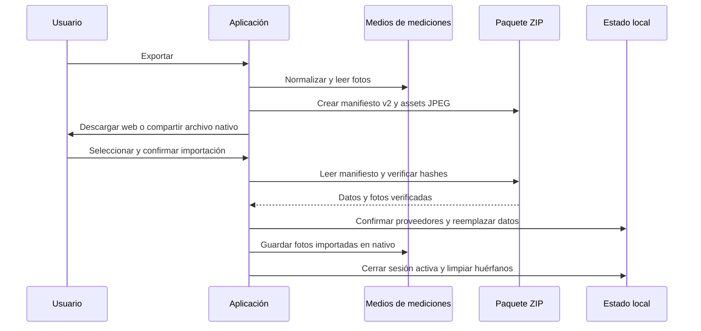

---
okf:
  version: 1
  kind: code-wiki
  status: grounded
  scope: Local persistence, hydration, sensitive storage, reset, tracing, and manual backup in apps/mobile
type: concepto
title: Estado local, recuperación, borrado y copias
description: Describe cómo la aplicación móvil conserva, recupera y borra datos locales, y cómo exporta e importa copias portables con fotos de mediciones. Delimita secretos BYOK, datos sensibles y garantías que no ofrece la restauración.
summary: Complete persistence map and lifecycle for the local-first Expo app, including storage boundaries, normalization, manual JSON backup, failure modes, and security invariants.
tags: [mobile, persistence, local-storage, secure-storage, backup, recovery]
related:
  - ./application-shell.md
  - ./training.md
  - ./measurements.md
  - ./diet-and-food-estimation.md
  - ../agent/runtime.md
  - ../agent/provider-configuration.md
  - ../operations/build-release-and-testing.md
verified:
  - by: openwiki/0.5.0
    at: 2026-09-07T11:37:28.236Z
sources:
  - id: openwiki-source-929e8e1df23628a3f3848ff8
    resource: repo://apps/mobile/App.tsx
  - id: openwiki-source-c369f04b4bd4848feade9def
    resource: repo://apps/mobile/backup/backupFormat.test.ts
  - id: openwiki-source-e0b23d15e51e3e1d52dd696a
    resource: repo://apps/mobile/backup/backupFormat.ts
  - id: openwiki-source-e3b899d6ded9b219e98b3a0a
    resource: repo://apps/mobile/backup/measurementMedia.test.ts
  - id: openwiki-source-c13b295e970a1149f0f40cbd
    resource: repo://apps/mobile/backup/measurementMedia.ts
  - id: openwiki-source-7385ff07d119a125cc2d0f88
    resource: repo://apps/mobile/persistence/localStoreRecovery.test.ts
  - id: openwiki-source-f6b98cd46b889ff9fc8877c4
    resource: repo://apps/mobile/persistence/localStoreRecovery.ts
  - id: openwiki-source-3c944c63cf864826c8ed237d
    resource: repo://apps/mobile/storage/localDataDeletion.test.ts
  - id: openwiki-source-eb61d67eccd058343c908bca
    resource: repo://apps/mobile/storage/localDataDeletion.ts
generated: { by: "openwiki/0.5.0", at: "2026-09-07T11:37:28.236Z" }
---

# Estado local, recuperación, borrado y copias

La aplicación es *local-first*: `GymnasiaApp` mantiene el estado activo en React y usa `AsyncStorage` para el agregado general y particiones independientes. No hay aquí un servicio de sincronización ni una copia remota gestionada por Gymnasia. Las credenciales BYOK tienen un límite separado: en nativo viven en el repositorio de proveedores respaldado por `SecureStore`; el agregado y los backups las eliminan. Véase [Configuración de proveedores](../agent/provider-configuration.md) para su diario y sus reglas de commit.

## Almacenes y límites de propiedad

`LocalStore`, bajo `gymnasia.mobile.local.v3`, contiene plantillas e historial de entrenamiento, dieta y sus ajustes, mediciones, hilos y mensajes, configuración de proveedores, y los proveedores de chat y de IA de alimentos. La hidratación acepta los contenedores raíz que faltan en formatos antiguos y luego normaliza el estado de dominio. El validador estructural rechaza campos raíz desconocidos, proveedores no admitidos y tipos incompatibles antes de permitir una escritura de recuperación; no expone valores ni nombres desconocidos en sus incidencias.

Además del agregado existen particiones con ciclos de vida propios:

| Partición | Finalidad y tratamiento |
|---|---|
| `gymnasia.mobile.local.last_good.v1` | Snapshot del agregado validado, con SHA-256, para recuperar el último contenido íntegro. |
| `gymnasia.mobile.local.quarantine.v1` | Captura el payload y las incidencias de una lectura o commit ambiguo; bloquea escrituras posteriores hasta resolverla. |
| Claves `training.session`, `session_template_snapshot` y `session_template_draft` | Trabajo de una sesión activa; se excluyen del backup y se eliminan al restaurar, descartar o borrar actividad. |
| `personal_data`, `personal_foods` y `user_prefs` | Memoria del coach, alimentos del usuario y preferencias: se guardan separadamente del agregado, pero se incluyen en la copia. |
| `agent.tool_operations`, cachés de catálogos, trazas, consentimiento, salud de alarmas y metadatos de backup | Estado operativo, diagnóstico o caché, no parte del paquete de backup. El alcance de borrado decide cada uno explícitamente. |
| Directorio documental `gymnasia_measurement_media_v1` | En nativo, fotos de progreso ya normalizadas que posee la app. No es una clave de `AsyncStorage`. |
| Diario de proveedores `gymnasia.mobile.v4.provider_configuration` | En nativo se guarda en `SecureStore`; su espejo de AsyncStorage no debe ser la autoridad de secretos. En web el repositorio usa AsyncStorage porque no hay SecureStore. |

Las credenciales VivaGym heredadas `vivagym.email` y `vivagym.password` no son usadas por la versión actual y se conservan durante actualizaciones normales; el borrado completo sí las incluye. Las claves y prefijos antiguos de proveedores también están en el manifiesto de borrado para que no sobrevivan al restablecimiento completo.

## Lectura, validación y recuperación

```mermaid
flowchart TD
  Boot["Inicio de GymnasiaApp"] --> Dev["Lee dev store opcional"]
  Dev --> Inspect["Inspecciona agregado, snapshot y cuarentena"]
  Inspect -->|"vacío"| Initial["Crea estado inicial"]
  Inspect -->|"válido"| Normalize["Normaliza LocalStore"]
  Inspect -->|"corrupto o recuperable"| Lock["Muestra recuperación y deja isHydrated falso"]
  Normalize -->|"fallo"| Quarantine["Pone el payload en cuarentena"]
  Quarantine --> Lock
  Initial --> Providers["Hidrata repositorio de proveedores"]
  Normalize --> Providers
  Providers --> Commit["Escribe agregado canónico y snapshot"]
  Commit --> Ready["Publica estado y habilita efectos"]
  Lock --> Restore["Restaurar snapshot, reintentar o descartar"]
  Restore --> Inspect
```

*El ciclo evita que un estado inicial de React sobrescriba un agregado que aún no se ha comprobado.*

`LocalStoreRecoveryRepository` serializa sus operaciones. Al inspeccionar, distingue un almacén realmente vacío, uno válido, uno recuperable (hay snapshot válido) y uno corrupto. Un snapshot solo es utilizable si su versión, JSON, forma y hash SHA-256 son válidos. La cuarentena preserva el payload original y su hash cuando existe; una cuarentena previa sigue siendo un bloqueo incluso si la clave principal vuelve a parecer válida.

Un commit escribe el agregado, lo relee y exige igualdad exacta y forma válida antes de crear el snapshot. Si no puede verificarlo, genera cuarentena y falla como commit ambiguo; si solo falla la escritura del snapshot, los datos principales pueden haberse guardado pero se informa que la copia de recuperación no se actualizó. `restoreSnapshot()` repone un snapshot comprobado; `discardAffected()` elimina agregado, snapshot, cuarentena y dependencias y confirma un estado inicial nuevo. La pantalla de recuperación también permite exportar el payload en cuarentena: ese archivo se advierte como sensible y, en web, puede incluir claves de IA.

La barrera `isHydrated` solo se activa después de que el estado base haya pasado este flujo y se hayan leído las particiones secundarias. Por ello los efectos de persistencia no deben escribir los valores iniciales antes de la hidratación. Si la normalización posterior a la validación estructural lanza, el payload también pasa a cuarentena en vez de continuar con una reparación no verificable.

## Fotos de mediciones: posesión local y privacidad

Al incorporar una foto, `normalizeAndStoreMeasurementPhoto` comprueba dimensiones, reduce el lado mayor a 2048 px cuando es necesario, la vuelve a guardar como JPEG con calidad 0.8 y elimina segmentos EXIF, XMP, IPTC y comentarios. Rechaza una foto vacía o superior a 5 MiB tras optimizarla. En nativo guarda los bytes saneados en el directorio de medios propio, con nombre basado en SHA-256; en web conserva la URI de origen pero no obtiene una URI persistente propia.

La limpieza de una medición puede eliminar un archivo propio sin referencias, y el arranque/importación realiza una barrida oportunista de huérfanos. Estos fallos de limpieza no bloquean la aplicación. El borrado de actividad y el total vacían el directorio en nativo y comprueban que esté vacío; el navegador no dispone de ese directorio.

## Backup/restauración manual

El formato actual es un paquete ZIP con MIME `application/zip` y extensión `.gymnasia`; su nombre es `gymnasia_backup_YYYYMMDD_HHMM.gymnasia`. Incluye `manifest.json` de esquema **2** y, opcionalmente, JPEG en `media/<sha256>.jpg`. El manifiesto identifica la app, versión de esquema, versión de aplicación y fecha de creación, y contiene `data` con el `LocalStore` saneado, preferencias, alimentos personales y memoria personal. Para compatibilidad, el importador aún acepta el backup JSON de esquema 1.

Antes de empaquetar, las `photo_uri` del manifiesto se vuelven `null`; los bytes viajan como assets separados y enlaces de `measurementId` a hash. Los assets repetidos se deduplican. Se priorizan las mediciones recientes y se declaran omisiones cuando falta el medio, no puede leerse, no es válido o excede los límites: 500 enlaces/fotos, 5 MiB por foto, 200 MiB de medios, 2 MiB de manifiesto y 220 MiB de paquete. Una omisión no elimina los valores numéricos de su medición.

*La exportación no transmite secretos; la importación sustituye las particiones incluidas después de confirmar el paquete y conserva las credenciales locales.*

La exportación carga la memoria justo antes de construir el paquete, intenta preparar cada foto y crea el ZIP. En web provoca una descarga `Blob`; en nativo escribe temporalmente en caché, abre la hoja de compartir y borra el archivo temporal incluso si compartir falla. Solo tras completarse el flujo actualiza `lastBackupAt`; esa marca no prueba que el usuario haya conservado el archivo.

Al seleccionar se admiten ZIP y el JSON v1 legado, con un límite de entrada de 220 MiB; seleccionar no escribe nada. Para v2, la importación verifica tamaño, manifiesto, rutas internas permitidas, asociaciones no ambiguas, tamaño y SHA-256 de cada foto. Un asset corrupto o JPEG inválido se omite, conserva la medición numérica y genera una advertencia. En web, una foto v2 no recibe almacenamiento persistente y se restaura con `photo_uri: null`.

Tras confirmar, la aplicación normaliza estrictamente el agregado importado antes de mutar React. Conserva las API keys y el `workspace_id` local de Anthropic al fusionar los metadatos importados y exige que el commit del repositorio de proveedores siga vigente. Normaliza preferencias, reemplaza alimentos y memoria personal, reinicia el estado de la pantalla de Memoria y cierra la sesión de entrenamiento activa. Las particiones usan efectos y escrituras separadas: la restauración **no es una transacción atómica** entre React, AsyncStorage, SecureStore y archivos de medios.

### Exclusiones y límites de privacidad

Nunca se exportan claves BYOK ni el diario seguro de proveedores. Tampoco se incluyen sesiones activas y sus borradores, cachés de catálogos, trazas, consentimiento, diagnóstico de alarmas, metadatos de backup ni credenciales VivaGym heredadas. El paquete sí puede contener actividad, dieta, mediciones, conversaciones, preferencias, alimentos y memoria personal; debe tratarse como información sensible. Las fotos JPEG incluidas se han despojado de metadatos seleccionados, pero siguen siendo datos personales. Un backup v1 puede portar URI antiguas: se intenta normalizarlas durante la importación y se advierte si no se pueden recuperar.

## Borrado verificable

El manifiesto de runtime asigna cada destino a uno de dos alcances:

- **Borrar actividad y conversaciones** reescribe el agregado con actividad, dieta, medidas y chats vacíos, crea un snapshot de ese estado, elimina cuarentena, sesión y borradores, el libro de operaciones del agente y las fotos propias de mediciones. Conserva proveedores y sus claves, memoria, alimentos personales, preferencias, cachés, trazas, consentimiento y metadatos.
- **Borrar todos mis datos** elimina el agregado y sus auxiliares, configuración y claves de proveedores, memoria, preferencias, alimentos, cachés, trazas, consentimientos, metadatos, operaciones del agente, fotos propias y las credenciales seguras heredadas. Recorre también claves encontradas en el namespace activo. La única exclusión explícita es `gymnasia.mobile.signed_policy.cache.v1`, una caché pública de seguridad anti-retroceso, no datos del usuario.

Cada destino es una tarea con `delete` seguido de `verify`, ambos con timeout de 5 s. Las tareas se ejecutan en paralelo: un error, timeout o dato aún presente produce un informe `incomplete`, pero no cancela los demás destinos y permite reintentar. En nativo, el borrado además cancela notificaciones programadas y descarta las presentadas. Tras el informe se reinicia el runtime para desechar referencias y borradores de React que podrían reescribir datos ya borrados.

El alcance local no puede borrar paquetes ya exportados, fotos fuera del directorio propiedad de la app, permisos o canales del sistema, registros del sistema operativo, ni información enviada anteriormente a un proveedor externo.

## Pruebas relevantes y cambios seguros

`persistence/localStoreRecovery.test.ts` comprueba migración idempotente, validación que no filtra secretos, cuarentena byte a byte, snapshots con hash y bloqueo persistente. `storage/localDataDeletion.test.ts` cubre orden borrar/verificar, fallos, timeouts, reintentos y propiedades con `fast-check`; además exige que manifiestos e inventario de privacidad coincidan. `backup/backupFormat.test.ts` cubre compatibilidad v1, ZIP v2, hashes, deduplicación, límites, rutas seguras, enlaces ambiguos y limpieza de metadatos JPEG. `backup/measurementMedia.test.ts` verifica el puente de SHA-256.

Al añadir una partición o campo persistido: decida si es agregado, dato independiente, caché, estado efímero o secreto; defina normalización/migración; determine explícitamente ambos alcances de borrado; y actualice el backup solo si debe ser portable. Para cambios incompatibles, incremente el esquema y añada una ruta de importación explícita. Si se añade multimedia, mantenga bytes portables y verificados, no solo URI locales.
