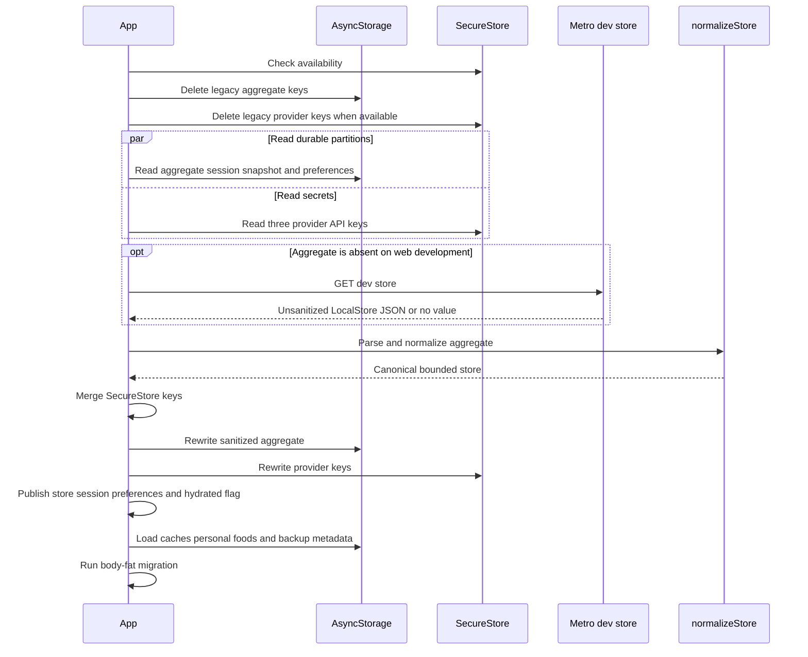
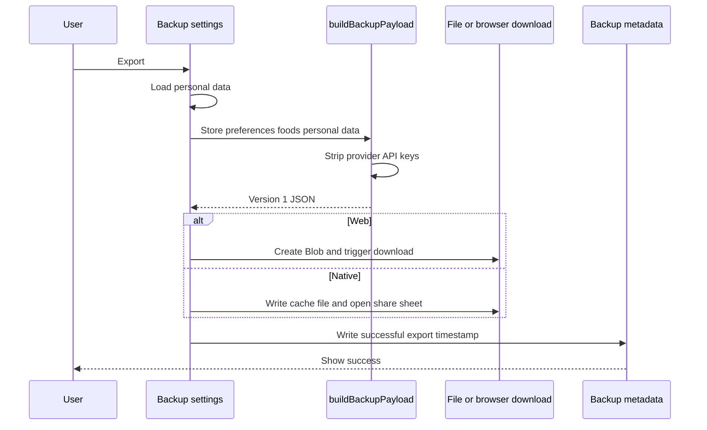
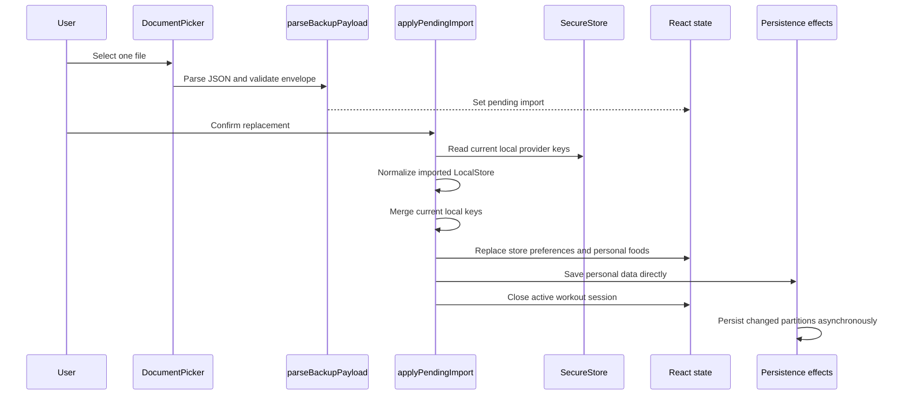

---
okf:
  version: 1
  kind: code-wiki
  status: grounded
  scope: Local persistence, hydration, sensitive storage, reset, tracing, and manual backup in apps/mobile
type: concepto
title: Estado local y copia de seguridad
description: Mapa completo de persistencia y ciclo de vida de la aplicación Expo con enfoque local-first, incluidos los límites de almacenamiento, la normalización, la copia de seguridad manual en JSON, los modos de fallo y las invariantes de seguridad.
summary: Complete persistence map and lifecycle for the local-first Expo app, including storage boundaries, normalization, manual JSON backup, failure modes, and security invariants.
tags: [mobile, persistence, local-storage, secure-storage, backup, hydration]
sources:
  - apps/mobile/App.tsx
  - apps/mobile/metro.config.js
  - apps/mobile/trace.ts
  - apps/mobile/app.json
  - apps/mobile/package.json
  - apps/mobile/agent/toolExecutor.ts
  - apps/mobile/agent/toolExecutor.test.ts
related:
  - ./application-shell.md
  - ./training.md
  - ./measurements.md
  - ./diet-and-food-estimation.md
  - ../agent/runtime.md
  - ../agent/provider-configuration.md
  - ../content/repositories.md
  - ../integrations/vivagym-and-updates.md
  - ../operations/build-release-and-testing.md
---

# Estado local y copia de seguridad

Gymnasia sigue un enfoque local-first: el cliente Expo es propietario del estado del producto, sin una base de datos de la aplicación ni un servicio de sincronización. `App.tsx::App` mantiene el agregado activo en el estado de React, lo hidrata desde `AsyncStorage` y `SecureStore`, y persiste las mutaciones posteriores mediante efectos. La copia de seguridad manual genera un archivo JSON portable en lugar de subirlo a un servicio de Gymnasia. Esta página define ese límite; la semántica de los dominios se aborda en [Entrenamiento](./training.md), [Mediciones](./measurements.md) y [Dieta y estimación de alimentos](./diet-and-food-estimation.md).

## Propiedad del estado y esquemas

### `LocalStore`

`LocalStore` es el principal agregado persistido bajo `STORAGE_KEY` (`gymnasia.mobile.local.v3`):

| Campo | Tipo | Propietario y normalización |
|---|---|---|
| `templates` | `WorkoutTemplate[]` | Plantillas de entrenamiento. La hidratación repara nombres, categorías, iconos, duración, imágenes de ejercicios, series heredadas y series actuales. |
| `workoutHistory` | `WorkoutSessionSummary[]` | Sesiones completadas, normalizadas, con las más recientes primero y limitadas por `MAX_WORKOUT_HISTORY_ITEMS` a 180. |
| `dietByDate` | `Record<string, DietDay>` | Días de dieta normalizados mediante `normalizeDietByDate`. |
| `dietSettings` | `DietSettings` | Completada y migrada mediante `normalizeDietSettings`. |
| `measurements` | `Measurement[]` | Cada registro de métrica/foto se normaliza, se ordena con los más recientes primero y se limita a 1826. Consulte [Mediciones](./measurements.md). |
| `threads` | `ChatThread[]` | Metadatos de los hilos de chat. Los datos ausentes se convierten en un arreglo vacío en lugar de recrear el hilo inicial. |
| `messagesByThread` | `Record<string, ChatMessage[]>` | Los mensajes se reparan por hilo; los roles no válidos se convierten en `assistant`, se generan los identificadores y las fechas ausentes, e `is_streaming` siempre se restablece a `false`. |
| `keys` | `AIKey[]` | Exactamente OpenAI, Anthropic y Google después de la normalización. Se migran los modelos y el esfuerzo de razonamiento, y se marca exactamente una entrada como activa. La ubicación de la clave de API depende de la disponibilidad de SecureStore. |
| `chatProvider` | `Provider` opcional | Se migra desde la clave activa cuando está ausente. El entorno de ejecución no valida un valor persistido arbitrario frente a la unión de proveedores. |
| `foodAIProvider` | `Provider` opcional | De forma predeterminada, Google cuando está ausente. |

`createInitialStore()` comienza sin entrenamientos, historial, dieta ni mediciones; con la configuración de dieta predeterminada; un hilo `Coach 1` vacío; y tres registros de proveedores predeterminados. En el navegador, la hidratación sin datos persistidos utiliza en su lugar `createWebSeedStore()`, por lo que una ejecución web nueva no equivale a una ejecución nativa nueva.

### Mapa de almacenamiento independiente

El agregado no constituye todo el modelo de persistencia. A continuación se enumeran todas las claves independientes encontradas en el código fuente.

| Backend y clave exacta | Valor almacenado | ¿Incluido en la copia de seguridad manual? | Ciclo de vida |
|---|---|---:|---|
| AsyncStorage `gymnasia.mobile.local.v3` | `LocalStore` saneado, o el almacén completo si SecureStore no está disponible | Sí, como `data.store` con las claves eliminadas | Se lee y normaliza durante la hidratación; se reescribe inmediatamente y después de cada cambio del almacén. |
| AsyncStorage `gymnasia.mobile.training.session.v1` | `WorkoutSession` activo | No | Se normaliza durante la hidratación; se establece mientras está activo y se elimina cuando está ausente o se restablece por una importación. |
| AsyncStorage `gymnasia.mobile.training.session_template_snapshot.v1` | Instantánea de `WorkoutTemplate` anterior a la sesión | No | Solo se lee si se hidrata una sesión; se escribe con una sesión y se elimina cuando esta se cierra. |
| AsyncStorage `gymnasia.mobile.chat.system_prompt.v1` | Último prompt del sistema obtenido de forma remota | No | Alternativa de caché; los errores se ignoran deliberadamente. |
| AsyncStorage `gymnasia.mobile.personal_data.v1` | `PersonalDataField[]`, cada uno con `{key, description, value}` | Sí | La configuración y las herramientas del agente lo cargan y guardan por separado. El JSON ausente o no válido se lee como `[]`. |
| AsyncStorage `gymnasia.mobile.user_prefs.v1` | `UserPreferences` | Sí | Se combina superficialmente sobre los valores predeterminados durante la hidratación; se persiste por separado. Contiene el periodo y la métrica del gráfico, así como la configuración de notificaciones. |
| AsyncStorage `gymnasia.mobile.personal_foods.v1` | `FoodRepoEntry[]` | Sí | Se carga después de la hidratación y se persiste mediante un efecto separado. |
| AsyncStorage `gymnasia.mobile.exercises_repo.v2` | Caché del agregado remoto de ejercicios | No | Estrategia que prioriza la red y usa la caché como alternativa. |
| AsyncStorage `gymnasia.mobile.foods_repo.v1` | Caché remota de alimentos | No | Estrategia que prioriza la red y usa la caché como alternativa. |
| AsyncStorage `gymnasia.mobile.products_repo.v1` | Caché remota de productos | No | Estrategia que prioriza la red y usa la caché como alternativa. |
| AsyncStorage `gymnasia.mobile.recipes_repo.v1` | Caché remota de recetas | No | Estrategia que prioriza la red y usa la caché como alternativa. |
| AsyncStorage `gymnasia.mobile.backup_meta.v1` | `{lastBackupAt: string | null}` | No | Se actualiza después de una ruta de exportación/uso compartido correcta; es solo informativo. |
| AsyncStorage `gymnasia.mobile.body_fat_migration_done` | Cadena `"1"` | No | Marcador de migración única del historial de grasa corporal incluido. |
| AsyncStorage `gymnasia.mobile.lastUpdateCheck` | Milisegundos desde el epoch como cadena | No | Limitación a cuatro horas de las comprobaciones de versiones. |
| AsyncStorage `gymnasia_debug_traces` | Hasta 1000 objetos `TraceEntry` | No | Gestionado por `trace.ts`; se carga de forma diferida y se reescribe sin esperar el resultado. |
| SecureStore `gymnasia.mobile.v3.provider.api_key.<provider>` | Una clave de API de proveedor sin espacios circundantes | No | Se combina con `LocalStore` en memoria; se establece/elimina cada vez que cambia `store.keys`. |
| SecureStore `vivagym.email`, `vivagym.password` | Credenciales heredadas de una integración retirada | No | La versión actual no las lee ni escribe durante la hidratación o el uso normal; una actualización dentro del mismo package name las conserva y `resetLocalData` las elimina. |
| Archivo de desarrollo `apps/mobile/.dev-store.json` mediante `/dev-store` | JSON de `LocalStore` en memoria sin sanear | No | Solo para desarrollo web; lectura alternativa cuando AsyncStorage no tiene un agregado y escritura espejo después de cambios del almacén. |

Las claves de agregado heredadas `gymnasia.mobile.local.v1` y `.v2`, junto con los prefijos antiguos de claves de proveedor `gymnasia.mobile.provider.api_key` y `gymnasia.mobile.v2.provider.api_key`, se **eliminan**, no se importan, durante cada hidratación. Por tanto, esa operación es una limpieza, no una migración de datos.

## Ciclo de vida de hidratación y persistencia



*Leyenda: La hidratación inicial canoniza el agregado, combina los secretos, reescribe ambos almacenes y solo entonces habilita los efectos de persistencia del dominio y los cargadores posteriores.*

La barrera `isHydrated` es la invariante clave: los efectos del agregado, las preferencias, los alimentos personales y la sesión finalizan antes de que se vuelva verdadera, lo que impide que los valores predeterminados iniciales de React sobrescriban el estado duradero durante una carga normal. `loading`, `error` e `isHydrated` son estados distintos: el bloque `finally` establece `isHydrated` incluso después de un fallo de análisis o lectura, por lo que la aplicación puede abandonar su interfaz de carga y los efectos posteriores pueden persistir los valores predeterminados actuales en memoria.

Después de la hidratación:

1. Cualquier cambio en `store` se serializa mediante `serializeStoreForAsyncStorage`, escribe el agregado y los secretos del proveedor, y llama a `saveDevStoreFile` de forma concurrente.
2. `userPrefs`, `personalFoods` y `activeWorkoutSession` tienen efectos independientes y, por tanto, puntos de confirmación independientes.
3. La eliminación de una sesión también elimina su instantánea de plantilla. Los fallos al escribir la instantánea se ignoran; los fallos de la sesión muestran un error global.
4. Las cachés de repositorios, la caché del prompt del sistema, los datos personales, el límite de comprobación de actualizaciones, el marcador de migración, los metadatos de copia de seguridad y las trazas se escriben mediante sus propias funciones, no mediante el efecto principal de persistencia.
5. `migrateBodyFatHistory` se ejecuta después de la hidratación. Completa un valor de grasa corporal ausente para una fecha coincidente o crea un registro al mediodía, guarda el agregado modificado mediante un asistente de lectura-modificación-escritura, actualiza el estado de React y, a continuación, marca la migración como completada. Todos los fallos de migración son silenciosos.

### Copropiedad en memoria

La Memoria personal está deliberadamente fuera de `LocalStore`. La configuración y las herramientas del agente comparten `gymnasia.mobile.personal_data.v1`, pero no comparten un único objeto de estado reactivo:

| Actor | Ruta de lectura | Ruta de escritura | Consecuencia para la coherencia |
|---|---|---|---|
| Configuración de Memoria | `loadMemoryFields` llama de forma diferida a `loadPersonalData` una vez cuando se accede por primera vez a la sección | Las confirmaciones, adiciones y eliminaciones de la interfaz llaman a `savePersonalData`; las ediciones también residen en `memoryFields` | No hay suscripción al almacenamiento ni recarga después de la primera carga; la pantalla puede sobrescribir escrituras externas más recientes |
| Herramientas del agente | Los controladores de lista/descripción/valor llaman a la función `loadPersonalData` inyectada para cada operación | `save_personal_data` reemplaza todo el arreglo mediante la función `savePersonalData` inyectada | Las lecturas ven las escrituras duraderas de la interfaz, pero las escrituras no actualizan una pantalla de Memoria que ya esté abierta |
| Exportación de copia de seguridad | Llama a `loadPersonalData` inmediatamente antes de crear la carga útil | Ninguna | Exporta el valor almacenado, no una edición de texto sin guardar que solo se conserve en `memoryFields` |
| Importación de copia de seguridad | No se combina con la Memoria actual | Guarda directamente el arreglo importado o `[]` | No actualiza `memoryFields` ni borra `memoryLoaded`; una pantalla abierta y obsoleta puede sobrescribir posteriormente la importación |
| Restablecimiento | Sin lectura | Sin escritura | `resetLocalData` conserva la Memoria almacenada y el estado actual de la interfaz de Memoria |

`loadPersonalData` devuelve `[]` cuando el JSON está ausente o no es válido y no realiza ninguna normalización del esquema a nivel de elemento. `save_personal_data` es un reemplazo, no una combinación a nivel de campo. Los cambios en esta área deben coordinar el estado de la interfaz, las dependencias del agente, la copia de seguridad y la semántica de restablecimiento; corregir un único propietario mantiene los riesgos de que prevalezca la última escritura.

### Propiedad de las notificaciones

Las opciones de notificación se encuentran en `UserPreferences.notifications`, dentro de la clave independiente `gymnasia.mobile.user_prefs.v1`, y no son campos de `LocalStore` ni de la sesión de entrenamiento activa. La forma es `{ enabled, sound, vibrate, soundKey }`, con los valores predeterminados `true`, `true`, `true` y `rest_finished`. La hidratación combina superficialmente las preferencias almacenadas sobre `DEFAULT_USER_PREFS`; como el objeto anidado no se combina en profundidad, un objeto `notifications` presente pero parcial o mal formado no se repara campo por campo.

Las preferencias se persisten por separado después de la hidratación, se incluyen en la copia de seguridad como `data.userPrefs` y se reemplazan durante la importación (o se restablecen a sus valores predeterminados cuando están ausentes). `resetLocalData` las conserva sin cambios. La propiedad en tiempo de ejecución corresponde al entrenamiento: `enabled` controla la programación en segundo plano, mientras que el sonido y la vibración en primer plano siguen sus propias opciones. Los efectos exactos, las diferencias de canales de Android y los tonos disponibles se describen en [Entrenamiento](./training.md#preferencias-de-notificación-y-efectos-exactos); la ruta de configuración se encuentra en [Interfaz de la aplicación](./application-shell.md#control-de-la-configuración-de-notificaciones).

### Invariantes de normalización

`normalizeStore` es el límite de compatibilidad, no un validador general de esquemas. Aplica invariantes locales importantes:

- las mediciones y el historial de entrenamientos se ordenan por fecha descendente y tienen límites;
- existen los tres registros de proveedores, con uno y solo uno activo;
- los valores de medición positivos se redondean a dos decimales, mientras que los valores no válidos o no positivos se convierten en `null`;
- los mensajes de chat no pueden reanudarse en estado de transmisión después de reiniciar;
- la representación antigua del entrenamiento basada en `sets`, `load_kg` y `rest_seconds` se concilia con las series actuales;
- los registros y la configuración de dieta, así como los resúmenes de entrenamientos, se normalizan antes de pasar a estar activos.

No valida en profundidad cada objeto. En particular, `threads` se acepta directamente, los campos de selección de proveedor se convierten mediante una aserción de tipo en lugar de comprobarse, y la validación de la copia de seguridad puede aceptar datos anidados mal formados que posteriormente hagan que la normalización lance una excepción.

## Límite de datos sensibles

Cuando `SecureStore.isAvailableAsync()` se completa correctamente, `stripSensitiveStoreData` reemplaza cada `AIKey.api_key` por `""` antes de serializarlo para AsyncStorage o para una copia de seguridad. Durante la hidratación, `mergeStoreWithSecureApiKeys` da prioridad a un valor no vacío de SecureStore y, en caso contrario, conserva el valor del agregado. Esto permite migrar valores en texto sin formato desde el agregado y trasladarlos a SecureStore durante la reescritura inmediata.

Cuando SecureStore no está disponible, todo el almacén —incluidas las claves de API de los proveedores— se conserva deliberadamente en AsyncStorage para que la web y los entornos no compatibles sigan funcionando; la interfaz de configuración advierte sobre esta alternativa. Las dos credenciales heredadas de VivaGym no tienen alternativa en texto sin formato: la versión retirada no las lee ni las escribe en ninguna plataforma.

Una excepción importante exclusiva del desarrollo es `saveDevStoreFile(JSON.stringify(store))`: a diferencia de la ruta de AsyncStorage, recibe el almacén **sin sanear**. Por ello, las claves de proveedores configuradas pueden escribirse en `apps/mobile/.dev-store.json` durante el desarrollo web. El middleware de Metro también sirve y acepta `/dev-store` con `Access-Control-Allow-Origin: *`, no realiza ninguna autenticación ni validación del cuerpo o del esquema y utiliza escrituras de archivo síncronas. Es infraestructura de desarrollo, no una API de producción, y el archivo debe tratarse como sensible.

Las entradas de traza pueden contener cualquier tipo de `data`. `pushTrace` las envía también a la consola y las almacena en AsyncStorage; quienes realicen llamadas no deben añadir credenciales ni datos personales. La persistencia de trazas conserva las 1000 entradas más recientes, pero sus escrituras sin espera no son transaccionales.

### Carga, copia, borrado y privacidad de las trazas

`trace.ts` administra un búfer a nivel de módulo junto con `gymnasia_debug_traces`. La primera llamada a `pushTrace` o `getTraces` analiza de forma diferida el JSON almacenado; solo se comprueba que sea un arreglo, y los errores de lectura o análisis producen un búfer vacío. Las primeras llamadas concurrentes comparten `traceBufferLoading`, lo que evita que una carga sobrescriba a otra. Las lecturas posteriores devuelven una copia superficial del arreglo del búfer en memoria y no vuelven a leer el almacenamiento. Cada inserción añade `{ ts, tag, message, data }`, conserva las 1000 entradas más recientes, inicia una escritura de persistencia sin esperarla y también registra en la consola la entrada con formato.

El panel de trazas de Configuración ofrece tres operaciones distintas:

- **Cargar/actualizar:** `getTraces` devuelve el búfer actual. `formatTraces` añade la plataforma, la marca de tiempo de generación, el recuento, la marca de tiempo ISO de cada entrada y la serialización JSON sin censura de `data`.
- **Copiar:** `Clipboard.setStringAsync` recibe todo el texto sin formato. Los errores de copia se descartan. No hay censura, confirmación, uso compartido o carga automáticos ni limpieza del portapapeles; la privacidad del portapapeles después de la llamada es responsabilidad del sistema operativo.
- **Borrar:** `clearTraces` espera la carga inicial, vacía el búfer e intenta ejecutar `AsyncStorage.removeItem`. Los errores de eliminación se descartan y, a continuación, el panel borra su lista local; por tanto, el estado vacío visible no demuestra un borrado duradero.

Las trazas se excluyen de la copia de seguridad/importación y `resetLocalData` no las modifica. La importación no puede sobrescribirlas y la exportación de una copia de seguridad no las revela. Sin embargo, pueden permanecer copias en la consola de Expo o en herramientas como `adb logcat`, independientemente de que se borre AsyncStorage. Los productores actuales incluyen el montaje de la aplicación, eventos de permiso/canal/programación/cancelación/entrega/pulsación de notificaciones, errores de alertas de descanso y los títulos, cuerpos y activadores asociados; los cuerpos de las notificaciones pueden contener nombres de ejercicios. Tanto el almacenamiento de trazas como los volcados al portapapeles deben tratarse como datos de diagnóstico potencialmente personales. El flujo de la interfaz está enlazado desde [Interfaz de la aplicación](./application-shell.md#panel-de-trazas-y-límite-de-privacidad).

## Contrato de copia de seguridad manual

### Sobre de la versión 1

`buildBackupPayload` genera la siguiente estructura JSON:

```json
{
  "app": "gymnasia",
  "type": "backup",
  "schemaVersion": 1,
  "appVersion": "1.16.0",
  "createdAt": "ISO-8601 timestamp",
  "data": {
    "store": "LocalStore with every provider api_key blank",
    "userPrefs": "UserPreferences",
    "personalFoods": "FoodRepoEntry[]",
    "personalData": "PersonalDataField[]"
  }
}
```

`appVersion` procede de la configuración de Expo, con `0.0.0` como valor alternativo; es un metadato, no una comprobación de compatibilidad de importación. `schemaVersion` es el control de compatibilidad. El analizador acepta versiones de esquema inferiores o iguales a `BACKUP_SCHEMA_VERSION`, rechaza las versiones futuras y solo comprueba la identidad del sobre, la versión numérica y la presencia de `data.store`. No existen funciones explícitas de migración por versión.

Los datos excluidos son importantes desde el punto de vista semántico: claves de API de proveedores, credenciales heredadas de integraciones retiradas, entrenamiento activo e instantánea anterior a la sesión, cachés remotas, caché de prompts, trazas, metadatos de copias de seguridad/actualizaciones y marcadores de migración. Una cadena `photo_uri` dentro de una medición se incluye porque las mediciones residen en `store`, pero los bytes de la imagen referenciada **no** se copian en el JSON. Por tanto, un dispositivo restaurado puede contener URI `file:` o `content:` inservibles.

### Secuencias de exportación e importación



*Leyenda: La exportación captura cuatro particiones de datos del usuario, elimina los secretos de los proveedores y delega la ubicación duradera a una descarga del navegador o a la hoja nativa de uso compartido.*

El nombre de archivo usa la hora local: `gymnasia_backup_YYYYMMDD_HHMM.json`. En el entorno nativo, el archivo de caché se reemplaza y, a continuación, se requieren `Sharing.isAvailableAsync()` y `shareAsync()`. La marca de tiempo de los metadatos significa que el flujo llegó al final de la invocación de descarga o uso compartido; no puede demostrar que el usuario conservara o subiera el archivo.



*Leyenda: La importación es un reemplazo confirmado de las particiones incluidas en la copia de seguridad, que conserva las claves de proveedor actuales y finaliza intencionadamente cualquier entrenamiento activo.*

La selección acepta JSON, texto sin formato o cualquier tipo MIME; lee el archivo, analiza el JSON, valida superficialmente el sobre y lo almacena en `pendingImport`. La selección por sí sola no modifica ninguna partición duradera del producto. Después, la confirmación normaliza `data.store`, superpone las claves de API actuales de SecureStore, asigna valores predeterminados a las preferencias ausentes, asigna arreglos vacíos a los alimentos y datos personales ausentes o que no sean arreglos, actualiza el estado de React, espera directamente la escritura de datos personales y llama explícitamente a `setActiveWorkoutSession(null)`.

La importación no elimina directamente el almacenamiento de la sesión. Después de que React publique la sesión nula, el efecto protegido de la sesión elimina tanto `gymnasia.mobile.training.session.v1` como `gymnasia.mobile.training.session_template_snapshot.v1`; por tanto, la importación finaliza cualquier entrenamiento activo y elimina ambas claves excluidas, en lugar de intentar normalizarlas respecto a las plantillas importadas. Las demás particiones modificadas son persistidas por efectos independientes, de modo que la finalización no constituye una confirmación duradera atómica. La Memoria importada tampoco se copia en `memoryFields`, por lo que se mantiene la salvedad sobre la copropiedad descrita anteriormente.

## Atomicidad, restablecimiento y comportamiento ante fallos

No existe ninguna transacción que abarque AsyncStorage, SecureStore, el estado de React, el archivo de desarrollo o las particiones de la copia de seguridad.

- Las escrituras del agregado principal y de las claves de proveedores se ejecutan en `Promise.all`; una puede confirmarse mientras la otra falla. El bloque `catch` solo establece un error global y no revierte los cambios.
- La importación modifica el almacén, las preferencias y los alimentos en React antes de esperar la persistencia de los datos personales. Si esa escritura final falla, la interfaz informa de un fallo de importación aunque las particiones anteriores en memoria hayan cambiado y quizá ya se hayan persistido mediante efectos.
- `saveMeasurementsToStorage` y el efecto principal del agregado escriben en la misma clave. La ruta de lectura-modificación-escritura de la migración/herramienta puede entrar en conflicto con una escritura más reciente del agregado.
- La mayoría de los fallos de cachés, preferencias, alimentos personales, prompts, trazas e instantáneas se descartan. La aplicación prioriza la disponibilidad sobre la confirmación de escritura duradera.
- Un JSON de agregado dañado o una llamada de almacenamiento rechazada envían la hidratación a su bloque `catch`. Como la hidratación se completa de todos modos, el estado predeterminado en memoria puede sobrescribir posteriormente un estado recuperable pero mal formado.
- Los asistentes de lectura/escritura de SecureStore suelen dejar que los fallos individuales de la API rechacen la operación de hidratación o persistencia que los contiene; solo la comprobación de disponibilidad captura los errores.

`resetLocalData()` es un restablecimiento del producto en memoria, no `AsyncStorage.clear()`:

- reemplaza `LocalStore`, restablece el estado de la interfaz de proveedores, vuelve a Inicio y finaliza el entrenamiento activo;
- a continuación, los efectos de persistencia ordinarios reescriben el agregado, eliminan las claves de API de proveedores ahora vacías y eliminan las claves de sesión;
- elimina también las dos claves heredadas `vivagym.email` y `vivagym.password`, sin leer sus valores;
- **no** restablece `userPrefs` (incluida la configuración de notificaciones), `personalFoods`, los datos `personalData`/Memoria almacenados o cargados, las cachés, las trazas, los metadatos de copia de seguridad, el límite de actualizaciones ni el marcador de migración de grasa corporal;
- en desarrollo web, también replica el nuevo agregado en el archivo de desarrollo.

Por consiguiente, no debe deducirse de esta función ningún texto de interfaz que implique un borrado completo del dispositivo.

## Pruebas y comandos de validación

No hay pruebas específicas para la hidratación, la normalización, la alternativa cuando SecureStore no está disponible, la cobertura del restablecimiento, la compatibilidad del sobre de copia de seguridad, la atomicidad de la exportación/importación ni la portabilidad de las fotos. Las pruebas del ejecutor del agente inyectan la persistencia de mediciones y demuestran que un JSON de mediciones mal formado no produce escrituras, pero no ejercitan el almacenamiento de Expo. Las pruebas deterministas existentes solo incluyen `agent/**/*.test.ts`.

Ejecute las comprobaciones específicas actuales desde la raíz del repositorio:

```bash
npm test
npm --workspace apps/mobile run test:deterministic
npx tsc --noEmit -p apps/mobile/tsconfig.json
```

El comando de TypeScript es una comprobación específica útil del contrato, pero no está declarado como script del paquete. Para la validación manual de la persistencia:

```bash
npm run dev:mobile
npm --workspace apps/mobile run web
```

Verifique por separado un ciclo nativo y uno web: cree cada partición, reinicie, inspeccione el estado normalizado, exporte, compruebe que todos los valores `data.store.keys[*].api_key` estén vacíos, importe después de cambiar las claves de API locales, confirme que las claves se conserven, confirme que la sesión activa se cierre y pruebe archivos ausentes, no válidos y con versiones futuras. Durante el desarrollo web, inspeccione y proteja también `apps/mobile/.dev-store.json`; nunca confirme en el repositorio los secretos que contenga.

## Procedimiento seguro para realizar cambios

1. Añada un campo al tipo de TypeScript propietario y a su constructor inicial/predeterminado.
2. Amplíe `normalizeStore` o el cargador independiente para que los valores persistidos antiguos o mal formados reciban un valor determinista.
3. Decida si el campo corresponde a datos del usuario, estado efímero, una caché que puede volver a descargarse o un secreto; colóquelo en el backend adecuado en lugar de ampliar automáticamente `LocalStore`.
4. Si debe incluirse en una copia de seguridad portable, actualice `BackupData`. Para cambios incompatibles, incremente `BACKUP_SCHEMA_VERSION` y añada una migración explícita de importación en lugar de depender de una aserción de tipo.
5. Actualice deliberadamente la semántica de restablecimiento y documente si los usuarios existentes conservan el campo.
6. Pruebe fallos entre todas las particiones confirmadas de forma independiente, el comportamiento cuando SecureStore no está disponible, el JSON dañado, las copias de seguridad antiguas y las futuras.
7. Si añade contenido multimedia, exporte los bytes o los archivos copiados en lugar de incluir únicamente URI locales del entorno aislado.

Las invariantes centrales son: no persistir secretos de proveedores en el almacenamiento de producción ordinario cuando SecureStore esté disponible; no iniciar nunca los efectos de persistencia antes de la hidratación; normalizar toda entrada duradera antes de consumirla; mantener limitadas las colecciones acotadas; y no afirmar que la restauración de copias de seguridad es atómica hasta que la escritura en varias particiones sea transaccional.
