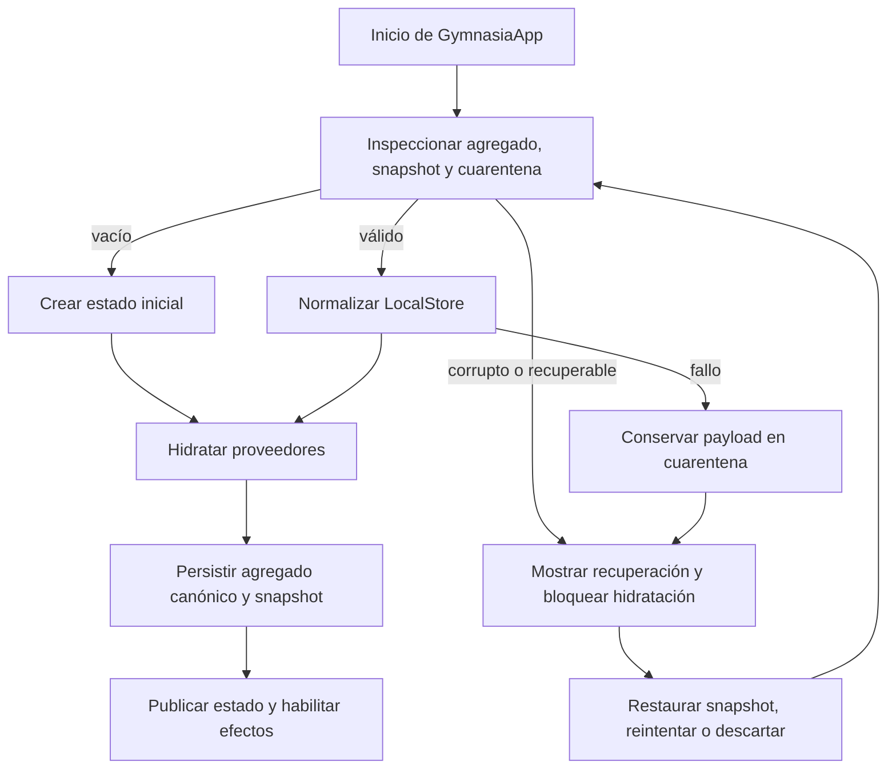
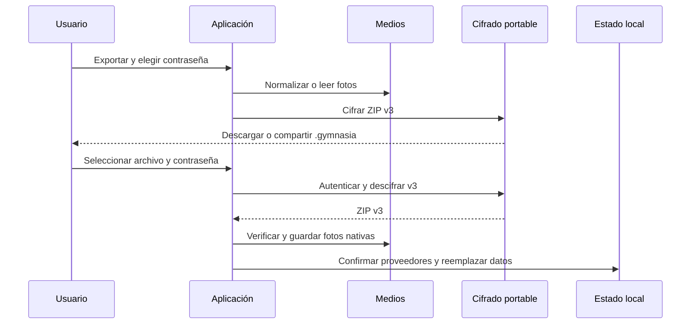

# Estado local, recuperación, borrado y copias

Gymnasia es *local-first*: `GymnasiaApp` mantiene el estado activo en React y persiste el agregado y sus particiones locales. No implementa sincronización ni una copia remota gestionada. Una copia exportada es responsabilidad de quien la guarda y contiene datos de salud y conversaciones; debe tratarse como información sensible.

Hay tres límites que no conviene mezclar:

- **Datos de usuario portables:** actividad, dieta, mediciones, conversaciones, preferencias, alimentos personales y memoria; forman el contenido de una copia de usuario.
- **Secretos BYOK y configuración de proveedores:** las API keys no viajan en el backup. En nativo, el repositorio de proveedores usa `SecureStore`; en web su alternativa es `AsyncStorage`. La política de autoridad, diario y commits pertenece a [Configuración de proveedores](../agent/provider-configuration.md).
- **Artefactos de recuperación:** el snapshot y la cuarentena protegen el agregado local frente a lecturas o escrituras ambiguas. Una exportación de cuarentena es un artefacto técnico distinto de una copia de usuario y puede contener secretos web.

## Mapa de persistencia y propiedad

`LocalStore` se persiste bajo `gymnasia.mobile.local.v3` (con namespace de entorno). Incluye plantillas e historial de entrenamiento, dieta y ajustes, mediciones, hilos y mensajes, metadatos no secretos de proveedores y recibos mínimos de escrituras efectuadas por tools. Sus contenedores raíz antiguos ausentes se completan durante la migración; antes de una escritura gestionada, la validación rechaza campos raíz desconocidos, recibos malformados, proveedores fuera de `openai`, `anthropic` y `google`, y formas incompatibles. Los diagnósticos usan rutas saneadas y no revelan valores ni nombres desconocidos.

| Partición o recurso | Propiedad y ciclo de vida |
|---|---|
| `gymnasia.mobile.local.last_good.v1` | Snapshot del payload validado con SHA-256. Es la última alternativa verificable para recuperar el agregado. |
| `gymnasia.mobile.local.quarantine.v1` | Payload problemático, hash e incidencias saneadas. Una cuarentena válida bloquea escrituras aunque la clave principal parezca válida en un arranque posterior. |
| `gymnasia.mobile.training.session.v1`, `session_template_snapshot` y `session_template_draft` | Trabajo de sesión activa dependiente del agregado. No se exporta y se elimina al descartar recuperación, restaurar una copia o borrar actividad. |
| `gymnasia.mobile.personal_data.v1`, `personal_foods.v1` y `user_prefs.v1` | Memoria del coach, alimentos propios y preferencias: son particiones independientes, pero se proyectan al backup de usuario. La memoria usa un sobre versionado con recibos de tools; la copia exporta sus campos, no esos recibos. |
| Diario `gymnasia.mobile.v4.provider_configuration` | Configuración y secretos de proveedores: `SecureStore` es la autoridad en nativo; el espejo de `AsyncStorage` no debe convertirse en fuente de secretos. |
| `gymnasia_measurement_media_v1` | Directorio de documentos privado en nativo para JPEG de mediciones propiedad de la aplicación, no una clave de `AsyncStorage`. |
| `gymnasia.mobile.agent.tool_operations.v1`, cachés de catálogos, trazas, consentimiento, salud de alarmas y metadatos de backup | Estado operativo, de diagnóstico o caché. Está fuera del paquete portable y su borrado se decide expresamente en el manifiesto. El journal de tools se escribe antes del efecto y conserva operaciones ambiguas hasta reconciliarlas o borrar actividad. |

Las credenciales VivaGym heredadas no participan en el funcionamiento actual ni en un backup; el borrado total las inventaría para que no sobrevivan a un restablecimiento.

## Inicio, validación y recuperación



*La hidratación no publica `isHydrated` hasta inspeccionar el almacenamiento; así los efectos de React no sobrescriben un payload no comprobado con el estado inicial.*

`LocalStoreRecoveryRepository` serializa sus operaciones. Al inspeccionar distingue estado vacío, válido, recuperable —hay snapshot válido— y corrupto. Un snapshot es utilizable solo si versión, JSON, forma y SHA-256 coinciden. La cuarentena conserva el payload original byte a byte cuando existe y su hash; si el almacenamiento no se puede leer, registra el fallo sin fingir que está vacío.

Un commit valida el serializado, comprueba que sea seguro reemplazar el primario, escribe, relee y exige igualdad exacta y forma válida antes de actualizar el snapshot. Las tools que mutan comida, mediciones o rutinas añaden en ese mismo valor un recibo con identidad SHA-256, nombre y fecha, de modo que una recuperación puede distinguir un efecto ya comprometido de uno que no ocurrió. Si la verificación falla, deja cuarentena y comunica un commit ambiguo. Si solo falla la escritura del snapshot, el primario puede haberse guardado, pero se informa que la copia de recuperación no se actualizó. `restoreSnapshot()` repone un snapshot comprobado y solo entonces elimina la cuarentena; `discardAffected()` elimina el agregado, sus auxiliares y las claves dependientes, y crea un estado inicial con la configuración actual de proveedores.

La pantalla `LocalStoreRecoveryScreen` ofrece restaurar la última copia íntegra, reintentar tras una reparación externa, guardar el payload dañado o descartarlo con confirmación. El reintento ignora deliberadamente una cuarentena previa para aceptar un primario reparado; el resto del flujo la respeta como bloqueo. La normalización semántica que falla después de la validación estructural también manda el payload a cuarentena en vez de intentar una reparación no verificable.

### Exportación de cuarentena y utilidad CLI

«Guardar copia dañada» serializa un documento `local-store-recovery` de esquema 1 que incluye la cuarentena y una advertencia de sensibilidad. Se cifra con contraseña antes de descargarse o compartirse; no es importable como backup de usuario. El formato criptográfico y sus parámetros se documentan en [Cifrado portable y recuperación](./portable-encryption-and-recovery.md), para no duplicar aquí su contrato.

Para inspeccionarlo fuera de la aplicación se usa la utilidad de recuperación:

```bash
npm run decrypt:recovery -- --input <archivo.gymnasia> --output <destino.json>
```

La contraseña se solicita sin eco. `--password-stdin` existe únicamente para automatización. La CLI exige entrada y salida distintas, no sobrescribe un destino existente, valida que el texto descifrado sea una exportación `local-store-recovery`, crea el resultado con permisos `0600` y limpia el archivo parcial ante un fallo. El JSON resultante es sensible: conservarlo con esos permisos no sustituye su manejo seguro.

## Fotos de mediciones: posesión y privacidad

Al incorporar una foto, `normalizeAndStoreMeasurementPhoto` verifica dimensiones, reduce el lado mayor a 2048 px si procede, recodifica JPEG con calidad 0.8 y elimina EXIF, XMP, IPTC y comentarios. Rechaza bytes vacíos o de más de 5 MiB tras optimizarlos. En nativo guarda los bytes saneados en el directorio propio con nombre SHA-256; en web puede conservar el URI de origen, pero no obtiene una URI persistente propia.

Al eliminar o sustituir una medición se puede borrar un archivo propio que ya no tenga referencias. Arranque e importación ejecutan además una barrida oportunista de huérfanos. Es limpieza no crítica: los fallos del sistema de archivos no bloquean la aplicación. Los dos alcances de borrado vacían el directorio nativo y verifican que esté vacío; el navegador no tiene ese directorio.

## Copia portable de usuario

La salida actual es un archivo `.gymnasia` cifrado y autenticado de esquema **3**, con MIME `application/vnd.gymnasia.encrypted`. Antes de cifrar, el plaintext es un ZIP que contiene `manifest.json` v3 y, opcionalmente, `media/<sha256>.jpg`. El manifiesto identifica aplicación, versión, fecha y `data`: `LocalStore` saneado, preferencias, alimentos personales y memoria personal. El detalle de derivación de clave, AEAD por fragmentos, validación de cabecera y límites de contraseña vive en [Cifrado portable y recuperación](./portable-encryption-and-recovery.md).

La compatibilidad es explícita y solo de entrada: el selector reconoce el paquete ZIP v2 heredado y el JSON v1; ambos se validan con su versión esperada. La exportación nueva nunca produce v1, v2 ni un ZIP sin cifrar. El selector también acepta tipos MIME genéricos porque los sistemas de archivos pueden no preservar el MIME específico; determina el formato por prefijo cifrado, firma ZIP o JSON, no por la extensión.



*El recorrido muestra la salida v3. Las entradas heredadas v2 y JSON v1 siguen rutas de lectura separadas antes de la misma confirmación de restauración.*

### Medios y límites del ZIP interno

Antes de empaquetar, todas las `photo_uri` del manifiesto pasan a `null`; los bytes viajan como assets JPEG y enlaces separados entre `measurementId` y el SHA-256. Los bytes idénticos se deduplican y se priorizan mediciones recientes. Se registran omisiones si el medio falta, es ilegible o inválido, excede el límite individual, la cantidad o el presupuesto total; nunca se descarta por ello la medición numérica.

Los límites son 500 enlaces y assets, 5 MiB por foto, 200 MiB de bytes de medios, **8 MiB** para `manifest.json` y 220 MiB para el ZIP plaintext. El archivo cifrado admite solamente ese plaintext de hasta 220 MiB más la sobrecarga del sobre autenticado. Al crear el ZIP, el manifiesto se valida y cada asset declarado debe existir y tener el tamaño indicado; al leerlo, se validan identidad de aplicación, versión, IDs de medición, rutas internas permitidas, MIME JPEG, tamaños, hashes, enlaces no ambiguos y motivos de omisión conocidos.

Una foto declarada que no se encuentre, cuyo tamaño no coincida, cuyo SHA-256 falle o que no sea JPEG válido se omite del resultado de medios, no invalida la medición. Durante la importación, la aplicación deja su `photo_uri` a `null`, muestra una advertencia y conserva los valores numéricos. En web las fotos v2/v3 válidas tampoco se restauran a URI persistente: se informa esa limitación y quedan en `null`. Las URI de fotos de JSON v1 se intentan normalizar en el dispositivo receptor y pueden perderse si no se pueden leer.

### Confirmación y reemplazo

Seleccionar y desbloquear una copia no escribe estado: prepara un `PendingBackupImport`; la mutación empieza tras la confirmación. Para v3 se autentica y descifra antes de analizar ZIP y hashes. Los bytes de plaintext y los medios pendientes se ponen a cero al terminar o cancelar cuando es posible, y la copia temporal nativa elegida se elimina después de desbloquear o cancelar.

Al aplicar la importación, se normaliza estrictamente el agregado antes de cambiar React. La aplicación conserva las API keys locales y el `workspace_id` local de Anthropic, confirma primero un commit vigente en el repositorio de proveedores, normaliza preferencias, reemplaza alimentos y memoria personal, invalida la caché de la pantalla de memoria y cierra cualquier sesión activa. Finalmente intenta barrer fotos huérfanas.

La restauración **no es atómica** entre React, `AsyncStorage`, `SecureStore` y el directorio de medios: una interrupción puede dejar particiones ya cambiadas junto a otras pendientes. Cualquier modificación de estas fronteras debe preservar la validación previa y tratar errores parciales como un riesgo de recuperación, no como un rollback garantizado.

### Exclusiones y privacidad

Nunca se exportan API keys BYOK, el diario seguro de proveedores, sesión activa ni sus borradores, el journal ni los recibos de operaciones de tools, cachés de catálogo, trazas, consentimiento, diagnóstico de alarmas, metadatos de backup o credenciales VivaGym heredadas. El paquete sí puede contener actividad, dieta, mediciones, conversaciones, preferencias, alimentos y los campos de memoria personal; debe tratarse como información sensible. Las fotos incluidas ya no contienen los metadatos JPEG retirados, pero siguen siendo datos personales. Un backup v1 puede portar URI antiguas: se intenta normalizarlas durante la importación y se advierte si no se pueden recuperar. Al importar, los recibos técnicos del dispositivo actual se conservan en vez de leerlos de la copia, porque el journal local también sobrevive a la importación y una operación anterior ambigua no debe reejecutarse sobre los datos restaurados. `lastBackupAt` se actualiza después del flujo de compartir/descargar: indica que la aplicación creó la copia, no que el usuario la haya conservado.

## Borrado verificable

El manifiesto de runtime asigna cada destino a uno de dos alcances:

- **Borrar actividad y conversaciones** reescribe el agregado con actividad, dieta, medidas y chats vacíos y genera el snapshot de ese estado. Elimina cuarentena, sesión y borradores, libro de operaciones del agente y fotos propias. Conserva proveedores y sus claves, memoria, alimentos personales, preferencias, cachés, trazas, consentimiento y metadatos.
- **Borrar todos mis datos** elimina agregado y auxiliares, configuración y claves de proveedores, memoria, preferencias, alimentos, cachés, trazas, consentimientos, metadatos, operaciones, fotos y secretos heredados. También recorre claves detectadas en el namespace activo. La única exclusión explícita es `gymnasia.mobile.signed_policy.cache.v1`, caché pública de seguridad anti-retroceso y no dato de usuario.

Cada destino ejecuta `delete` y luego `verify`, con timeout de 5 s por fase. Las tareas se ejecutan en paralelo: un error, timeout o valor aún presente produce un informe `incomplete`, no cancela los demás y permite reintentar. En nativo se cancelan y descartan también las notificaciones; tras el informe se reinicia el runtime para que referencias y borradores de React no reescriban datos borrados.

Antes de empezar, el runtime bloquea persistencias nuevas y espera a que terminen las que
ya estaban en cola. Esta barrera incluye la escritura posterior del espejo de desarrollo:
sin ella, una persistencia antigua podría completar después del borrado y volver a poblar
ese espejo con el estado previo aunque el agregado principal ya se hubiera limpiado.

El borrado de actividad elimina el journal y los recibos de tools dentro de `LocalStore`
y del sobre de memoria, pero conserva los campos de memoria personal. El alcance local
no puede borrar paquetes ya exportados, fotos fuera del directorio propiedad de la app,
permisos o canales del sistema, registros del sistema operativo, ni información enviada
anteriormente a un proveedor externo.

## Pruebas y cambios seguros

- `persistence/localStoreRecovery.test.ts` cubre migración idempotente, incidencias sin filtración de secretos, cuarentena byte a byte, snapshot con hash, bloqueo persistente, commit ambiguo y descarte de solo las dependencias afectadas.
- `backup/backupFormat.test.ts` cubre salida ZIP v3, entradas v2/v1 heredadas, SHA-256, deduplicación, prioridad y límites, rutas/enlaces maliciosos, metadatos JPEG y conservación de mediciones ante medios corruptos. `backup/portableEncryption.test.ts` añade vector estable, autenticación de fragmentos, alteración, truncamiento y límites de contraseña.
- `scripts/storage-recovery.e2e.mjs` verifica en web que la recuperación no sobrescribe JSON roto, no contacta proveedores, cifra la exportación de cuarentena, permite reintento, restaura tras confirmación y conserva las particiones independientes al descartar. `scripts/decrypt-recovery.test.mjs` verifica descifrado CLI, permisos `0600` y ausencia de sobrescritura.
- `storage/localDataDeletion.test.ts` verifica el orden borrar/verificar, fallos y timeouts reintentables, resultados bajo órdenes arbitrarios y consistencia entre manifiesto de borrado e inventario de privacidad.

Al añadir una partición o campo persistido, decidir si pertenece al agregado, a datos independientes, caché, estado efímero o secreto; definir su migración y normalización; declarar ambos alcances de borrado; e incluirlo en la copia solo si debe ser portable. Los cambios incompatibles requieren una versión nueva y una ruta de importación explícita. Para multimedia, transportar bytes verificables en vez de URI locales.
