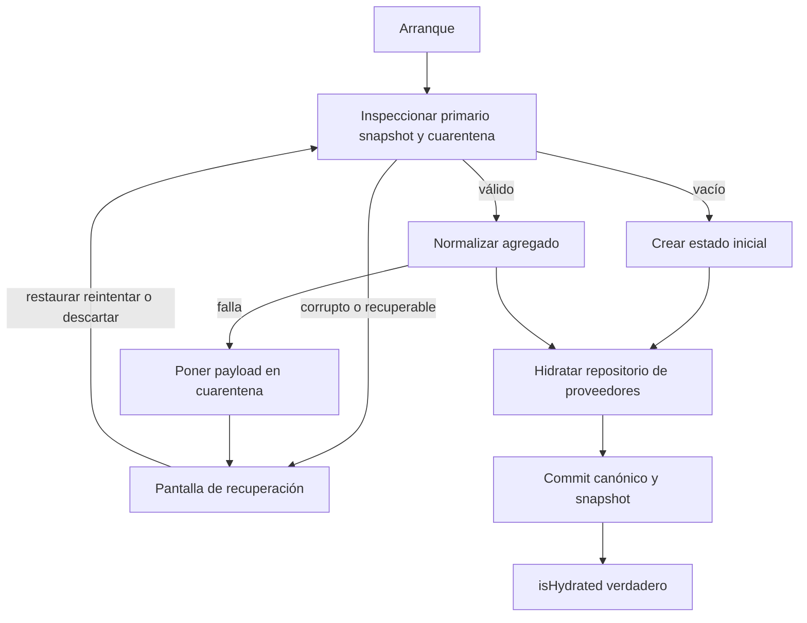
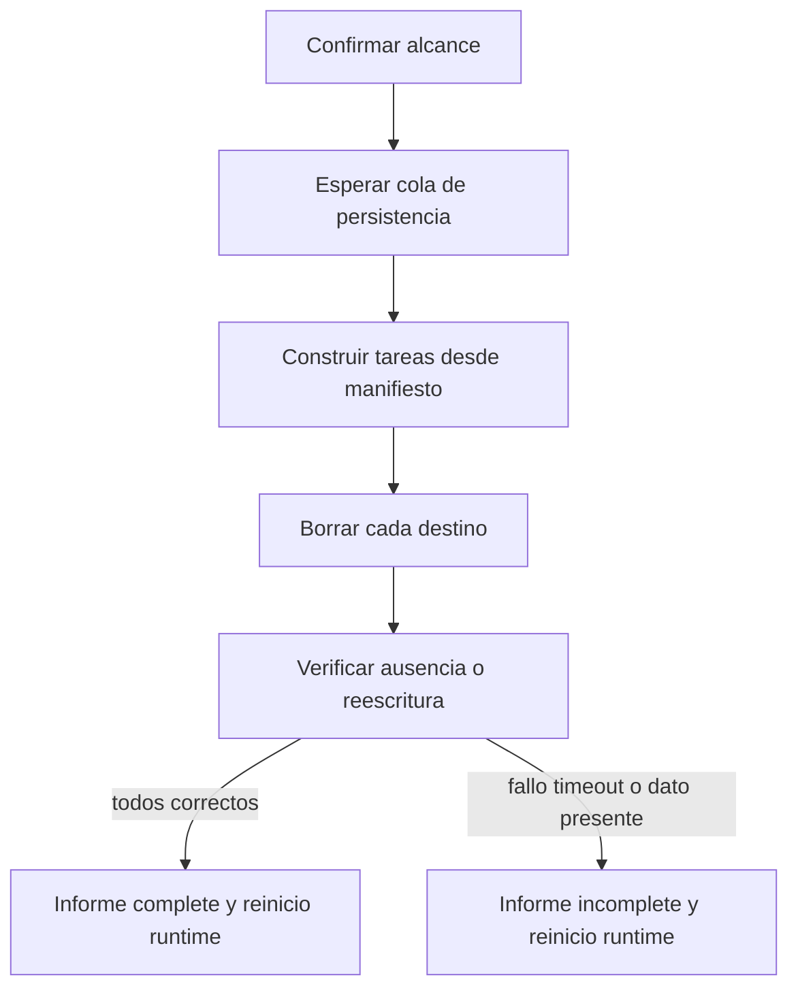

# Estado local, borrado y recuperación

Gymnasia Mobile es **local-first**: el estado de uso se mantiene en React y se persiste en el dispositivo. No se debe interpretar una exportación como una copia gestionada por la aplicación: contiene datos de salud, actividad y conversaciones, y quien la exporta debe custodiarla como información sensible.

La regla de seguridad central es **no sobrescribir un agregado que no se haya podido leer y validar**. El arranque inspecciona el almacenamiento antes de publicar el estado hidratado; una lectura ambigua o inválida lleva a recuperación, no a reemplazar los datos por el estado inicial.

## Fronteras de datos y propiedad

`LocalStore` es el agregado de actividad, dieta, mediciones, conversaciones, configuraciones no secretas de proveedores y recibos de operaciones de tools. Se guarda bajo la clave con ámbito de entorno `gymnasia.mobile.local.v3`; la serialización elimina las API keys antes de escribirlo. El estado inicial crea un hilo de chat y valores por defecto, pero no debe persistirse como consecuencia de un fallo de lectura.

| Área | Almacenamiento y responsabilidad | Backup y borrado |
|---|---|---|
| Agregado principal | `gymnasia.mobile.local.v3`, su snapshot `gymnasia.mobile.local.last_good.v1` y cuarentena `gymnasia.mobile.local.quarantine.v1`. | El agregado saneado es portable; actividad lo reescribe vaciado y el borrado total lo elimina. |
| Sesión de entrenamiento | Sesión activa, snapshot de plantilla y borrador son claves independientes y dependientes del agregado. | No son portables; recuperación por descarte y ambos borrados los eliminan. |
| Proveedores y secretos BYOK | El repositorio de proveedores mantiene un journal; en nativo el journal canónico está en `SecureStore` y el espejo de `AsyncStorage` se sanea sin claves. En web se usa `AsyncStorage`. | Las API keys no viajan en el backup. El borrado de actividad las conserva; el total elimina journal y secretos inventariados. |
| Preferencias, alimentos y memoria | `user_prefs`, alimentos personales y memoria personal son particiones independientes. La memoria contiene también recibos técnicos. | Son datos portables con sus normalizaciones correspondientes. El borrado de actividad conserva preferencias y alimentos, reescribe la memoria para quitar sus recibos; el total los elimina. |
| Fotos de medición | En nativo, JPEG en el directorio privado `gymnasia_measurement_media_v1`; no es una clave de `AsyncStorage`. | Pueden incluirse como assets; los dos alcances de borrado limpian el directorio propio. |

La validación estructural migra contenedores raíz antiguos ausentes a valores vacíos, pero rechaza campos raíz desconocidos, tipos incompatibles, recibos no verificables y proveedores fuera de `openai`, `anthropic`, `google` y `custom_openai`. Los diagnósticos usan rutas generalizadas, por ejemplo `$[unknown]`, para no filtrar valores ni nombres de campo sensibles.

## Inicio y recuperación antes de escribir

```mermaid
flowchart TD
  Start["Arranque"] --> Inspect["Inspeccionar primario snapshot y cuarentena"]
  Inspect -->|"vacío"| Initial["Crear estado inicial"]
  Inspect -->|"válido"| Normalize["Normalizar agregado"]
  Inspect -->|"corrupto o recuperable"| Recovery["Pantalla de recuperación"]
  Normalize -->|"falla"| Quarantine["Poner payload en cuarentena"]
  Quarantine --> Recovery
  Initial --> Providers["Hidratar repositorio de proveedores"]
  Normalize --> Providers
  Providers --> Commit["Commit canónico y snapshot"]
  Commit --> Ready["isHydrated verdadero"]
  Recovery -->|"restaurar reintentar o descartar"| Inspect
```

*La hidratación solo habilita efectos dependientes del almacenamiento después de inspeccionar, normalizar y tratar el resultado de persistencia.*

`runLocalStoreHydration()` es el punto de entrada del arranque. Inspecciona el repositorio con un espejo de desarrollo opcional como fallback; si recibe `recoverable` o `corrupt`, deja `isHydrated` en `false` y muestra `LocalStoreRecoveryScreen`. Si la forma pasa la validación pero `normalizeStore()` falla semánticamente, conserva el payload original en cuarentena y vuelve a la misma ruta. Una excepción no recuperable lleva a la pantalla de fallo de inicio, tampoco a una hidratación parcial.

`useLocalStoreRuntime()` conserva una referencia al último store y serializa las mutaciones persistentes en una cola. Un `commit()` calcula el siguiente estado, lo persiste primero y solo entonces lo publica; las actualizaciones visuales sin commit permanecen como cambios de React hasta que otra ruta las persista. Esta distinción evita anunciar una modificación durable si `persistLocalStore()` falla.

### Contrato del repositorio de recuperación

`LocalStoreRecoveryRepository` serializa inspecciones, commits y resolución. Sus resultados distinguen:

- **`empty`**: no hay primario, snapshot ni cuarentena utilizable.
- **`valid`**: el JSON migrado y validado puede normalizarse; la inspección no lo reescribe por sí misma.
- **`recoverable`**: hay una cuarentena o un primario problemático y puede haber snapshot válido. Una cuarentena existente sigue bloqueando aunque el primario parezca válido en el siguiente arranque.
- **`corrupt`**: no existe un candidato seguro para continuar; también cubre un fallo al leer el almacenamiento, que no se trata como vacío.

Un snapshot contiene versión, fecha, payload y SHA-256. Solo se acepta cuando versión, hash, JSON y forma son válidos. La cuarentena conserva el payload exacto cuando está disponible, su hash y causas saneadas; la creación de cuarentena que no se pueda persistir sigue bloqueando la instancia en memoria.

Antes de un commit normal, el repositorio relee el primario y rechaza escribir sobre una cuarentena, un primario inválido o un primario desaparecido si hay snapshot. Tras escribir, relee y compara el texto exacto y su forma antes de actualizar el snapshot. Si esa comprobación falla, crea cuarentena y lanza un error de commit ambiguo. Si solo falla el snapshot, el primario puede haber quedado guardado, pero se informa que la protección de recuperación no se actualizó.

Las salidas de la pantalla son deliberadamente explícitas:

- **Restaurar** repone un snapshot comprobado, lo verifica mediante commit y solo después elimina la cuarentena.
- **Reintentar** ignora de forma controlada una cuarentena previa para aceptar un primario reparado externamente; si tiene éxito, `resolveCurrent()` actualiza snapshot y elimina la cuarentena.
- **Descartar** elimina la familia administrada y claves de sesión dependientes, y crea un agregado inicial que conserva la configuración actual de proveedores. Las particiones independientes no se descartan por accidente.
- **Guardar copia dañada** exporta el registro de cuarentena como documento `local-store-recovery` de esquema 1 cifrado con contraseña. No es un backup de usuario ni una entrada importable. `npm run decrypt:recovery -- --input <archivo.gymnasia> --output <destino.json>` exige rutas distintas, evita sobrescribir el destino y crea el resultado con permisos `0600`.

## Copias portables y medios

La exportación actual crea `.gymnasia` con MIME `application/vnd.gymnasia.encrypted`. El sobre cifrado y autenticado es de esquema 3; su plaintext es un ZIP con `manifest.json` de esquema 3 y JPEG opcionales en `media/`. La importación conserva lectores explícitos para ZIP v2 y JSON v1 heredados; una exportación nueva no genera esos formatos.

La selección de un archivo, su descifrado y la validación del manifiesto preparan un `PendingBackupImport`: **no escriben** todavía. La mutación empieza únicamente tras la confirmación. Para v3, se autentica y descifra el sobre antes de verificar el ZIP; al cancelar o terminar se limpian los buffers de medios cuando es posible y se elimina la copia temporal nativa.

Antes de empaquetar, las `photo_uri` del manifiesto se sustituyen por `null`. Los bytes JPEG son assets identificados por SHA-256 y los enlaces los asocian a mediciones. La exportación deduplica bytes iguales, prioriza las fotos recientes y conserva la medición numérica cuando un medio falta o se omite. Los límites son 500 assets/enlaces, 5 MiB por foto, 200 MiB de medios, 8 MiB para el manifiesto y 220 MiB de plaintext total.

En importación se validan aplicación, versión, rutas internas, enlaces, MIME, tamaños y hashes. Un asset no verificable se descarta con advertencia, sin borrar la medición. En web una foto válida no obtiene URI persistente y queda en `null`; en nativo se guarda tras comprobar hash y retirar metadatos. Las fotos nuevas se recodifican como JPEG, se reducen a un borde máximo de 2048 px, se despojan de EXIF/XMP/IPTC/comentarios y se almacenan en el directorio propio con nombre SHA-256.

### Aplicar una restauración

La restauración valida y normaliza estrictamente el agregado antes de modificar el estado de React. Conserva por proveedor la API key local y, para Anthropic, el `workspace_id` local; confirma primero el commit vigente del repositorio de proveedores. Después reemplaza el agregado, normaliza preferencias, reemplaza alimentos y memoria, invalida la caché de la pantalla de memoria y termina cualquier sesión activa para no mezclarla con plantillas importadas. Conserva los recibos de tools del dispositivo actual porque el journal local sobrevive y una operación ambigua anterior no debe repetirse sobre los datos restaurados.

Este flujo **no es atómico** entre React, `AsyncStorage`, `SecureStore` y el directorio de medios. Un fallo puede ocurrir después de que una partición haya cambiado. Por eso, cambios en esta ruta deben mantener la validación previa, el orden de commit del repositorio de proveedores y mensajes que no prometan rollback.

## Preferencias y secretos

Las preferencias se leen como una partición secundaria durante la hidratación y se normalizan antes de publicarse. Un fallo al leer una partición secundaria se comunica como no fatal: no convierte por sí solo el agregado principal en vacío ni autoriza una sobrescritura. Al importar, las reparaciones de preferencias se informan como advertencia.

El agregado persistido no es autoridad para secretos. Durante hidratación, la aplicación combina configuraciones heredadas con credenciales seguras y migra al `ProviderConfigurationRepository`. En nativo, este escribe un journal completo en `SecureStore` y un espejo sin API keys en `AsyncStorage`; un `pending` sobreviviente se revierte al último commit en vez de promocionarse automáticamente. Si el almacén seguro falla, la aplicación puede continuar con los datos principales, pero muestra que las claves no pudieron comprobarse.

## Borrado verificable

Hay dos alcances, declarados en `LOCAL_DATA_MANIFEST` y `LOCAL_SECURE_DATA_MANIFEST`:

- **Borrar actividad y conversaciones** crea un `LocalStore` de reinicio que conserva ajustes de dieta y configuración de proveedores, pero vacía actividad, dieta, mediciones, chats y recibos del agregado. Reescribe primario y snapshot con ese valor, elimina cuarentena, sesión y borradores, limpia los recibos técnicos de memoria, el ledger del agente y las fotos propias. Conserva memoria personal, alimentos, preferencias y las demás claves de configuración o caché.
- **Borrar todos mis datos** elimina la familia administrada, proveedores y secretos, memoria, preferencias, alimentos, cachés, trazas, consentimiento, metadatos, claves heredadas y claves detectadas del namespace activo. La excepción intencional es `gymnasia.mobile.signed_policy.cache.v1`: una caché pública firmada que se conserva como protección anti-retroceso, no como dato de usuario.

```mermaid
flowchart TD
  Request["Confirmar alcance"] --> Drain["Esperar cola de persistencia"]
  Drain --> Build["Construir tareas desde manifiesto"]
  Build --> Delete["Borrar cada destino"]
  Delete --> Verify["Verificar ausencia o reescritura"]
  Verify -->|"todos correctos"| Complete["Informe complete y reinicio runtime"]
  Verify -->|"fallo timeout o dato presente"| Incomplete["Informe incomplete y reinicio runtime"]
```

*Cada destino se considera completado solo tras su verificación; el informe permite reintentar los que fallaron.*

Antes de crear tareas, `performDataDeletion()` entra en la cola de persistencia para esperar operaciones anteriores. Así una escritura antigua no puede repoblar después el agregado o el espejo de desarrollo. Cada tarea tiene fase `delete` y `verify`, ambas con timeout de 5 segundos; se ejecutan en paralelo y un fallo no cancela las demás. El resultado es `complete` o `incomplete`, con destinos completados y fallos clasificados como borrado, verificación o timeout. Tras el informe se reinicia el runtime para que referencias de React no restauren datos ya eliminados. En nativo también se cancelan y descartan las notificaciones.

El borrado local no puede revocar copias ya exportadas, archivos fuera del directorio que pertenece a la aplicación, permisos o canales del sistema, registros del sistema operativo ni datos que se hubieran enviado antes a un proveedor externo.

## Pruebas y guía para cambios seguros

Las pruebas relevantes son:

- `persistence/localStoreRecovery.test.ts`: migración idempotente, diagnósticos sin secretos, cuarentena byte a byte, snapshot con hash, bloqueo durable, commits ambiguos, restauración y descarte selectivo.
- `storage/localDataDeletion.test.ts`: éxito solo tras borrar y verificar, continuidad ante fallos, timeout reintentable, propiedades con órdenes arbitrarios y correspondencia entre manifiesto e inventario de privacidad.
- `backup/backupFormat.test.ts` y `backup/portableEncryption.test.ts`: ZIP v3, entrada v2/v1, hashes y límites de medios, JPEG, manipulación del sobre y autenticación.
- `scripts/storage-recovery.e2e.mjs`: en web verifica que recuperación no sobrescriba JSON roto, no contacte proveedores, exporte cuarentena cifrada y permita reintentar o restaurar un snapshot.

Al añadir una partición persistida, decidir primero si es parte del agregado, un dato independiente, caché, estado efímero o secreto. Después definir validación/migración, su comportamiento de recuperación, ambos alcances de borrado y si debe ser portable. No añadir un campo raíz al agregado sin actualizar el validador: por diseño, los campos raíz desconocidos bloquean la escritura para proteger datos de una versión no compatible.
