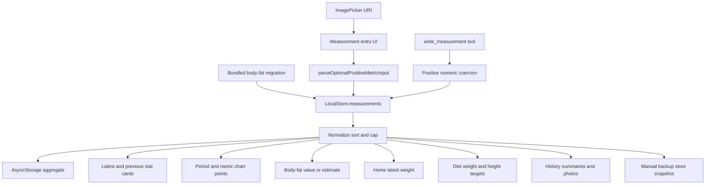
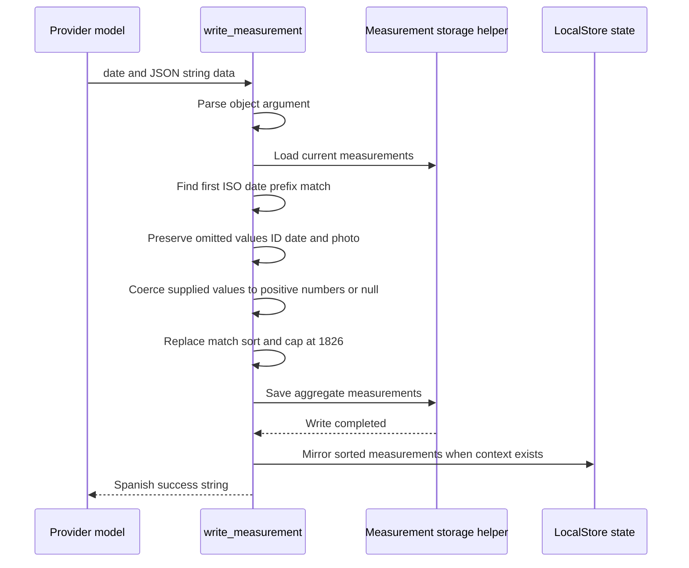

---
okf:
  version: 1
  kind: code-wiki
  status: grounded
  scope: Measurement model, UI and agent writes, body-fat estimation, dashboard derivations, photos, persistence, and consumers in apps/mobile
type: concepto
title: Mediciones
description: Esquema canónico y ciclo de vida de las mediciones, incluidos la validación, los upserts, la grasa corporal derivada y los gráficos, los consumidores entre dominios, el comportamiento de las copias de seguridad, los fallos y las pruebas.
summary: Canonical measurement schema and lifecycle, including validation, upserts, derived body fat and charts, cross-domain consumers, backup behavior, failures, and tests.
tags: [mobile, measurements, body-fat, charts, agent-tools, diet]
sources:
  - apps/mobile/App.tsx
  - apps/mobile/agent/toolDefinitions.ts
  - apps/mobile/agent/toolExecutor.ts
  - apps/mobile/agent/toolDefinitions.test.ts
  - apps/mobile/agent/toolExecutor.test.ts
  - apps/mobile/package.json
  - apps/mobile/vitest.config.mts
related:
  - ./local-state-and-backup.md
  - ./diet-and-food-estimation.md
  - ./application-shell.md
  - ../agent/runtime.md
  - ../agent/provider-streaming.md
  - ../operations/build-release-and-testing.md
---

# Mediciones

Las mediciones son registros dentro de `LocalStore.measurements`, consumidos por el panel de Mediciones, Inicio, los cálculos de objetivos de dieta, los resúmenes del historial, las herramientas del agente y la copia de seguridad manual. La IU y el agente comparten la estructura persistida y las reglas de ordenación/límite, pero **no** tienen una semántica de escritura idéntica. Los mecanismos de persistencia y copia de seguridad se detallan en [Estado local y copia de seguridad](./local-state-and-backup.md); las fórmulas nutricionales posteriores se detallan en [Dieta y estimación de alimentos](./diet-and-food-estimation.md).

## Esquema canónico

`App.tsx::Measurement` y `agent/toolExecutor.ts::ToolMeasurement` son estructuralmente equivalentes:

| Campo | Tipo | Significado y restricciones |
|---|---|---|
| `id` | `string` | Identidad estable del registro. Las ediciones de la IU reemplazan por ID; los upserts por fecha del agente conservan el ID coincidente. La hidratación genera uno si falta. Se presupone la unicidad, pero no se comprueba. |
| `measured_at` | `string` | Marca de tiempo ISO. Las fechas seleccionadas en la IU se normalizan al mediodía local y luego se convierten a ISO. Las fechas creadas por el agente usan `new Date(date + "T12:00:00").toISOString()`. La hidratación reemplaza los valores no válidos por el instante actual. |
| `weight_kg` | `number \| null` | Peso corporal positivo opcional en kilogramos. |
| `body_fat_pct` | `number \| null` | Porcentaje positivo opcional de grasa corporal medido explícitamente. No existe validación de límite superior. |
| `photo_uri` | `string \| null` | URI opcional local del selector/cámara. La hidratación recorta las cadenas no vacías. Las escrituras del agente conservan una foto existente y no pueden crearla ni eliminarla. |
| `neck_cm` | `number \| null` | Circunferencia positiva opcional del cuello. |
| `chest_cm` | `number \| null` | Circunferencia positiva opcional del pecho. |
| `waist_cm` | `number \| null` | Circunferencia positiva opcional de la cintura. |
| `hips_cm` | `number \| null` | Circunferencia positiva opcional de la cadera; necesaria para la estimación derivada de grasa corporal femenina. |
| `biceps_cm` | `number \| null` | Circunferencia positiva opcional del brazo/bíceps. La IU etiqueta esta métrica del gráfico como “Brazo”. |
| `quadriceps_cm` | `number \| null` | Circunferencia positiva opcional del cuádriceps. |
| `calf_cm` | `number \| null` | Circunferencia positiva opcional de la pantorrilla. |
| `height_cm` | `number \| null` | Altura positiva opcional, utilizada directamente y como valor alternativo del nivel de medición más reciente para los cálculos de grasa corporal y dieta. |

La invariante persistida después de `normalizeStore` es el orden de más reciente a más antiguo según `measured_at` y un máximo de **1.826 registros**. Los valores positivos se redondean a dos decimales durante la hidratación y el análisis de la IU; los valores no válidos, no finitos, iguales a cero o negativos se normalizan a `null`. No se aplican rangos fisiológicos: por ejemplo, `body_fat_pct: 500` y `height_cm: 1` se aceptan si son positivos.

El límite aproxima cinco años de datos diarios, pero se basa en registros, no en fechas. Pueden existir varios registros para una misma fecha del calendario, por lo que no garantiza cinco años de cobertura.

## Ciclo de vida de los datos y dependencias



*Leyenda: Tres rutas de escritura basadas en las fuentes alimentan la colección acotada de mediciones, que a su vez impulsa las vistas de grasa corporal, panel, Inicio, dieta, historial, persistencia y copia de seguridad.*

### Hidratación y migración

`normalizeMeasurement(raw, index)` repara cada registro durante `normalizeStore`: genera los ID que faltan, canoniza las fechas a ISO, normaliza cada campo numérico y recorta el URI de la foto. `sortMeasurementsDesc` clona y ordena por marca de tiempo descendente, tras lo cual `normalizeStore` toma los primeros 1.826.

Después de la hidratación, `migrateBodyFatHistory` se ejecuta una vez, salvo que `gymnasia.mobile.body_fat_migration_done` sea igual a `"1"`. Contiene una lista incorporada en el código fuente de porcentajes con fecha. Para cada fecha, rellena `body_fat_pct` solo cuando un registro existente no tiene valor; de lo contrario, crea un registro que solo contiene grasa corporal al mediodía. Nunca sobrescribe un porcentaje existente. Si hay cambios, ordena y escribe las mediciones en el agregado persistido, las refleja en React y, después, establece el marcador. La propia migración no aplica el límite de 1.826. Cualquier error de lectura, escritura o del marcador se ignora silenciosamente, por lo que puede volver a intentarlo en otro inicio y su escritura de estado puede competir con el efecto normal del agregado.

## Rutas de creación, edición, eliminación y fotos de la IU

### Análisis del formulario

`addMeasurementFromSettings` analiza las diez entradas numéricas de forma independiente con `parseOptionalPositiveMetricInput`:

- un valor en blanco significa `null` y es válido;
- un separador decimal con coma se convierte una vez en punto;
- el resultado debe ser finito y mayor que cero;
- los valores aceptados se redondean a dos decimales;
- el primer campo no válido detiene el guardado y establece un error global en español específico del campo.

Se requiere al menos un valor numérico o `measurementPhotoUri`. Esto significa que los registros que solo contienen una foto son válidos, pero un registro completamente vacío no lo es.

### Creación y edición

Un guardado correcto desde la IU construye el registro **completo** a partir del estado actual del formulario. Los registros nuevos reciben `uid("measurement")`; las ediciones conservan `editingMeasurementId`. La fecha seleccionada se fuerza a las 12:00 locales mediante `measurementDateFromSelection` y se convierte a ISO. El actualizador elimina el registro anterior por ID, antepone el reemplazo, ordena de forma descendente, limita a 1.826 y, después, cierra y restablece la pantalla de entrada.

`openMeasurementForEdit` copia todos los campos persistidos al formulario y utiliza la fecha almacenada. Como el guardado es un reemplazo completo, borrar una entrada existente escribe `null` intencionadamente. Se permite cambiar la fecha. La IU no impide que dos registros compartan una fecha del calendario.

`deleteMeasurement(id)` filtra inmediatamente por ID. No hay confirmación, opción de deshacer ni acuse directo de escritura duradera; el efecto ordinario de persistencia del agregado escribe el resultado posteriormente.

### Fotos

`pickMeasurementPhoto` y `takeMeasurementPhoto` solicitan permiso para la biblioteca multimedia o la cámara mediante `expo-image-picker`, usan la selección exclusiva de imágenes con calidad `0.8` y conservan el URI del primer recurso devuelto. La denegación del permiso, la ausencia de URI y las excepciones del selector establecen errores globales en español; la cancelación no hace nada.

La aplicación solo almacena el URI. No copia la imagen a un almacenamiento duradero controlado por la aplicación, no elimina los archivos de imagen cuando se borran los registros ni incorpora los bytes de la imagen en la copia de seguridad. Por tanto, la duración del URI y su portabilidad entre dispositivos se delegan a la plataforma o al proveedor. El historial puede mostrar y ampliar un URI que ya no sea accesible.

## Rutas de lectura y escritura del agente

El catálogo canónico declara:

- `read_measurement({date: string})`
- `write_measurement({date: string, data: string})`

`toolDefinitions.ts` documenta las fechas como `YYYY-MM-DD`, pero el esquema genérico solo exige `string`; no existe un validador de expresión regular/formato. `data` también es una **cadena** JSON, no un esquema de objeto con restricciones sobre las propiedades numéricas.

### `read_measurement`

El controlador requiere una fecha no vacía, carga las mediciones desde `STORAGE_KEY` y devuelve el primer registro cuyo `measured_at.startsWith(date)` coincida. Elimina `id` y `photo_uri` del JSON devuelto. Como las marcas de tiempo ISO son cadenas UTC, la coincidencia por prefijo suele seguir la fecha ISO, que puede diferir de la fecha del calendario local del usuario cerca de los límites de zona horaria. Si existen fechas duplicadas, el almacenamiento de más reciente a más antiguo suele determinar el registro devuelto, pero el propio cargador no ordena.

### `write_measurement`



*Leyenda: El agente realiza un upsert parcial basado en la fecha, escribe primero en el almacenamiento y, después, refleja el resultado en el estado de React.*

El comportamiento del controlador es preciso:

1. Si `date` falta o está vacío, devuelve un mensaje controlado sin escribir.
2. `parseObjectArgument` acepta en tiempo de ejecución una cadena JSON o un objeto. Un JSON roto devuelve `El JSON de medidas no es válido.`; un valor analizado que no sea un objeto, como `[]`, se convierte en `{}` en lugar de producir un error.
3. Carga directamente desde el almacenamiento agregado persistido, busca la primera coincidencia con `startsWith(date)` y conserva el ID, la marca de tiempo y la foto de ese registro.
4. Para cada campo numérico admitido, la omisión conserva un valor existente. Un valor `null` explícito, cero, negativo, no numérico o no finito se convierte en `null`. Las claves desconocidas se ignoran.
5. Un registro nuevo recibe `uid("measurement")` y `new Date(date + "T12:00:00").toISOString()`. Un texto de fecha no válido puede hacer que esta expresión lance una excepción en lugar de devolver un mensaje de validación controlado.
6. Se elimina la coincidencia, el reemplazo se ordena y se limita a 1.826 y, después, se ejecuta `saveMeasurementsToStorage`. A continuación se ejecuta el `setStore` opcional de React.

La descripción de la herramienta dice que los campos omitidos “permanecerán como `null`”, pero la implementación conserva los campos omitidos en un registro existente. La implementación constituye el comportamiento autoritativo.

### Diferencias semánticas entre la IU y el agente

| Aspecto | IU | Herramienta del agente |
|---|---|---|
| Identidad | Edición por ID de registro | Upsert por la primera coincidencia con el prefijo de fecha ISO |
| Fecha duplicada | Puede crear duplicados | Reemplaza un registro coincidente |
| Forma de actualización | Reemplazo completo desde el formulario; los valores en blanco borran valores | Actualización parcial; los valores omitidos se conservan |
| Métrica proporcionada no válida | Rechaza todo el guardado con un error | Convierte esa métrica en `null` e informa de que se realizó correctamente |
| Al menos un valor | Obligatorio; la foto cuenta | No es obligatorio; `{}` puede crear un registro con todos los campos en `null` |
| Validación de fecha | El selector/estado de fecha produce un `Date` | El esquema solo comprueba que sea una cadena; una fecha no válida puede lanzar una excepción |
| Foto | Puede crear, reemplazar o borrar el URI | La foto existente se conserva; no se admite una foto nueva |
| Persistencia | Primero React, efecto posterior | Primero el almacenamiento y, después, reflejo opcional en React |
| Redondeo numérico | Dos decimales en la entrada | Sin redondeo explícito hasta una hidratación posterior |

Estas incoherencias son importantes al ampliar cualquiera de las rutas: compartir una estructura de TypeScript no implica compartir un contrato de comandos.

## Semántica de la grasa corporal

`estimateMeasurementBodyFatPercentage(measurement, fallbackHeightCm, sex)` devuelve primero el valor explícito de `body_fat_pct` sin modificar. Solo si está ausente utiliza las fórmulas de circunferencias de la Marina de los Estados Unidos.

Para usuarios masculinos, con todas las longitudes convertidas de centímetros a pulgadas:

```text
86.01 × log10(waist − neck) − 70.041 × log10(height) + 36.76
```

Requiere altura, cintura, cuello y `waist > neck`.

Para usuarios femeninos:

```text
163.205 × log10(waist + hips − neck) − 97.684 × log10(height) − 78.387
```

Además, requiere cadera y una circunferencia combinada positiva. La altura es `measurement.height_cm` o el valor alternativo proporcionado. Una estimación finita se redondea a un decimal y se limita al intervalo de **3–60 %**; aquí, un porcentaje explícito no se redondea ni se limita. El sexo procede de `store.dietSettings.sex` y, de forma predeterminada, es masculino.

Las bandas de zonas masculinas y femeninas son metadatos de presentación del gráfico de grasa corporal. No validan los datos ni clasifican otras métricas.

## Derivaciones del panel, gráficos, historial, Inicio y dieta

### Tarjetas de valor más reciente/anterior

`resolveMeasurementMetricPair` recorre el arreglo de más reciente a más antiguo y selecciona los dos primeros valores finitos no nulos para un selector; no tienen que proceder de registros adyacentes. La grasa corporal utiliza valores explícitos o estimados. `buildMeasurementStatCard` redondea la diferencia a un decimal:

- sin valor más reciente → “Sin datos”;
- sin valor anterior → “Primer registro”;
- diferencia absoluta inferior a `0.05` después del cálculo → presentación de igualdad;
- el peso, la grasa corporal y la cintura consideran las disminuciones como una mejora;
- el pecho, la cadera, el brazo, el cuello, el cuádriceps y la pantorrilla consideran los aumentos como una mejora.

Estos colores codifican una preferencia simplista de la IU, no una evaluación de salud.

### Gráficos y preferencias

`MEASURES_CHART_METRIC_OPTIONS` admite peso, grasa corporal, pecho, cintura, cadera, bíceps/brazo, cuello, cuádriceps y pantorrilla. La altura y las fotos no tienen una métrica de gráfico. Los períodos son de 30, 90 o 180 días, o todos los datos. El límite es `Date.now() - days × 24h`, una duración móvil en lugar de meses naturales.

Para los gráficos, se eliminan las mediciones sin valor seleccionado y las fechas no válidas, los valores se ordenan de más antiguo a más reciente y los puntos incluyen el ID del registro, una etiqueta localizada de fecha corta, el valor y la marca de tiempo. Los puntos de grasa corporal pueden derivarse con la altura alternativa actual, como se describió anteriormente. `UserPreferences.chartPeriod` y el `chartMetric` opcional persisten por separado de `LocalStore`; la hidratación fusiona superficialmente las preferencias con los valores predeterminados. Un período persistido con formato incorrecto no se valida en tiempo de ejecución antes de asignarlo.

### Resúmenes del historial

`buildMeasurementHistorySummary` emite, en orden:

1. el peso, cuando está presente;
2. la grasa corporal explícita o estimada, cuando está disponible;
3. exactamente uno de los siguientes: cintura; en su defecto, pecho; en su defecto, bíceps; o, en su defecto, “Foto de progreso”.

Si ninguno se aplica, devuelve “Sin medidas numéricas”. Por tanto, un registro puede contener varias circunferencias aunque su línea compacta del historial solo muestre una.

### Consumidores de Inicio y dieta

`latestWeightMeasurement` y `latestHeightMeasurement` seleccionan el primer registro, en orden de más reciente a más antiguo, donde el valor correspondiente no sea nulo. `dashboard.weight` de Inicio es el peso corporal más reciente y su presentación del cambio se deriva del historial de mediciones. Dieta utiliza ese mismo peso más reciente para calcular objetivos y conversiones de gramos por kilogramo. La altura prefiere la altura de la medición más reciente y, después, un valor positivo de `dietSettings.height_cm`; los cálculos de calorías/objetivos de la dieta también consumen la edad, el sexo y los ajustes de actividad externos a este dominio.

La dependencia es unidireccional en tiempo de ejecución: cambiar una medición vuelve a calcular inmediatamente las vistas de Inicio y dieta a partir del estado de React. Ninguna instantánea de objetivos registra qué medición produjo un objetivo histórico. Consulte [Dieta y estimación de alimentos](./diet-and-food-estimation.md) para conocer las fórmulas exactas de macronutrientes y calorías.

## Participación en la persistencia y las copias de seguridad

Las mediciones no se almacenan bajo una clave independiente; son un campo de `gymnasia.mobile.local.v3`. Los cambios normales de la IU persisten mediante el efecto del agregado. En cambio, las herramientas del agente llaman a `loadMeasurementsFromStorage` y `saveMeasurementsToStorage`, que leen, modifican y escriben esa misma clave agregada y, después, actualizan React cuando existe un establecedor de contexto.

La copia de seguridad manual incluye el `LocalStore` normalizado, por lo que participan todos los objetos de medición y sus cadenas `photo_uri`. La importación ejecuta `normalizeStore`, lo que restaura el orden, la normalización positivo/`null` y el límite de 1.826. Los bytes de las imágenes no participan. Para conocer el comportamiento completo de las particiones y la atomicidad, consulte [Estado local y copia de seguridad](./local-state-and-backup.md).

La lectura independiente del almacenamiento por parte del agente introduce un riesgo de estado obsoleto: una mutación reciente de React cuyo efecto agregado no se haya confirmado puede estar ausente de la carga del agente; a la inversa, una persistencia simultánea de todo el almacén puede sobrescribir la escritura exclusiva de mediciones del ayudante. No existe una comprobación de revisión ni una transacción.

## Fallos e invariantes

Las invariantes efectivas del dominio son:

- los registros canónicos hidratados tienen un ID, una marca de tiempo ISO válida, valores numéricos positivos anulables y un URI de foto recortado anulable;
- la colección se ordena de más reciente a más antiguo y las rutas normales de IU/agente/normalización están limitadas a 1.826;
- los registros de la IU contienen al menos una métrica o foto, pero los registros migrados, creados por el agente o importados pueden contener menos;
- la grasa corporal explícita tiene prioridad sobre la grasa corporal derivada;
- las actualizaciones del agente conservan los campos omitidos y las fotos;
- solo la IU controla la captura/selección de fotos;
- las fechas duplicadas son válidas y las lecturas/upserts basados en fechas solo se dirigen a la primera coincidencia.

Comportamiento conocido ante fallos:

- La validación de la IU muestra un error global y no modifica el estado.
- Los fallos del selector/cámara muestran un error global; la cancelación no.
- La persistencia de la IU es asíncrona, por lo que el cierre correcto del formulario no demuestra que exista almacenamiento duradero.
- `saveMeasurementsToStorage` ignora todas las excepciones; por tanto, `write_measurement` puede devolver que se realizó correctamente y actualizar React incluso cuando falle su escritura duradera directa.
- El ayudante de almacenamiento regresa sin escribir si falta la clave agregada principal, de nuevo sin indicar el fallo.
- El JSON mal formado del agente se controla, pero las cadenas de fecha mal formadas y los fallos de dependencias pueden propagar excepciones a través del ejecutor.
- La hidratación reemplaza las fechas no válidas por “ahora”, lo que puede mover registros históricos dañados al principio en lugar de rechazarlos.
- La ordenación presupone fechas válidas después de la normalización. Los registros heredados cargados por el agente no se normalizan antes de ordenarlos, salvo que el ordenador inyectado lo haga.
- Los URI de las fotos pueden quedar obsoletos y las copias de seguridad no pueden repararlos.

## Pruebas y comandos

La cobertura automatizada es limitada:

- `toolDefinitions.test.ts` comprueba que el catálogo de herramientas coincida con los controladores, que los tres esquemas de transmisión de los proveedores se deriven de las mismas definiciones canónicas, que se informen la ausencia de `date`/`data` y los tipos incorrectos de nivel superior, y que 1.000 entradas arbitrarias sembradas nunca hagan que `validateToolInput` lance una excepción.
- `toolExecutor.test.ts` comprueba que el JSON mal formado pasado a `write_measurement` devuelva una cadena controlada y no llame a `saveMeasurements`.
- Actualmente ninguna prueba comprueba la creación/actualización correcta de mediciones, la conservación de campos/fotos omitidos, la conversión de valores numéricos a nulos, el comportamiento de las fechas, el comportamiento de ordenación/límite, la validación/edición/eliminación de la IU, las fórmulas de grasa corporal, la derivación de gráficos, la migración, las condiciones de carrera de persistencia ni el comportamiento de copias de seguridad/fotos.
- Vitest solo incluye `agent/**/*.test.ts`; los ayudantes de IU de `App.tsx` no tienen cobertura directa. Los scripts de Playwright se centran en el chat del agente y el entrenamiento, no en Mediciones.

Ejecute las comprobaciones deterministas desde la raíz del repositorio:

```bash
npm test
npm --workspace apps/mobile run test:deterministic
npx vitest run --config apps/mobile/vitest.config.mts apps/mobile/agent/toolDefinitions.test.ts apps/mobile/agent/toolExecutor.test.ts
npx tsc --noEmit -p apps/mobile/tsconfig.json
```

Para la validación manual de la IU:

```bash
npm run dev:mobile
npm --workspace apps/mobile run web
```

Pruebe por separado en nativo y web: entradas en blanco, cero, negativas y con coma decimal; registros que solo contengan fotos; edición y borrado de valores; fechas duplicadas; eliminación; requisitos previos de grasa corporal masculina/femenina; porcentaje explícito frente a derivado; cada métrica y período del gráfico; persistencia tras reiniciar; upserts parciales del agente; fechas no válidas del agente; 1.827 registros; exportación/importación; y restauración en otro dispositivo donde el URI de la foto original no esté disponible.

## Procedimiento de ampliación segura

Para añadir una métrica:

1. Añada el campo anulable tanto a `Measurement` como a `ToolMeasurement` con las mismas unidades.
2. Amplíe `normalizeMeasurement`, el estado/restablecimiento/edición/guardado del formulario, el texto del error de validación y la lógica de lista permitida/conservación de `writeMeasurement` del agente.
3. Añada el campo a la descripción de `write_measurement`; si es importante una validación más estricta, evolucione `JsonSchemaProperty` para que `data` pueda ser un objeto tipado en lugar de una cadena JSON opaca.
4. Decida si la métrica pertenece a las tarjetas, el historial, los gráficos, Inicio, la dieta, la estimación de grasa corporal o ninguno. Añada un `MeasuresChartMetricKey` y una opción solo cuando tenga sentido representarla gráficamente.
5. Defina explícitamente la semántica de actualización: reemplazo completo de la IU, parche parcial del agente, comportamiento de fechas duplicadas, borrado con valores nulos, rango, unidades, redondeo y límite.
6. Añada pruebas unitarias específicas para la normalización, el upsert correcto de la herramienta, la semántica de omisión/`null`, las fórmulas, el filtrado por períodos y las fechas duplicadas; añada cobertura de IU para creación/edición/eliminación y permisos.
7. Si añade contenido multimedia, cópielo a un almacenamiento controlado y amplíe la copia de seguridad para transportar bytes o archivos complementarios, no solo URI.

No añada un campo a un único escritor: el esquema duplicado actual es documentación estructural en tiempo de compilación, no un validador compartido en tiempo de ejecución.