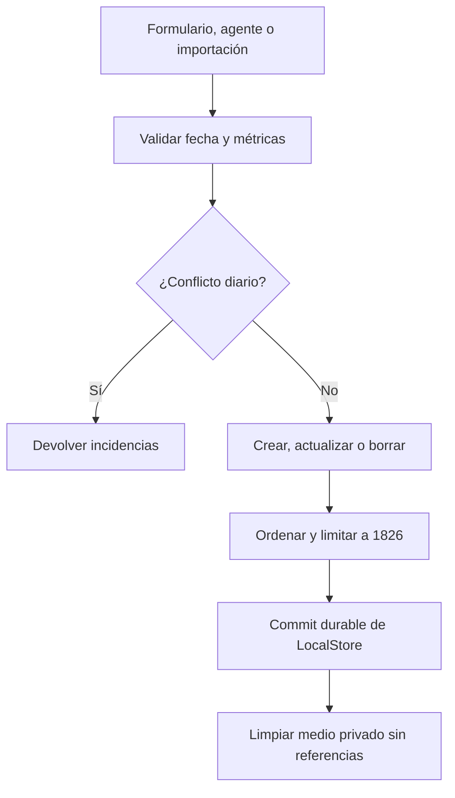
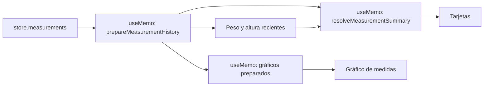

# Mediciones y rendimiento del historial

Las mediciones pertenecen al `LocalStore` local-first y su contrato ejecutable vive en `apps/mobile/measurements/measurementContract.ts`. El mismo módulo normaliza datos persistidos, aplica altas, ediciones y borrados, y construye las proyecciones que consume `App.tsx`: historial ordenado, resumen de tarjetas y series para gráficos. Esta concentración es importante a escala máxima: el historial admite **1.826** registros y la interfaz prepara y ordena el conjunto una vez por cambio real de mediciones, en vez de repetir selectores costosos en cada render.

## Modelo, normalización e invariantes

Una `Measurement` tiene `id`, `measured_on`, `measured_at`, diez métricas anulables y `photo_uri` opcional. Las métricas son `weight_kg`, `body_fat_pct`, cuello, pecho, cintura, cadera, bíceps, cuádriceps, gemelo y altura. El arreglo `MEASUREMENT_METRIC_KEYS` es la lista de autoridad: ampliar el dominio exige añadir la métrica allí, además de la interfaz, el esquema de herramientas del agente y las presentaciones necesarias.

| Aspecto | Regla |
| --- | --- |
| Fecha de calendario | `measured_on` debe ser una fecha real `AAAA-MM-DD` y no puede ser futura. |
| Instante técnico | Una normalización conserva un `measured_at` válido; si falta o es inválido, deriva el mediodía local de la fecha. Al mover una medición, la edición vuelve a fijarlo a ese mediodía. |
| Valores | Son `number | null`; un número debe ser finito y positivo, se redondea a dos decimales y `body_fat_pct` no puede exceder 100. Los textos numéricos, incluida la coma decimal, solo se aceptan en las rutas que solicitan esa compatibilidad. |
| Contenido mínimo | Una medición debe contener alguna métrica o una foto. Para dejarla vacía se usa borrado por `id`, no un reemplazo vacío. |
| Orden y capacidad | La colección se ordena por fecha descendente, luego por instante e `id`, y conserva como máximo `MAX_MEASUREMENTS` (1.826); las mutaciones devuelven también los registros expulsados. |
| Duplicados diarios | Datos heredados con varias entradas del mismo día se preservan para revisión. Un `upsert` en tal fecha falla, y una edición no puede moverse a una fecha ya ocupada. |

La carga es deliberadamente estricta: una entrada que no sea objeto, que tenga fecha inválida/futura o métricas inválidas genera incidencias en vez de inventar datos. Para formatos antiguos puede derivar `measured_on` desde un `measured_at` válido. Esta normalización se aplica antes de que los datos importados entren en el estado activo.



*Las validaciones y los conflictos se resuelven antes del commit; la limpieza de archivos es posterior y oportunista.*

## Escrituras y persistencia

La pantalla convierte los diez controles con el validador del contrato. Al crear, `upsertMeasurementByDate` completa la única entrada del día y conserva métricas no presentes en el parche; al editar, `replaceMeasurementById` reemplaza explícitamente todos los valores del formulario. `deleteMeasurementById` opera sobre la identidad estable.

Antes de mutar, la interfaz puede normalizar una foto. Después usa `commitLocalStoreMutation`: si el commit de almacenamiento falla, la medición no se confirma en React y cualquier archivo nuevo que no tenga referencias se intenta eliminar. Tras un commit válido, compara las URI anteriores y las resultantes para borrar solo los medios privados que ya no use ningún registro. El flujo E2E simula un fallo de `localStorage` y comprueba precisamente que ni el almacenamiento ni los resúmenes cambian en ese caso.

Las herramientas del agente comparten el contrato: sus parches aceptan `data` estructurado y `clear_fields`; conservan campos no incluidos y solo eliminan los solicitados. El analizador rechaza campos desconocidos, un parche vacío o la petición contradictoria de actualizar y borrar la misma métrica. Para los detalles de autorización, ejecución y commits del agente, consulte [Runtime del agente](../agent/runtime.md).

## Una preparación compartida para resúmenes y gráficos

`prepareMeasurementHistory(measurements)` ordena una copia una sola vez y, en el mismo recorrido, localiza las mediciones más recientes con peso y altura válidos. Produce `PreparedMeasurementHistory`, que es la entrada compartida para los cálculos posteriores. `resolveMeasurementSummary` recorre ese historial ordenado y devuelve para cada una de las nueve métricas de presentación el par `{ latest, previous }`.

La selección es por métrica y por día: se toma el primer valor finito del orden estable, y no se mezclan contornos de dos entradas distintas para estimar grasa. Por ello los duplicados heredados no hacen que el resultado dependa del orden de entrada. Para grasa corporal, un valor explícito gana; si falta, se estima con cintura, cuello y altura (y cadera para `female`), o devuelve `null` si faltan requisitos. La estimación se redondea a un decimal y queda entre 3 y 60.

Los gráficos reutilizan el historial preparado mediante `buildPreparedMeasurementChartPoints`. Eliminan duplicados por día, aplican un corte inclusivo de días de calendario y devuelven los puntos en orden cronológico. Los adaptadores públicos que reciben un arreglo sin preparar siguen existiendo, pero preparan internamente el historial y no deben emplearse repetidamente desde el componente raíz.



*La preparación depende solo del arreglo de mediciones; sexo y altura efectiva vuelven a calcular el resumen, no el ordenamiento.*

## Frontera de memoización y coste esperado

En `GymnasiaApp`, `preparedMeasurements` está dentro de `useMemo` con dependencia exclusiva `store.measurements`. `measurementSummary` depende del historial preparado, `latestBodyHeightCm` y `userSex`. Las tarjetas y ambos cálculos de puntos de gráficos se encuentran también en `useMemo`; así, un tick del cronómetro, navegación, scroll, borrador de chat o cambio de periodo visual no debe reordenar ni resumir el historial.

El trabajo funcional de una actualización de mediciones es un ordenamiento y recorridos lineales posteriores. `MeasurementWorkCounters` permite observar preparaciones, ordenamientos, visitas, evaluación de métricas, resúmenes, gráficos y tarjetas sin recopilar valores de salud. No es telemetría: la sonda solo existe si `EXPO_PUBLIC_MEASUREMENT_PERF_TEST=1`, el entorno es `development` y la plataforma es `web`; entonces expone el contador en `globalThis.__GYMNASIA_MEASUREMENT_WORK__`. En producción, staging o plataformas nativas devuelve `undefined` y no crea la global.

## Regresión E2E del historial máximo

`apps/mobile/scripts/measurement-performance.e2e.mjs` construye una exportación web de desarrollo con proveedor falso y la sonda activada. Siembra exactamente 1.826 mediciones en el namespace de almacenamiento de desarrollo, sirve el `dist` exportado y usa Playwright con un viewport móvil.

La prueba espera que la preparación visite todo el historial, valida la tarjeta inicial y fija una línea base de contadores. Después confirma que ticks de cronómetro, completar una serie, navegación, scroll, selección de periodo, envío y descarte de chat no modifican la preparación, ordenamiento, resumen, visitas, evaluaciones ni tarjetas. También verifica las invalidaciones que **sí** corresponden: sexo y altura recalculan el resumen sin preparar de nuevo; alta, edición, borrado, importación, recuperación desde snapshot y borrado total actualizan la interfaz y no retienen un resumen obsoleto. Incluye además un commit fallido para proteger la frontera entre persistencia y cálculo.

Ejecute la protección integral desde la raíz:

```bash
npm run test:measurements:performance:e2e
```

Para iterar en contratos deterministas, ejecute las suites focalizadas y el chequeo estático:

```bash
npx vitest run --config apps/mobile/vitest.config.mts apps/mobile/measurements/measurementContract.test.ts apps/mobile/measurements/measurementSummary.test.ts apps/mobile/measurements/measurementMemoization.contract.test.ts
npm --workspace apps/mobile exec tsc --noEmit
```

La E2E es web y con fixtures: demuestra la dependencia de render, persistencia web y proyecciones de este flujo, no el rendimiento de Android/iOS ni el comportamiento de sus sistemas de archivos.

## Fotos privadas y backup portable

Una foto se normaliza con `normalizeAndStoreMeasurementPhoto`: se reescala si hace falta, se codifica JPEG, se eliminan EXIF, XMP, IPTC y comentarios, se limita a 5 MiB y se calcula SHA-256. En Android/iOS se guarda bajo el directorio documental privado `gymnasia_measurement_media_v1/<sha256>.jpg`; contenido idéntico puede compartir archivo. En web se conserva la URI de sesión, por lo que la aplicación advierte que no puede garantizar persistencia tras cerrar el navegador.

La aplicación elimina fotos privadas solo cuando ya no están referenciadas y realiza barridos oportunistas de huérfanos al arrancar y tras importar. Si la migración de una URI antigua o la limpieza falla, la medición se conserva, se informa cuando corresponde y la aplicación no queda bloqueada.

El respaldo v2 es un ZIP `.gymnasia` con `manifest.json` y JPEG bajo `media/<sha256>.jpg`. Antes de serializar `data.store.measurements`, `withoutPortablePhotoUris` fuerza toda `photo_uri` a `null`; un manifiesto de medios enlaza cada `measurementId` con un asset por hash. Los bytes repetidos se deduplican y la selección prioriza las fotos recientes. Hay límites de 500 enlaces, 5 MiB por archivo, 200 MiB de medios únicos, 8 MiB de manifiesto y 220 MiB de paquete. Una foto ausente, ilegible, inválida o fuera de presupuesto se declara como omisión sin perder la medición numérica.

Al importar, se validan esquema, IDs únicos, límites, rutas internas seguras, enlaces y omisiones no ambiguos. Cada asset se comprueba por tamaño, hash y estructura JPEG; uno defectuoso deja el `photo_uri` de ese registro en `null` y genera una advertencia. En nativo los bytes válidos se guardan otra vez en el directorio privado; la web no puede restaurarlos persistentemente. La importación JSON v1 continúa como ruta de compatibilidad y trata de migrar las URI legadas. Para el ciclo completo de recuperación, exclusiones de datos y borrado, consulte [Estado local, recuperación y backup](./local-state-and-backup.md).

## Cambio seguro y cobertura focalizada

- `measurementContract.test.ts` cubre fechas, métricas, normalización, conflictos, mutaciones, límite, gráficos y estimación.
- `measurementSummary.test.ts` compara el algoritmo preparado con la referencia previa, prueba duplicados/no finitos e impone un ordenamiento y trabajo lineal hasta `MAX_MEASUREMENTS`.
- `measurementMemoization.contract.test.ts` analiza el AST de `App.tsx` para impedir que se pierdan las dependencias reales de los `useMemo` o se reintroduzcan selectores independientes por render.
- `backupFormat.test.ts` y `measurementMedia.test.ts` cubren paquete, hashes, límites, deduplicación, rutas y puente de medios.

Al cambiar una métrica o derivación, preserve primero la semántica de selección por día y actualice los tests de equivalencia. Al tocar la interfaz, no añada un selector que reciba `store.measurements` directamente en el render: reutilice `preparedMeasurements` y declare las dependencias mínimas correctas. Si se modifica la frontera de invalidación o el historial máximo, actualice también la E2E de rendimiento para que distinga explícitamente qué interacciones deben permanecer sin trabajo y qué mutaciones deben invalidar la proyección.
