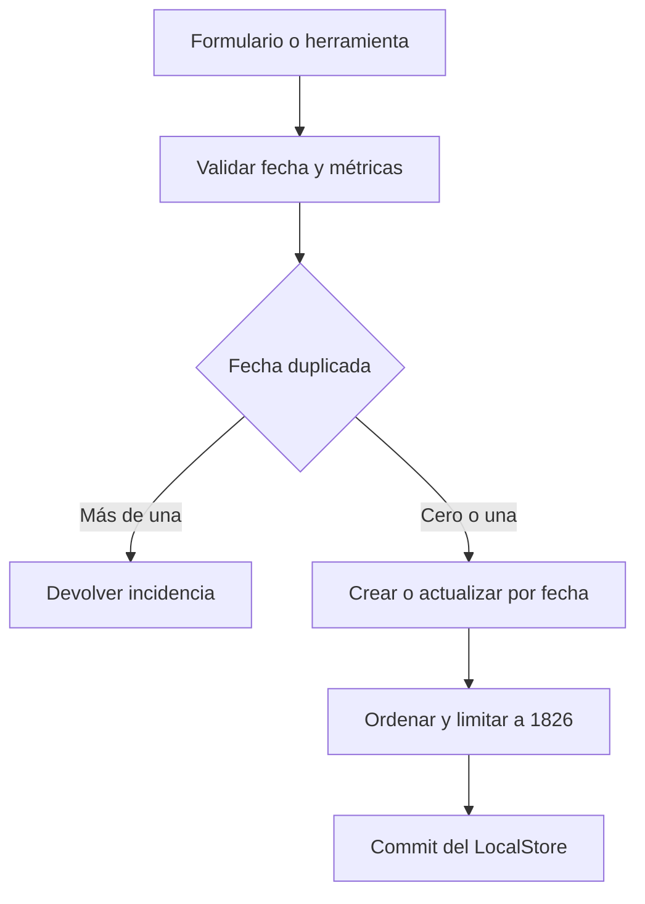
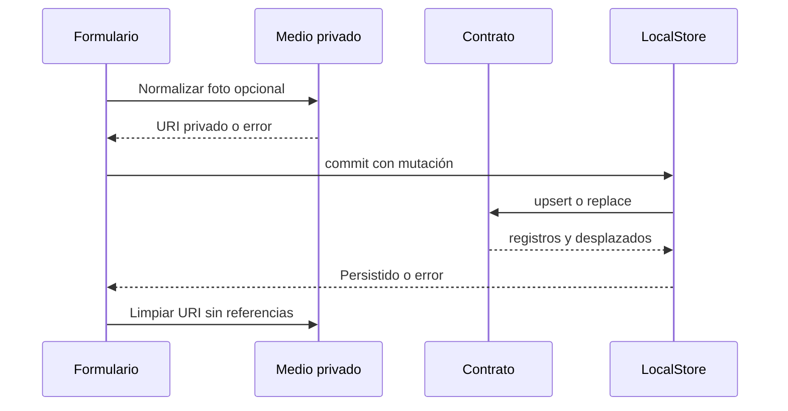
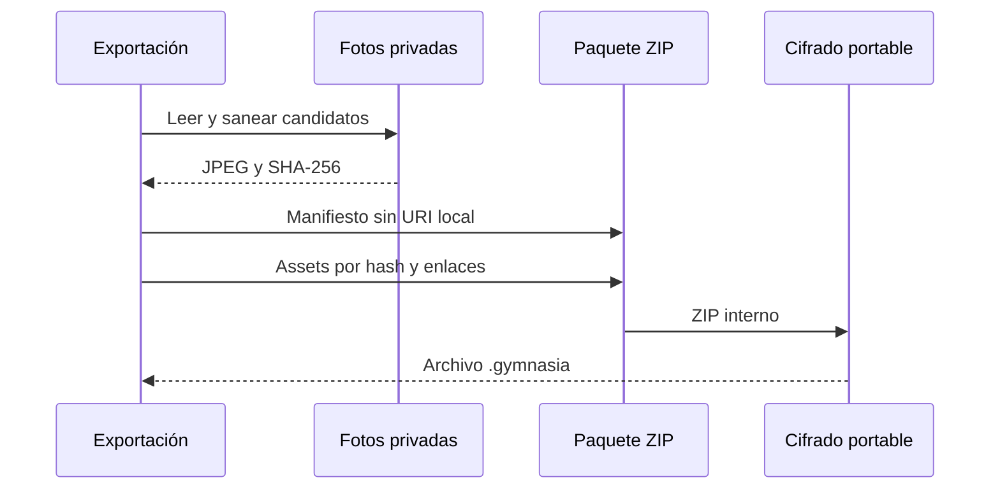

---
okf:
  version: 1
  kind: code-wiki
  status: grounded
  scope: Contrato de mediciones, fotos privadas de progreso y su proyección al paquete de respaldo en apps/mobile
type: concepto
title: Mediciones y fotos de progreso
description: Contrato local de las mediciones móviles, sus fotos privadas y las operaciones del agente que las leen o escriben. Describe la persistencia transaccional, los resúmenes derivados y la copia portable cifrada.
summary: Measurement contract, private progress-photo lifecycle, and portable backup projection.
tags: [mobile, measurements, backup, privacy, media]
related:
  - ./local-state-and-backup.md
  - ./diet-and-food-estimation.md
  - ../agent/runtime.md
sources:
  - id: openwiki-source-ce025f2f0f394ccba9235558
    resource: repo://apps/mobile/agent/toolDefinitions.ts
  - id: openwiki-source-165cffcff462003cd11223e2
    resource: repo://apps/mobile/agent/toolExecutor.test.ts
  - id: openwiki-source-d3be928c369037f29888bc0b
    resource: repo://apps/mobile/agent/toolExecutor.ts
  - id: openwiki-source-929e8e1df23628a3f3848ff8
    resource: repo://apps/mobile/App.tsx
  - id: openwiki-source-e0b23d15e51e3e1d52dd696a
    resource: repo://apps/mobile/backup/backupFormat.ts
  - id: openwiki-source-c13b295e970a1149f0f40cbd
    resource: repo://apps/mobile/backup/measurementMedia.ts
  - id: openwiki-source-8756ebcba5040e69bc188ab4
    resource: repo://apps/mobile/backup/portableEncryption.ts
  - id: openwiki-source-38706b8a9c8db94990f38e34
    resource: repo://apps/mobile/controllers/measurementsController.ts
  - id: openwiki-source-7008ede2c23cd79f4d2e7f43
    resource: repo://apps/mobile/measurements/measurementContract.ts
  - id: openwiki-source-ca9d8aba8612e46df10beb95
    resource: repo://apps/mobile/scripts/measurement-performance.e2e.mjs
verified:
  - by: openwiki/0.5.0
    at: 2026-09-15T14:17:12.687Z
generated: { by: "openwiki/0.5.0", at: "2026-09-15T14:17:12.687Z" }
---

# Mediciones y fotos de progreso

Una medición es un registro local identificado por `id`, con el día de calendario `measured_on`, el instante técnico `measured_at`, diez métricas opcionales y `photo_uri` opcional. `apps/mobile/measurements/measurementContract.ts` es el límite compartido: la interfaz, el agente y la importación deben usarlo para no reinterpretar fechas, métricas, límites ni conflictos heredados. La foto es un recurso privado separado del registro; una copia portable jamás conserva su ruta local.

## Contrato e invariantes

| Parte | Regla efectiva |
|---|---|
| Día e instante | `measured_on` debe ser una fecha real `AAAA-MM-DD` que no sea futura. Si falta en datos heredados se deriva de un `measured_at` válido. Al crear o mover de día se genera `measured_at` al mediodía local; un timestamp válido existente se conserva. |
| Métricas | Las diez claves de `MEASUREMENT_METRIC_KEYS` son `number \| null`: solo números finitos, positivos y redondeados a dos decimales; `body_fat_pct` no puede superar 100. Las cadenas numéricas —incluida coma decimal— se aceptan únicamente en compatibilidad heredada o en la presentación. |
| Contenido | Debe quedar al menos una métrica o una foto. Para retirar el último contenido se elimina el registro por `id`; no se persiste una medición vacía. |
| Colección | La colección se ordena por día descendente, `measured_at` e `id`, y retiene como máximo 1.826 entradas. Las mutaciones devuelven las entradas expulsadas para que el llamador pueda limpiar sus fotos. |
| Duplicados | Pueden existir días repetidos de datos antiguos. Un `upsert` sobre un día ambiguo falla; una edición puede permanecer en su día duplicado, pero no moverse a un día ya ocupado. |

La normalización de una colección no inventa datos: objetos, fechas y métricas inválidos producen incidencias. `upsertMeasurementByDate` es deliberadamente un parche y conserva métricas y foto omitidas del único registro de ese día. `replaceMeasurementById` es la edición completa del formulario y sustituye los valores de la ficha.



*Las validaciones y el conflicto se resuelven antes de mutar; el límite se aplica al resultado ordenado.*

## Interfaz, persistencia y ciclo de fotos

`useMeasurementsRuntime` prepara el historial con `useMemo` dependiente de `store.measurements`; el resumen vuelve a calcularse si cambian el historial, la altura efectiva o el sexo. La altura efectiva prioriza la última altura medida y usa el ajuste de dieta como respaldo. Este diseño evita ordenar y recorrer las mediciones por interacciones no relacionadas.

Al guardar desde el formulario, el controlador valida todas las entradas antes de iniciar la escritura. Si hay foto, primero la normaliza y persiste; después invoca `localStore.commit` para aplicar `upsertMeasurementByDate` o `replaceMeasurementById`. Si el commit falla o el contrato rechaza la mutación, informa el fallo y elimina el archivo recién creado si ya no está referenciado. Tras una edición, borrado o expulsión por límite, solo borra una foto propiedad de la app cuando ninguna medición restante usa el mismo URI.



*La foto se puede generar antes del commit, pero únicamente una referencia persistida conserva su archivo privado.*

`normalizeAndStoreMeasurementPhoto` comprueba dimensiones, reduce el lado mayor a 2048 px, recodifica JPEG con calidad 0,8 y elimina metadatos JPEG. Rechaza resultados vacíos o mayores de 5 MiB y calcula SHA-256 sobre los bytes saneados. En Android e iOS escribe en `Paths.document/gymnasia_measurement_media_v1/<sha256>.jpg`: es un directorio privado y direccionado por contenido, por lo que bytes iguales reutilizan archivo. Un URI ya propio se vuelve a validar y se rechaza si contiene metadatos inesperados. En web conserva el URI de origen como no poseído; por ello no promete persistencia al cerrar el navegador.

Al hidratar, el controlador intenta migrar fotos heredadas al directorio privado en nativo y muestra un aviso si alguna no se puede copiar. Tanto esa migración como una importación ejecutan un barrido oportunista de huérfanos; sus fallos se absorben para no bloquear la aplicación. `clearMeasurementMedia` es la operación explícita que elimina todo el directorio, apropiada para el borrado global de datos, no para eliminar un registro individual.

## Herramientas del agente: lectura, escritura e idempotencia

`read_measurement` valida el día y rechaza un día duplicado antes de responder. Cuando encuentra el registro, elimina `id`, `photo_uri` y `measured_at`; así el modelo recibe solamente día y medidas, sin identidad técnica, ubicación de la foto ni timestamp.

`write_measurement` está declarado como `local_write` y recibe `date`, `data` estructurado y `clear_fields`. Los campos omitidos no se borran; `clear_fields` los lleva explícitamente a `null`. El analizador rechaza claves desconocidas, un parche vacío y actualizar y borrar simultáneamente el mismo campo. La herramienta no puede escribir fotos: esta frontera evita que el agente introduzca URIs o bytes de imágenes en el almacén.

La escritura exige `context.commitStore`, aplica el mismo `upsertMeasurementByDate` dentro del commit y añade un recibo `toolOperationReceipts` para `write_measurement`. Cuando hay `operationId`, el ID creado es determinista (`measurement_op_` más los primeros 24 caracteres), de modo que reintentos de la misma operación no duplican el registro. Solo llama a `markEffectCommitted` después de que el commit termine y no haya error de mutación; una excepción de persistencia se traduce en resultado indeterminado, nunca en éxito.

## Lecturas derivadas y coste

`prepareMeasurementHistory` ordena una vez y localiza la última medición con peso y altura. `resolveMeasurementSummary` recorre ese historial y, por cada métrica, usa como actual y anterior el primer valor finito de días distintos. Los gráficos aplican el mismo criterio de un valor por día, filtran con un intervalo inclusivo de días de calendario y devuelven el orden cronológico. Esto hace estables los resultados ante duplicados heredados y ante el orden de entrada.

El porcentaje explícito de grasa prevalece. Si falta, `estimateMeasurementBodyFatPercentage` usa cintura, cuello y altura (medida o alternativa); para `female` también exige cadera. Si faltan prerrequisitos, las diferencias no son positivas o el cálculo no es finito devuelve `null`; de otro modo redondea a un decimal y restringe el resultado a 3–60. Los contadores de rendimiento solo se habilitan en web de desarrollo con `EXPO_PUBLIC_MEASUREMENT_PERF_TEST=1`: no contienen valores, no persisten ni envían telemetría.

## Copia portable: datos, medios e importación

La exportación actual genera un manifiesto v3 y un ZIP interno con `manifest.json` y entradas `media/<sha256>.jpg`, que luego se cifra en el archivo `.gymnasia`. Antes de crear el manifiesto se sustituyen todos los `photo_uri` de `data.store.measurements` por `null`. `links` relaciona cada `measurementId` con un asset SHA-256 y `omissions` explica una foto no transportada. Se deduplican bytes idénticos y se conservan siempre las métricas aunque una foto falte.



*El vínculo portable es un hash y no una ruta de archivos del dispositivo.*

La selección toma primero las fotos más recientes y limita enlaces a 500, cada archivo a 5 MiB, bytes únicos a 200 MiB y el ZIP a 220 MiB. El parser del manifiesto exige IDs de medición únicos, assets JPEG con hash/ruta/tamaño válidos, enlaces no ambiguos y motivos de omisión conocidos. Durante la lectura, cada entrada admitida se verifica por tamaño, SHA-256 y estructura JPEG antes de ponerse a disposición de la restauración.

Al importar, el prefijo portable actual conduce al descifrado y a la validación de v3; las rutas de compatibilidad siguen aceptando ZIP v2 y JSON v1. Para cada enlace v2/v3, si el asset falta, falla checksum, JPEG o escritura privada, la medición importada recibe `photo_uri: null` y se añade un detalle de advertencia. En web `storeImportedMeasurementPhoto` devuelve `null`, por lo que también advierte que no puede persistir la foto. Solo después de preparar medios se normaliza el almacén importado en modo estricto y se reemplaza el estado; si falla esa validación estructural, el estado actual queda intacto. La importación conserva el journal local de recibos de tools, nunca API keys del respaldo, invalida la memoria cargada, cierra una sesión de entrenamiento activa y barre medios huérfanos.

## Pruebas y operaciones focalizadas

- `measurementContract.test.ts` cubre fechas, métricas, normalización heredada, parches, duplicados, reemplazo, borrado, límite, gráficos y estimación de grasa. `measurementSummary.test.ts` cubre equivalencia, invariancia y trabajo lineal tras ordenar.
- `toolExecutor.test.ts` verifica el contrato estructurado de `write_measurement`, el parche que preserva valores, borrado explícito, rechazo sin persistir y que un fallo de commit no se confirma.
- `measurementMedia.test.ts`, `backupFormat.test.ts` y `portableEncryption.test.ts` cubren saneamiento, límites, deduplicación, manifiestos/enlaces hostiles, medios corruptos, autenticación y compatibilidad. `scripts/measurement-performance.e2e.mjs` siembra 1.826 registros, comprueba que interacciones ajenas no recalculan medidas, y verifica guardar, editar, borrar, importar, recuperar y borrar datos a través de la UI web.

```bash
npx vitest run --config apps/mobile/vitest.config.mts apps/mobile/measurements/measurementContract.test.ts apps/mobile/measurements/measurementSummary.test.ts apps/mobile/measurements/presentationModel.test.ts apps/mobile/agent/toolExecutor.test.ts apps/mobile/backup/backupFormat.test.ts apps/mobile/backup/measurementMedia.test.ts apps/mobile/backup/portableEncryption.test.ts
npx tsc --noEmit -p apps/mobile/tsconfig.json
```
