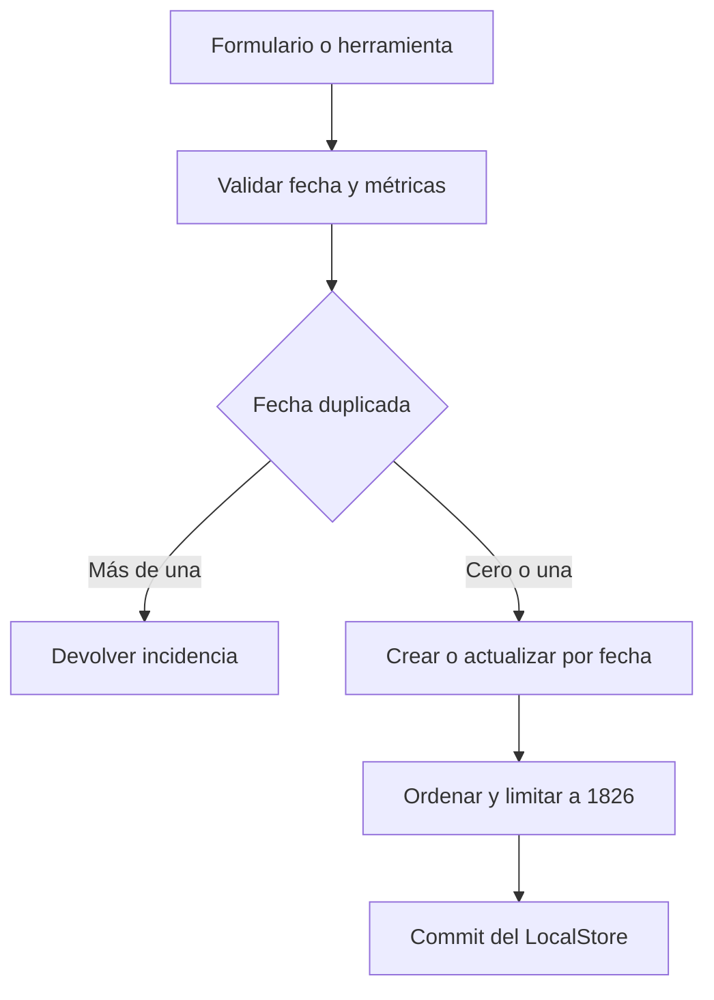
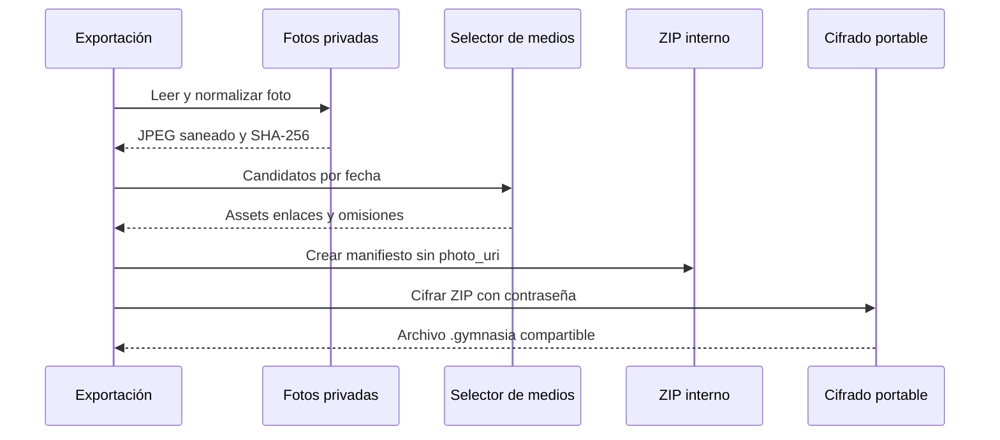

---
okf:
  version: 1
  kind: code-wiki
  status: grounded
  scope: Contrato de mediciones, fotos privadas de progreso y su proyección al paquete de respaldo en apps/mobile
type: concepto
title: Mediciones, fotos de progreso y respaldo
description: Contrato compartido de las mediciones móviles, incluidas sus reglas de fecha, validación y lecturas derivadas. Explica el ciclo de vida de fotos privadas y cómo se exportan e importan en respaldos portables cifrados.
summary: Measurement contract, private progress-photo lifecycle, and portable backup projection.
tags: [mobile, measurements, backup, privacy, media]
related:
  - ./local-state-and-backup.md
  - ./diet-and-food-estimation.md
  - ../agent/runtime.md
sources:
  - id: openwiki-source-ce025f2f0f394ccba9235558
    resource: repo://apps/mobile/agent/toolDefinitions.ts
  - id: openwiki-source-d3be928c369037f29888bc0b
    resource: repo://apps/mobile/agent/toolExecutor.ts
  - id: openwiki-source-929e8e1df23628a3f3848ff8
    resource: repo://apps/mobile/App.tsx
  - id: openwiki-source-e0b23d15e51e3e1d52dd696a
    resource: repo://apps/mobile/backup/backupFormat.ts
  - id: openwiki-source-c13b295e970a1149f0f40cbd
    resource: repo://apps/mobile/backup/measurementMedia.ts
  - id: openwiki-source-8756ebcba5040e69bc188ab4
    resource: repo://apps/mobile/backup/portableEncryption.ts
  - id: openwiki-source-7008ede2c23cd79f4d2e7f43
    resource: repo://apps/mobile/measurements/measurementContract.ts
verified:
  - by: openwiki/0.5.0
    at: 2026-09-13T07:56:37.562Z
generated: { by: "openwiki/0.5.0", at: "2026-09-13T07:56:37.562Z" }
---

# Mediciones, fotos de progreso y respaldo

Una medición es un registro identificado por `id`, con una fecha de calendario (`measured_on`), un instante técnico (`measured_at`), diez métricas opcionales y una foto opcional. `apps/mobile/measurements/measurementContract.ts` es el límite compartido para validar, mutar y derivar datos: la interfaz, el agente y la importación no deberían reinterpretar fechas, métricas o duplicados. La foto tampoco es solo un URI: se normaliza y, en nativo, queda bajo almacenamiento privado; el respaldo no transporta rutas locales.

## Modelo e invariantes

| Parte | Regla efectiva |
|---|---|
| Fecha | `measured_on` debe ser una fecha real `AAAA-MM-DD` y no futura. Si falta en datos antiguos, se deriva de un `measured_at` válido. Al crear o cambiar de día se usa el mediodía local para `measured_at`; un timestamp válido existente se conserva. |
| Métricas | Las diez claves de `MEASUREMENT_METRIC_KEYS` son `number \| null`. Los números han de ser finitos y positivos, se redondean a dos decimales y `body_fat_pct` no supera 100. Las cadenas numéricas, incluida la coma decimal, solo se admiten donde se pide compatibilidad heredada. |
| Contenido | Una medición ha de tener al menos una métrica no nula o una foto. Para retirar el último contenido hay que borrar el registro por `id`, no escribir un registro vacío. |
| Colección | Se ordena por día descendente, después por `measured_at` e `id`, y conserva como máximo 1.826 registros. Las mutaciones devuelven los registros desplazados por ese límite. |
| Duplicados | Los datos heredados pueden conservar varios registros del mismo día y el contrato los detecta. Un `upsert` en un día ambiguo falla; una edición puede mantenerse en su día duplicado, pero no trasladarse a un día ocupado. |

La normalización de una colección es deliberadamente estricta: una entrada que no sea objeto, una fecha inválida o futura, o una métrica inválida genera incidencias en vez de inventar datos. En cambio, `upsertMeasurementByDate` es un parche: cuando hay exactamente un registro para la fecha, mantiene las métricas y la foto omitidas. `replaceMeasurementById` es el mecanismo de edición completa y reemplaza todos los valores del formulario.



*Las entradas se validan y resuelven antes de la mutación; el límite se aplica al resultado ordenado.*

## Escritura y lectura por el agente

La interfaz y el agente comparten el contrato. `read_measurement` valida la fecha y rechaza primero un día duplicado; su respuesta elimina `id`, `photo_uri` y `measured_at`, por lo que no expone esa identidad técnica ni la ubicación de la foto. `write_measurement` declara un objeto `data` con las métricas admitidas y `clear_fields`; los campos no incluidos permanecen y solo los solicitados explícitamente se llevan a `null`. El analizador también rechaza campos desconocidos, un parche vacío y el intento de actualizar y borrar a la vez el mismo campo.

El ejecutor aplica el parche mediante `context.commitStore`, no con una actualización local directa. En la aplicación ese callback se adapta a `useLocalStoreRuntime().commit`, por lo que la herramienta entra por el mismo límite de persistencia del almacén. Si no hay un committer o la mutación informa un conflicto, devuelve un error y no marca el efecto como confirmado. Al añadir una métrica hay que actualizar tanto `MEASUREMENT_METRIC_KEYS` como el esquema de `write_measurement`; de otro modo el contrato rechazará el campo.

## Lecturas derivadas y coste

Los selectores preparan una historia ordenada una sola vez y, para cada métrica, toman el primer valor finito de cada fecha. Así el peso, altura, pares actual/anterior y puntos de gráfico no dependen del orden de entrada aun cuando haya duplicados heredados. Los gráficos usan un intervalo inclusivo de días de calendario y devuelven los puntos en orden cronológico.

El porcentaje de grasa explícito prevalece. Si falta, `estimateMeasurementBodyFatPercentage` calcula una estimación con cintura, cuello y altura —propia o alternativa—; para `female` necesita además cadera. Si faltan prerrequisitos o las diferencias no son positivas devuelve `null`; el resultado se redondea a un decimal y queda entre 3 y 60. La preparación y el resumen recorren la colección linealmente después de una ordenación, un comportamiento cubierto por pruebas de coste y equivalencia.

## Fotos privadas: normalización y limpieza

`normalizeAndStoreMeasurementPhoto` verifica dimensiones, reduce el lado mayor a 2048 px, vuelve a codificar JPEG con calidad 0,8 y elimina segmentos EXIF, XMP, IPTC y comentarios. Rechaza bytes vacíos y cualquier resultado que exceda 5 MiB, y calcula SHA-256 sobre los bytes saneados.

En Android e iOS, los bytes se escriben como `Paths.document/gymnasia_measurement_media_v1/<sha256>.jpg`. Es un directorio privado de la aplicación direccionado por contenido: los mismos bytes reutilizan archivo. Si el URI ya pertenece a ese directorio, se verifica que sea JPEG sin metadatos inesperados antes de reutilizarlo. En web el resultado conserva el URI de origen y se marca como no poseído; no hay garantía de restauración persistente.

`deleteOwnedMeasurementPhotoIfUnreferenced` y `sweepOrphanedMeasurementPhotos` son utilidades tolerantes a fallos: solo borran URIs del directorio propiedad de la app que no estén referenciados y capturan errores de archivos. La aplicación invoca el barrido después de aplicar una importación; por ello la limpieza no bloquea una restauración aunque falle. Los llamadores que retiren o sustituyan mediciones deben usar la primera utilidad con las referencias restantes para evitar borrar un archivo compartido o dejar huérfanos.

## Respaldo portable: ZIP interno y envoltorio cifrado

La exportación actual crea un manifiesto de respaldo **v3** y un ZIP interno con `manifest.json` y entradas `media/<sha256>.jpg`; después cifra el ZIP antes de compartir el archivo `.gymnasia`. En el manifiesto, `data.store.measurements` siempre lleva `photo_uri: null`. Las relaciones `links` asocian un `measurementId` a un asset SHA-256, y `omissions` registran por qué no se transportó una foto. Así se preservan las mediciones numéricas sin filtrar rutas privadas y se deduplican bytes idénticos.



*La ruta local termina en el dispositivo: el paquete enlaza bytes por hash y el archivo que se comparte es el ZIP cifrado.*

La selección prioriza las fotos más recientes y limita los enlaces a 500, cada archivo a 5 MiB y los bytes únicos a 200 MiB; el ZIP interno no puede superar 220 MiB. Una foto ausente, ilegible, inválida o fuera de presupuesto se omite sin descartar su medición y la interfaz presenta una advertencia. El manifiesto valida IDs de medición únicos, rutas internas `media/<hash>.jpg`, hashes, tamaños, límites, enlaces no ambiguos y motivos de omisión conocidos.

El envoltorio portable v3 exige una contraseña de 12 a 128 puntos de código (y como máximo 512 bytes UTF-8). Deriva una clave de 32 bytes con `scrypt` y cifra bloques de 1 MiB con `xchacha20-poly1305`; cada bloque autentica también la cabecera y su índice. La importación comprueba formato, límites y tamaño exacto antes de descifrar, y comunica el mismo error para una contraseña incorrecta o contenido corrupto. Las claves, sal y nonces temporales se sobrescriben al terminar el cifrado o descifrado.

## Importación y compatibilidad

Al elegir un archivo, la aplicación distingue el prefijo cifrado actual de los formatos antiguos. Un respaldo cifrado se descifra con la contraseña y entonces se valida el ZIP y manifiesto v3; también se conserva una ruta explícita para ZIP v2 y para JSON v1. El manifiesto v3 se valida antes de aplicar la importación; cada asset declarado se vuelve a comprobar por tamaño, SHA-256 y estructura JPEG. Los bytes o enlaces que fallen esa comprobación no producen URI: se conserva la medición con `photo_uri: null` y se informa una advertencia.

Los JPEG válidos se guardan de nuevo en el directorio privado nativo, verificando de nuevo su hash. En web `storeImportedMeasurementPhoto` devuelve `null`, por lo que las fotos se notifican como no persistentes. Después se normaliza el almacén importado y se reemplaza el estado; la sesión de entrenamiento activa se cierra para no mezclarla con los nuevos datos y se ejecuta el barrido de medios huérfanos. Si la importación estructural falla, la ruta de aplicación aborta antes de reemplazar el almacén.

## Pruebas relevantes

`measurementContract.test.ts` cubre fechas reales y futuras, redondeo, migración desde timestamp, parches heredados, conflicto de duplicados, edición, borrado, límite, gráficos y estimación de grasa. `measurementSummary.test.ts` añade equivalencia frente a la implementación de referencia, invariancia ante historiales generados y un límite de trabajo para la preparación compartida.

`backupFormat.test.ts` cubre el manifiesto v3, compatibilidad explícita con ZIP v2 y JSON v1, SHA-256, deduplicación, prioridad y presupuestos, saneamiento JPEG, rutas/enlaces maliciosos y la conservación de la medición si el medio está corrupto. `portableEncryption.test.ts` prueba el vector estable, autenticación por bloques, manipulación, truncamiento y contraseñas. Para cambios en estos límites ejecute:

```bash
npx vitest run --config apps/mobile/vitest.config.mts apps/mobile/measurements/measurementContract.test.ts apps/mobile/measurements/measurementSummary.test.ts apps/mobile/backup/backupFormat.test.ts apps/mobile/backup/measurementMedia.test.ts apps/mobile/backup/portableEncryption.test.ts
npx tsc --noEmit -p apps/mobile/tsconfig.json
```
