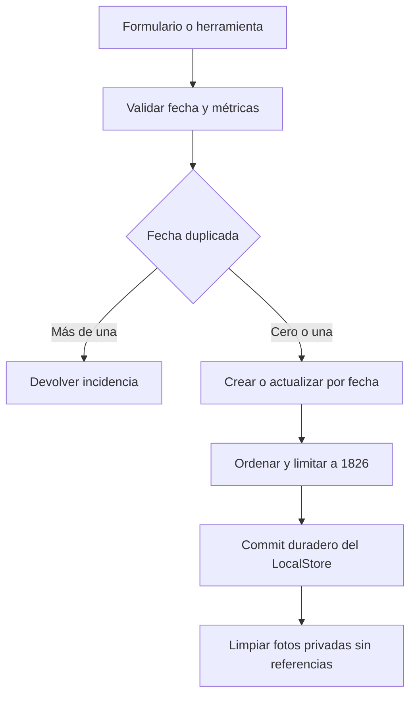
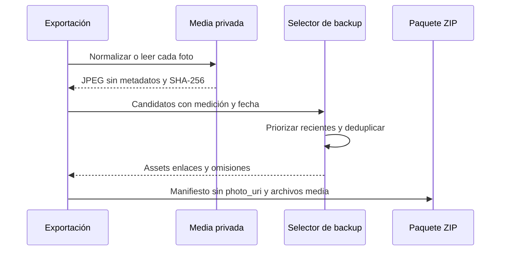

---
okf:
  version: 1
  kind: code-wiki
  status: grounded
  scope: Contrato de mediciones, fotos privadas de progreso y su proyección al paquete de respaldo en apps/mobile
type: concepto
title: Mediciones, fotos de progreso y respaldo
description: Contrato compartido para fechas, métricas y unicidad de las mediciones móviles, junto con el ciclo privado de sus fotos y las reglas para incluirlas —u omitirlas explícitamente— en un respaldo portable.
summary: Measurement contract, private progress-photo lifecycle, and portable backup projection.
tags: [mobile, measurements, backup, privacy, media]
related:
  - ./local-state-and-backup.md
  - ./diet-and-food-estimation.md
  - ../agent/runtime.md
verified:
  - by: openwiki/0.5.0
    at: 2026-09-07T11:37:28.236Z
sources:
  - id: openwiki-source-ce025f2f0f394ccba9235558
    resource: repo://apps/mobile/agent/toolDefinitions.ts
  - id: openwiki-source-d3be928c369037f29888bc0b
    resource: repo://apps/mobile/agent/toolExecutor.ts
  - id: openwiki-source-929e8e1df23628a3f3848ff8
    resource: repo://apps/mobile/App.tsx
  - id: openwiki-source-c369f04b4bd4848feade9def
    resource: repo://apps/mobile/backup/backupFormat.test.ts
  - id: openwiki-source-e0b23d15e51e3e1d52dd696a
    resource: repo://apps/mobile/backup/backupFormat.ts
  - id: openwiki-source-c13b295e970a1149f0f40cbd
    resource: repo://apps/mobile/backup/measurementMedia.ts
  - id: openwiki-source-7008ede2c23cd79f4d2e7f43
    resource: repo://apps/mobile/measurements/measurementContract.ts
generated: { by: "openwiki/0.5.0", at: "2026-09-07T11:37:28.236Z" }
---

# Mediciones, fotos de progreso y respaldo

Una medición une una fecha de calendario (`measured_on`), un instante técnico (`measured_at`), diez métricas opcionales y, opcionalmente, una foto. `measurementContract.ts` es el límite común: la pantalla, las herramientas del agente y la importación deben pasar por él en vez de interpretar fechas, positividad o duplicados por su cuenta. Las fotos no son un simple URI: en nativo se normalizan y se guardan en almacenamiento privado de la aplicación; el respaldo v2 lleva bytes JPEG verificados, no rutas locales.

## Modelo e invariantes

| Parte | Regla efectiva |
|---|---|
| Identidad | `id` identifica el registro para editar, borrar y enlazar su medio en el backup. La importación de un paquete v2 rechaza IDs de medición repetidos. |
| Fecha | `measured_on` debe ser una fecha real `AAAA-MM-DD` y no puede ser futura. `measured_at` se conserva si es una fecha válida; al crear o mover un registro se fija al mediodía local de `measured_on`, para evitar ambigüedades de zona horaria. |
| Métricas | `weight_kg`, `body_fat_pct`, circunferencias y `height_cm` son `number | null`. Los números deben ser finitos, positivos y se redondean a dos decimales; `body_fat_pct` no puede superar 100. Las cadenas numéricas —incluida una coma decimal— solo se aceptan en las rutas que lo solicitan explícitamente. |
| Contenido | Un registro debe contener al menos una métrica no nula o una foto. No se usa `null` para crear un registro vacío: debe borrarse por ID. |
| Colección | Se ordena por `measured_on` descendente, después por `measured_at` y `id`; se conservan como máximo 1.826 registros. |
| Unicidad por día | Los datos heredados pueden contener duplicados y se muestran para su revisión, pero un alta/`upsert` por fecha falla si hay más de uno. Una edición puede conservar su duplicado actual, pero no puede moverlo a una fecha ya ocupada. |

La normalización de una colección es estricta: si una entrada no es objeto, tiene una fecha inválida/futura o una métrica inválida, devuelve incidencias en lugar de inventar una fecha o convertir silenciosamente el registro. Para datos antiguos sin `measured_on`, puede derivarlo de un `measured_at` válido. Las rutas de escritura aplican asimismo el límite y devuelven los registros desplazados, lo que permite limpiar sus fotos si ya no quedan referenciadas.



*Flujo de mutación de una medición: la validación y el conflicto se resuelven antes del commit, y los recursos multimedia huérfanos se eliminan después.*

## Escrituras desde la interfaz y el agente

La interfaz analiza sus diez campos con el mismo validador y exige algún valor o foto. Al crear, `upsertMeasurementByDate` completa la única medición que ya exista ese día —sin borrar métricas omitidas—; al editar, `replaceMeasurementById` reemplaza todos los valores del formulario, por lo que una entrada vacía borra deliberadamente esa métrica. Ambos rechazan dejar el registro vacío. `deleteMeasurementById` elimina por identidad estable.

Las herramientas `read_measurement` y `write_measurement` usan también fechas de calendario, no prefijos de timestamps. La lectura rechaza primero una fecha duplicada y no expone `id`, `photo_uri` ni `measured_at`. La escritura recibe `data` estructurado y `clear_fields`: el parche conserva las métricas no incluidas y solo borra las solicitadas explícitamente. Rechaza campos desconocidos, un parche vacío, una fecha inválida/futura y un conflicto de duplicados. El ejecutor aplica el cambio mediante `commitStore`; en la aplicación esta operación se serializa en una cola, persiste el snapshot antes de actualizar React y propaga un fallo de commit en vez de confirmar una escritura no durable.

El contrato es un punto de extensión obligatorio: al añadir una métrica hay que incorporarla a `MEASUREMENT_METRIC_KEYS`, al esquema de herramienta y a las presentaciones que procedan. De lo contrario, la validación del parche la rechazará y no llegará al almacenamiento.

## Lecturas derivadas

Los selectores eliminan el efecto de duplicados al elegir, para cada día, el primer valor finito según el orden estable. Así, el peso o altura «más reciente», el par actual/anterior y los puntos del gráfico no dependen del orden de entrada del arreglo. Los gráficos aplican un límite inclusivo de días de calendario y se ordenan cronológicamente para representarse.

El porcentaje de grasa corporal explícito prevalece sobre una estimación. Si falta, `estimateMeasurementBodyFatPercentage` usa cintura, cuello y altura —de la medición o altura alternativa— y añade cadera para el caso femenino; devuelve `null` si faltan prerrequisitos, redondea la estimación a un decimal y la acota entre 3 y 60. Estas derivaciones alimentan las vistas de progreso; la altura y peso más recientes también son entradas para el dominio de dieta, descrito en [Dieta y estimación de alimentos](./diet-and-food-estimation.md).

## Privacidad y ciclo de vida de las fotos

Al guardar una foto, `normalizeAndStoreMeasurementPhoto` comprueba dimensiones, reduce el lado mayor a 2048 px si es necesario, la vuelve a codificar como JPEG con calidad 0,8 y elimina metadatos EXIF, XMP, IPTC y comentarios. Rechaza una imagen vacía o que siga excediendo 5 MiB. Calcula SHA-256 sobre los bytes normalizados.

En Android/iOS, la foto queda en `Paths.document/gymnasia_measurement_media_v1/<sha256>.jpg`: un directorio privado de la aplicación y direccionado por contenido. Si los mismos bytes se reutilizan, se comparte el archivo. Las fotos heredadas que apunten fuera del directorio se intentan migrar al arrancar; si no se pueden copiar, la medición no se borra y se avisa al usuario. En web no se puede asegurar almacenamiento persistente: se conserva el URI durante la sesión, pero la aplicación advierte que puede perderse al cerrar el navegador.

Al sustituir, eliminar o expulsar una medición por el límite, se borra una foto privada solo si ningún registro restante usa su URI. Una limpieza adicional al arrancar y tras importar elimina huérfanos. Es limpieza oportunista: un error del sistema de archivos no bloquea la aplicación y podrá reintentarse después.

## Proyección al respaldo portable

El exportador construye un paquete ZIP `.gymnasia` v2 con `manifest.json` y entradas `media/<sha256>.jpg`. El `data.store.measurements` del manifiesto siempre tiene `photo_uri: null`; una relación separada enlaza cada `measurementId` con el asset identificado por SHA-256. Esto evita exportar rutas privadas y permite que varias mediciones apunten a un único archivo de bytes idénticos.



*La exportación separa las rutas locales de los bytes portables y registra tanto los enlaces recuperables como las omisiones.*

La selección prioriza fotos más recientes y admite hasta 500 enlaces, 5 MiB por archivo y 200 MiB de bytes únicos; el ZIP completo no puede superar 220 MiB. Una foto ausente, ilegible, inválida, demasiado grande, fuera del límite de cantidad o fuera del presupuesto total se omite **sin descartar la medición numérica**. La omisión se declara en el manifiesto con su `measurementId` y motivo, y la interfaz informa de ello como advertencia, no como éxito completo.

Al importar v2, el manifiesto valida app, versión, mediciones, IDs, límites, rutas internas seguras, enlaces no ambiguos y motivos de omisión conocidos. Los bytes de cada asset se vuelven a verificar por tamaño, SHA-256 y JPEG válido antes de restaurarlos. Si falla un archivo, el vínculo se restaura como `photo_uri: null`, se informa el detalle y la medición permanece. Los JPEG correctos se guardan otra vez en el directorio privado nativo; en web no se restauran de modo persistente y se notifican como tales. La importación de JSON v1 sigue aceptándose, pero intenta migrar sus URI y puede perder fotos que no sean legibles en el dispositivo receptor.

## Pruebas relevantes

`measurementContract.test.ts` cubre calendario real y fecha futura, redondeo y máximo de grasa corporal, migración desde timestamp válido, compatibilidad del parche JSON heredado, actualización parcial, conflicto de duplicados, edición, borrado, orden/límite, series de gráficos, estimación de grasa y una propiedad de invariancia ante permutaciones.

`backupFormat.test.ts` prueba el paquete v2, verificación SHA-256, eliminación de metadatos JPEG, deduplicación, prioridad y límites, rutas/enlaces maliciosos y la preservación de las mediciones cuando el medio está corrupto. `measurementMedia.test.ts` verifica que el hash entregue un `Uint8Array` contiguo al puente nativo. Para un cambio en estos contratos, ejecute como mínimo:

```bash
npx vitest run --config apps/mobile/vitest.config.mts apps/mobile/measurements/measurementContract.test.ts apps/mobile/backup/backupFormat.test.ts apps/mobile/backup/measurementMedia.test.ts
npx tsc --noEmit -p apps/mobile/tsconfig.json
```
