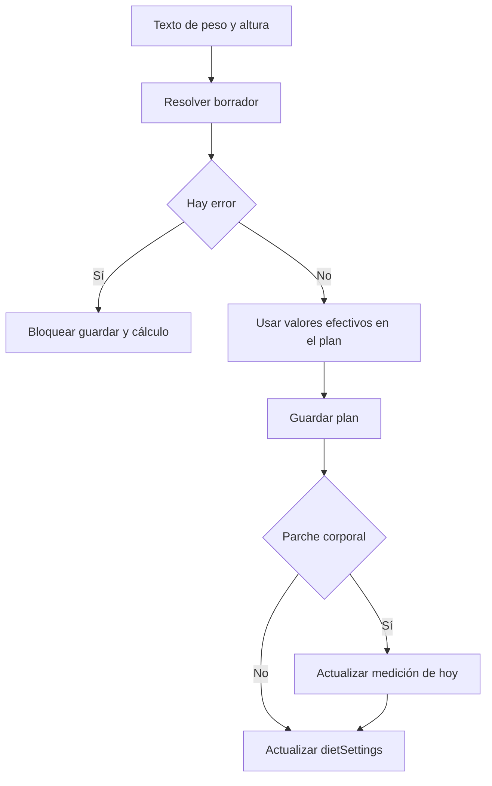

---
okf:
  version: 1
  kind: code-wiki
  status: grounded
  scope: Flujo de borradores, validación, cálculo y persistencia de mediciones corporales en apps/mobile
type: concepto
title: Mediciones y métricas corporales
description: Contrato, ciclo de edición y persistencia de las mediciones corporales móviles. Explica cómo el borrador de peso y altura alimenta el plan de dieta sin crear otra fuente de verdad.
summary: Contrato de mediciones, borradores de peso y altura, controladores de pantalla y persistencia local.
tags: [mobile, measurements, validation, persistence, diet]
related:
  - ./local-state-and-backup.md
  - ./diet-and-food-estimation.md
  - ../agent/runtime.md
sources:
  - id: openwiki-source-ce025f2f0f394ccba9235558
    resource: repo://apps/mobile/agent/toolDefinitions.ts
  - id: openwiki-source-d3be928c369037f29888bc0b
    resource: repo://apps/mobile/agent/toolExecutor.ts
  - id: openwiki-source-929e8e1df23628a3f3848ff8
    resource: repo://apps/mobile/App.tsx
  - id: openwiki-source-38706b8a9c8db94990f38e34
    resource: repo://apps/mobile/controllers/measurementsController.ts
  - id: openwiki-source-f4cb42639b722f40aa5d0429
    resource: repo://apps/mobile/controllers/settingsController.ts
  - id: openwiki-source-48c9220b786189d88056ced7
    resource: repo://apps/mobile/measurements/bodyMetricsDraft.test.ts
  - id: openwiki-source-d6830ce6b989de4f82a65ed4
    resource: repo://apps/mobile/measurements/bodyMetricsDraft.ts
  - id: openwiki-source-7008ede2c23cd79f4d2e7f43
    resource: repo://apps/mobile/measurements/measurementContract.ts
  - id: openwiki-source-2738c54d099fb7a1c8c82e19
    resource: repo://apps/mobile/measurements/measurementSummary.test.ts
verified:
  - by: openwiki/0.6.0
    at: 2026-09-27T17:43:05.548Z
generated: { by: "openwiki/0.6.0", at: "2026-09-27T17:43:05.548Z" }
---

# Mediciones y métricas corporales

`apps/mobile/measurements/measurementContract.ts` es el límite de dominio para el historial: centraliza el formato almacenado, la normalización, las mutaciones y las lecturas derivadas. La pantalla de Medidas, el formulario de dieta y las herramientas del agente convergen en ese contrato y en el `LocalStore`; peso y altura no se duplican dentro de `dietSettings`.

## Registro e invariantes

Una `Measurement` tiene identidad estable (`id`), el día de calendario `measured_on`, el instante técnico `measured_at`, `photo_uri` opcional y diez métricas opcionales: peso, porcentaje de grasa, siete contornos y altura. Una normalización heredada puede derivar `measured_on` desde un `measured_at` válido; si necesita crear o cambiar el instante del día, usa mediodía local para evitar desplazamientos de fecha por zona horaria.

| Invariante | Consecuencia para quien cambia el código |
|---|---|
| Fecha | Debe ser una fecha real `AAAA-MM-DD` y no futura. |
| Métrica | Debe ser finita y positiva; se redondea a dos decimales. `body_fat_pct` además no puede superar 100. Las cadenas con coma o punto decimal solo se habilitan en rutas de entrada compatibles. |
| Contenido | Un registro debe conservar una métrica o una foto. Para quitar el último contenido se borra por `id`; no se persiste una medición vacía. |
| Orden y capacidad | La colección se ordena por día descendente, luego `measured_at` e `id`, y se limita a 1.826 elementos. La mutación informa los elementos desplazados por el límite. |
| Día duplicado | Los duplicados heredados se detectan y pueden editarse en el mismo día para corregirlos. No se puede hacer `upsert` sobre un día ambiguo ni mover una edición a un día ya ocupado. |

`upsertMeasurementByDate` es un parche por fecha: con un único registro existente conserva métricas y foto omitidas. `replaceMeasurementById`, utilizado al editar desde el historial, reemplaza todos los valores del formulario y puede cambiar de fecha solo si no genera conflicto. Ambas rutas vuelven a aplicar validación, contenido mínimo, orden y límite.

## Borrador de peso y altura en el plan de dieta

El plan mantiene texto de edición local en `BodyMetricsDraft` (`weightInput` y `heightInput`), no una segunda copia persistida. `resolveBodyMetricsDraft` analiza ambos valores con `validateMeasurementMetric`, acepta coma decimal, y devuelve simultáneamente:

- valores efectivos para cálculo: valor válido del borrador o, si está vacío, el último valor medido;
- mensajes por campo y `hasIssues` si el texto no es un número positivo válido;
- un `MeasurementPatch` únicamente con valores válidos, no vacíos y distintos del último registro.

Un campo vacío no borra una medición y un campo inválido no se sustituye silenciosamente por el valor anterior: queda efectivo como `null`, marca el problema y no entra en el parche. Esto impide calcular o guardar el plan con datos de cuerpo inválidos, pero permite que macros por kg y el cálculo calórico usen el último dato conocido mientras el borrador está vacío.


```mermaid
flowchart TD
    Draft["Texto de peso y altura"] --> Resolve["Resolver borrador"]
    Resolve --> Invalid{"Hay error"}
    Invalid -->|"Sí"| Block["Bloquear guardar y cálculo"]
    Invalid -->|"No"| Calculate["Usar valores efectivos en el plan"]
    Calculate --> Save["Guardar plan"]
    Save --> Changed{"Parche corporal"}
    Changed -->|"Sí"| Upsert["Actualizar medición de hoy"]
    Changed -->|"No"| Settings["Actualizar dietSettings"]
    Upsert --> Settings
```

*El plan calcula con el borrador resuelto, pero solo persiste peso y altura como medición de hoy cuando hay un cambio válido.*

Al guardar, `useDietSettingsRuntime` primero previsualiza el `upsertMeasurementByDate` contra el almacén actual. Si hay conflicto o error, no actualiza nada y muestra las incidencias. Si pasa, su mutador escribe en una sola actualización tanto `dietSettings` como la colección resultante. Así Home, Medidas, dieta y agente vuelven a leer el mismo historial. El identificador se crea antes del mutador para que una repetición del updater no genere IDs distintos.

## Pantalla de Medidas y persistencia

`App.tsx` instancia `useMeasurementsRuntime` con el runtime del almacén local, servicios de plataforma, preferencias y un generador de IDs, y renderiza `MeasurementsScreen` con el modelo y las acciones del controlador. El runtime prepara el historial una vez por cambio de `store.measurements`; de ahí obtiene el último peso, la última altura y el resumen que consume la pantalla. Si no hay altura medida, usa como alternativa el `height_cm` válido de los ajustes de dieta para cálculos y presentación, sin copiarlo a una medición.

La entrada manual conserva estado efímero para el formulario, fecha, foto, edición y carga. Al guardar:

1. convierte cada texto con `parseOptionalPositiveMetricInput` y rechaza el primer valor inválido;
2. exige por lo menos una métrica o una foto;
3. para una alta aplica el parche por fecha; para edición usa el reemplazo completo por `id`;
4. ejecuta la mutación dentro de `localStore.commit`, devuelve el estado anterior si el contrato falla y solo cierra el formulario después del commit exitoso.

Los selectores de visualización ordenan una vez el historial preparado. Para cada métrica escogen el primer valor finito de cada día, de modo que los duplicados heredados no hacen que tarjetas, último peso o gráficas dependan del orden de entrada. Los gráficos filtran un intervalo inclusivo de días de calendario y presentan los puntos cronológicamente. El porcentaje de grasa explícito tiene prioridad; si falta, se estima con cintura, cuello y altura —y también cadera para `female`—, devuelve `null` cuando faltan prerrequisitos y acota la estimación a 3–60 con un decimal.

## Herramienta del agente

`read_measurement` valida la fecha y rechaza un día duplicado antes de responder. Expone las métricas y `measured_on`, pero elimina `id`, `photo_uri` y `measured_at`. `write_measurement` declara un objeto estructurado de métricas y `clear_fields`: los campos omitidos se conservan, mientras que solo los solicitados para borrar pasan a `null`. El análisis rechaza campos desconocidos, un parche vacío y actualizar y borrar el mismo campo en la misma operación.

El ejecutor vuelve a validar y delega el `upsert` al mismo contrato. Requiere `context.commitStore`; en `App.tsx` ese callback adapta el `ToolStore` a `localStoreRuntime.commit`. Por tanto, el efecto se reconoce como confirmado solo después del commit y la herramienta devuelve un error si no dispone de persistencia durable o la mutación encuentra un conflicto. Al añadir una métrica, actualice `MEASUREMENT_METRIC_KEYS`, el esquema de `write_measurement` y las proyecciones de pantalla para que los límites no diverjan.

## Pruebas focalizadas

- `bodyMetricsDraft.test.ts` verifica coma/punto decimal, vacío como ausencia, rechazo de texto no finito o no positivo, valores efectivos, parche mínimo y preservación de las demás métricas al aplicarlo a hoy. Incluye propiedades con cadenas arbitrarias y números positivos formateados.
- `measurementContract.test.ts` cubre calendario y futuro, redondeo y máximo de grasa, migración heredada, parches del agente, duplicados, reemplazo, borrado, límite y estimación/gráficas.
- `measurementSummary.test.ts` compara resumen y gráficas contra una referencia, prueba historiales permutados y limita el trabajo a una ordenación y recorridos lineales. Sus contadores de rendimiento solo se exponen en web de desarrollo con `EXPO_PUBLIC_MEASUREMENT_PERF_TEST=1`.

Para cambios en el contrato o el borrador, ejecute:

```bash
npx vitest run --config apps/mobile/vitest.config.mts apps/mobile/measurements/bodyMetricsDraft.test.ts apps/mobile/measurements/measurementContract.test.ts apps/mobile/measurements/measurementSummary.test.ts
npx tsc --noEmit -p apps/mobile/tsconfig.json
```
