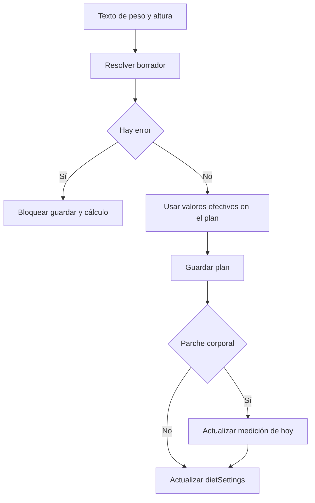
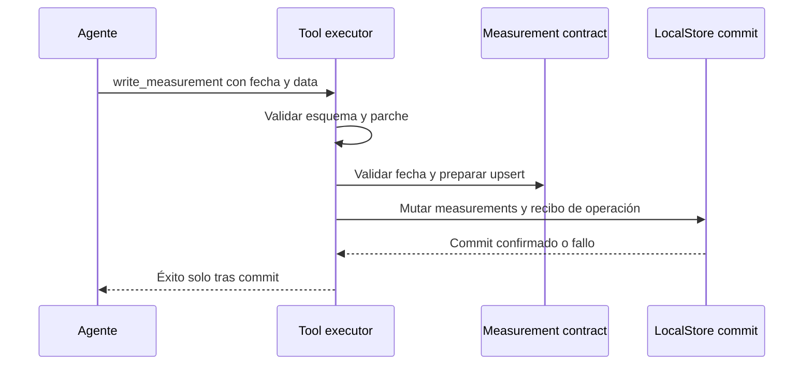

# Mediciones corporales

`apps/mobile/measurements/measurementContract.ts` es el límite de dominio del historial. Pantalla de Medidas, plan de dieta y herramientas del agente deben pasar por sus validaciones y mutaciones; así, peso y altura no tienen una segunda fuente persistida dentro de `dietSettings`. La colección vive en el almacén local de la app y puede contener fotos, por lo que sus datos y URIs deben tratarse como información personal local.

## Modelo e invariantes del historial

Una `Measurement` tiene `id`, el día de calendario `measured_on`, el instante técnico `measured_at`, `photo_uri` opcional y diez métricas opcionales: peso, porcentaje de grasa, cuello, pecho, cintura, cadera, bíceps, cuádriceps, gemelo y altura. Durante la normalización de datos heredados se puede derivar `measured_on` de un `measured_at` válido; cuando hay que crear el instante de un día, se emplea el mediodía local para que la zona horaria no desplace la fecha.

| Invariante | Efecto seguro |
|---|---|
| Fecha | Debe existir y usar `AAAA-MM-DD`; no puede ser futura. |
| Métrica | Debe ser finita y positiva, se redondea a dos decimales y `body_fat_pct` no puede superar 100. Las rutas que reciben texto pueden habilitar coma o punto decimal. |
| Contenido | Un registro debe conservar alguna métrica o una foto. No se persiste una medición vacía: para quitar el último contenido hay que eliminarla por `id`. |
| Orden y capacidad | Se ordena por día descendente, después por `measured_at` e `id`, y se conservan como máximo 1.826 registros; la mutación informa los desplazados por el límite. |
| Duplicados | Un historial heredado puede contener varios registros del mismo día y los detecta para revisión, pero no admite `upsert` en un día ambiguo ni mover una edición a un día ya ocupado. |

Hay dos semánticas de escritura deliberadamente distintas:

- `upsertMeasurementByDate` es un parche por fecha. Con un único registro del día, conserva métricas y foto que no se mencionen.
- `replaceMeasurementById` es la edición explícita del historial: sustituye todos los valores del formulario y permite cambiar la fecha solo sin conflicto.

Ambas rutas vuelven a validar, exigen contenido mínimo, ordenan y aplican el límite. No se debe saltar el contrato editando `measurements` directamente.

## Borrador de peso y altura del plan de dieta

`BodyMetricsDraft` conserva únicamente el texto efímero de `weightInput` y `heightInput`. `resolveBodyMetricsDraft` lo analiza con `validateMeasurementMetric` y produce en una sola resolución los valores efectivos para el cálculo, los mensajes por campo y un `MeasurementPatch` mínimo.

- Un valor válido del borrador prevalece sobre el último medido; uno vacío reutiliza el último valor conocido.
- Un valor inválido no se sustituye silenciosamente: el valor efectivo queda en `null`, marca `hasIssues` y no se incluye en el parche.
- Solo se incluyen valores válidos, no vacíos y diferentes del último registro. Por tanto, borrar el texto no borra una medida existente.


```mermaid
flowchart TD
    Draft["Texto de peso y altura"] --> Resolve["Resolver borrador"]
    Resolve --> Invalid{"Hay error"}
    Invalid -->|"Sí"| Block["Bloquear guardar y cálculo"]
    Invalid -->|"No"| Calculate["Usar valores efectivos en el plan"]
    Calculate --> Save["Guardar plan"]
    Save --> Changed{"Parche corporal"}
    Changed -->|"Sí"| Upsert["Actualizar medición de hoy"]
    Changed -->|"No"| Settings["Actualizar dietSettings"]
    Upsert --> Settings
```

*El plan calcula con el borrador resuelto y solo escribe peso y altura como medición de hoy si existe un cambio válido.*

Al guardar, el runtime de dieta previsualiza el `upsert` contra el almacén actual. Si detecta un conflicto o error, no actualiza nada; si pasa, el mutador guarda conjuntamente `dietSettings` y la colección resultante. El identificador se crea antes del mutador para que una repetición del updater no produzca IDs distintos.

## Pantalla, fotos y commit local

`useMeasurementsRuntime` adapta `LocalStore`, servicios de plataforma, preferencias y la pantalla. Prepara el historial cuando cambia `store.measurements`, obtiene los últimos peso y altura y calcula el resumen. Si no existe altura medida, puede usar un `dietSettings.height_cm` válido como alternativa de lectura, sin copiarlo a una medición.

El formulario manual mantiene estado efímero para textos, fecha, foto, edición y carga. Su guardado sigue este orden:

1. Convierte cada texto con `parseOptionalPositiveMetricInput` y detiene el proceso en el primer valor inválido.
2. Exige por lo menos una métrica o foto.
3. Normaliza una foto nueva a almacenamiento propio antes de mutar; solicita permisos de biblioteca o cámara y no conserva EXIF en la selección.
4. Dentro de `localStore.commit`, aplica `upsertMeasurementByDate` en una alta o `replaceMeasurementById` al editar. Si el contrato falla, devuelve el estado previo.
5. Solo tras el commit exitoso cierra el formulario. Después elimina ficheros de foto propios que ya no estén referenciados; también limpia una foto recién creada si la mutación o el commit fallan.

El controlador migra fotos heredadas a almacenamiento propio tras la hidratación. En web no puede garantizar que sigan disponibles tras cerrar el navegador y muestra un aviso de exportación; un fallo de migración conserva las mediciones y avisa para revisar las fotos antes de exportar.

Para los derivados, el historial preparado elige el primer valor finito de cada día: los duplicados heredados no hacen que tarjetas, último peso o gráficas dependan del orden de entrada. Los gráficos filtran un intervalo inclusivo de días y devuelven puntos cronológicos. El porcentaje de grasa explícito tiene prioridad; en su ausencia, la estimación usa cintura, cuello y altura —más cadera para `female`—, devuelve `null` si faltan prerrequisitos y limita el resultado a 3–60 con un decimal.

## Herramientas del agente

`read_measurement` valida la fecha y rechaza un día duplicado antes de responder. Devuelve `measured_on` y las métricas, pero elimina `id`, `photo_uri` y `measured_at`; no use esta herramienta como acceso a fotos o identidad interna.

`write_measurement` recibe una fecha y un objeto `data` estructurado. Los campos omitidos se conservan y `clear_fields` expresa los borrados solicitados. El esquema y `parseMeasurementToolPatch` rechazan campos desconocidos, valores fuera de rango, parche vacío y pedir actualizar y borrar el mismo campo. El ejecutor vuelve a usar `upsertMeasurementByDate`, por lo que también rechaza fechas inválidas, registros vacíos y duplicados ambiguos.


```mermaid
sequenceDiagram
    participant Agent as Agente
    participant Executor as Tool executor
    participant Contract as Measurement contract
    participant Commit as LocalStore commit
    Agent->>Executor: write_measurement con fecha y data
    Executor->>Executor: Validar esquema y parche
    Executor->>Contract: Validar fecha y preparar upsert
    Executor->>Commit: Mutar measurements y recibo de operación
    Commit-->>Executor: Commit confirmado o fallo
    Executor-->>Agent: Éxito solo tras commit
```

La herramienta exige `context.commitStore`; `App.tsx` lo adapta a `localStoreRuntime.commit`. Si no hay almacenamiento durable no escribe. Antes del commit se construye un ID determinista a partir de `operationId` cuando existe, y el mutador añade un recibo de `write_measurement`; tras un commit correcto marca el efecto como confirmado. Si el commit lanza, se transforma en estado indeterminado, no en una respuesta de éxito. Al extender métricas, actualice conjuntamente `MEASUREMENT_METRIC_KEYS`, el esquema de `write_measurement`, los modelos de presentación y las pruebas para evitar contratos divergentes.

## Pruebas focalizadas y cambio seguro

- `bodyMetricsDraft.test.ts` cubre coma/punto decimal, vacío como ausencia, texto no finito o no positivo, valores efectivos, parche mínimo y preservación de las demás métricas al aplicarlo. Incluye propiedades con cadenas arbitrarias y números positivos formateados.
- `measurementContract.test.ts` cubre calendario, futuro, redondeo, máximo de grasa, migración heredada, parches, duplicados, reemplazo, borrado, límite y estimación/gráficas.
- `measurementSummary.test.ts` compara resumen y gráficas contra una referencia, prueba historiales permutados y verifica una ordenación y recorridos lineales del historial preparado.
- `toolExecutor.test.ts` comprueba que la herramienta completa un registro sin borrar campos omitidos, permite un borrado explícito, no muta ante entrada inválida o duplicados y no comunica éxito cuando falla la persistencia.

Para modificar el contrato, el borrador o el ejecutor, ejecute:

```bash
npx vitest run --config apps/mobile/vitest.config.mts apps/mobile/measurements/bodyMetricsDraft.test.ts apps/mobile/measurements/measurementContract.test.ts apps/mobile/measurements/measurementSummary.test.ts apps/mobile/agent/toolExecutor.test.ts
npx tsc --noEmit -p apps/mobile/tsconfig.json
```
