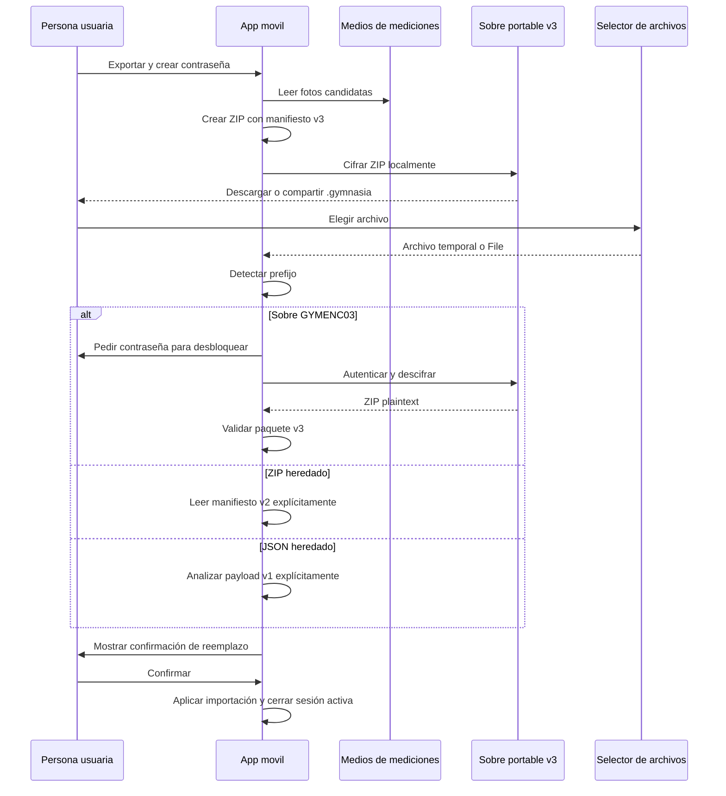
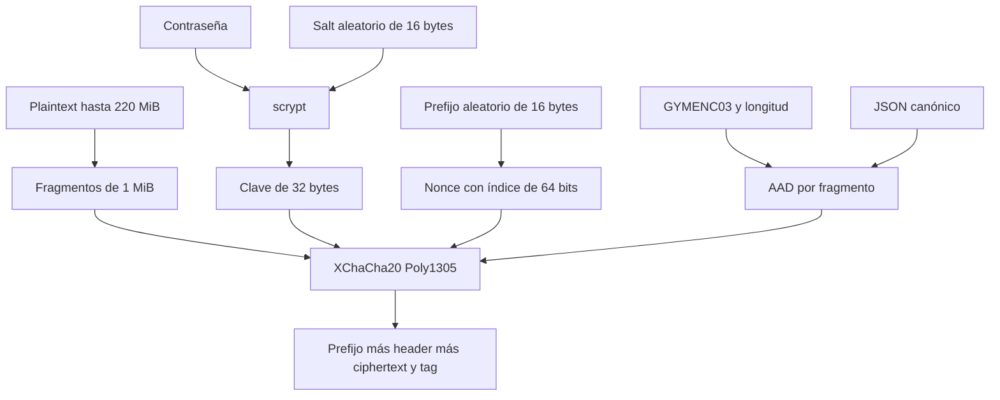

# Cifrado portátil, importación heredada y recuperación local

Gymnasia es local-first: una copia portable la guarda y transporta la persona usuaria, y una cuarentena protege el almacenamiento local que no se puede leer o sustituir con seguridad. Ambos artefactos pueden contener datos de salud, conversaciones y, en web, credenciales de IA; ninguno se envía a un servicio para cifrar, descifrar o recuperar.

Hay que separar dos capas y sus versiones:

- **Sobre portable cifrado v3 (salida actual):** archivo `.gymnasia` con MIME `application/vnd.gymnasia.encrypted`, prefijo `GYMENC03`, KDF y AEAD. Es el contenedor que cifra tanto una copia de usuario como una exportación de cuarentena.
- **Contenido de la copia normal actual:** el plaintext del sobre es un ZIP con `manifest.json` de backup **v3** y JPEG opcionales. No se exporta como ZIP desnudo.
- **Compatibilidad solo de entrada:** JSON de backup **v1** y ZIP con manifiesto **v2**. El importador los identifica y lee en rutas deliberadamente distintas; no son salidas actuales y no tienen el sobre cifrado v3.
- **Exportación de recuperación:** usa el mismo sobre v3, pero su plaintext es JSON `local-store-recovery` de esquema 1, no un backup importable de usuario.

## Recorrido de exportación e importación

La acción de configuración abre `PortablePasswordModal`; la creación exige confirmación de contraseña y el desbloqueo pide una contraseña no vacía. El modal usa entrada secreta, desactiva autocapitalización, autocorrección y autocompletado, y vacía contraseña, confirmación y error local al cerrarse. La política para crear contraseñas es de 12 a 128 puntos de código Unicode y como máximo 512 bytes UTF-8; no recorta espacios. La aplicación advierte que no almacena la contraseña y que perderla hace irrecuperable el archivo.



*La detección por bytes evita depender de extensión o MIME; el reemplazo ocurre solo después de preparar y confirmar una importación pendiente.*

### Salida de usuario

`runBackupExport` proyecta el `LocalStore`, preferencias, alimentos personales y memoria personal, sanea la proyección para no escribir credenciales y cambia todas las `photo_uri` del manifiesto a `null`. Lee las fotos como candidatos y crea un manifiesto v3 con una tabla de assets y enlaces `measurementId`–`assetId`. El ZIP contiene `manifest.json` y, para cada asset elegido, `media/<sha256>.jpg`; las fechas ZIP son fijas para una generación reproducible.

Los bytes idénticos se deduplican por SHA-256 y las candidatas se ordenan de más reciente a más antigua. Las mediciones numéricas siguen en el manifiesto aun si una foto falta, no se puede leer, no es válida o rebasa un límite; el manifiesto registra una omisión. Los límites del plaintext son 500 fotos/enlaces, 5 MiB por JPEG, 200 MiB de medios, 8 MiB de manifiesto y 220 MiB para el ZIP completo. Al crear el paquete, cada asset declarado debe tener bytes presentes y tamaño idéntico al declarado.

En web, el sobre se construye como `Blob` y se descarga; en nativo se escribe por fragmentos en un archivo de caché, se abre el diálogo de compartir y se borra el temporal en `finally`. Tras crear el archivo se actualiza `lastBackupAt`: señala que la app produjo la copia, no que el destino la haya conservado.

### Detección, validación y aplicación

El selector acepta MIME específico, ZIP, JSON, texto y genérico porque los gestores de archivos no garantizan el MIME. Primero lee solo el prefijo: si es `GYMENC03`, conserva temporalmente el origen, pide contraseña y aplica `decryptPortablePayload`. Si no, carga como máximo 220 MiB: una firma ZIP se interpreta **solo** como manifiesto v2 y lo demás se analiza **solo** como payload JSON v1. Así un ZIP v3 sin cifrar no es una entrada normal compatible.

Una entrada v3 se descifra y verifica antes de convertirse en `PendingBackupImport`; el plaintext se pone a cero después de analizarlo. Para ZIP v2 se vuelve a leer y verificar al confirmar. Cancelar la contraseña o la confirmación borra la copia temporal nativa y limpia los buffers pendientes cuando pueden sobrescribirse.

La comprobación ZIP limita la descompresión a entradas permitidas: valida identidad de Gymnasia y versión esperada, mediciones con IDs únicos, lista de medios, rutas exactas `media/<sha256>.jpg`, MIME JPEG, tamaños y presupuesto, hashes, enlaces sin ambigüedad y causas de omisión conocidas. Solo incorpora un JPEG cuyo tamaño y SHA-256 coinciden y cuya estructura es válida; un medio fallido queda fuera, con `photo_uri: null`, sin invalidar sus datos numéricos. En web no hay URI propia persistente para restaurar la foto; también queda en `null`. El JSON v1 conserva sus URI como ruta de migración y trata de normalizarlas en el dispositivo receptor.

La confirmación anuncia que sustituirá todos los datos y que no se puede deshacer. Al aplicarla, la app normaliza estrictamente el agregado antes de publicar el reemplazo, conserva las API keys locales y el `workspace_id` local de Anthropic, y aborta si el commit de configuración de proveedores detecta un cambio concurrente. También conserva el journal local de `toolOperationReceipts`, para que una operación previa ambigua no se repita automáticamente sobre los datos restaurados. Después normaliza preferencias, reemplaza alimentos y memoria, invalida la caché de memoria, cierra la sesión activa y realiza una barrida oportunista de fotos huérfanas. La restauración cruza React, `AsyncStorage`, `SecureStore` y el sistema de archivos: **no es una transacción atómica**; los cambios deben preservar validación previa y comunicar fallos parciales, no prometer rollback.

## Contrato interoperable del sobre v3

El formato es independiente de Expo: `PortableByteSource` aporta tamaño y lecturas por rango, lo que permite descifrar desde `File` web, archivo nativo o descriptor Node sin cargar el ciphertext entero. El writer recibe el plaintext completo, pero genera header y ciphertext por fragmentos de 1 MiB.



*Cada fragmento usa un nonce y AAD derivados de su índice, y el header completo queda autenticado junto con cada fragmento.*

La secuencia de bytes es:

1. ocho bytes mágicos ASCII `GYMENC03`;
2. longitud big-endian de 32 bits del header;
3. header JSON UTF-8 canónico, de 1 a 4096 bytes;
4. ciphertext de cada fragmento seguido por su tag de 16 bytes.

El header tiene exactamente las claves `app`, `type`, `schemaVersion`, `kdf`, `aead` y `plaintextBytes`: `app` es `gymnasia`, `type` es `encrypted-portable`, y `schemaVersion` es 3. `kdf` fija `scrypt` con `N=32768`, `r=8`, `p=3`, salida de 32 bytes y `saltHex` de 16 bytes. `aead` fija `xchacha20-poly1305`, `chunkBytes=1048576` y `noncePrefixHex` de 16 bytes. El nonce final concatena ese prefijo con el índice big-endian de 64 bits; el AAD concatena todos los bytes de prefijo/header con el mismo índice.

El lector exige esas claves exactas, parámetros exactos, hex minúsculo con longitud exacta, `plaintextBytes` entero seguro positivo de hasta 220 MiB y serialización `JSON.stringify` idéntica al header recibido. Calcula el número de fragmentos y exige que el tamaño total sea exacto: no acepta header no canónico, truncamiento ni bytes sobrantes. Solo `unsupported-version` se muestra como necesidad de una app más reciente; cualquier otro fallo estructural, contraseña incorrecta, tag inválido o corrupción se colapsa en `invalid-password-or-corrupt`. Esto evita convertir los mensajes de error en un oráculo sobre el archivo.

`scryptAsync` limita su memoria a 64 MiB y cede periódicamente al runtime. Durante cifrado y descifrado se ponen a cero los buffers de contraseña codificada, clave, salt, prefijo nonce y fragmentos temporales cuando es posible. El descifrado debe reservar un `Uint8Array` del tamaño de plaintext declarado: el fragmentado reduce lecturas y procesamiento de ciphertext, **no** elimina el coste de memoria del plaintext final. El límite de 220 MiB y la comprobación del tamaño del archivo cifrado existen también para acotar esa asignación.

### Límites de seguridad que no cubre

El cifrado autentica confidencialidad e integridad del archivo frente a quien no conoce la contraseña; no recupera una contraseña perdida, no autentica identidad, no sincroniza ni conserva copias, y no protege el plaintext una vez abierto. La UI y la CLI deben evitar registrar contraseña, plaintext o `rawPayload`; los diagnósticos de estructura muestran rutas y códigos saneados, no valores ni nombres de campos desconocidos. Quien cambie parámetros o el orden JSON del sobre debe crear y soportar explícitamente una versión: el lector v3 no negocia variantes de algoritmo.

## Cuarentena local y descifrado seguro

`LocalStoreRecoveryRepository` inspecciona agregado primario, snapshot y cuarentena de forma serializada. Un snapshot aceptable tiene versión 1, payload JSON con forma válida y SHA-256 coincidente. Un primary inválido, ausente pese a snapshot, ilegible o no verificable tras escritura produce/respeta una cuarentena con payload bruto si está disponible, su hash y incidencias saneadas. Una cuarentena válida bloquea commits ordinarios incluso si el primary parece válido tras reiniciar; ello evita escribir encima de los datos que motivaron el bloqueo.

La pantalla de recuperación no hidrata el runtime ni llama a proveedores de IA. Presenta, según disponibilidad, restaurar el último snapshot verificado, guardar la copia dañada protegida, reintentar después de una reparación externa o descartar con confirmación. El reintento es el único recorrido que ignora una cuarentena existente para inspeccionar un primary reparado; si logra un commit verificado, la elimina. Restaurar también la elimina solo tras reescribir y verificar el snapshot. Descartar elimina el agregado, snapshot, cuarentena y claves de sesión dependientes, y crea un estado inicial que conserva la configuración actual de proveedores; no borra las particiones independientes.

La exportación de cuarentena solo se habilita si hay `rawPayload`. Serializa un documento con identidad Gymnasia, `type: "local-store-recovery"`, `schemaVersion: 1`, metadatos de exportación, advertencia de sensibilidad y el registro de cuarentena; lo cifra mediante el mismo flujo de contraseña y sobre v3. No debe enviarse al importador de backups ni tratarse como una copia regular.

### Procedimiento con la CLI

Descifre la exportación únicamente en una máquina y directorio controlados, y trate el JSON resultante como información sensible:

```bash
npm run decrypt:recovery -- --input <archivo.gymnasia> --output <destino.json>
```

La CLI comprueba que entrada y salida sean distintas, que la entrada sea un archivo y no supere el máximo del sobre cifrado, y que el destino no exista. Pide la contraseña en un TTY sin eco; `--password-stdin` está reservado a automatización y no es el procedimiento manual recomendado. Después valida que el plaintext UTF-8 sea JSON con `app: "gymnasia"`, `type: "local-store-recovery"`, esquema 1 y campo `recovery`, antes de crear la salida exclusivamente con modo `0600`. Si una escritura falla, cierra y elimina el parcial; al final borra el buffer plaintext de memoria cuando es posible. La herramienta no repara ni reimporta el contenido: permite inspección o recuperación manual posterior sin sobrescribir el almacenamiento original.

## Cambio seguro y pruebas focalizadas

- Para tocar el envelope, conserve el vector determinista y las pruebas de round-trip por más de un fragmento, alteración, truncamiento, bytes sobrantes y contraseña. `apps/mobile/backup/portableEncryption.test.ts` es la especificación ejecutable del wire format.
- Para tocar paquetes o medios, pruebe producción v3, lectura v1/v2 explícita, límites, deduplicación/prioridad, validación de rutas y enlaces, SHA-256 y que una foto corrupta no descarte la medición. `apps/mobile/backup/backupFormat.test.ts` cubre esas fronteras.
- Para tocar la cuarentena, pruebe que el primary se conserva byte a byte, que snapshot y hash se verifican, que el lock persiste, que la escritura ambigua queda bloqueada y que el descarte no borra datos independientes. La unidad responsable es `apps/mobile/persistence/localStoreRecovery.test.ts`.
- Ejecute la integración web `npm run test:storage-recovery:e2e` al modificar la interfaz, persistencia o exportación de recuperación, y `npm run test:recovery-cli` al cambiar el procedimiento Node. La E2E comprueba que el JSON defectuoso no se sobrescribe, que la exportación se cifra y que el flujo de recuperación no contacta proveedores; no sustituye una prueba en iOS/Android.

Consulte [Estado local, recuperación, borrado y copias](local-state-and-backup.md) para propiedad de particiones y borrado, y [Build, release y estrategia de validación](../operations/build-release-and-testing.md) para la selección de checks y sus límites.
