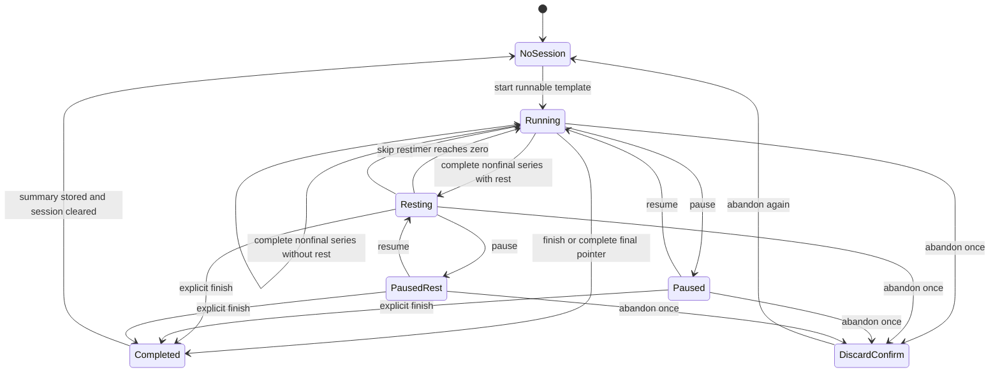
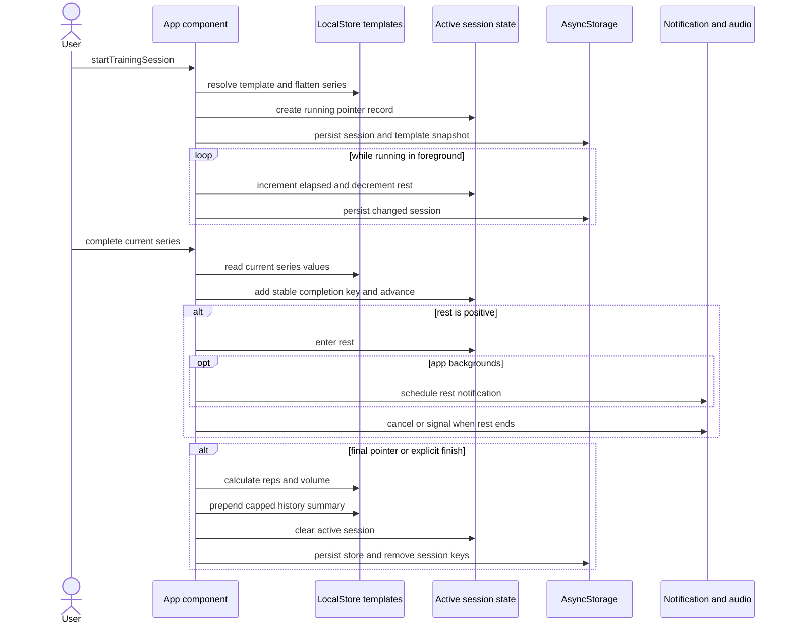

# Plantillas de entrenamiento, sesiones, descanso e historial

El dominio de entrenamiento es un subsistema con prioridad local implementado principalmente dentro de `apps/mobile/App.tsx`. Es responsable de las plantillas de rutinas, los ejercicios y series editables, una sesión activa reanudable, la temporización y las alertas de descanso, el historial de sesiones completadas y las estadísticas por rutina. El agente de chat dispone de una superficie más limitada para leer y crear rutinas en `apps/mobile/agent/toolDefinitions.ts` y `toolExecutor.ts`; no inicia, avanza, finaliza ni elimina sesiones.

Para conocer los límites circundantes de estado y navegación, consulta [Estado local y copia de seguridad](./local-state-and-backup.md) y [Estructura de la aplicación](./application-shell.md). Las reglas de publicación de repositorios y de archivos agregados se encuentran en [Repositorios de contenido](../content/repositories.md), mientras que el comportamiento del bucle de herramientas del agente se encuentra en [Entorno de ejecución del agente](../agent/runtime.md). Las operaciones de compilación y pruebas en navegador se describen en [Compilación, publicación y pruebas](../operations/build-release-and-testing.md).

## Responsabilidad y símbolos principales

| Aspecto | Símbolos del código fuente | Responsabilidad |
|---|---|---|
| Modelo de dominio | `SeriesType`, `SubSeries`, `ExerciseSeries`, `WorkoutTemplate`, `WorkoutSession`, `WorkoutSessionSummary`, `TemplateSeriesPointer` | Formas persistidas de plantillas, sesiones e historial, e identidad estable de los punteros |
| Normalización de plantillas | `buildSeriesFromLegacyExercise`, `seriesToLegacySets`, `normalizeStore`, `resolveTrainingCategory`, `normalizeTemplateIcon` | Migra los `sets` heredados, proporciona valores predeterminados y normaliza la categoría, el icono, la duración y los metadatos de los ejercicios |
| Edición de plantillas | `createTrainingTemplate`, `updateActiveTrainingTemplate`, `addExerciseFromRepo`, `addCustomExerciseFromForm`, controladores de clonación, movimiento y eliminación de series y ejercicios | Modifica el array canónico `LocalStore.templates` |
| Ejecución de sesiones | `startTrainingSession`, `resolveSessionRuntime`, `completeCurrentSessionSeries`, `markSessionSeriesAsDone`, `markSessionSeriesAsNotDone` | Construye y hace avanzar el modelo aplanado de punteros de series |
| Descanso y temporización | efectos de temporizador y `AppState`, `pauseWorkoutSession`, `resumeWorkoutSession`, `skipSessionRest`, auxiliares de notificación y audio | Cuenta el tiempo en primer plano, reconcilia el tiempo en segundo plano y alerta al finalizar el descanso; las preferencias pertenecen a `UserPreferences`, como se documenta en [Estado local y copia de seguridad](./local-state-and-backup.md) |
| Finalización y retención | `finishWorkoutSession`, `summarizeWorkoutSessionPerformance`, `normalizeWorkoutSessionSummary`, `sortWorkoutHistoryDesc` | Crea resúmenes de historial con límite y el estado del modal de finalización |
| Vistas derivadas | `inferTemplateDurationMinutes`, estimadores de calorías, `calculateWorkoutStreak`, `buildHomeWeekProgress`, memorizaciones de estadísticas de entrenamiento | Proporciona estimaciones para listas y detalles, el progreso de Inicio y los gráficos |
| Catálogo de ejercicios | `ExerciseRepoEntry`, `loadExercisesRepo`, `findRepoExerciseMatch`, `getExerciseImageUrl` | Obtiene, almacena en caché, busca y enriquece los ejercicios de las plantillas a partir de `ejercicios/all.json` |
| Interfaz con el agente | definiciones y controladores de `search_exercises`, `read_routines`, `create_routine` | Busca en el catálogo cargado y lee o añade plantillas |

## Contratos de datos

### Jerarquía de plantillas

Un `WorkoutTemplate` tiene un `id` estable, un `name` visible, una categoría, un icono y una duración opcionales, y ejercicios ordenados. `TrainingCategory` puede ser `strength`, `hypertrophy`, `cardio` o `flexibility`; `TrainingFilter`, que solo se usa en listas, añade `all`. Si los datos persistidos de categoría están ausentes o no son válidos, `inferTrainingCategory` clasifica el nombre de la rutina y, si no puede hacerlo, utiliza fuerza de forma predeterminada.

Cada ejercicio tiene su propio `id` estable, metadatos opcionales de nombre, imagen y músculos, un array numérico heredado `sets` y el array canónico opcional `series`. También conserva los resúmenes heredados `load_kg` y `rest_seconds`. Cada modificación de repeticiones, peso o descanso vuelve a calcular `sets` y deriva esos resúmenes heredados del primer valor no vacío de las series.

Un `ExerciseSeries` almacena entradas de texto en lugar de valores numéricos validados:

- `id` estable;
- `SeriesType` opcional: normal, calentamiento, fallo, AMRAP, parcial, negativa, forzada, tempo, isométrica, dropset, rest-pause, myo-reps, clúster o superserie;
- cadenas `reps`, `weight_kg` y `rest_seconds`;
- cadenas opcionales de tempo en tres partes;
- `sub_series` opcionales para tipos compuestos. Una `SubSeries` también puede identificar otro ejercicio mediante su nombre e ID.

En tiempo de ejecución, una `ExerciseSeries` de **nivel superior** se trata como una unidad que puede completarse. No se aplanan ni se completan de manera independiente las `sub_series`.

### Sesión activa

`WorkoutSession` es un pequeño registro de puntero y progreso, en lugar de una copia congelada del entrenamiento. Hace referencia a `template_id`, duplica el nombre y la categoría de la plantilla para mostrarlos, apunta al ejercicio y a la serie actuales mediante índices de array y registra la finalización con claves estables con el formato `exerciseId:seriesId`. También almacena recuentos, segundos transcurridos y de descanso, `started_at` y `status` (`running` o `paused`).

`listTemplateSeriesPointers` aplana la plantilla canónica actual siguiendo el orden de los ejercicios. `resolveSessionRuntime` resuelve el par de índices de vuelta a esa lista. Este diseño permite editar los valores de las series y la estructura del entrenamiento durante una sesión, pero implica que el significado de la sesión depende de que la plantilla siga existiendo.

### Historial completado

`WorkoutSessionSummary` es un agregado inmutable desde el momento de su creación que contiene la identidad y el nombre de la rutina, la marca de tiempo de finalización, los segundos transcurridos, los recuentos de series de nivel superior completadas y totales, las calorías estimadas, las repeticiones totales y el volumen total en kilogramos. El historial se ordena del más reciente al más antiguo y está limitado por `MAX_WORKOUT_HISTORY_ITEMS` a **180** registros, tanto al añadir elementos como durante la hidratación.

El volumen es la suma de `reps × weight_kg` analizados para las claves completadas que aún pueden resolverse en la plantilla actual. Las repeticiones se redondean a números no negativos, el peso es no negativo y las entradas incorrectas o vacías aportan cero. Las calorías son únicamente una estimación basada en la tasa de la categoría aplicada a los minutos transcurridos: 8,8 kcal/min para fuerza, 9,2 para hipertrofia, 10,5 para cardio y 4,5 para flexibilidad, con una estimación mínima de un minuto.

## Ciclo de vida de plantillas y repositorios

1. `createTrainingTemplate` añade inmediatamente una plantilla canónica vacía y la abre en modo de edición. La creación se bloquea mientras haya una sesión activa.
2. El usuario puede añadir un ejercicio del repositorio, un bloque en blanco o un ejercicio personalizado. Los valores predeterminados para fuerza e hipertrofia son 10 repeticiones, 20 kg y 120 segundos de descanso; cardio y flexibilidad no utilizan una carga predeterminada y usan 75 segundos de descanso.
3. Las modificaciones del nombre, la categoría, el icono, la duración, los ejercicios, las series, el tempo, el tipo y las subseries compuestas llaman directamente a `setStore`. Las acciones de clonación, movimiento y eliminación también actualizan el array canónico.
4. `saveTrainingTemplateChanges` se limita a borrar el error y cerrar el modo de edición. La persistencia ya está controlada por el efecto general de `store`; no existe un borrador del editor ni un límite de reversión.
5. Las plantillas pueden clonarse, moverse hacia arriba o eliminarse de la lista de rutinas. Las operaciones de clonación asignan nuevos IDs de plantilla, ejercicio y series de nivel superior.

El contrato del repositorio de ejercicios es `ExerciseRepoEntry`: `id`, `name`, rutas de imágenes masculinas y femeninas, músculos principales y secundarios, equipamiento, dificultad e instrucciones. Después de la hidratación, `loadExercisesRepo` obtiene el recurso `EXERCISES_ALL_URL` sin caché y almacena el array decodificado bajo `gymnasia.mobile.exercises_repo.v2`; si falla la obtención, utiliza esa caché y después un array vacío. El cargador no realiza ninguna validación de la forma de los datos en tiempo de ejecución.

`findRepoExerciseMatch` intenta primero una coincidencia exacta del nombre sin distinguir mayúsculas y minúsculas y, después, una clave tolerante que elimina acentos, signos de puntuación, palabras conectoras en español, una `s` final y el orden de los tokens. Cuando el enriquecimiento posterior a la hidratación tiene éxito, las imágenes del repositorio sustituyen únicamente las imágenes ausentes o alojadas en el repositorio, mientras que se conservan los esquemas URI personalizados; se completan los metadatos de músculos ausentes, pero se conserva el texto de músculos existente. Consulta [Repositorios de contenido](../content/repositories.md) para conocer el contrato de `all.json` y de las rutas de imágenes del lado del productor.

El agente solo expone `search_exercises`, `read_routines` y `create_routine`. `create_routine` añade elementos directamente a `templates`, requiere al menos un ejercicio, solo realiza una coincidencia exacta del repositorio sin distinguir mayúsculas y minúsculas, y acepta la categoría, el icono, el tipo de serie y los valores mediante una cadena JSON. No aplica las enumeraciones declaradas en tiempo de ejecución y no crea datos avanzados de tempo o subseries. Esto es intencionadamente más limitado que el ciclo de vida de la interfaz de usuario; consulta [Entorno de ejecución del agente](../agent/runtime.md).

La creación de ejercicios personalizados llama a `createGitHubExerciseIssue` después de actualizar el estado local, pero la constante compartida `GITHUB_FOOD_ISSUE_TOKEN` está vacía de manera deliberada porque un cliente estático no debe incrustar un token de escritura de GitHub. Por tanto, el auxiliar retorna antes de emitir una solicitud. Actualmente, este enlace de incidencias está deshabilitado y no realiza ninguna operación: la creación de ejercicios personalizados y el guardado automático local normal no esperan la publicación de una incidencia, no dependen de ella ni reciben información de procedencia de dicha publicación.

## Máquina de estados de sesión y descanso

Una sesión solo puede iniciarse cuando no hay una sesión activa, la plantilla existe y puede aplanarse al menos una entrada canónica `series`. Los `sets` heredados sin `series` normalizadas no pueden ejecutarse de forma independiente. El inicio captura una instantánea de la plantilla anterior a la sesión, inicializa el primer puntero y entra en `running` sin descanso.



*Los estados de la sesión activa son proyecciones de `status`, `is_resting` y la interfaz de descarte en dos pasos; `DiscardConfirm` es un estado del componente y no un valor persistido de `WorkoutSessionStatus`.*

Completar el puntero actual añade una sola vez su clave estable. Si existe otro puntero, la sesión avanza hasta él e inicia el descanso según la serie completada. El análisis del descanso acepta segundos, un sufijo `s`, un sufijo `m` o `minutes:seconds`; los valores no válidos y no positivos se convierten en cero. Si el puntero completado es el último del orden aplanado, el código finaliza inmediatamente. El controlador alternativo de lista de comprobación puede marcar cualquier serie como completada, selecciona un puntero sin completar y finaliza cuando su recuento alcanza el total de la sesión. Desmarcar una serie completada cancela el descanso, elimina su clave y enfoca esa serie.

El movimiento del puntero y el enfoque de ejercicios están deshabilitados durante el descanso. Durante la sesión, los usuarios pueden modificar los campos de las series, añadir, eliminar o reordenar series, añadir, reordenar o eliminar ejercicios y crear un ejercicio personalizado. Estas acciones editan la misma plantilla canónica y ajustan o vuelven a normalizar las claves y los recuentos de la sesión. Los controladores de eliminación correspondientes protegen la existencia de al menos un ejercicio y de al menos una serie por ejercicio, aunque otras rutas de modificación y la hidratación siguen requiriendo normalización.

El intervalo de un segundo hace avanzar el tiempo transcurrido solo mientras el estado es `running`; durante el descanso también reduce el tiempo de descanso. Al pasar a segundo plano, la aplicación registra una marca de tiempo en memoria y programa una notificación local para un descanso activo. Al volver a primer plano, añade los segundos de tiempo real y los resta del descanso solo si la sesión sigue en ejecución. Una transición natural del descanso en primer plano cancela la notificación y reproduce la alerta de sonido o vibración seleccionada; una omisión manual suprime esa alerta.

### Preferencias de notificación y efectos exactos

<!-- openwiki: broken internal link [./local-state-and-backup.md#propiedad-de-las-notificaciones] heading anchor "propiedad-de-las-notificaciones" does not exist in "./local-state-and-backup.md". Fix the href or restore the target, then delete this comment. -->
La configuración de notificaciones no forma parte de los datos de plantillas o sesiones de entrenamiento. Se encuentra en `userPrefs.notifications` bajo la clave persistida de forma independiente `gymnasia.mobile.user_prefs.v1`; la copia de seguridad la incluye como `data.userPrefs`. Los valores predeterminados son `{ enabled: true, sound: true, vibrate: true, soundKey: "rest_finished" }`. Ajustes ofrece los sonidos `rest_finished`, `beep`, `bell`, `ascending` y `buzzer`. Consulta [Estructura de la aplicación](./application-shell.md#control-de-la-configuración-de-notificaciones) para conocer la ruta de ajustes y [Estado local y copia de seguridad](./local-state-and-backup.md#propiedad-de-las-notificaciones) para conocer la responsabilidad sobre el almacenamiento, la importación y el restablecimiento.

- `enabled` solo controla la programación de una notificación de fin de descanso en segundo plano. Desactivarlo no deshabilita la alerta de fin natural del descanso dentro de la aplicación: con la aplicación abierta, `playRestFinishedAlert` sigue respetando `sound` y `vibrate`.
- `sound` controla el audio seleccionado en la alerta dentro de la aplicación y establece `content.sound` de la notificación programada en el archivo seleccionado o en `false`.
- `vibrate` controla la vibración `[0, 300, 150, 300]` dentro de la aplicación e incluye u omite la carga útil de vibración de la notificación programada.
- `soundKey` selecciona el archivo incluido para la reproducción dentro de la aplicación y el contenido de la notificación programada. Al seleccionar un tono en Ajustes, el sonido se previsualiza inmediatamente y se activa la vibración de forma incondicional; la previsualización no simula la preferencia `vibrate`.
- Cuando aparece un ID de entrenamiento activo, el efecto de sesión inicializa el audio, solicita permiso para las notificaciones y, en Android, crea el canal `rest_end_alert` con el archivo fijo `rest_finished.wav`, vibración habilitada, importancia máxima, visibilidad pública en la pantalla de bloqueo, luces, insignia y omisión del modo No molestar. Pausar y reanudar la misma sesión no vuelve a ejecutar por sí solo este efecto basado en el ID. Esos valores del canal no se reescriben a partir de `sound`, `vibrate` ni `soundKey`, por lo que el comportamiento del sistema o del canal de Android puede diferir de las preferencias de contenido.
- La programación llama primero a `cancelAllScheduledNotificationsAsync`, lo que afecta a todas las notificaciones programadas por esta aplicación, y después programa una notificación de descanso con fecha. El controlador siempre solicita la presentación de alertas, banners, listas y sonidos en primer plano; el permiso real y las políticas del sistema operativo o del canal siguen siendo externos.
- El control de “alarmas exactas” de Android abre los ajustes del sistema para alarmas exactas y, si no es posible, los ajustes de la aplicación. La aplicación solicita permiso para las notificaciones, pero no bifurca el flujo según el estado de concesión devuelto.

## Secuencia de ejecución y persistencia



*La secuencia muestra la separación real entre los datos canónicos de la plantilla, el estado de la sesión activa persistido por separado y el historial derivado.*

### Límites de almacenamiento

| Clave/ubicación | Contenido de entrenamiento | Ciclo de vida |
|---|---|---|
| `gymnasia.mobile.local.v3` (`STORAGE_KEY`) | `templates` y `workoutHistory` dentro de `LocalStore` | Se normaliza durante la hidratación y se reescribe después de cada cambio del almacén |
| `gymnasia.mobile.training.session.v1` | `WorkoutSession` activa | Se reescribe después de cada cambio del estado de la sesión; se elimina cuando la sesión pasa a ser nula |
| `gymnasia.mobile.training.session_template_snapshot.v1` | `WorkoutTemplate` anterior a la sesión | Se escribe junto con una sesión activa y se elimina cuando esta se borra |
| `gymnasia.mobile.exercises_repo.v2` | `ExerciseRepoEntry[]` almacenado en caché | Se actualiza después de una obtención remota correcta; solo se utiliza como entrada alternativa |
| Carga útil de copia de seguridad manual | `LocalStore`, y por tanto las plantillas y el historial | Se exporta e importa mediante el flujo de copia de seguridad versionado |

La copia de seguridad manual **no** incluye la clave de sesión activa ni su instantánea de plantilla. Al confirmar una importación, `applyPendingImport` llama explícitamente a `setActiveWorkoutSession(null)` después de sustituir las particiones respaldadas. A continuación, el efecto de persistencia de sesión elimina tanto `gymnasia.mobile.training.session.v1` como `gymnasia.mobile.training.session_template_snapshot.v1`; por tanto, la importación finaliza el trabajo en curso en lugar de reconciliarlo con las plantillas importadas. La instantánea tampoco está presente en la carga útil ni se restaura. Consulta [Estado local y copia de seguridad](./local-state-and-backup.md) antes de modificar estos límites.

Al iniciar la aplicación, `normalizeStore` migra cada ejercicio mediante `buildSeriesFromLegacyExercise`, reconstruye los conjuntos heredados, proporciona nombres, categoría, icono y duración, normaliza el historial, lo ordena y aplica el límite de 180 registros. La sesión cargada por separado solo se acepta si la plantilla a la que hace referencia existe y tiene series ejecutables. `normalizeWorkoutSession` filtra las claves de finalización desconocidas, limita los tiempos y recuentos, actualiza el recuento total, el nombre y la categoría a partir de la plantilla, utiliza `running` como valor predeterminado para estados desconocidos y deshabilita el descanso salvo que quede tiempo positivo. El mismo normalizador se ejecuta siempre que cambian las plantillas o la sesión activa; una sesión no válida se cierra automáticamente.

## Finalización, cambios de plantilla y estadísticas

Se puede llegar a `finishWorkoutSession` desde el puntero final o desde la acción explícita de finalización, incluso desde los estados de pausa o descanso y antes de que todas las series estén completadas. Calcula el rendimiento con respecto a la plantilla tal como existe en el momento de finalizar, antepone un resumen, muestra la tarjeta o el modal de “último entrenamiento”, borra la sesión activa y finalmente elimina la persistencia de la sesión.

Una instantánea anterior a la sesión permite realizar una acción posterior a la finalización para restaurar los cambios de la plantilla. Sin embargo, `buildTemplateSeriesSignature` solo compara los IDs de ejercicios junto con el ID, las repeticiones, el peso y el descanso de cada serie de nivel superior. Cuando cambia esa firma, el modal de finalización puede conservar las modificaciones o llamar a `revertWorkoutTemplateChangesAfterSession`. Cerrar el modal conserva las modificaciones canónicas.

El historial por rutina filtra los resúmenes por el `template_id` estable y después por 3, 6 o 12 meses, o por todo el período. Los gráficos muestran volumen, repeticiones o minutos transcurridos y escalan cada barra con respecto al máximo seleccionado. Las derivaciones de Inicio tratan cualquier resumen como un día completado: `calculateWorkoutStreak` permite que hoy o ayer sean el inicio de la racha, y `buildHomeWeekProgress` marca las fechas locales de lunes a domingo. Eliminar una plantilla no elimina su historial, pero esos resúmenes dejan de aparecer en los detalles de una plantilla porque ya no existe una plantilla coincidente que pueda abrirse.

## Invariantes

- Existe como máximo una `activeWorkoutSession`, y el inicio o la creación de otra rutina se bloquean mientras exista.
- Una sesión ejecutable requiere una plantilla activa y al menos una serie canónica de nivel superior.
- La identidad de finalización de un puntero es `exerciseId:seriesId`, no un índice de array; por tanto, las operaciones de reordenación conservan la identidad de finalización.
- `total_series_count` se normaliza según el recuento actual de punteros aplanados. Se espera que los controladores de modificación mantengan válidas las claves completadas y cuenten únicamente las claves existentes.
- Los valores del temporizador y del descanso son enteros no negativos después de normalizar la sesión.
- Las sesiones pausadas no hacen avanzar el intervalo en primer plano ni la reconciliación al volver al primer plano.
- La finalización crea como máximo un resumen mediante la ruta síncrona de la interfaz de sesión activa, y la retención está limitada a 180.
- El historial solo contiene agregados: no conserva la prescripción de ejercicios y series utilizada en ese entrenamiento.
- Las modificaciones de plantillas son canónicas y se guardan automáticamente. “Guardar cambios” es una confirmación de navegación, no la confirmación de una transacción.
- Los datos del repositorio enriquecen las plantillas, pero no sobrescriben una imagen propiedad del usuario ni una etiqueta de músculo existente.

## Riesgos y limitaciones demostrados por el código fuente

1. **La normalización de series avanzadas pierde información.** `buildSeriesFromLegacyExercise` reconstruye las series existentes únicamente con `id`, repeticiones, peso y descanso. Por tanto, cada hidratación mediante `normalizeStore` descarta `type`, los campos de tempo y `sub_series`, aunque el editor, los datos iniciales, el lector del agente y los tipos de TypeScript los admitan.
2. **No existe una semántica de cancelación del editor.** Cada pulsación de tecla y cada acción estructural actualizan `LocalStore`; cerrar, volver atrás y “Guardar cambios” no pueden descartar una sesión de edición. Una plantilla vacía recién creada también queda persistida de inmediato.
3. **Las modificaciones durante la sesión alteran la plantilla reutilizable.** Descartar un entrenamiento borra el estado de la sesión y no genera historial, pero no restaura la instantánea anterior a la sesión. La restauración de la instantánea solo se ofrece después de completar la sesión.
4. **La detección de cambios es incompleta.** La firma de finalización examina la estructura y el orden de los IDs de ejercicios y series, además de las repeticiones, el peso y el descanso de nivel superior, pero ignora los nombres de plantillas y ejercicios, la categoría, el icono, la duración, los metadatos de los ejercicios, el tipo, el tempo y las subseries, así como otros campos ajenos a la firma. Esas modificaciones pueden conservarse sin que `has_template_changes` pase a ser verdadero, por lo que puede que no aparezca la opción de restauración.
5. **El trabajo compuesto solo se contabiliza en el nivel superior.** Los dropsets, clústeres rest-pause, myo-reps y superseries pueden contener miniseries, pero la progresión, el descanso, las repeticiones y el volumen solo utilizan los campos de las series de nivel superior. El trabajo de las subseries no aparece en los totales del historial.
6. **Un puntero final no demuestra una finalización completa.** La navegación manual de punteros puede omitir series anteriores; completar el último puntero aplanado llama a `finishWorkoutSession` incluso cuando el recuento completado es inferior al total. La finalización explícita también registra entrenamientos parciales como historial normal, e Inicio los considera días completados.
7. **El recuento hidratado y el número de claves pueden divergir.** `normalizeWorkoutSession` filtra las claves de finalización, pero confía en un `completed_series_count` persistido finito y lo limita, en lugar de volver a calcularlo a partir de esas claves. Las modificaciones y acciones posteriores de la lista de comprobación suelen corregirlo, pero inicialmente la visualización del progreso puede no coincidir.
8. **La temporización basada en el reloj real no sobrevive a reinicios.** Los segundos de la sesión son instantáneas persistidas. La reconciliación en segundo plano solo utiliza una marca de tiempo almacenada en memoria; la finalización del proceso o el reinicio del dispositivo no permiten añadir el tiempo transcurrido o de descanso que falte a partir de `started_at`.
9. **Un descanso pausado aún puede generar una notificación.** La programación en segundo plano comprueba que haya un descanso activo y segundos restantes, pero no el estado de la sesión. Una sesión pausada durante un descanso puede programar una notificación de fin de descanso aunque la reconciliación al volver al primer plano no reduzca deliberadamente el tiempo mientras está en pausa.
10. **La persistencia es frecuente y no transaccional.** La sesión activa cambia cada segundo mientras está en ejecución y desencadena una escritura asíncrona de la sesión completa. Las escrituras del almacén, la sesión y la instantánea son independientes, y los errores en su mayoría se muestran o se ignoran de forma separada, por lo que un fallo puede dejar generaciones no sincronizadas entre las distintas claves.
11. **La copia de seguridad excluye el trabajo en curso y la importación lo descarta.** Las plantillas y el historial participan en la copia de seguridad, pero la sesión activa y la instantánea no. Una importación confirmada borra explícitamente la sesión activa; a continuación, el efecto protegido de sesión elimina ambas claves de sesión independientes. No existe una fusión, un resumen de finalización ni una recuperación de los cambios de plantilla para ese entrenamiento descartado.
12. **La creación mediante el agente es permisiva y semánticamente más limitada.** El ejecutor convierte los campos JSON sin validar las enumeraciones, utiliza coincidencias exactas con el repositorio, crea `sets` como índices basados en cero en lugar de valores de repeticiones, omite la duración y los campos de series avanzadas, y puede crear ejercicios sin series. Esa plantilla se persiste, pero no puede ejecutarse hasta que se edite.
13. **La alternativa del repositorio no está validada y puede estar desactualizada.** El JSON remoto y el almacenado en caché se convierten directamente. La coincidencia tolerante de nombres puede combinar nombres distintos después de eliminar conectores, singularizar y ordenar tokens; prevalece la primera fila coincidente del repositorio.
14. **El historial no puede volver a calcularse.** Como los resúmenes no contienen la prescripción de ejercicios completada, las correcciones posteriores del análisis, la contabilización de series compuestas o las tasas de calorías no pueden migrar con precisión los totales antiguos.

## Cobertura E2E

`apps/mobile/scripts/train-usability.e2e.mjs` es el recorrido específico de Playwright, expuesto en la raíz del repositorio como:

```bash
npm run test:train:e2e
# Visible browser
npm run test:train:e2e:headed
```

El script restablece los datos locales, verifica el estado vacío de las rutinas, crea una rutina de cardio y un ejercicio personalizado, añade y edita cuatro series, comprueba la interfaz derivada de la duración, ejecuta acciones de clonación, movimiento y eliminación de ejercicios y plantillas, inicia una sesión, completa las cuatro series omitiendo los descansos, observa la interfaz del entrenamiento completado y, después, inicia otra sesión y verifica el flujo de descarte con dos clics. Utiliza de forma predeterminada una ventana gráfica de 390 píxeles, puede usar `TRAIN_E2E_URL`, reutilizar un servidor con `TRAIN_E2E_REUSE_SERVER=1` y guarda `/tmp/train-usability-failure.png` en caso de fallo.

Se trata de un recorrido de usabilidad en navegador, no de un conjunto de pruebas unitarias para las funciones del dominio. No recarga durante una sesión activa, no inspecciona AsyncStorage ni prueba la temporización en segundo plano o mediante AppState, las notificaciones o el audio, la pausa y reanudación, la finalización arbitraria desde la lista de comprobación, la finalización parcial explícita, las series avanzadas, los fallos de obtención o caché del repositorio, los límites del historial o los períodos estadísticos, la interacción de copia de seguridad e importación, las rutinas creadas por el agente ni el comportamiento de conservar o revertir instantáneas. El conjunto determinista de Vitest se centra en los contratos del agente; su cobertura de herramientas de rutinas debe ampliarse siempre que cambie `create_routine`.

## Procedimientos de validación y modificación

### Modificar la forma de una plantilla o serie

1. Actualiza todos los tipos relacionados de la interfaz de usuario y del agente (`WorkoutTemplate`, `ExerciseSeries`, `ToolWorkoutTemplate` y los esquemas).
2. Haz que `normalizeStore` conserve y valide todos los campos admitidos; en concreto, añade una prueba de regresión para las series avanzadas durante el ciclo serializar → hidratar.
3. Decide si los campos heredados `sets`, `load_kg` y `rest_seconds` deben seguir siendo salidas de compatibilidad y mantén coherente su derivación.
4. Actualiza las rutas de clonación para que las `sub_series` anidadas se clonen en profundidad cuando sea necesario.
5. Valida una rutina creada desde la interfaz de usuario y otra creada por el agente y, después, ejecuta las pruebas deterministas y la prueba E2E de entrenamiento.

### Modificar la progresión o la edición estructural de sesiones

1. Conserva los IDs estables de ejercicios y series, así como la semántica de `pointerKey`.
2. Vuelve a calcular de forma atómica los punteros válidos, las claves de finalización, el recuento completado, el recuento total y el puntero actual después de cada modificación estructural.
3. Prueba los casos normales, sin descanso, con descanso temporizado, pausa, omisión, desmarcado, reordenación, eliminación, finalización parcial, finalización definitiva, descarte y recarga.
4. Confirma que el rendimiento utilice la prescripción prevista, especialmente si las subseries se convierten en unidades de ejecución.
5. Prueba la persistencia con una sesión serializada después de cada transición y normalizada tanto con plantillas sin cambios como con plantillas modificadas.

### Modificar el comportamiento de descanso o segundo plano

Valida el comportamiento en hardware nativo además de en la web: cuenta atrás en primer plano, permiso de notificaciones en segundo plano denegado o concedido, descanso pausado, omisión manual, finalización natural, vuelta al primer plano antes o después del vencimiento, finalización del proceso y supresión de alertas duplicadas. La prueba E2E del navegador no puede demostrar que las notificaciones nativas funcionen correctamente.

### Comprobaciones mínimas antes de la fusión

```bash
npm run test:deterministic
npm run test:train:e2e
npm --workspace apps/mobile run build:web
```

Inspecciona también `ejercicios/all.json` siempre que cambien el esquema del repositorio o las rutas de imágenes, y realiza una exportación e importación manual si cambia la serialización de plantillas o del historial. Antes de depender exclusivamente de la prueba E2E, una ampliación sólida de las pruebas específicas debe cubrir `buildSeriesFromLegacyExercise`, `normalizeWorkoutSession`, los invariantes de finalización y recuento, los cálculos de resúmenes, la retención de 180 elementos y la restauración de instantáneas.
