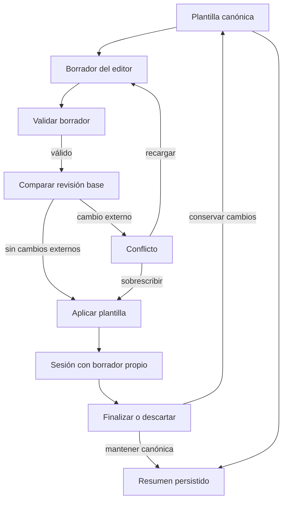

# Plantillas, series y ejecución de entrenamientos

El dominio de entrenamiento separa la **prescripción editable** (`WorkoutTemplate`) de la **ejecución** (`WorkoutSession`). Los contratos puros de `apps/mobile/training/` definen la forma, la normalización, las copias, las revisiones y la proyección en unidades ejecutables; `apps/mobile/App.tsx` conserva el estado, persiste los borradores de sesión y coordina la interfaz, el temporizador y las notificaciones. Para los límites generales de persistencia, véase [Estado local y copia de seguridad](./local-state-and-backup.md); para permisos y alarmas de Android, [Permisos de Android](../operations/android-permissions.md).

## Modelo e identidades

Una plantilla contiene ejercicios ordenados y cada ejercicio mantiene `sets: number[]` por compatibilidad, pero la prescripción operativa es `series?: ExerciseSeries[]`. Una serie tiene un `id`, entradas textuales de repeticiones, peso y descanso, un tipo opcional, tempo y, cuando procede, `sub_series`. La versión `series_schema_version` se sella dentro de cada rutina: evita añadir claves raíz incompatibles al almacén y nunca rebaja una versión futura ya escrita.

Los catorce valores admitidos de `SeriesType` incluyen tipos simples —por ejemplo `normal`, `warmup`, `tempo` e `isometric`— y los cinco tipos compuestos `dropset`, `restpause`, `myoreps`, `cluster` y `superset`. Solo estos últimos expanden mini-series durante la ejecución. Una mini-serie puede nombrar y referir otro ejercicio y puede tener su propio enlace de catálogo.

La normalización repara datos almacenados antes de que lleguen a la interfaz: convierte números finitos en texto, recorta texto, descarta tempo inválido, valida tipos de serie y regenera IDs faltantes o duplicados. Las identidades de serie y mini-serie son únicas dentro de su lista; una estructura no interpretable genera incidencias. En modo `repair` se recupera lo posible; en `strict`, errores estructurales impiden aceptar el resultado. Si un ejercicio no tiene `series`, la migración las deriva de sus `sets`, `load_kg` y `rest_seconds` heredados. La proyección inversa a `sets` conserva únicamente las repeticiones positivas que se puedan leer.

## Series simples, compuestas y unidades de ejecución

La ejecución no usa índices como identidad. `listWorkoutExecutionUnits` recorre ejercicios y series en orden y crea:

- una unidad `primary` por cada serie, con clave `exerciseId:seriesId`;
- para una serie de tipo compuesto, una unidad `sub_series` por cada mini-serie, con clave `exerciseId:seriesId:subSeriesId`, inmediatamente después de su unidad principal;
- ninguna mini-serie para un tipo simple aunque el dato conservado aún contenga `sub_series`.

Esta distinción permite ocultar temporalmente mini-series al cambiar a un tipo simple sin destruirlas: al volver a un tipo compuesto reaparecen; si nunca existieron, se crea una usando los valores visibles. Una superserie muestra el `exercise_name` de su mini-serie cuando está disponible; las demás mini-series conservan el nombre del ejercicio raíz.

### Semántica de descanso de bloques compuestos

El descanso es una transición entre unidades, no un atributo que siempre se aplica al marcar una unidad. `resolveWorkoutExecutionRest` usa el `rest_seconds` de la **siguiente** mini-serie mientras el siguiente esfuerzo continúa dentro del mismo bloque compuesto. Al salir del bloque hacia otra serie o ejercicio, usa el `rest_seconds` de la serie principal completada. Si no existe siguiente unidad, o no coincide ninguno de esos casos, no hay descanso. Por ello una mini-serie final con descanso `0` no anula el descanso configurado para concluir el bloque.

`parseWorkoutRestSeconds` acepta segundos numéricos, `s`, minutos `m` y `minutos:segundos`; entradas vacías, negativas o inválidas se convierten en cero. Esta regla se aplica tanto a series simples como a la transición de bloques compuestos.

## Edición transaccional y conflictos

El editor nunca debe mutar la rutina canónica mientras se escribe. `createWorkoutTemplateDraft` crea copias profundas de `original` y `draft`; una edición calcula su suciedad comparando la revisión funcional del borrador con `baseRevision`. La revisión cubre nombre, categoría, icono, duración, orden y contenido funcional de ejercicios, series, tempo, mini-series y enlaces de catálogo. Excluye deliberadamente el sello de esquema y los espejos derivados `sets`, `load_kg` y `rest_seconds`, para no generar conflictos falsos.

Guardar valida nombre no vacío, al menos un ejercicio y alguna serie ejecutable. Para editar, el commit solo se aplica si la revisión canónica sigue siendo `baseRevision`; si falta la plantilla devuelve `missing`, y si cambió devuelve `conflict` sin escribir. Para crear, una plantilla existente con el mismo ID también es conflicto. Un borrador limpio puede recibir un `rebase`; uno sucio se conserva para no borrar trabajo local. El usuario puede recargar la versión canónica o confirmar explícitamente la sobrescritura.

Las operaciones de clonación son profundas: una instantánea conserva IDs para restauración; una duplicación regenera los IDs de rutina, ejercicios, series y mini-series. Al duplicar una rutina, también reasigna los `exercise_id` internos de superseries para que apunten a los ejercicios clonados. `createSeriesAfter` copia por completo la configuración de la serie previa pero con identidades nuevas.



*El ciclo muestra los dos espacios de borrador: el editor confirma una plantilla canónica y la sesión usa otro borrador, cuya resolución puede volver a modificarla o limitarse a guardar el resumen.*

## Sesión recuperable

Una sesión inicia solo si no hay otra activa y la plantilla se expande al menos a una unidad ejecutable. Guarda el primer `current_unit_key`, las claves completadas, contadores derivados, tiempo, estado `running` o `paused`, y el posible `pending_resolution`. Además crea un borrador versionado de la plantilla para la sesión, con su revisión base y `draft_revision`.

Mientras se entrena, la plantilla efectiva es ese borrador de sesión, no la canónica. Esto mantiene ejecutable la sesión incluso si la rutina canónica cambia o desaparece. Cuando una modificación estructural cambia el borrador, la aplicación vuelve a listar unidades, elimina claves completadas que ya no existan, recalcula los contadores y resuelve una unidad actual válida. Al hidratar, el normalizador también deduplica y filtra claves, migra las antiguas claves de serie a todas las unidades de su bloque, y deriva contadores desde las claves realmente válidas; la migración es idempotente.

Completar la unidad actual agrega su clave una sola vez, busca la siguiente unidad incompleta y programa el descanso calculado. Si no queda ninguna, solicita la finalización. La lista de comprobación puede completar una unidad concreta y finaliza solo al alcanzar el total de esfuerzos; desmarcarla cancela un descanso activo, la enfoca y vuelve a derivar el contador. Mover el puntero o enfocar un ejercicio está bloqueado durante el descanso.

Al pedir finalizar o descartar, la sesión pasa a `paused` con una resolución pendiente recuperable. Se compara el borrador con la instantánea original y también con la revisión canónica. Si hay cambios, el modal permite conservar el borrador de sesión o mantener la canónica; una divergencia canónica exige una decisión explícita antes de sobrescribir. La mutación atómica añade el resumen solo si su ID no está ya en historial, evitando duplicados al reintentar. Después espera las colas de persistencia y elimina las claves de sesión, instantánea y borrador.

## Resumen e historial

`summarizeWorkoutExecution` cuenta claves únicas completadas y calcula repeticiones y volumen solo de esas unidades. Convierte repeticiones a enteros no negativos y peso a número no negativo; valores ilegibles aportan cero. El resultado conserva tanto el total global de esfuerzos como un desglose de principales y mini-series. El resumen actual usa `calculation_version: 2`, marca `can_recalculate: false` y guarda volumen, repeticiones, calorías estimadas y tiempos; los resúmenes heredados se mantienen como versión 1, sin desglose. El historial se añade al principio y se limita a `MAX_WORKOUT_HISTORY_ITEMS`.

## Alarmas de descanso

El temporizador de sesión conserva `elapsed_seconds`, `is_resting`, `rest_seconds_left` y `rest_seconds_total`. Al terminar naturalmente un descanso, cancela la notificación pendiente y reproduce la alerta dentro de la aplicación, salvo si fue una omisión manual. Un candado breve y una marca temporal reducen alertas duplicadas cuando una notificación llega inmediatamente después.

Para una alarma en segundo plano, `scheduleRestEndNotification` no hace nada si `notifications.enabled` es falso; en otro caso cancela todas las notificaciones programadas por la aplicación y agenda una notificación fechada en el canal Android `rest_end_alert`. El contenido usa el sonido elegido si `sound` está activo y el patrón de vibración solo si `vibrate` lo está. La inicialización solicita permiso, configura el modo de audio y, en Android, crea el canal con importancia máxima, vibración y el archivo fijo `rest_finished.wav`. El comportamiento final de entrega continúa sujeto a permiso y a políticas del sistema operativo.

## Pruebas orientadas a cambios seguros

- `workoutExecution.test.ts` prueba expansión de los cinco tipos compuestos, claves, descansos dentro y entre bloques, formatos de descanso, totales sin duplicación, entradas inválidas y migración heredada idempotente; incluye propiedades sobre unicidad y finitud.
- `workoutTemplateOperations.test.ts` prueba copias sin referencias compartidas, regeneración de IDs y reasignación de superseries, y la conservación de mini-series al alternar tipos.
- `workoutTemplateTransactions.test.ts` cubre cancelación, rebase limpio, conflictos, desaparición, validación, serialización del borrador de sesión y propiedades de aplicación o cancelación exacta.
- `npm run test:train:series-operations:e2e` verifica desde la interfaz que cancelar no muta la plantilla, que el guardado aplica una transacción completa, que las modificaciones de sesión no tocan la canónica antes de resolverse y que borrador, decisión pendiente y conflicto sobreviven una recarga.
- `npm run test:train:compound:e2e` siembra los cinco tipos compuestos, migra sesiones antiguas, ejecuta principales y mini-series a través de recargas y verifica el resumen v2 y el desglose frente a historial legado.

Antes de cambiar contratos, ejecución o descansos, ejecute al menos:

```bash
npm --workspace apps/mobile test -- --run training
npm run test:train:series-operations:e2e
npm run test:train:compound:e2e
```
