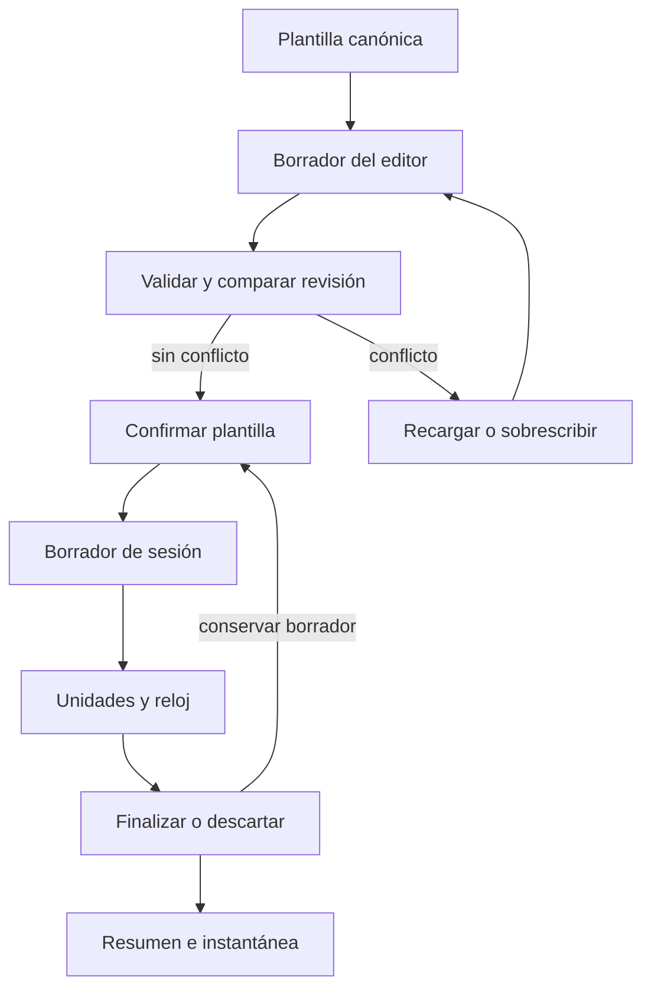

# Entrenamiento, plantillas e historial

El entrenamiento es **local-first**: `apps/mobile/training/` concentra contratos puros para normalizar, clonar, versionar y proyectar datos; `apps/mobile/App.tsx` posee el estado React, las colas de persistencia y las integraciones de interfaz, reloj y notificaciones. Se separan tres artefactos que no deben confundirse:

- `WorkoutTemplate`: prescripción canónica y editable.
- borrador de sesión: copia versionada desde la que se ejecuta una sesión activa.
- `WorkoutSessionSummary`: registro histórico inmutable en la práctica, que puede incluir una instantánea autocontenida de la prescripción ejecutada.

Para el almacén y las copias de seguridad, véase [Estado local y copia de seguridad](./local-state-and-backup.md). La entrega efectiva de alarmas Android depende además de los permisos y del sistema operativo; véase [Permisos de Android](../operations/android-permissions.md).

## Series: formato, migración e identidades

Cada ejercicio conserva `sets: number[]` como espejo heredado, pero la prescripción operativa es `series?: ExerciseSeries[]`. Una serie contiene ID, repeticiones, peso y descanso como texto, tipo opcional, tempos y `sub_series` opcionales. El sello por plantilla `series_schema_version` es `1`; se conserva un sello futuro en vez de rebajarlo y no se añade una clave raíz al almacén, cuya validación rechaza claves desconocidas.

`SERIES_TYPES` admite nueve tipos simples (`normal`, `warmup`, `failure`, `amrap`, `partial`, `negative`, `forced`, `tempo`, `isometric`) y cinco compuestos: `dropset`, `restpause`, `myoreps`, `cluster` y `superset`. Solo los compuestos generan mini-series ejecutables. Una mini-serie puede aportar `exercise_name`, `exercise_id` y `catalog_link`; en una superserie se presenta el nombre propio si existe.

La normalización acepta números finitos heredados y los convierte a texto, recorta campos, valida tipo, tempo y enlace de catálogo, y sustituye IDs ausentes o duplicados dentro de su lista. Registra incidencias en ambos modos: `repair` reconstruye lo recuperable, mientras `strict` bloquea ante estructura no interpretable (`expected_object`, `expected_array` o `expected_string`). Si no hay `series`, deriva una serie por cada `sets` heredado, aplicando el peso decreciente y descanso heredados. La proyección inversa a `sets` solo conserva el primer entero positivo legible de cada serie.

## Unidades de ejecución y descansos

`listWorkoutExecutionUnits` usa claves estables, no índices. Recorre ejercicios y series en orden y produce una unidad `primary` por serie con `exerciseId:seriesId`; para una serie compuesta añade, inmediatamente después, una `sub_series` por mini-serie con `exerciseId:seriesId:subSeriesId`. Deduplica claves y no expande mini-series guardadas en una serie de tipo simple. Por ello alternar temporalmente a un tipo simple no destruye el trabajo: las mini-series siguen en el dato y reaparecen al volver a un tipo compuesto; al entrar por primera vez se crea una desde los valores visibles.

El descanso es una transición. Si la próxima unidad es una mini-serie del mismo bloque, `resolveWorkoutExecutionRest` toma el `rest_seconds` de esa **próxima** mini-serie. Al salir del bloque toma el descanso de la serie principal ya completada; sin próxima unidad no hay descanso. `parseWorkoutRestSeconds` acepta número, sufijo `s`, sufijo `m` y `minutos:segundos`; entradas vacías, negativas o inválidas producen cero.



*El flujo separa explícitamente edición canónica, ejecución aislada y persistencia del historial.*

## Edición transaccional de plantillas

El editor crea copias profundas de `original` y `draft`. `buildWorkoutTemplateRevision` compara el contenido funcional —metadatos de la rutina, orden y contenido de ejercicios, series, tempos, mini-series y enlaces— pero omite el sello técnico y los espejos derivados `sets`, `load_kg` y `rest_seconds`, con lo que evita conflictos falsos. Un rebase solo reemplaza un borrador limpio; uno sucio se conserva.

Antes de guardar se requiere nombre, al menos un ejercicio y alguna serie ejecutable. Para editar, `resolveWorkoutTemplateCommit` rechaza una plantilla ausente como `missing` y una revisión canónica distinta como `conflict`; para crear, el mismo ID ya existente también es conflicto. En cualquiera de los casos no aplica el borrador hasta que se recargue o se solicite explícitamente sobrescritura.

Las copias para instantánea preservan identidades. Las duplicaciones regeneran IDs de rutina, ejercicios, series y mini-series; al duplicar una rutina, remapean además los `exercise_id` que conectan superseries con ejercicios clonados. `createSeriesAfter` clona toda la configuración de la serie anterior con IDs nuevos. Son límites importantes: una edición o duplicación no debe compartir arreglos, enlaces de catálogo ni identidades accidentales con su origen.

## Sesión recuperable y resolución

Al iniciar se exige que no exista otra sesión y que la plantilla genere al menos una unidad. La sesión guarda la unidad actual, claves completadas, contadores, estado, tiempo y la posible `pending_resolution`; también se crea `WorkoutSessionTemplateDraftRecord` con `session_id`, `template_id`, revisión base, contador `draft_revision` y copia profunda. El borrador puede proyectarse sobre la lista de plantillas incluso si la canónica se eliminó.

Una actualización estructural del borrador incrementa `draft_revision` solo si cambió la revisión funcional. La aplicación vuelve a listar unidades, filtra claves completadas ya inválidas, vuelve a derivar los contadores y resuelve una unidad actual válida. Si esa corrección desplaza la unidad actual durante un descanso, cancela el descanso. Al hidratar, la app puede reconstruir el borrador desde la instantánea o plantilla previa, migra claves heredadas de bloque a todas sus unidades y deriva los contadores desde las claves válidas, no desde contadores antiguos.

Al terminar o descartar, la sesión se pausa y crea una resolución pendiente recuperable. Si se opta por conservar el borrador, el commit comprueba que la revisión de la plantilla canónica aún coincide con la base; una plantilla eliminada o modificada exige decidir explícitamente el conflicto. La mutación local sustituye o añade la plantilla elegida y añade el resumen solo si su ID no figura ya en el historial. Tras esperar las dos colas de persistencia de sesión y borrador, borra las tres claves de AsyncStorage: sesión, instantánea base y borrador.

## Reloj, descansos y notificaciones

`WorkoutSessionClock` persiste el ancla `clock_last_tick_ms`, `elapsed_seconds`, estado, descanso restante y total, y la identidad de alarma: `rest_cycle_id`, `rest_alarm_revision`, `rest_due_at_ms` y `last_handled_rest_alert`. Cada inicio de descanso crea ciclo y revisión; pausar, reanudar o cancelar invalida la alarma incrementando la revisión cuando corresponde. Esta identidad evita tratar como vigente una notificación atrasada de un ciclo anterior.

Al hidratar o en cada tick, `reconcileWorkoutSessionClock` no avanza una sesión pausada. Si el reloj retrocede lo reancla sin sumar tiempo; si el hueco supera doce horas (`MAX_RECOVERABLE_WORKOUT_GAP_MS`), la pausa automáticamente y conserva el descanso sin fecha programada. Para huecos válidos descuenta segundos completos preservando el resto subsegundo. El fin natural del descanso emite una alerta una sola vez y persiste la identidad manejada; una recuperación solo reproduce el sonido local dentro de una ventana reciente y si el sistema no informó entrega.

Una notificación es programable únicamente para sesión `running`, descanso vigente, ciclo, revisión y fecha futura válidos. El contrato solicita `schedule` al empezar, reanudar o cambiar revisión, y `cancel` al dejar de ser programable. La integración cancela antes las notificaciones de descanso propias, verifica que el payload siga siendo el de la sesión activa, y solo agenda si `notifications.enabled`. Programa una fecha con el canal Android `rest_end_alert`, sonido seleccionado o `false`, vibración opcional y payload `rest_end` que identifica sesión, ciclo, revisión y vencimiento. Los fallos de la API de notificaciones se trazan, no impiden la sesión.

## Resumen, instantánea y lectura histórica

El cálculo deduplica por clave de esfuerzo y solo suma unidades completadas. Convierte repeticiones a entero no negativo, peso a número no negativo y redondea el volumen a una decimal; aporta el total y el desglose de principales y mini-series. La finalización crea un resumen de cálculo v2 y, si existe plantilla efectiva, una `prescription_snapshot` v1 con unidad `kg`, ejercicio, tipo, valores numéricos prescritos, tempos, descansos y estado completado de series y mini-series. No incluye imágenes, URI locales, músculo ni enlaces de catálogo: reduce exposición de datos y mantiene el historial independiente de la plantilla actual.

La instantánea validada permite recalcular y clasificar como `match` o `mismatch` sin sobrescribir los totales almacenados. Una instantánea inválida se degrada durante hidratación a no recalculable y conserva los totales; en modo estricto se rechaza. Los resúmenes heredados permanecen sin instantánea y no se inventa una. Una sesión solo es `completed` si alcanzó todos sus esfuerzos; parciales no cuentan para racha ni progreso semanal. El historial se ordena por fecha descendente y, al añadir una finalización, se conserva un máximo de 180 elementos.

## Validación mínima antes de cambiar el dominio

Las pruebas unitarias y de propiedades cubren normalización y migración de series, operaciones y transacciones de plantillas, unidades/descansos/resúmenes, reloj y contrato de notificación. `workoutHistory.test.ts` verifica la instantánea sin información visual o de catálogo, su independencia ante cambios posteriores, recalculación sin mutar totales, degradación o rechazo estricto y exclusión de parciales.

Los recorridos Playwright siembran almacenamiento local, exportan la web de Expo si no se proporciona una URL y validan la persistencia real. `test:train:series-operations:e2e` cubre edición, cancelación, conflictos y recuperación de borradores. `test:train:compound:e2e` cubre los cinco tipos compuestos, migración idempotente, recuperación de reloj, descanso y resumen v2 frente a historia heredada. `test:train:history:e2e` cubre historial global, rutina eliminada, discrepancia, exportación, borrado, restauración y rechazo transaccional de backup inválido.

```bash
npm --workspace apps/mobile test -- --run training
npm run test:train:series-operations:e2e
npm run test:train:compound:e2e
npm run test:train:history:e2e
```
