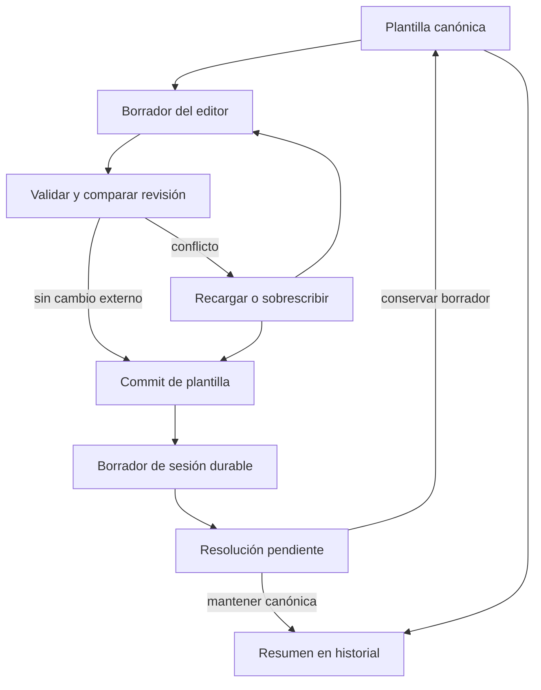
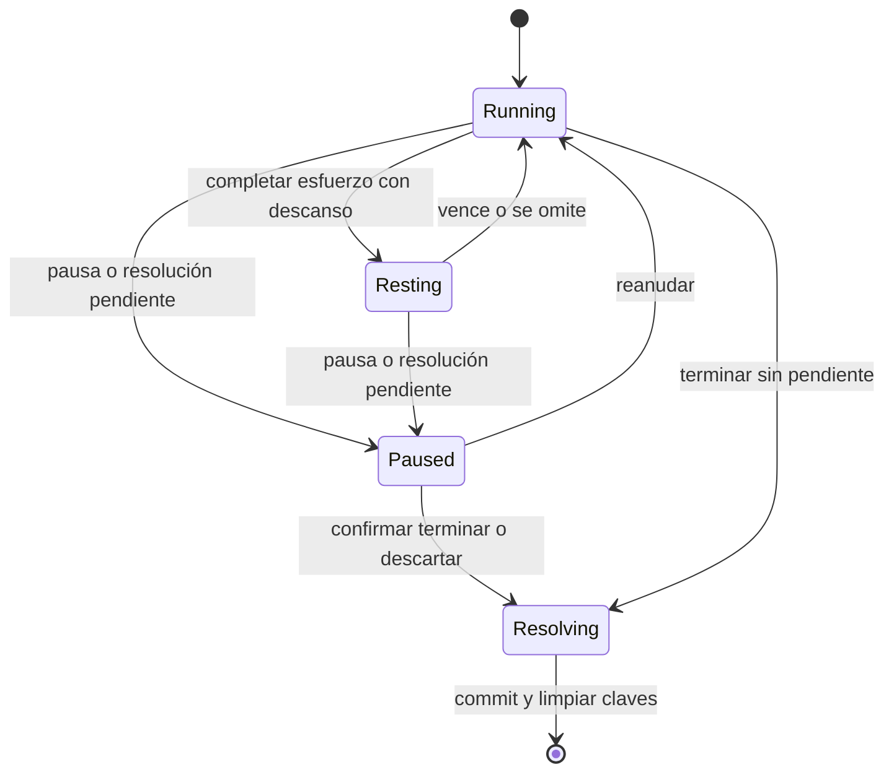

# Entrenamiento y sesiones

El dominio separa la **prescripción editable** (`WorkoutTemplate`) de una **ejecución recuperable** (`WorkoutSession`) y de su resultado inmutable (`WorkoutSessionSummary`). Los módulos puros de `apps/mobile/training/` son la autoridad de contratos, normalización, cálculo y transiciones; `apps/mobile/App.tsx` posee el estado React, las colas de persistencia, la integración con `AsyncStorage`, el reloj y `expo-notifications`. Los controladores de `apps/mobile/controllers/trainingController.ts` no duplican esas reglas: adaptan modelo y acciones a pantallas, overlays y la pila de volver.

Para los límites generales de persistencia y restauración, véase [Estado local y copia de seguridad](./local-state-and-backup.md). Esta página se centra en los invariantes específicos de entrenamiento.

## Qué es durable y qué es interfaz

| Capa | Estado o responsabilidad |
| --- | --- |
| Plantilla canónica durable | `templates` conserva rutina, ejercicios, series, identidad y el sello `series_schema_version`; es la prescripción que se editará en el futuro. |
| Sesión durable recuperable | La sesión, su instantánea inicial y el `WorkoutSessionTemplateDraftRecord` se guardan por separado. Contienen claves de esfuerzos, reloj, descanso, resolución pendiente y revisión base. |
| Historial durable | `workoutHistory` guarda resúmenes y, en el esquema actual, una instantánea compacta de la prescripción ejecutada. |
| Estado efímero de interfaz | Menús, selectores, modales de confirmación, filtros, búsqueda, expansión de historial y selección de detalle viven en React o se derivan para el controlador. No deben convertirse en parte de una plantilla o sesión. |
| Integración de dispositivo | La alarma programada, el permiso y el canal Android son efectos reconciliados desde el descanso durable; no son la fuente de verdad del reloj. |

`useTrainingCatalogController`, `useTrainingSessionController`, `useTrainingEditorController`, `useTrainingDetailController` y `useTrainingHistoryController` exponen `model`, `actions` y capas de retroceso. Mantienen el último input en un `ref`, por lo que las acciones memorizadas delegan al estado actual; los manejadores de volver cierran primero la capa abierta correspondiente. El controlador no posee ni persiste las mutaciones de entrenamiento.

## Plantillas, series e identidades

Una plantilla ordena ejercicios. Cada ejercicio conserva `sets: number[]` como espejo de compatibilidad, mientras que `series?: ExerciseSeries[]` es la prescripción operativa. Una serie tiene ID, repeticiones, peso y descanso textuales, tipo opcional, tempo y, opcionalmente, `sub_series`; una mini-serie puede referir o nombrar otro ejercicio y enlazar el catálogo.

Los 14 `SeriesType` admitidos incluyen nueve simples y cinco compuestos: `dropset`, `restpause`, `myoreps`, `cluster` y `superset`. Solo los compuestos expanden mini-series en ejecución. Cambiar temporalmente a un tipo simple **no borra** las mini-series: quedan ocultas y reaparecen al volver a compuesto. Si se entra por primera vez en un tipo compuesto se crea una mini-serie con los valores visibles (para `dropset`, descanso `0`).

El sello `series_schema_version` está dentro de cada rutina, no en la raíz del almacén: una clave raíz desconocida activa la recuperación del almacén. `sealedSeriesSchemaVersion` escribe la versión soportada pero nunca reduce una versión futura leída.

### Normalización y compatibilidad

Antes de presentar datos, la normalización convierte números finitos a texto, recorta entradas, descarta tempo inválido, valida tipos y enlaces de catálogo, y regenera IDs ausentes o repetidos. La unicidad de IDs se exige por lista de series y por lista de mini-series. En `repair` se conserva y repara lo interpretable; en `strict`, los problemas estructurales —objeto, lista o texto donde no corresponde— bloquean la aceptación. El arranque usa reparación, mientras que una importación aplica la vía estricta para no sustituir el almacén por datos incompatibles.

Si faltan `series`, se derivan desde `sets`, `load_kg` y `rest_seconds` heredados. El espejo inverso `sets` incluye solo la primera repetición positiva legible de cada serie. Por tanto, modificar los campos derivados no debe usarse para detectar cambios funcionales ni para reconciliar una sesión.

## Edición aislada y conflictos

El editor nunca modifica la plantilla canónica mientras el usuario escribe. `createWorkoutTemplateDraft` crea copias profundas de `original` y `draft`; para una edición, `baseRevision` es la revisión funcional de la canónica al abrir. Esa revisión cubre metadatos, orden, ejercicios, series, tempo, mini-series y enlaces de catálogo, y excluye el sello y espejos heredados para evitar conflictos espurios.

Al guardar se validan metadatos obligatorios y que cada ejercicio tenga nombre y al menos una serie con repeticiones positivas, además de valores numéricos, condiciones de series compuestas y enlaces. Un commit de edición solo se aplica si la revisión canónica sigue siendo `baseRevision`; devuelve `missing` si desapareció y `conflict` si cambió, sin escribir. En creación, un ID existente también entra en conflicto. Un `rebase` solo reemplaza un borrador limpio; un borrador sucio se conserva para no perder trabajo local. La persona puede recargar la canónica o sobrescribir de forma explícita.

Las instantáneas usan copias profundas que preservan IDs. Las duplicaciones regeneran los IDs de rutina, ejercicios, series y mini-series y reasignan los `exercise_id` internos de superseries a sus ejercicios clonados. `createSeriesAfter` clona toda la configuración de la serie anterior con identidades nuevas.


```mermaid
flowchart TD
    Canonical["Plantilla canónica"] --> Editor["Borrador del editor"]
    Editor --> Check["Validar y comparar revisión"]
    Check -->|"sin cambio externo"| Save["Commit de plantilla"]
    Check -->|"conflicto"| Choice["Recargar o sobrescribir"]
    Choice --> Editor
    Choice --> Save
    Save --> SessionDraft["Borrador de sesión durable"]
    SessionDraft --> Pending["Resolución pendiente"]
    Pending -->|"conservar borrador"| Canonical
    Pending -->|"mantener canónica"| History["Resumen en historial"]
    Canonical --> History
```

*La plantilla, el borrador de editor y el borrador de sesión son espacios distintos; la decisión final controla si el último vuelve a ser canónico.*

## Ejecución, progreso y recuperación

`listWorkoutExecutionUnits` convierte la plantilla efectiva en esfuerzos con claves estables, no índices: una unidad `primary` por serie (`exerciseId:seriesId`) y, en una serie compuesta, mini-series `sub_series` consecutivas (`exerciseId:seriesId:subSeriesId`). Ignora mini-series de tipos simples y evita claves repetidas. El contador, la unidad actual y el resumen se derivan de esas claves.

Solo se inicia una sesión si no hay otra activa y la plantilla tiene alguna unidad ejecutable. La sesión fija la primera clave actual, las claves completadas, contadores, estado `running` o `paused`, reloj, posible `pending_resolution` y un borrador de plantilla de sesión con `base_revision` y `draft_revision`. Durante el entrenamiento se ejecuta ese borrador, incluso si la plantilla canónica se modifica o elimina.

Al cambiar la estructura del borrador, la aplicación vuelve a enumerar unidades, descarta completadas que ya no existen, recalcula contadores y elige una unidad actual válida. Al hidratar, `normalizeWorkoutSession` deduplica y filtra claves, migra las antiguas claves de serie al bloque completo, normaliza una resolución pendiente a pausa y vuelve a derivar los contadores. Así la migración es idempotente y una marca antigua no deja una sesión parcialmente inconsistente.

Marcar el esfuerzo actual lo añade una sola vez y busca el siguiente pendiente; la lista también puede marcar una unidad concreta. Desmarcar cancela un descanso, enfoca esa unidad y recalcula. No se permite mover el foco durante descanso. Al solicitar terminar o descartar, se pausa la sesión y se persiste `pending_resolution`: un cierre o reinicio no convierte silenciosamente una sesión parcial en finalizada.

### Reloj y descanso

El reloj durable ancla `clock_last_tick_ms`, `rest_due_at_ms`, `rest_cycle_id`, `rest_alarm_revision` y la última alerta tratada. Reconcilia segundos enteros conservando la fracción subsegundo. Una pausa congela tiempo y descanso; reanudar un descanso conserva lo pendiente pero crea una fecha objetivo y una revisión nuevas. Si el reloj retrocede, se reancla sin sumar tiempo; si el hueco supera 12 horas, la sesión se pausa automáticamente sin inventar tiempo ni terminar el descanso. Cada ciclo de descanso solo puede emitir una alerta lógica gracias a `last_handled_rest_alert`.

El descanso se decide entre unidades: dentro del mismo bloque compuesto toma el descanso de la **siguiente** mini-serie; al salir del bloque toma el de la serie principal completada. Sin siguiente unidad no hay descanso. `parseWorkoutRestSeconds` acepta segundos, sufijo `s`, minutos `m` y `minutos:segundos`; vacío, negativo o inválido vale cero.


```mermaid
stateDiagram-v2
    [*] --> Running
    Running --> Resting: completar esfuerzo con descanso
    Resting --> Running: vence o se omite
    Running --> Paused: pausa o resolución pendiente
    Resting --> Paused: pausa o resolución pendiente
    Paused --> Running: reanudar
    Paused --> Resolving: confirmar terminar o descartar
    Running --> Resolving: terminar sin pendiente
    Resolving --> [*]: commit y limpiar claves
```

*El reloj, el ciclo y la revisión de alarma hacen recuperable la transición; los modales solo deciden la resolución.*

## Finalización atómica e historial

Al resolver, `App.tsx` compara el borrador de sesión tanto con la instantánea inicial como con la revisión de la canónica. Si se pretende conservar el borrador y la rutina canónica cambió o desapareció, abre un conflicto y no escribe hasta una decisión explícita. La mutación local única puede reemplazar o volver a insertar la plantilla elegida y añade el resumen solamente si su ID aún no existe; el historial se antepone y se limita a `MAX_WORKOUT_HISTORY_ITEMS`. Tras confirmar la mutación espera ambas colas de persistencia y elimina las tres claves de sesión. Esta orden evita perder un borrador recuperable y evita duplicar un resumen al reintentar.

Un resumen actual tiene `summary_schema_version: 2`, `calculation_version: 2`, conteos de esfuerzos y desglose de principales y mini-series. `summarizeWorkoutEfforts` ignora claves repetidas, cuenta solo esfuerzos completados y transforma repeticiones/peso ilegibles o negativos en cero. Una sesión solo es `completed` cuando completó todos sus esfuerzos; de otro modo es `partial`, que no contribuye a racha ni progreso semanal.

Además de los totales almacenados, v2 guarda `prescription_snapshot`: nombres, tipo, repeticiones, peso, descanso, tempo y marca de ejecución en kg. No incluye imágenes, enlaces de catálogo ni datos musculares. Es independiente de la rutina actual, por lo que un historial sigue explicando lo ejecutado aunque se edite o borre la plantilla. La recalculación compara totales, conteos y desglose pero no sobrescribe los valores guardados: informa `match` o `mismatch`. Un resumen heredado o una instantánea inválida se conserva sin capacidad de recalcular; durante hidratación se degrada con una incidencia, mientras que en importación estricta se rechaza toda la restauración de forma transaccional.

## Notificaciones de descanso

Una notificación es programable solo para una sesión `running`, en descanso, con segundos pendientes, ciclo, revisión y vencimiento futuro. Su payload identifica `kind: "rest_end"`, sesión, ciclo, revisión y fecha objetivo. La reconciliación programa al abrir o cambiar de revisión y cancela si deja de ser programable. Antes de programar limpia únicamente avisos marcados como propios; un contador de operación invalida y cancela resultados asíncronos obsoletos.

Si las notificaciones están desactivadas no agenda nada. En Android inicializa el canal `rest_end_alert` con importancia máxima, vibración, sonido configurado, visibilidad pública y `bypassDnd`; la entrega real sigue dependiendo del permiso y de la política del sistema. Al volver a primer plano, la aplicación contrasta bandeja y respuesta de notificación con el payload esperado para no reproducir dos alertas. También mide retraso observado frente a `expected_at_ms` y muestra el estado de puntualidad, sin afirmar que pueda consultar el permiso de alarmas exactas.

## Pruebas que protegen el cambio

- `series.contract.test.ts` impide que `App.tsx` reintroduzca tipos, normalización, copias o firmas de series; también verifica que solo la importación sea estricta y que el sello no se filtre a la raíz del almacén.
- Las pruebas de contratos, propiedades y regresión de `seriesContract`, `workoutTemplateOperations` y `workoutTemplateTransactions` cubren reparación, identidades, copias, cambios de tipo, validación, rebase y conflictos.
- `workoutExecution.test.ts`, `workoutSessionModel.test.ts` y `workoutSessionClock.test.ts` cubren expansión, descansos, deduplicación, migración, pausas, huecos largos, retroceso de reloj y alerta única por ciclo. `restNotificationContract.test.ts` y su prueba de reanudación cubren el payload y la reconciliación de alarmas.
- `workoutHistory.test.ts` verifica instantáneas sin datos de catálogo o imágenes, independencia frente a ediciones, discrepancias sin sobrescritura, legado, rechazo estricto e impacto de sesiones parciales en racha y semana.
- `npm run test:train:history:e2e` recorre historial global, cálculo coincidente y discrepante, plantilla eliminada, legado y el ciclo de exportar, borrar actividad, restaurar y rechazar una instantánea incompatible sin alterar lo ya restaurado.

Antes de modificar estos contratos o el flujo, ejecute al menos:

```bash
npm --workspace apps/mobile run test:deterministic
npm run test:train:series-operations:e2e
npm run test:train:compound:e2e
npm run test:train:history:e2e
```
