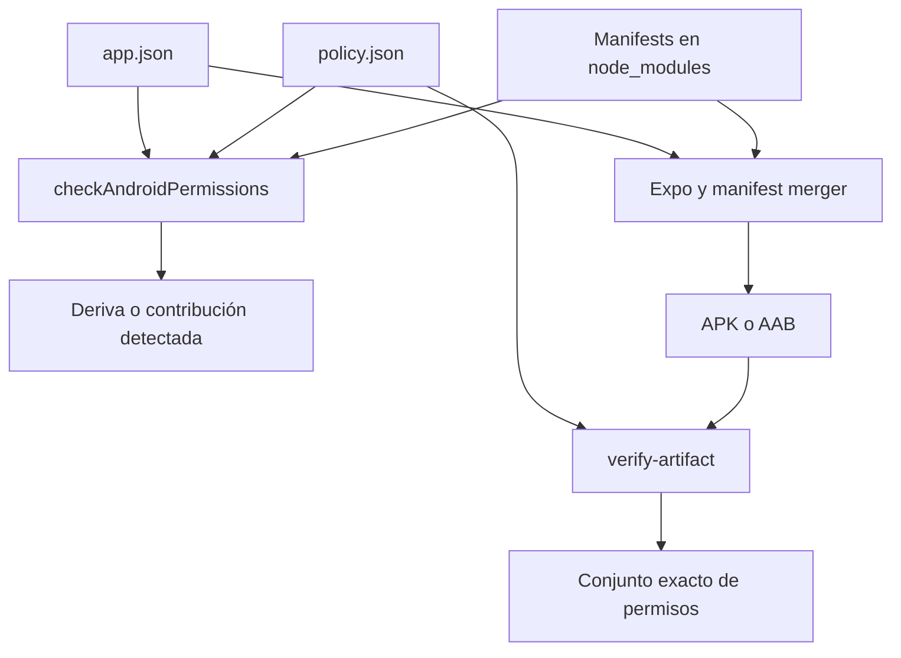
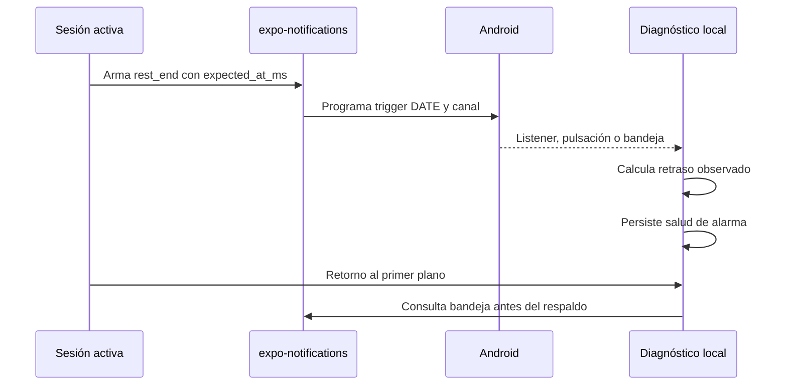

# Permisos Android y configuración nativa

Esta página separa tres contratos que no deben confundirse: la declaración Expo que alimenta la generación nativa, la política que protege el *checkout* frente a dependencias y el manifiesto fusionado que decide si un APK/AAB es publicable. Que un permiso esté declarado no acredita que el usuario lo haya concedido, ni que Android entregue una notificación a la hora solicitada.

El shell y las variantes se describen en [Shell de aplicación, plataformas y navegación](../mobile/application-shell.md); el temporizador de entrenamiento en [Plantillas, series y ejecución de entrenamientos](../mobile/training.md), y la transacción de release en [Compilación, publicación y validación](build-release-and-testing.md).

## Configuración aprobada y variantes

`apps/mobile/app.json` es la fuente de los permisos explícitos de Expo. Declara exactamente `WAKE_LOCK`, `VIBRATE`, `RECEIVE_BOOT_COMPLETED` y `SCHEDULE_EXACT_ALARM`; bloquea `USE_EXACT_ALARM`, `REQUEST_INSTALL_PACKAGES`, `RECORD_AUDIO` y `SYSTEM_ALERT_WINDOW`. En particular, `FOREGROUND_SERVICE` ya no forma parte ni de la configuración, ni de la lista aprobada, ni del conjunto esperado en el artefacto. El plugin `expo-av` usa `microphonePermission: false`, coherente con bloquear `RECORD_AUDIO`.

`app.config.ts` carga esa base, exige un `APP_ENV` válido y solo sustituye identidad y metadatos de variante: paquete/bundle identifier, nombre, espacio de almacenamiento, canal y modo de proveedor. Por tanto, development, staging y production comparten este contrato de permisos; el paquete es respectivamente `com.maximofn.gymnasia.dev`, `.staging` o el identificador de producción.

| Permiso | Estado | Motivo y límite operativo |
| --- | --- | --- |
| `WAKE_LOCK`, `VIBRATE`, `RECEIVE_BOOT_COMPLETED` | Permitido y declarado. | Respaldan el aviso, su vibración y la reprogramación posterior a un reinicio. |
| `SCHEDULE_EXACT_ALARM` | Permitido y declarado. | Es necesario para el aviso de descanso, pero su declaración no confirma que el usuario haya permitido alarmas exactas. |
| `USE_EXACT_ALARM` | Bloqueado. | No se debe publicar para esta aplicación; es distinto de `SCHEDULE_EXACT_ALARM`. |
| `REQUEST_INSTALL_PACKAGES`, `RECORD_AUDIO`, `SYSTEM_ALERT_WINDOW` | Bloqueados. | La aplicación no instala paquetes, no captura audio y no dibuja sobre otras aplicaciones. |

`scripts/android-permissions/policy.json` es la fuente operativa de la lista aprobada, los bloqueos y la justificación de cada permiso. Si se cambia una lista hay que cambiar también su `rationale`: las pruebas exigen que todo permiso de política tenga motivo.

## Dos puertas frente al manifest merger



*El control del checkout anticipa deriva; la puerta de release inspecciona el manifiesto fusionado que realmente se publica.*

1. **Checkout.** `checkAndroidPermissions` lee `app.json`, normaliza formas corta y `android.permission.*`, y exige igualdad entre `android.permissions` y `allowedPermissions`. También exige que cada bloqueo de política esté en `expo.android.blockedPermissions`. Recorre los `node_modules` de raíz y de `apps/mobile`; un árbol sin `AndroidManifest.xml` falla con `scanner-empty`, así que debe ejecutarse después de `npm ci`.
2. **Contribuciones.** El walker no sigue enlaces simbólicos y omite ejemplos, pruebas Android e intermedios definidos por la política. Extrae `<uses-permission>`, pero ignora `tools:node="remove"`: esa entrada instruye al merger para retirar un permiso, no lo declara. Una dependencia no reconocida que aporte un permiso bloqueado genera `dependency-contribution`. `acknowledgedContributors` solo reconoce el origen conocido —hoy `react-native` para `SYSTEM_ALERT_WINDOW` de debug—; no autoriza que llegue al binario.
3. **Artefacto.** `verify-artifact.mjs` obtiene el manifiesto de un AAB con `bundletool dump manifest` o de un APK con `apkanalyzer manifest print`. El evaluador rechaza tanto cualquier permiso bloqueado como cualquier diferencia, por falta o por exceso, respecto de `expectedArtifactPermissions`. Por eso `expectedMergedExtras` es solo documentación de aportaciones legítimas posibles y no sustituye el conjunto exacto de la release.

La segunda puerta además revisa tipo y tamaño del archivo, SDK, paquete, versión, configuración integrada, snapshot, certificado y sonidos nativos. No use un `grep` de un manifiesto generado o de un paquete como prueba de publicación: el manifest merger y la comprobación de artefacto son los límites de confianza relevantes.

## Ciclo del aviso de descanso

Al comenzar una sesión, `initWorkoutNotifications` solicita permiso de notificaciones y, en Android, crea/consulta el canal `rest_end_alert`, de importancia máxima, con sonido, vibración, visibilidad pública y `bypassDnd`. Un fallo queda trazado y no impide la sesión.

La notificación se **arma mientras la app sigue en primer plano** al empezar un descanso planificable, no al recibir la transición a segundo plano. El ciclo necesita una sesión `running`, en descanso, con segundos restantes, ciclo de descanso, revisión de alarma y `rest_due_at_ms` futuros. Cuando esos datos cambian de modo que se debe reprogramar, se eliminan avisos de descanso anteriores y se programa mediante `expo-notifications` un trigger `DATE` para `expected_at_ms`, en el canal `rest_end_alert`. El payload incluye `kind: "rest_end"`, `session_id`, `rest_cycle_id` y `rest_alarm_revision`, que impiden asociar la entrega a un ciclo obsoleto. Al terminar, cancelar o dejar de ser planificable, se cancelan los avisos correspondientes.



*El armando previo al segundo plano reduce la carrera contra la congelación del proceso; la entrega sigue dependiendo del sistema Android.*

## Evidencia de puntualidad y recuperación

La aplicación no puede consultar desde JavaScript `canScheduleExactAlarms`; por ello no modela «no entregada». Solo registra una observación si el listener recibe el aviso, el usuario pulsa una respuesta o la bandeja contiene el `rest_end` que coincide con el ciclo esperado. En los tres casos calcula `max(0, deliveredAt - expected_at_ms)`, persiste en AsyncStorage `lastDelayMs`, `lastObservedAt` y `lateStreak`, y clasifica como tardía una demora estrictamente mayor que 5 segundos. Una observación puntual restablece la racha; sin observación el estado es **Sin comprobar**, no un fallo demostrado.

Al reanudar o hidratar una sesión vencida, primero consulta la bandeja y la última respuesta. Solo esa evidencia suprime la alerta local. Si no hay evidencia, `shouldPlayRecoveredRestAlert` permite el sonido de respaldo únicamente si el vencimiento está entre cero y 120 segundos atrás. El retorno del usuario no se convierte en medición de retraso: la medición solo se escribe dentro de los caminos que han observado una entrega. El identificador de alerta ya atendida, un candado de sonido y la ventana de recuperación evitan duplicados.

La pantalla Android abre `REQUEST_SCHEDULE_EXACT_ALARM` para el paquete de la variante y cae a los ajustes de la app si falla. Su indicador de puntualidad y la guía de batería para fabricantes restrictivos son diagnóstico y ayuda para el usuario; no prueban una concesión ni garantizan futuras entregas.

## Cambiar y validar con seguridad

1. Cambie `app.json` y `policy.json` como una unidad: permisos declarados/aprobados, bloqueos y `rationale`. No reintroduzca `FOREGROUND_SERVICE` por una dependencia o un cambio de configuración sin actualizar todos los contratos y revisar la necesidad nativa.
2. Ante una contribución bloqueada, mantenga el bloqueo Expo y verifique el manifiesto de artefacto. Añadir un paquete a `acknowledgedContributors` reconoce que se ha investigado su origen, pero no le concede el permiso.
3. Si se modifica parser, política o walker, amplíe `permissions.test.mjs`. Cubre el contrato real, todos los códigos de infracción, la vivacidad contra manifests instalados, la normalización y el caso `tools:node="remove"`.
4. Si se cambia la programación, payload, listeners, canal o retorno de segundo plano, pruebe un binario Android con notificaciones concedidas y denegadas, app en primer/segundo plano y retorno antes/después de la ventana de 120 segundos. La E2E de entrenamiento inicia Expo Web y Playwright para recorrer una rutina; no puede validar permisos, intents, canales ni entrega Android.
5. Para una candidata, ejecute las puertas locales y la verificación de artefacto con las herramientas nativas requeridas. Esta última es la autoridad sobre el manifiesto fusionado.

```bash
npm ci
npm run check:android-permissions
npm run test:android-permissions
npm run verify:production-artifact
npm --workspace apps/mobile exec tsc --noEmit
```

`check:android-permissions` revisa configuración y manifests instalados; `test:android-permissions` prueba ese contrato. `verify:production-artifact` requiere los argumentos y las herramientas de inspección definidos para APK/AAB, por lo que forma parte del flujo de release, no de una comprobación vacía local. TypeScript y la E2E web no añaden cobertura nativa.
