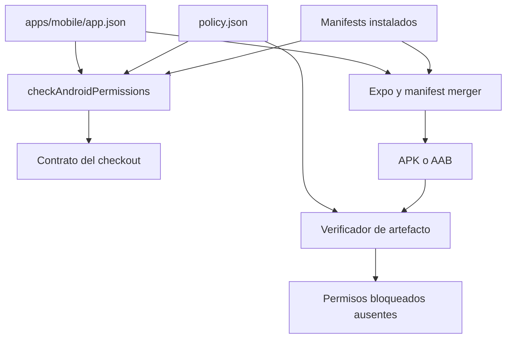
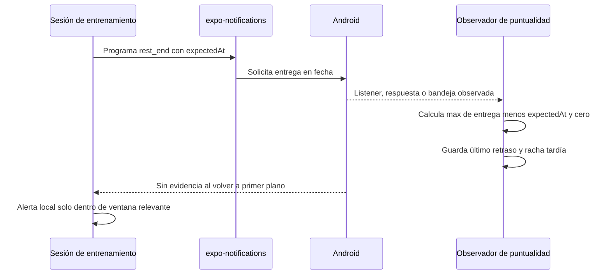

# Permisos Android y fiabilidad de avisos

Esta página cubre dos contratos relacionados pero distintos: qué permisos puede declarar o bloquear la variante Android y qué puede **observar** la aplicación sobre un aviso de descanso. Una declaración en `app.json` permite que Expo la incorpore al manifiesto generado; no acredita que el usuario haya concedido una capacidad, que Android vaya a entregar una notificación ni que lo haga a la hora solicitada. La comprobación de permisos protege la entrega; las mediciones de puntualidad describen evidencia obtenida en un dispositivo.

El shell y la configuración de variantes se documentan en [Shell de aplicación, plataformas y navegación](../mobile/application-shell.md); la semántica del temporizador está en [Plantillas, series y ejecución de entrenamientos](../mobile/training.md). Para la escalada de una release, consulte [Compilación, publicación y validación](build-release-and-testing.md).

## Contrato declarativo y propiedad

`apps/mobile/app.json` es la entrada Expo. Declara exactamente `FOREGROUND_SERVICE`, `WAKE_LOCK`, `VIBRATE`, `RECEIVE_BOOT_COMPLETED` y `SCHEDULE_EXACT_ALARM`; además bloquea `USE_EXACT_ALARM`, `REQUEST_INSTALL_PACKAGES`, `RECORD_AUDIO` y `SYSTEM_ALERT_WINDOW`. El plugin `expo-av` se configura con `microphonePermission: false`, y `expo-notifications` registra los cinco recursos de sonido de los avisos. `app.config.ts` parte de esa base y sustituye el `android.package` según `APP_ENV`, por lo que el contrato de permisos es común a development, staging y production mientras cambia el identificador de aplicación.

`scripts/android-permissions/policy.json` es la política aprobada: repite las listas permitida y bloqueada y exige un `rationale` para cada permiso. No use la política para encubrir una divergencia: el evaluador falla si se añade un permiso no aprobado o si falta uno permitido, y también falla si un permiso bloqueado no figura en `expo.android.blockedPermissions`.

| Permiso | Estado en la configuración | Límite operativo documentado |
| --- | --- | --- |
| `FOREGROUND_SERVICE` | Permitido y declarado. | La política lo describe como declarado sin servicio ni `foregroundServiceType`; retirarlo o conservarlo exige actualizar conjuntamente la política y comprobar el comportamiento nativo. |
| `WAKE_LOCK`, `VIBRATE`, `RECEIVE_BOOT_COMPLETED` | Permitidos y declarados. | La política los vincula con despertar/vibrar el aviso y reprogramar avisos tras reinicio. |
| `SCHEDULE_EXACT_ALARM` | Permitido y declarado. | La aplicación ofrece abrir los ajustes de alarmas exactas; que esté declarado no prueba que el usuario o el sistema lo haya habilitado. |
| `USE_EXACT_ALARM` | Bloqueado, no declarado. | Es distinto de `SCHEDULE_EXACT_ALARM`; la política lo prohíbe para la publicación de esta aplicación. |
| `REQUEST_INSTALL_PACKAGES`, `RECORD_AUDIO`, `SYSTEM_ALERT_WINDOW` | Bloqueados, no declarados. | La configuración expresa que no se instalan paquetes, no se graba audio y no se dibuja sobre otras aplicaciones. |

## Defensa antes y después del manifest merger

Hay dos superficies que deben mantenerse separadas:

1. **Checkout instalado.** `checkAndroidPermissions` lee `app.json`, normaliza tanto `NOMBRE` como `android.permission.NOMBRE` y recorre `node_modules` de la raíz y de `apps/mobile`. Extrae los `<uses-permission>` de cada `AndroidManifest.xml`, excluyendo explícitamente una entrada con `tools:node="remove"`, pues esa entrada ordena eliminar el permiso y no lo declara.
2. **Artefacto de producción.** El verificador de release extrae el manifiesto fusionado del APK/AAB y falla si contiene cualquiera de los permisos bloqueados de `policy.json`. Esta es la comprobación que puede confirmar la ausencia de esos permisos en el artefacto, no el escaneo de manifests de dependencias.



*El escáner local detecta deriva y contribuciones de dependencias; el verificador del artefacto inspecciona el manifiesto fusionado de la release.*

El escáner no sigue enlaces simbólicos, omite rutas de ejemplos, pruebas Android e intermedios configurados en la política, y trata cero manifests como `scanner-empty`. Por tanto, ejecute `npm ci` antes del control: un resultado sin dependencias no es una revisión satisfactoria. Una contribución bloqueada desde un paquete no incluido en `acknowledgedContributors` es una infracción. El único contribuidor reconocido actualmente es `react-native`; ese reconocimiento solo identifica un origen conocido y no permite que `SYSTEM_ALERT_WINDOW` sobreviva en producción, que sigue bloqueado y se revisa contra el artefacto.

`expectedMergedExtras` es documentación de permisos legítimos que pueden llegar de dependencias; el escáner local no los valida. No convierta una búsqueda textual de un manifiesto de origen en la prueba de una release: una directiva `tools:node="remove"` sería un falso positivo y las garantías del APK/AAB se obtienen en la verificación de artefacto.

## Aviso de descanso: programación y evidencia

Al activar una sesión, el cliente prepara audio, solicita el permiso de notificaciones y, en Android, crea el canal `rest_end_alert` con importancia máxima, sonido, vibración, visibilidad pública y `bypassDnd`. Los errores se trazan y no bloquean la sesión. Si hay un descanso activo al pasar la app a segundo plano y las notificaciones están habilitadas en las preferencias, programa una notificación fechada: antes cancela las programadas por la aplicación, usa el canal y lleva `kind: "rest_end"` junto con `expectedAt`.



*La clasificación depende de una entrega que la aplicación observa; la falta de observación desencadena una protección local, no el diagnóstico de una notificación perdida.*

El observador puede obtener evidencia por el listener de recepción, por una respuesta al pulsar la notificación o, al volver al primer plano, encontrando un aviso `rest_end` en la bandeja. En los tres casos calcula `max(0, deliveredAt - expectedAt)`. La marca `expectedAt` viaja en el payload, por lo que una recepción o pulsación puede medirse aunque el proceso se hubiera reiniciado; la salud persistida en AsyncStorage guarda únicamente `lastDelayMs`, `lastObservedAt` y `lateStreak`.

El umbral de retraso es 5 segundos. Una entrega por encima lo incrementa y muestra **Con retraso**; una entrega a tiempo reinicia la racha y muestra **A tiempo**; sin una entrega medida el estado es **Sin comprobar**. Esto no representa una API de consulta de alarmas exactas: el propio código reconoce que Expo/Android no expone desde JavaScript un `canScheduleExactAlarms`, y tampoco asigna un estado «no entregada». El silencio de un listener puede deberse a que Android mató el proceso y no demuestra que la notificación no llegase.

Al regresar después de que un descanso debería haber terminado, la aplicación consulta primero la bandeja. Solo suprime la alerta interna si hay evidencia de entrega; sin ella puede reproducir el respaldo durante 120 segundos. No registra el tiempo que tardó el usuario en volver como retraso, porque eso mediría la reanudación de la app y no la entrega. Un candado y una ventana de deduplicación evitan que la alerta local y una notificación casi simultánea suenen dos veces.

La pantalla de notificaciones Android abre `REQUEST_SCHEDULE_EXACT_ALARM` con el paquete de la variante y, si el intent falla, abre los ajustes de la app. También muestra guía de batería para fabricantes identificados mientras no haya una observación puntual. Son acciones de diagnóstico y configuración para el usuario, no evidencia de que un permiso se haya concedido ni garantía de que el sistema entregue futuros avisos.

## Cambio seguro y validación

1. Para modificar `android.permissions` o `blockedPermissions`, actualice en la misma revisión `allowedPermissions` o `blockedPermissions` y su motivo en `policy.json`. Mantenga las listas declarada y aprobada exactamente alineadas.
2. Si una dependencia incorpora un permiso bloqueado, compruebe primero que `blockedPermissions` lo neutraliza. Añada el paquete a `acknowledgedContributors` solo si su contribución es conocida y neutralizada; no convierte el permiso en aceptable para el manifiesto final.
3. Si cambia el parseo o la política, amplíe `permissions.test.mjs`: cubre el contrato real, todos los códigos de infracción, la vivacidad del recorrido y que `tools:node="remove"` no sea una declaración.
4. Si cambia programación, listeners, vuelta desde segundo plano, sonido o canal, haga una compilación Android y pruebe permiso concedido y denegado, notificación en primer plano y segundo plano, y retorno a la app. `apps/mobile/scripts/train-usability.e2e.mjs` sirve la versión web con Playwright y prueba creación/ejecución de entrenamiento, pero no prueba alarmas ni permisos Android.
5. Para una candidata de producción, no sustituya la release por el escáner local: la verificación del artefacto debe inspeccionar el APK/AAB fusionado y después debe instalarse en un dispositivo representativo.

```bash
npm ci
npm run check:android-permissions
npm run test:android-permissions
npm --workspace apps/mobile exec tsc --noEmit
```

Los dos primeros comandos validan respectivamente la configuración y los manifests instalados, y las pruebas del evaluador; TypeScript no añade cobertura nativa. Una exportación web o la E2E de entrenamiento son señales de interfaz web y no confirman permisos, canales, intentos, entrega en segundo plano ni puntualidad en Android.
