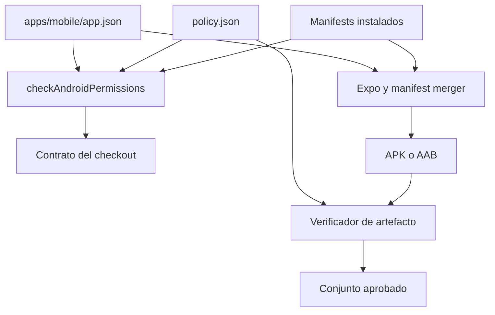
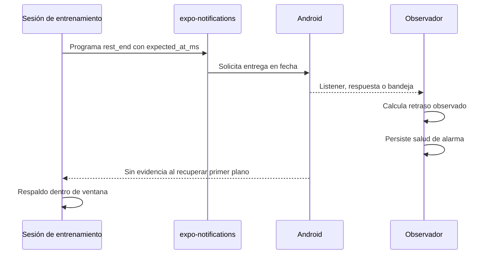

# Permisos Android y fiabilidad de avisos

Esta página cubre dos contratos distintos. El primero limita los permisos que una variante Android puede declarar y comprueba tanto las dependencias como el manifiesto fusionado de producción. El segundo registra lo que la aplicación **observa** de un aviso de descanso: una declaración en Expo no prueba una concesión del usuario, una entrega de Android ni puntualidad.

## Contrato declarativo

`apps/mobile/app.json` es la fuente de la lista declarada por Expo. Solo declara `WAKE_LOCK`, `VIBRATE`, `RECEIVE_BOOT_COMPLETED` y `SCHEDULE_EXACT_ALARM`; bloquea `USE_EXACT_ALARM`, `REQUEST_INSTALL_PACKAGES`, `RECORD_AUDIO` y `SYSTEM_ALERT_WINDOW`. En particular, `FOREGROUND_SERVICE` ya no forma parte ni de la configuración, ni de la política permitida, ni del conjunto esperado del artefacto. `expo-av` conserva `microphonePermission: false` para expresar que reproduce avisos pero no graba audio.

`app.config.ts` carga esa base y exige un `APP_ENV` válido. Según la variante, reemplaza `android.package` —además del identificador iOS, nombre y metadatos de entorno—, pero no cambia la lista de permisos. También reconstruye el plugin `expo-notifications` para incluir los sonidos definidos en `notifications/notificationSounds.json`.

La fuente de aprobación es `scripts/android-permissions/policy.json`. Sus listas `allowedPermissions` y `blockedPermissions`, y un `rationale` por cada permiso, deben evolucionar junto con `app.json`.

| Permiso | Estado | Significado operativo |
| --- | --- | --- |
| `WAKE_LOCK`, `VIBRATE`, `RECEIVE_BOOT_COMPLETED` | Permitidos y declarados | La política los asocia respectivamente con despertar/vibrar el aviso y reprogramar avisos tras reiniciar. |
| `SCHEDULE_EXACT_ALARM` | Permitido y declarado | Es la capacidad asociada al aviso de fin de descanso; declararlo no acredita que el usuario haya habilitado «Alarmas y recordatorios». |
| `USE_EXACT_ALARM` | Bloqueado | Es distinto de `SCHEDULE_EXACT_ALARM` y Google Play lo reserva a aplicaciones de alarma o calendario. |
| `REQUEST_INSTALL_PACKAGES`, `RECORD_AUDIO`, `SYSTEM_ALERT_WINDOW` | Bloqueados | La aplicación no instala paquetes, no graba audio y no dibuja sobre otras aplicaciones; el bloqueo evita que el manifest merger los reintroduzca. |

## Dos controles complementarios

`checkAndroidPermissions` lee `app.json`, normaliza las formas corta y `android.permission.*`, y compara la declaración con la política: detecta permisos prohibidos, deriva en ambos sentidos y bloqueos ausentes. Después recorre los `node_modules` de la raíz y de `apps/mobile`, sin seguir enlaces simbólicos y omitiendo los fragmentos configurados para ejemplos, pruebas e intermedios. Si no encuentra ningún `AndroidManifest.xml`, añade `scanner-empty`: ejecute `npm ci` antes de interpretar el resultado como válido.

Al extraer un manifest, una entrada `<uses-permission>` con `tools:node="remove"` no cuenta como contribución: es una orden para que el merger retire el permiso. Una dependencia no reconocida que aporte un permiso bloqueado genera `dependency-contribution`. `react-native` es el único contribuidor reconocido actualmente, porque su manifest de depuración aporta `SYSTEM_ALERT_WINDOW`; ese reconocimiento no hace aceptable el permiso final.



*El escáner local descubre deriva y aportaciones de dependencias; el control de release examina el manifiesto fusionado real.*

El escáner del checkout no demuestra el resultado del merger. Durante la validación de producción, `production-release.mjs` rechaza cada permiso bloqueado **y** exige que el conjunto único de permisos del manifiesto coincida exactamente con `expectedArtifactPermissions`. Así detecta tanto un bloqueado como una incorporación o retirada inesperada. `expectedMergedExtras` solo documenta aportaciones legítimas previsibles de dependencias; no es el criterio que aplica el verificador de artefacto.

## Ciclo de vida del aviso de descanso

Al existir una sesión activa, `initWorkoutNotifications` solicita el permiso de notificaciones y, en Android, crea el canal `rest_end_alert` con importancia máxima, sonido, vibración, visibilidad pública y `bypassDnd`. Sus errores se trazan y no interrumpen la sesión. La inicialización se reinicia para una nueva sesión activa.

Una notificación solo es programable si la sesión está en ejecución, en descanso, tiene tiempo restante, ciclo y revisión de alarma válidos, y una hora futura. Al entrar en ese estado o cambiar la revisión, el efecto de ciclo de vida programa el aviso mientras la app sigue en primer plano; no espera a que llegue el evento de segundo plano. Antes elimina los avisos `rest_end` programados o presentados, comprueba que el payload no haya quedado obsoleto, y agenda mediante `expo-notifications` una fecha en el canal. El payload identifica sesión, ciclo y revisión, e incluye `kind: "rest_end"` y `expected_at_ms`; una operación posterior cancela el identificador que haya quedado obsoleto.



*La aplicación mide una entrega que puede observar, no una concesión de alarmas exactas ni la ausencia de una entrega.*

## Evidencia de entrega y recuperación

La aplicación obtiene evidencia por el listener de recepción, por una respuesta al pulsar la notificación o al encontrar el aviso correspondiente en la bandeja o como última respuesta. Con el `expected_at_ms` del payload calcula `max(0, deliveredAt - expectedAt)`. `recordAlarmObservation` guarda directamente en AsyncStorage `lastDelayMs`, `lastObservedAt` y `lateStreak`, ya que estas observaciones pueden ocurrir justo antes de que el proceso pase a segundo plano. Más de cinco segundos es tardío; una observación puntual reinicia la racha. La interfaz muestra **Con retraso**, **A tiempo** o **Sin comprobar**.

La ausencia de un listener no es prueba de pérdida: Android puede haber terminado el proceso. Al volver a primer plano —y también durante la recuperación en arranque— se consulta primero bandeja y última respuesta, se limpian avisos `rest_end` ajenos y solo se suprime el respaldo si hay evidencia del mismo ciclo. Si no la hay, `shouldPlayRecoveredRestAlert` permite reproducir la alerta local únicamente desde el vencimiento hasta 120 segundos después. El momento de volver a la app no se registra como retraso de la alarma. El candado del reproductor limita además alertas locales solapadas.

Los diagnósticos pueden consultar el permiso de notificaciones y la importancia del canal, pero la puntualidad se deduce exclusivamente de esas observaciones. En Android, la acción de ajustes abre `REQUEST_SCHEDULE_EXACT_ALARM` para el paquete de la variante y, si falla, usa `Linking.openSettings()`. Es una vía de configuración para el usuario, no una consulta JavaScript de `canScheduleExactAlarms` ni una garantía sobre entregas futuras.

## Cambio seguro y validación

1. Al modificar `android.permissions` o `blockedPermissions`, actualice en la misma revisión las listas y el motivo de `policy.json`; el contrato exige igualdad exacta entre lo declarado y lo permitido.
2. Si una dependencia aporta un bloqueado, confirme que `blockedPermissions` lo neutraliza. Añadirla a `acknowledgedContributors` solo documenta el origen para el escáner; no la autoriza en el APK/AAB.
3. Cambios en el parser o la política requieren casos en `permissions.test.mjs`. La prueba cubre el contrato real, todos los códigos de infracción, el recorrido de manifests, el reconocimiento condicionado de `react-native`, el parseo de `tools:node="remove"` y las propiedades de normalización.
4. Para cambios de programación, listeners, recuperación, canal o sonido, pruebe en Android con permisos concedidos y denegados, primer y segundo plano, retorno a la app y un dispositivo con restricciones de batería. La E2E de entrenamiento levanta Expo Web y Playwright para flujos de rutinas y sesiones; no valida capacidades Android.
5. Una candidata de producción necesita además `npm run verify:production-artifact`, que inspecciona el APK/AAB fusionado; el escáner local no lo sustituye.

```bash
npm ci
npm run check:android-permissions
npm run test:android-permissions
npm --workspace apps/mobile exec tsc --noEmit
```

Los dos primeros comandos comprueban la configuración y dependencias instaladas, y prueban el evaluador. TypeScript y la E2E web aportan cobertura de código o interfaz, no confirman permisos, canales, intents, entrega en segundo plano ni puntualidad Android.
