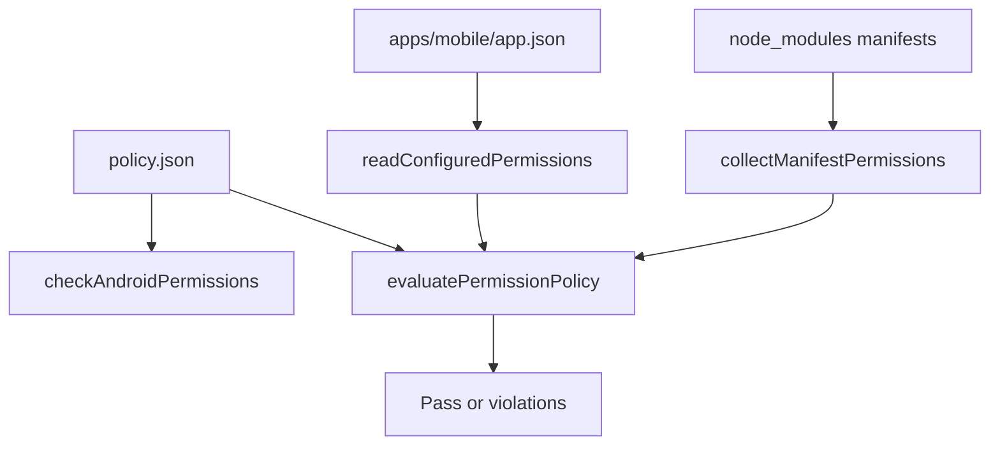

# Validación de permisos Android publicables

Consulta esta página al modificar `apps/mobile/app.json`, dependencias Expo/React Native, configuración nativa, avisos de descanso o la publicación Android. El contrato evita que el manifiesto publicable declare permisos incompatibles con Google Play y detecta permisos prohibidos que una dependencia podría aportar durante el *manifest merger*. Es una barrera de entrega nativa que complementa la configuración y publicación de [Compilación, publicación y pruebas](build-release-and-testing.md); no es un permiso en tiempo de ejecución ni un sustituto de la prueba de la aplicación en un dispositivo.

## Fuente de verdad y límite del escáner

`scripts/android-permissions/policy.json` es la fuente única de verdad. Apunta a `apps/mobile/app.json`, donde Expo declara `expo.android.permissions` y `expo.android.blockedPermissions`. `scripts/android-permissions/permissions.mjs` normaliza la forma corta o `android.permission.*`, compara la configuración con esa política y recorre `node_modules` de la raíz y de `apps/mobile` en busca de `AndroidManifest.xml`. El programa de entrada `check.mjs` devuelve error cuando encuentra una infracción.

*La política compara la configuración declarativa de Expo y las aportaciones de los manifests de dependencias antes de considerar publicable una compilación.*

La ausencia de manifests es una infracción `scanner-empty`: antes de ejecutar el control se requiere `npm ci`. El escáner no sigue enlaces simbólicos para evitar ciclos y omite ejemplos, pruebas de Android y artefactos intermedios. Esta política inspecciona las dependencias instaladas, no reconstruye ni analiza el manifiesto final de un AAB.

## Contrato de permisos actual

La política permite exactamente `FOREGROUND_SERVICE`, `WAKE_LOCK`, `VIBRATE`, `RECEIVE_BOOT_COMPLETED` y `SCHEDULE_EXACT_ALARM`; la configuración debe contener todos ellos y ningún permiso adicional no reconocido. Los motivos de producto pertenecen a `policy.json::rationale`: el aviso de descanso necesita `WAKE_LOCK`, vibración, reprogramación tras reinicio y alarma exacta concedible por el usuario. `FOREGROUND_SERVICE` está documentado como declarado sin un servicio o `foregroundServiceType` y no debe retirarse o conservarse sin actualizar coordinadamente la política y validar el comportamiento nativo.

`USE_EXACT_ALARM` está prohibido. Google Play lo reserva para aplicaciones cuya función principal es despertador o calendario; Gymnasia no pertenece a esa categoría. Debe aparecer en `expo.android.blockedPermissions` para que el *manifest merger* no pueda reintroducirlo desde una dependencia. `SCHEDULE_EXACT_ALARM` es distinto: permanece declarado y se concede mediante la configuración de alarmas y recordatorios del usuario.

Una entrada `<uses-permission ... tools:node="remove"/>` no cuenta como declaración del permiso: ordena al *manifest merger* eliminarla. No conviertas una simple búsqueda textual de esa línea en un fallo, porque produciría un falso positivo. `expectedMergedExtras` enumera contribuciones legítimas esperadas de dependencias para una futura validación del manifiesto fusionado; el control actual no las verifica.

## Receta de cambio

1. Identifica si el cambio toca permisos explícitos, una dependencia con Android, notificaciones, alarmas o la configuración de Expo. El propietario de la lista declarada es `apps/mobile/app.json`; el propietario del contrato es `scripts/android-permissions/policy.json`.
2. Si se añade o retira un permiso, actualiza coordinadamente `allowedPermissions` y su `rationale`. La lista aprobada y la lista declarada deben coincidir; no uses la política para silenciar una divergencia sin un motivo de producto y publicación.
3. Para un permiso prohibido aportado por una dependencia, confirma primero que `blockedPermissions` lo elimina en la configuración Expo. Solo después registra el paquete en `acknowledgedContributors`; esa lista significa que la aportación es conocida y neutralizada, no que el permiso sea aceptable.
4. Mantén la prueba de contrato y las pruebas de evaluador en `permissions.test.mjs`. Cubre el permiso añadido o retirado, configuración bloqueada, contribución de dependencia y el comportamiento del parser si cambias el escáner.
5. Ejecuta los controles específicos y, si cambia la configuración nativa o una dependencia, sigue la validación nativa condicional de [Compilación, publicación y pruebas](build-release-and-testing.md). Una exportación web no comprueba permisos Android ni el manifiesto de un artefacto EAS.

## Validación proporcional

| Cambio | Validación mínima | Cuándo ampliar |
|---|---|---|
| Política, escáner o pruebas de permisos | `npm run test:android-permissions` | Añade `npm run check:android-permissions` para ejercer la configuración y dependencias instaladas reales. |
| `apps/mobile/app.json` o dependencia móvil | `npm run check:android-permissions && npm run test:android-permissions` | Añade TypeScript y una compilación/prueba nativa cuando afecte a complementos, permisos, alarmas, notificaciones o recursos. |
| Candidata de publicación Android | Ambos controles de permisos | Inspecciona el artefacto real e instálalo en un dispositivo representativo; el escáner no verifica el manifiesto fusionado del AAB/APK. |

`prompt-policy.yml` ejecuta ambos controles en CI junto con la política de rutas, la paridad del prompt, pruebas del agente, OpenWiki y TypeScript. Para una iteración exclusiva de permisos, no hace falta ejecutar esas baterías ajenas; antes de publicar, aplica la escalada de [Compilación, publicación y pruebas](build-release-and-testing.md).

## Límites y riesgos

- El escáner depende de dependencias instaladas y falla sin manifests; no intentes obtener un resultado verde sin `npm ci`.
- La política detecta contribuciones prohibidas de dependencias, pero no confirma por sí sola el contenido del manifiesto fusionado del artefacto de EAS.
- Los permisos son contrato de plataforma y privacidad. No documentes ni afirmes que un permiso es necesario solo por estar presente: conserva o modifica la razón verificable de la política y prueba el flujo nativo afectado.
- El contenido de `apps/mobile/android` puede estar obsoleto y no es la fuente de verdad para este contrato; usa `apps/mobile/app.json` y la política.
