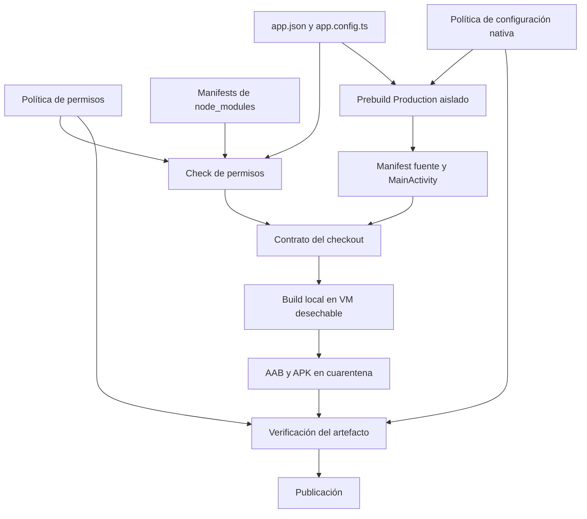

# Permisos y configuración Android

La política Android aplica **defensa en profundidad**: la configuración Expo declara el mínimo necesario, una lista de bloqueos evita que el manifest merger recupere capacidades no aprobadas y los controles verifican tanto el checkout como el binario final. Ninguna señal sustituye a otra: los manifests de dependencias anticipan deriva, `expo prebuild` comprueba lo que genera Expo y la inspección del artefacto comprueba el manifest fusionado que se distribuye.

La fuente declarativa es `apps/mobile/app.json`; las políticas revisables viven en `scripts/android-permissions/policy.json` y `scripts/android-native-config/policy.json`. No trate `apps/mobile/android/` como fuente de verdad: es un resultado ignorado de `expo prebuild` y puede estar obsoleto.

## Superficie aprobada y mínimo privilegio

La configuración Expo declara solo cuatro permisos Android:

| Permiso | Motivo aprobado |
| --- | --- |
| `WAKE_LOCK` | Permite despertar el dispositivo para el aviso de fin de descanso. |
| `VIBRATE` | Habilita la vibración configurable del aviso. |
| `RECEIVE_BOOT_COMPLETED` | Permite reprogramar avisos después de reiniciar el dispositivo. |
| `SCHEDULE_EXACT_ALARM` | Habilita la alarma exacta del aviso de descanso; el usuario la gestiona en «Alarmas y recordatorios». |

En cambio, `expo.android.blockedPermissions` bloquea `USE_EXACT_ALARM`, `REQUEST_INSTALL_PACKAGES`, `RECORD_AUDIO` y `SYSTEM_ALERT_WINDOW`. El bloqueo no es documentación pasiva: ordena al merger retirar esas aportaciones. `USE_EXACT_ALARM` no equivale a `SCHEDULE_EXACT_ALARM` y no se admite; tampoco se admite `FOREGROUND_SERVICE`.

`expo-av` se configura con `microphonePermission: false`: la app reproduce avisos, no graba audio. Al incorporar un plugin o SDK, parta de que puede introducir permisos implícitos y justifique cada excepción en la política, el inventario de privacidad y las comprobaciones antes de declararla.

`app.config.ts` carga la base de `app.json` y exige `APP_ENV` (`development`, `staging` o `production`). Cambia nombre, identificador de paquete, canal y espacio de almacenamiento según la variante, pero conserva la base Android y, tras eliminar una posible entrada previa, añade el plugin `expo-notifications` con los sonidos definidos en `notifications/notificationSounds.json`. Por tanto, cambiar un sonido o plugin también es un cambio de configuración nativa, aunque no modifique `android.permissions`.

## Tres observaciones, tres límites


```mermaid
flowchart TD
    Config["app.json y app.config.ts"] --> PermissionCheck["Check de permisos"]
    PermissionPolicy["Política de permisos"] --> PermissionCheck
    Dependencies["Manifests de node_modules"] --> PermissionCheck
    Config --> Prebuild["Prebuild Production aislado"]
    NativePolicy["Política de configuración nativa"] --> Prebuild
    Prebuild --> SourceManifest["Manifest fuente y MainActivity"]
    PermissionCheck --> SourceGate["Contrato del checkout"]
    SourceManifest --> SourceGate
    SourceGate --> LocalBuild["Build local en VM desechable"]
    LocalBuild --> Quarantine["AAB y APK en cuarentena"]
    Quarantine --> ArtifactCheck["Verificación del artefacto"]
    PermissionPolicy --> ArtifactCheck
    NativePolicy --> ArtifactCheck
    ArtifactCheck --> Release["Publicación"]
```

*El checkout, el código nativo generado y el binario fusionado son observaciones distintas; la publicación exige las puertas de fuente y artefacto.*

### 1. Política declarativa y dependencias instaladas

`checkAndroidPermissions` normaliza tanto nombres cortos como `android.permission.*` y exige dos invariantes:

- La lista `expo.android.permissions` debe coincidir exactamente con `allowedPermissions`: detecta permisos no aprobados y también retiradas no reflejadas en la política.
- Cada permiso bloqueado debe seguir en `expo.android.blockedPermissions`.

Después recorre los `node_modules` de la raíz y de `apps/mobile`, sin seguir enlaces simbólicos y omitiendo ejemplos, pruebas e intermedios configurados. Extrae `<uses-permission>` de cada `AndroidManifest.xml`; una entrada con `tools:node="remove"` se ignora porque es una instrucción para retirar el permiso durante el merger, no una contribución. Si ningún manifest está disponible, falla con `scanner-empty`: instale dependencias con `npm ci`; un verde sin manifests no es evidencia.

Una contribución bloqueada de una dependencia desconocida produce `dependency-contribution`. `acknowledgedContributors` solo reconoce el origen para hacer el diagnóstico accionable —actualmente `react-native` por su manifest de depuración con `SYSTEM_ALERT_WINDOW`—; no permite que el permiso aparezca en un APK/AAB. Mantenga el bloqueo y compruebe el binario final. Para consumo programático, `node scripts/android-permissions/check.mjs --json` devuelve la configuración, el número de manifests, las aportaciones y las infracciones, y usa código de salida no nulo si las hay.

### 2. Contrato del prebuild Production

`check:android-native-config` no reutiliza el directorio Android del checkout. Copia `apps/mobile` a un directorio temporal, excluye productos generados y dependencias, enlaza los `node_modules` instalados y ejecuta `expo prebuild --platform android --clean --no-install` con `APP_ENV=production`. Así el check no modifica la fuente ni valida accidentalmente un prebuild antiguo.

Sobre el resultado generado verifica conjuntos exactos de permisos fuente y directivas `tools:node="remove"`, y rechaza en las declaraciones de origen `FOREGROUND_SERVICE` y los permisos bloqueados. También exige:

- `android:enableOnBackInvokedCallback="false"` en `application`.
- La configuración de `.MainActivity`: exportada, orientación vertical, `singleTask` y los marcadores Kotlin revisados que preservan la integración React y el comportamiento de Atrás.
- Exactamente los cinco sonidos WAV aprobados (`ascending.wav`, `beep.wav`, `bell.wav`, `buzzer.wav` y `rest_finished.wav`) en `res/raw`.
- Cero advertencias de `expo prebuild`, salvo que la política las permita explícitamente; hoy la lista permitida está vacía.

Este contrato distingue dos listas que no deben mezclarse: el manifest **fuente** puede contener directivas de retirada para permisos que una dependencia aportaría, mientras que el artefacto no debe contener esos permisos. Un `grep` de `USE_EXACT_ALARM` sobre el manifest fuente puede encontrar la directiva `remove` y dar un falso positivo.

### 3. Evidencia de release y manifest fusionado

El workflow `build-apk.yml` valida el SHA exacto con `verify:production-source`, que vuelve a ejecutar los gates canónicos —incluidos ambos checks y sus pruebas— y falla si alguno ensucia el checkout. Después, `compile-android` compila el candidato validado en el runner de build dentro de una VM desechable, genera primero AAB y después APK, y transfiere ambos binarios y sus metadatos como resultados no confiables a una cuarentena de verificación independiente.

`verify:production-artifact` extrae el manifest con herramientas Android (`apkanalyzer` para APK; `bundletool` para AAB), inspecciona firma, SDK, configuración integrada, sonidos, tamaño, hashes y MIME. Para permisos aplica dos condiciones sobre el manifest fusionado:

1. Rechaza cualquier elemento de `blockedPermissions`.
2. Exige igualdad exacta con `expectedArtifactPermissions`.

El segundo control detecta tanto permisos inesperados como retiradas no revisadas. La lista es mayor que los cuatro permisos declarados porque documenta el conjunto completo observado en el binario, incluidas aportaciones legítimas de librerías y permisos específicos de launcher o paquete. `expectedMergedExtras` sirve para documentar aportaciones relevantes y para el inventario de Data safety; no relaja la igualdad del artefacto.

Cada verificación escribe evidencia `ProductionArtifactEvidenceV2`, con el commit y hash de la evidencia de fuente, hash/tamaño/identidad del binario, permisos y sonidos observados, snapshot de política y herramientas usadas. El workflow liga además cada AAB y APK validado a su intento y a la transacción durable, exige el mismo `versionCode` para ambos, y conserva el borrador si compilar o verificar falla.

Solo después se restaura el AAB validado, se persiste la intención de envío y se envía a Play Internal. Antes de desborrar la release se comprueba el estado durable, los hashes de los dos binarios y de sus evidencias, la evidencia Play y el vínculo de ambas evidencias de artefacto con la misma evidencia de fuente. No publique ni interprete un APK local como equivalente de esta cadena protegida.

## Operación y cambios seguros

### Comprobación reproducible del checkout

Ejecute desde la raíz, con una instalación limpia o actualizada:

```bash
npm ci
npm run check:android-permissions
npm run test:android-permissions
npm run check:android-native-config
npm run test:android-native-config
npm run check:data-inventory
npm run test:data-inventory
```

Los dos primeros comandos de cada familia tienen roles distintos: `check:*` evalúa el checkout actual y `test:*` prueba que el evaluador detecta regresiones mediante fixtures, casos unitarios y propiedades. El check de permisos necesita manifests instalados; el nativo necesita Expo CLI y ejecuta un prebuild temporal. Ninguno prueba la concesión del usuario, una notificación en segundo plano ni el comportamiento en un dispositivo.

El inventario de datos consume la política de permisos: exige una clasificación Data safety para cada permiso permitido y para cada extra relevante esperado del merger. Por privacidad, añadir o retirar un permiso debe actualizar la política de permisos, el contrato nativo cuando afecte al prebuild, el inventario y las declaraciones publicables correspondientes.

### Secuencia para modificar permisos, plugin o configuración nativa

1. **Defina la necesidad mínima.** Evite permisos amplios o de instalación, micrófono, superposición y servicio en primer plano salvo que exista una función aprobada y una revisión de privacidad.
2. **Cambie las fuentes de verdad en la misma revisión.** Para un permiso declarado, actualice `app.json`, `allowedPermissions` y su `rationale`; para un bloqueo, actualice `blockedPermissions` en ambos lados. Ajuste `expectedArtifactPermissions` únicamente con evidencia de un artefacto revisado, no para silenciar un fallo.
3. **Actualice el contrato generado.** Si cambian plugins, sonidos, `app.config.ts`, `MainActivity` o manifest, revise `scripts/android-native-config/policy.json` y por qué el cambio es seguro. No edite `apps/mobile/android/` para esquivar el control.
4. **Mantenga la trazabilidad de privacidad.** Actualice `scripts/data-inventory/inventory.json` y las declaraciones publicables si la capacidad implica datos, fotos, audio, red o un nuevo tercero.
5. **Ejecute la batería focalizada anterior.** Añada o modifique fixtures y pruebas cuando cambie el parser, una categoría de infracción o la política.
6. **Para publicar, use el workflow Production.** Solo su candidato exacto obtiene evidencia de fuente y de APK/AAB. Complete la release con una instalación manual en dispositivo representativo, comprobando permisos denegados/concedidos, avisos, segundo plano y retorno a primer plano.

## Diagnóstico de fallos

| Señal | Interpretación y siguiente acción |
| --- | --- |
| `config-drift` o `config-missing-block` | `app.json` y la política no evolucionaron juntos. Corrija la intención o el contrato; no elimine el check. |
| `dependency-contribution` | Una dependencia aporta un permiso bloqueado. Confirme que el bloqueo lo elimina; reconozca el contribuidor solo si se conoce y sigue siendo neutralizado. |
| `scanner-empty` | No hay dependencias/manifests legibles. Ejecute `npm ci`; no considere satisfactorio el resultado previo. |
| `source-permissions`, `removal-directives` o `forbidden-source-permission` | El prebuild Production difiere del contrato o una capacidad prohibida llegó al manifest fuente. Revise plugin/configuración y las directivas de merger. |
| `main-activity-*`, `application-attribute` o `notification-sounds` | Expo o un plugin alteró integración de actividad, atributo nativo o recursos empaquetados. Actualice la política solo tras revisar el cambio funcional. |
| `prebuild-warning` | Hay una advertencia no aprobada. Investíguela; no añada una allowlist genérica. |
| `permission` o `artifact-permissions` | El APK/AAB fusionado contiene un bloqueado o no coincide con el conjunto revisado. Detenga la publicación e identifique la dependencia/manifest que cambió. |

## Cobertura y límites de las pruebas

`permissions.test.mjs` prueba el contrato real, las infracciones `config-blocked`, `config-drift`, `config-missing-block` y `dependency-contribution`, el recorrido vivo de manifests instalados, la normalización y que `tools:node="remove"` no declare un permiso. `native-config.test.mjs` prueba los conjuntos exactos, los atributos y marcadores requeridos, advertencias, parser y tolerancia a orden/duplicados. Son guard rails deterministas: no reemplazan el manifest de un artefacto ni una prueba nativa manual.

La E2E de entrenamiento y otras E2E web sirven para UI y estado en navegador; no validan permisos Android, manifest merger, `MainActivity`, canal de notificaciones, alarmas, intents, audio ni ejecución en segundo plano. Para la cadena de publicación y sus controles remotos, consulte [Build, release y estrategia de validación](build-release-and-testing.md); para la configuración y ciclo de runtime móvil, consulte [Shell y navegación de la aplicación móvil](../mobile/application-shell.md).
