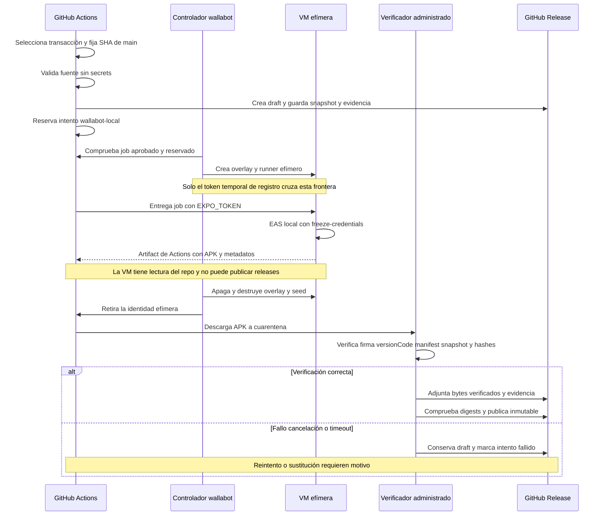

# Build y publicación Android de producción

La ruta canónica es [`.github/workflows/build-apk.yml`](../../.github/workflows/build-apk.yml). Se activa por un cambio relevante en `apps/mobile/**` fusionado a `main` o manualmente con `workflow_dispatch`; la concurrencia `android-production-release` serializa ejecuciones y no cancela la anterior. El resultado normal es una GitHub Release inmutable con `gymnasia.apk`, la transacción, evidencia de fuente y evidencia de artefacto. La promoción posterior a Google Play es otra operación: debe reutilizar el AAB ya validado y no autoriza una nueva build.

> **Invariantes de seguridad:** se compila exactamente el SHA de `main` que superó los gates; la versión está confirmada antes del workflow; el `versionCode` debe superar al último APK publicado; EAS se ejecuta localmente con `--freeze-credentials`; y ningún resultado se publica antes de verificar independientemente sus bytes y su cadena de evidencia.

## Contrato y estado durable

La unidad de trabajo es `AndroidReleaseTransactionV1`, persistida en el draft como `android-release-transaction.json`. Fija `version`, tag, `sourceCommit`, perfil `production-apk`, tipo `apk`, intentos y transiciones. Sus estados son `prepared`, `build-running`, `build-finished`, `failed`, `validated` y `superseded` —además de los estados históricos de build cloud—. El draft se crea **antes** de despachar la compilación, por lo que una caída del workflow no pierde la reserva.

La selección siempre atiende la transacción pendiente de menor versión semántica. Si no existe, crea una para la versión actual solo cuando esta es posterior a la última publicada. Una transacción fallida bloquea las posteriores hasta que un operador elige, con versión y motivo explícitos:

- `retry-failed`: vuelve de `failed` a `prepared` y conserva todo el intento anterior;
- `supersede-failed`: marca la versión `superseded` sin compilar y permite avanzar;
- `reconcile`: reanuda el intento durable existente, pero no autoriza una recompilación.

No se debe usar “re-run jobs” para eludir esta máquina de estados, ni borrar el draft para desbloquear la cola. Un APK ya validado es inmutable: reconciliar puede refrescar el hash de su JSON de evidencia, pero solo si SHA-256 y tamaño del APK siguen siendo idénticos.

### Versión de aplicación y `versionCode`

La versión semántica ya debe estar confirmada en `apps/mobile/app.json`. La política de PR toma el mayor valor entre base y releases publicadas, aplica el incremento de Conventional Commits y exige la coincidencia exacta; el workflow de release no modifica Git.

[`apps/mobile/eas.json`](../../apps/mobile/eas.json) mantiene `appVersionSource: remote` y `autoIncrement: true`; por eso Expo sigue siendo la autoridad del contador aun cuando la compilación sea local. Antes de validar, el verificador descarga la evidencia del último APK publicado y exige que el `versionCode` nuevo sea un entero positivo, no reutilizado y estrictamente mayor. Un intento que consumió contador no habilita su reutilización.

## Secuencia y fronteras de credencial



*El diagrama separa control cloud, credencial de registro del runner, credencial Expo dentro del guest, verificación en cuarentena y publicación con estados recuperables.*

Las fronteras son deliberadas:

1. **`validate-production`** corre en un runner administrado, con `contents: read`, sin environment ni secrets. Consulta controles de GitHub y reejecuta todos los gates.
2. **`prepare-production`** usa el environment `Production` y permiso de escritura para crear/actualizar el draft y reservar el intento. Congela hashes de snapshot, bundle de política y evidencia previa.
3. **`compile-android`** es el único job self-hosted. Recibe `EXPO_TOKEN` para consultar proyecto, firma administrada y contador, pero solo `contents: read`; no recibe capacidad para publicar una release. EAS usa `--local --non-interactive --freeze-credentials`, por lo que no crea una build cloud ni puede generar o cambiar claves.
4. **`verify-and-release`** vuelve a un runner administrado, no recibe `EXPO_TOKEN`, descarga el resultado a cuarentena y tiene el permiso de publicación. Solo tras validar y contrastar digests convierte el draft en release.
5. El controlador instalado de wallabot no procede del checkout del job. Su GitHub App está limitada al repositorio y a lectura de Actions, metadatos y administración de runners; la clave administrativa no entra en la VM. Al guest solo pasa un token temporal para registrar una identidad efímera y exclusiva del run e intento.

Nunca deben incorporarse a Git, artifacts, metadatos o logs tokens, keystores, contraseñas, rutas privadas, solicitudes de provisión ni diagnósticos sensibles. `local-build-metadata.json` tiene una lista cerrada de campos operativos y rechaza entorno, credenciales, host, logs y rutas.

## Flujo de extremo a extremo

### 1. Selección y validación del SHA exacto

`select-transaction` parte del SHA actual de `main`, pero una reconciliación puede seleccionar el `sourceCommit` de un draft anterior. Todos los jobs posteriores hacen checkout de ese SHA inmutable, no de una punta móvil. `verify:production-source` rechaza si:

- el checkout está sucio, cambia durante los gates o no es alcanzable desde `origin/main`;
- `origin`, ref, SHA esperado, versión, perfil o tipo de artefacto no coinciden;
- falta una PR fusionada a `main` o alguno de los status checks exigidos;
- el ruleset permite bypass o deja de exigir PR y checks;
- el environment `Production` deja de admitir solo ramas protegidas o pierde al aprobador esperado;
- una consulta remota falla: el error no se convierte en éxito.

Después ejecuta en orden la lista única `PRODUCTION_GATES`: políticas de prompt y salud, permisos y configuración nativa Android, inventario de datos y legal, paridad del prompt, pruebas deterministas y OpenWiki, contrato de release, TypeScript, export Android de Production y los E2E del agente y entrenamiento. Produce `ProductionSourceEvidenceV1` con el SHA, versión, controles, gates y resultado. Para la relación entre estos gates y el resto de CI, véase [Estrategia de validación](/openwiki/testing/validation-strategy.md).

### 2. Snapshot y reserva antes de compilar

Para un intento nuevo, `prepare-production` genera el snapshot firmado de política y empaqueta sus cuatro módulos; en reintentos restaura exactamente los assets del draft. Esto enlaza la release con el candidato de política aprobado; el contexto arquitectónico está en [Política y seguridad sanitaria](/openwiki/architecture/policy-and-health-safety.md) y la promoción en [Promoción de políticas](/openwiki/operations/policy-promotion.md).

Antes de despachar wallabot, el controlador:

- valida la evidencia de fuente contra la transacción;
- descarga y autentica la evidencia del último APK publicado como línea base de firma y `versionCode`;
- asigna una identidad `wallabot-local` derivada de run, intento y SHA;
- registra la toolchain fijada y los SHA-256 de los inputs inmutables;
- persiste la transacción y esos inputs tanto en el draft como en un artifact de Actions.

Si una ejecución anterior ya terminó pero dejó `build-running` sin resultado verificable, la reserva la convierte en `failed` y exige una decisión manual; no vuelve a compilar automáticamente. Si ya existe un resultado terminado o validado, `should_build` es falso y la reconciliación recupera el artifact del intento original.

### 3. Runner efímero y EAS local

El controlador de wallabot solo admite `compile-android` del workflow canónico en el repositorio, rama y eventos permitidos, después de que selección, validación y preparación hayan concluido y no queden aprobaciones pendientes. La etiqueta específica `gymnasia-RUN_ID-RUN_ATTEMPT` evita que otro run capture la VM. Cada job recibe un overlay nuevo, un runner registrado con `--ephemeral --disableupdate` y una identidad que el controlador retira al finalizar.

Dentro del guest, `run-local-build.mjs` vuelve a comprobar repositorio, `main`, identidad de intento, SHA de checkout, versión, hashes de inputs y la toolchain de [`ops/android-build/toolchain.json`](../../ops/android-build/toolchain.json). También exige usuario no root y ausencia de grupos o dispositivos de administración, Docker, KVM y GPU. Ejecuta:

```bash
eas build --platform android --profile production-apk \
  --local --non-interactive --freeze-credentials --output <archivo-temporal>
```

El perfil hereda `APP_ENV=production`, `autoIncrement: true` y produce APK. La VM usa la toolchain fijada —Node, npm, Java, EAS CLI, Android SDK/build-tools/platform-tools, NDK, command-line tools y CMake— en vez de descargar sustitutos durante el job. El único resultado exportado es el APK junto con metadatos mínimos que contienen identidad, toolchain, tamaño y SHA-256; el log privado de EAS se destruye con el guest.

### 4. Verificación independiente y publicación

El APK se trata como no confiable. `verify-and-release` lo descarga junto a sus metadatos en una cuarentena que debe contener exactamente esos dos archivos, finaliza el intento y persiste `build-finished` antes de analizarlo. `verify:production-artifact` comprueba:

- identidad del intento y coincidencia de SHA-256 y tamaño con los metadatos;
- `versionCode` estrictamente superior a la evidencia anterior;
- estructura APK, MIME, nombre publicado y límites de tamaño;
- firma criptográfica y certificado de subida aprobado;
- package, `versionName`, minSdk, targetSdk y conjunto exacto de permisos del manifest fusionado;
- configuración Production, snapshot firmado y sonidos nativos esperados;
- enlace íntegro a `ProductionSourceEvidenceV1` y ejecución completa de sus gates.

El resultado es `ProductionArtifactEvidenceV1`. La transacción pasa a `validated` con el hash y tamaño del APK y el hash de esta evidencia. Después se adjuntan los assets al draft y se vuelven a consultar desde GitHub: target SHA, MIME, límites y digests de APK, transacción, ambas evidencias e inputs deben coincidir. Solo entonces `gh release edit ... --draft=false --latest` hace pública la release inmutable.

## Operación, fallos y recuperación

### Ejecución normal

Un push relevante a `main` inicia el flujo. Para operar una transacción bloqueada, lanzar manualmente **Build Production APK & Publish Release** sobre `main` con una de estas combinaciones:

| Operación | Cuándo | Entradas obligatorias | Efecto |
| --- | --- | --- | --- |
| `reconcile` | Hay draft no fallido o se quiere auditar una versión ya publicada | Ninguna adicional | Reutiliza estado y bytes existentes |
| `retry-failed` | La transacción más antigua está `failed` y la misma fuente sigue siendo publicable | `target_version` y `reason` | Autoriza un intento nuevo sin borrar historial |
| `supersede-failed` | La versión fallida no debe publicarse | `target_version` y `reason` | Cierra esa versión y permite la siguiente |

No incluir secretos ni detalles privados del host en `reason`. Tras publicar o sustituir, `enqueue-next` consulta la versión actual de `main` y encola otra reconciliación si es posterior, manteniendo el orden semántico.

### Semántica de fallo

- Si compilar o verificar falla, o el job se cancela, el finalizador conserva el draft y transforma un intento activo/terminado en `failed` con motivo. La versión queda bloqueada.
- Si el APK ya quedó validado y falla la publicación, hay que reconciliar **los mismos bytes**; no autorizar otra build.
- Si el artifact de Actions aún existe, reconciliar lo recupera por run e intento originales. Si expiró, la recuperación manual debe partir exactamente del asset del draft y comprobar su hash, no reconstruirlo.
- Pérdida de red, reinicio o muerte del controlador no crea otra identidad ni otro build: el siguiente ciclo recupera la reserva durable, limpia la VM y retira esa misma identidad.
- Ante cancelación, mantenimiento, indisponibilidad prolongada de GitHub o timeout, wallabot detiene el guest. La limpieza se ejecuta también desde el hook de systemd si muere el controlador: elimina overlay, seed y material temporal, verifica la imagen base y después retira el runner cuando GitHub confirma que está offline y libre.
- El paso `if: always()` del job borra checkout y temporales; esta limpieza en guest complementa, pero no sustituye, la destrucción del overlay en el host.

### Parada y reversión a EAS cloud

La reversión es transaccional, no un atajo:

1. Deshabilitar el timer del controlador para impedir nuevas asignaciones. Si hay VM activa, detener deliberadamente el servicio, conservar el diario administrativo y reconciliar la retirada de **esa** identidad.
2. Esperar el resultado del intento o marcarlo `failed` con motivo. Un intento local validado debe publicarse con sus mismos bytes antes de cambiar backend.
3. Restaurar por PR revisada únicamente el workflow cloud desde `ops/android-build/build-apk.eas-cloud.yml`; mantener los scripts de transacción, que entienden ambos backends.
4. Sobre una versión fallida, usar `retry-failed` con motivo explícito de vuelta a `eas-cloud`. Se conserva SHA, versión, snapshot e historial, y se vuelve a consumir cuota de Expo.

No eliminar el proyecto Expo, sus credenciales ni la imagen base, ni convertir el ID del intento local en un build ID remoto.

## Runbook resumido de wallabot

La administración completa está en [`ops/android-build/README.md`](../../ops/android-build/README.md); esa fuente es obligatoria para instalar, hornear, auditar, activar, mantener o revertir el host. En síntesis:

- instalar el host, hornear una imagen **sin credenciales** y ejecutar la auditoría de aislamiento antes de habilitar provisión;
- mantener toolchain, imagen, runner y descargas fijados por versión y hash; repetir auditoría tras cualquier cambio;
- probar ausencia de acceso a red privada, puertos, montajes compartidos, privilegios, Docker, GPU y virtualización anidada;
- instalar el controlador como código root revisado e independiente de los checkouts; la GitHub App se limita al repositorio y su clave permanece fuera del guest;
- activar el timer solo después de una prueba integral con runner efímero, build, verificación, apagado, limpieza y retirada de identidad;
- usar el bloqueo de mantenimiento para impedir nuevas reservas y nunca borrar el ledger para forzar otro intento;
- comprobar limpieza y recuperación ante éxito, cancelación, caída de QEMU y timeout.

Estas tareas requieren intervención administrativa y revisión del runbook vigente. No se copian aquí comandos de custodia, ubicaciones privadas ni procedimientos de traslado de credenciales.

## Pruebas enfocadas

Desde un checkout de desarrollo sin credenciales:

```bash
npm run test:production-release
```

La suite cubre el contrato del workflow, selección de la transacción más antigua, transiciones y reconciliación idempotente, prohibición de sustituir bytes validados, identidad y metadatos locales, monotonicidad de `versionCode`, admisión de VM y limpieza de árboles de procesos. Las pruebas específicas del host descritas en el runbook cubren provisión, registro y transporte sin red.

Estas pruebas no certifican por sí solas el aislamiento real, la firma administrada, el contador remoto, la instalación física ni la retirada efectiva de un runner. Para una release real siguen siendo obligatorios `verify:production-source`, el build aprobado en `Production`, `verify:production-artifact`, la cadena de digests del draft y la limpieza observada del host.

## Publicación en Google Play

El workflow canónico documentado aquí publica un **APK en GitHub**, no promueve una release de Play. Para Play se genera y verifica un AAB con perfil `production`, se sube primero a Prueba interna y se promociona el **mismo AAB** a Prueba cerrada, sin volver a invocar EAS. Registrar aplicación, track, release ID, fecha, `versionName`, `versionCode`, SHA-256, certificado, actor/aprobador, smoke e informe de pre-lanzamiento. Los gates y la política de promoción están en [`docs/store/google-play/production-promotion-gates.md`](../../docs/store/google-play/production-promotion-gates.md).
