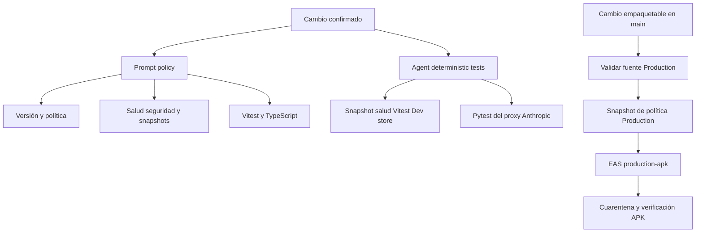
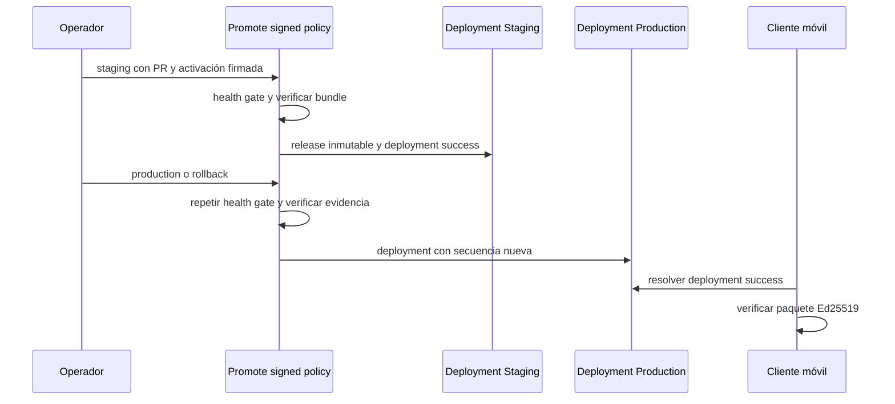

# Compilación, publicación y pruebas

## Alcance y principio de selección

Gymnasia es un espacio de trabajo npm con aplicaciones en `apps/*`. La aplicación Expo está en `apps/mobile`; la raíz concentra los comandos de política, controles de publicación y orquestación. Aunque `package.json` declara metadatos de Yarn, el bloqueo confirmado y los workflows usan npm: parta de una instalación limpia con `npm ci`.

No interprete `npm test` como una verificación global ni confunda una política publicada con el APK. Hay cinco fronteras independientes:

1. **snapshot de prompt:** el prompt fuente y los módulos generados que el agente empaqueta deben ser idénticos;
2. **salud y seguridad:** la política declarativa, sus casos deterministas, el bloque administrado del prompt y el runtime generado deben cumplir su contrato sin red ni secretos;
3. **política firmada:** un bundle y una activación canónicos, firmados con Ed25519 y anclados en raíces confiables, deben ser aptos para un canal;
4. **promoción:** Staging y Production autorizan y registran el mismo candidato inmutable mediante deployments de GitHub;
5. **producto:** las pruebas del agente, el tipado, los E2E y la compilación/publicación Android validan código y artefactos de la aplicación.

Una comprobación de una frontera no sustituye a otra. En particular, `check:health-safety` no firma ni promueve una política, la promoción no reemplaza las pruebas del agente, y la aprobación de un APK no vuelve a evaluar la política remota.

## Matriz de comandos mínima

Ejecute `npm ci` antes de comprobadores que inspeccionan dependencias o antes de reproducir CI. Los comandos de sincronización con `--write` modifican fuentes generadas: úselos para actualizar deliberadamente artefactos y confirme el resultado; los comandos `check:*` fallan ante divergencias y son los adecuados para validar.

| Frontera o cambio | Comando mínimo | Qué valida y qué no valida |
| --- | --- | --- |
| `prompts/AGENTS.md` o el snapshot de chat generado | `npm run check:chat-prompt` | Reconstruye y compara el snapshot del prompt. No valida reglas sanitarias ni firmas. Para regenerar intencionadamente: `npm run sync:chat-prompt`. |
| `policy/health-safety/**`, el bloque sanitario del prompt o módulos sanitarios generados | `npm run check:health-safety && npm run test:health-safety` | El primero valida esquemas, herramientas declaradas, bloque administrado, detección de exfiltración, snapshots de prompt/runtime y fixtures seguros; el segundo ejecuta pruebas Node de unidad, contrato, regresión y propiedades. No es una evaluación LLM autorizadora. Para modificar fuentes y snapshots de forma intencionada: `npm run sync:health-safety`. |
| Cambios de rutas sensibles, `CODEOWNERS`, ruleset, workflows de gobierno o scripts de promoción | `npm run check:prompt-policy && npm run test:prompt-policy` | Comprueba salidas generadas y ejecuta pruebas de la política de prompt **y** de `scripts/policy-promotion`. No publica ni firma. Ejecute `npm run sync:prompt-policy` solo tras cambiar la fuente declarativa. |
| Bundle, firma, activación, raíces de confianza o integración móvil de política firmada | `npm run test:prompt-policy && npm test` | Las pruebas Node cubren contrato y firma/promoción; Vitest cubre, entre otras cosas, el contrato del deployment y la verificación Ed25519 en el cliente. Añada el gate sanitario si cambian contenidos de salud. |
| Lógica, herramientas, persistencia, catálogos, dieta o mediciones del agente móvil | `npm test` | Ejecuta `test:deterministic` de Vitest y `test:dev-store` (comprobador más pruebas Node). No ejecuta Playwright, EAS ni una exportación de producción. |
| Archivo de prueba móvil concreto | `npm --workspace apps/mobile exec vitest run --config vitest.config.mts agent/path/to/file.test.ts` | Acelera la iteración sobre un archivo; sustituya la ruta por la prueba responsable. |
| Tipos de la app móvil | `npm --workspace apps/mobile exec tsc --noEmit` | Comprueba TypeScript, no el empaquetado ni el comportamiento en dispositivo. |
| Flujo de chat o proveedor de desarrollo en la web | `npm run test:agent:e2e` | Ejecuta los E2E de chat y proveedor de desarrollo. |
| Flujo de entrenamiento | `npm run test:train:e2e` | Ejecuta el E2E de usabilidad de entrenamiento; no sustituye el comportamiento nativo en segundo plano. |
| Configuración/permisos Android o dependencia nativa | `npm run check:android-permissions && npm run test:android-permissions` | Contrasta permisos declarados y manifests de dependencias con la política, además de sus pruebas. Complete con compilación nativa y dispositivo para APIs nativas. Véase [Validación de permisos Android publicables](android-permissions.md). |
| Exportación web | `npm --workspace apps/mobile run build:web` | Ejecuta `expo export --platform web`; no prueba un APK ni servicios remotos. |
| Artefacto publicable Android | no hay sustituto local único; use el workflow `Build Production APK & Publish Release` | Revalida fuente y gates, prepara el snapshot de política Production, compila con EAS y verifica el APK antes de publicar. |

`npm test` equivale a `npm run test:deterministic && npm run test:dev-store`. La configuración Vitest móvil incluye pruebas de `agent`, `backup`, `catalogs`, `diet`, `measurements`, `persistence` y `storage`; por eso sigue siendo una batería de producto más amplia que una prueba aislada del agente, pero no incluye los scripts E2E ni los controles de política de la raíz.

El comando `npm run test:llm` sigue siendo un marcador de posición: ejecutarlo correctamente no demuestra calidad ni seguridad de respuestas. La puerta sanitaria usa evaluación determinista y exige que el ejemplo LLM sea informativo (`authorizing=false`), no una autorización basada en modelo.

## CI: qué ejecuta cada workflow

*Los checks de PR son distintos de la cadena que firma/prepara política y de la publicación del binario.*

### `prompt-policy.yml`: control transversal requerido

`Prompt policy` se ejecuta en todas las PR y en cada push a `main`, sin filtros de ruta. Tras `npm ci` exige, en este orden operativo, versión Production confirmada, artefactos de gobierno, pruebas de gobierno/promoción, permisos Android y sus pruebas, política sanitaria y sus pruebas, inventario de datos y su suite, política de privacidad generada y su suite, snapshot de chat, `npm test`, pruebas de automatización OpenWiki y TypeScript. Su resumen solo informa resultados, no contenido de prompts, secretos, conversaciones ni datos personales.

Por tanto, un cambio exclusivamente sanitario debe correr localmente al menos los dos comandos sanitarios; un cambio de gobierno debe correr sus dos comandos específicos. En PR el workflow amplía ambos hasta la batería transversal, pero eso no convierte la promoción de política ni la compilación EAS en checks de PR.

### `agent-tests.yml`: CI determinista por rutas

`Agent deterministic tests` se activa para PR y push a `main` cuando cambian las rutas móviles, workers/proxy, prompts, política o scripts sanitarios, dev store, determinados documentos, manifiestos npm o workflows OpenWiki/propio. Tiene un job Node 22 de diez minutos con permisos de lectura: instala con `npm ci`, comprueba el snapshot de chat y la política sanitaria, ejecuta sus pruebas, `npm test`, el E2E Metro protegido de dev store, la suite del feedback worker, las pruebas OpenWiki y TypeScript. Un segundo job aislado instala `uv` y ejecuta `pytest` para `apps/anthropic_proxy`.

No realiza la validación de permisos Android, E2E generales de Playwright, exportación web, firma/promoción de política ni compilación EAS. Los cambios fuera de sus filtros tampoco reciben este workflow; `prompt-policy.yml` es el check transversal.

## Política sanitaria, snapshots y promoción firmada

La comprobación sanitaria lee la fuente canónica bajo `policy/health-safety`, extrae las herramientas anunciadas de `apps/mobile/agent/toolDefinitions.ts`, compara el bloque administrado de `prompts/AGENTS.md`, y compara tanto el snapshot de prompt como el módulo de runtime incluidos en móvil. También rechaza patrones de exfiltración y garantiza que los casos seguros y el informe determinista sean válidos. Se diseña para operar sin red, secretos ni evaluación LLM autorizadora.

La promoción es manual mediante `Promote signed policy` (`workflow_dispatch`), con operación `staging`, `production` o `rollback`, un motivo codificado y los cuerpos de activación/firma en Base64. El workflow serializa Staging y Production por canales distintos y no cancela operaciones anteriores.

*Production reutiliza un candidato ya publicado en Staging; el cliente solo acepta deployments y artefactos con identidad y firma verificables.*

En Staging, salvo el bootstrap único desde `main` protegido, la fuente debe ser una PR abierta contra `main` cuyo SHA tenga `prompt-policy` y `gymnasia/owner-authorization` correctos. El workflow descarga el candidato desde ese SHA pero usa el verificador de `main` confiable; vuelve a correr `check:health-safety`, verifica bundle, firma, activación, raíces, canal y correspondencia con fuentes, genera un informe sanitario y publica una release inmutable de pre-release con evidencia.

Production descarga esa release en vez de reconstruir el bundle. Repite la puerta sanitaria y la verificación, exige evidencia con hashes coincidentes, propietario y gate sanitario correcto, requiere que el candidato sea el último Staging para una activación normal y exige una secuencia mayor que cualquier deployment Production. Un rollback debe referirse al bundle Production actual y puede apuntar a un candidato previamente Production. La aprobación de entorno es `Production` o `Production Critical` si la activación es crítica; al éxito se registra el deployment y el status `gymnasia/policy-promotion`.

El cliente móvil consulta solo deployments `gymnasia-policy` del canal pedido, acepta el primer payload schema 3 con URLs exactas de la release del repositorio y estado más reciente `success`, y cachea tanto resultado como error durante cinco minutos. El paquete firmado se rechaza si no es JSON canónico, si se altera bundle/firma/activación, si la raíz no está integrada, si entorno/canal/herramientas/protocolo no corresponden, o si la activación no es reciente y su certificado no está vigente. Consulte [Ciclo de vida de política firmada](../agent/signed-policy-lifecycle.md) y [Runtime del agente](../agent/runtime.md) para el consumo en la app.

## Compilación y publicación del APK

La configuración efectiva de Expo y EAS es `apps/mobile/app.json` y `apps/mobile/eas.json`. `production-apk` hereda `production`, fija `APP_ENV=production`, habilita `autoIncrement` remoto y fuerza `android.buildType: apk`; el workflow nunca elige un perfil mediante input. La versión visible procede de `app.json` confirmado. La comprobación de versión Production exige un incremento semántico cuando cambia una ruta empaquetable de `apps/mobile/`: `feat` incrementa minor, un cambio incompatible incrementa major y el resto patch, tomando el máximo entre base y releases publicadas.

`Build Production APK & Publish Release` se inicia manualmente (reconciliar, reintentar o sustituir un fallo) o al hacer push a `main` con cambios empaquetables. Excluye scripts, Markdown, `public/` y tests de la app. La concurrencia global `android-production-release` conserva la ejecución precedente; la transacción durable escoge primero la versión pendiente más antigua.

1. **Fuente:** antes de exponer `EXPO_TOKEN`, valida el SHA exacto, checkout limpio, procedencia y alcanzabilidad desde `main`, ruleset activo sin bypass, entorno Production protegido, PR fusionada y los checks requeridos. Después ejecuta todos los gates de Production y falla si alguno modifica el checkout.
2. **Gates de Production:** incluyen los checks y suites de prompt-policy, permisos Android, salud/seguridad, inventario, legal, snapshot de chat, `npm test`, OpenWiki, pruebas de release, TypeScript, `expo export --platform android --dev` con `APP_ENV=production`, y los E2E de agente y entrenamiento. Esto es más amplio que ambos workflows de PR.
3. **Snapshot de política:** para una transacción nueva, `prepare-policy-snapshot.mjs --environment production` resuelve el último deployment Production correcto, descarga el bundle y firma desde su release, verifica digest, raíces, firmas, canal, herramientas y evidencia sanitaria, y genera los módulos de prompt/runtime/paquete firmado más metadatos. La transacción conserva un tar y el snapshot para que un reintento reutilice exactamente esas entradas inmutables.
4. **EAS y transacción:** el workflow crea un draft, adopta como máximo un build EAS con mismo perfil, versión, commit y mensaje, o envía uno con `--no-wait`; persiste el ID y consulta el estado. Un timeout de GitHub no invalida por sí mismo el build: `reconcile` puede retomarlo. Solo `ERRORED` y `CANCELED` son terminales; `retry-failed` y `supersede-failed` requieren versión y motivo.
5. **Cuarentena y publicación:** descarga primero a `/tmp/gymnasia.apk.download`, verifica con `verify:production-artifact` la identidad del binario y la cadena de evidencia antes de renombrarlo. Luego adjunta APK, transacción, evidencia de fuente, evidencia de artefacto y snapshots al draft; vuelve a comprobar commit, MIME, límites de tamaño y hashes de assets de GitHub antes de hacerlo público como `gymnasia.apk`.

La validación automatizada no sustituye instalar la candidata en un dispositivo Android: compruebe versión visible, datos locales, notificaciones, alarmas y comportamiento de segundo plano. Una exportación web o los E2E web no validan esas APIs nativas.

## Recetas por cambio

- **Sólo prompt no sanitario:** `npm run check:chat-prompt`, después `npm test` si cambia la conducta del agente.
- **Regla sanitaria o runtime sanitario:** `npm run check:health-safety && npm run test:health-safety`, `npm run check:chat-prompt`, `npm test`; incluya el control de gobierno si cambia una ruta sensible.
- **Firma, roots, activación o workflow de promoción:** `npm run check:prompt-policy && npm run test:prompt-policy && npm test`. No ejecute una promoción real para probar una edición: requiere entradas firmadas, un motivo y aprobación de entorno.
- **Cliente que resuelve o verifica política remota:** `npm --workspace apps/mobile exec vitest run --config vitest.config.mts agent/policyDeployment.test.ts agent/signedPolicy.test.ts`, seguido de `npm test`.
- **Código móvil empaquetable:** `npm test`, TypeScript, el E2E responsable y, si cambia configuración/empaquetado, `npm --workspace apps/mobile run build:web`. Para permisos o módulos nativos, añada los dos controles Android y una prueba de dispositivo.
- **Candidato de APK:** no omita los gates de fuente ni reemplace el workflow por `eas build` manual; inspeccione la evidencia y pruebe el APK publicado en un dispositivo.

Para orientación de privacidad y permisos Android, consulte [Validación de permisos Android publicables](android-permissions.md).
