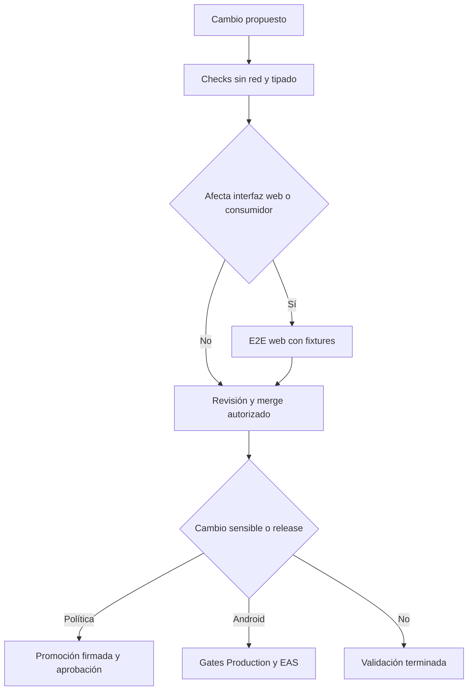
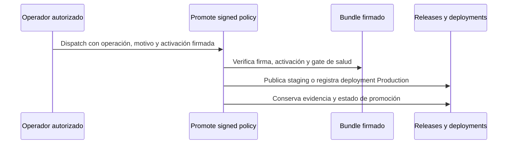
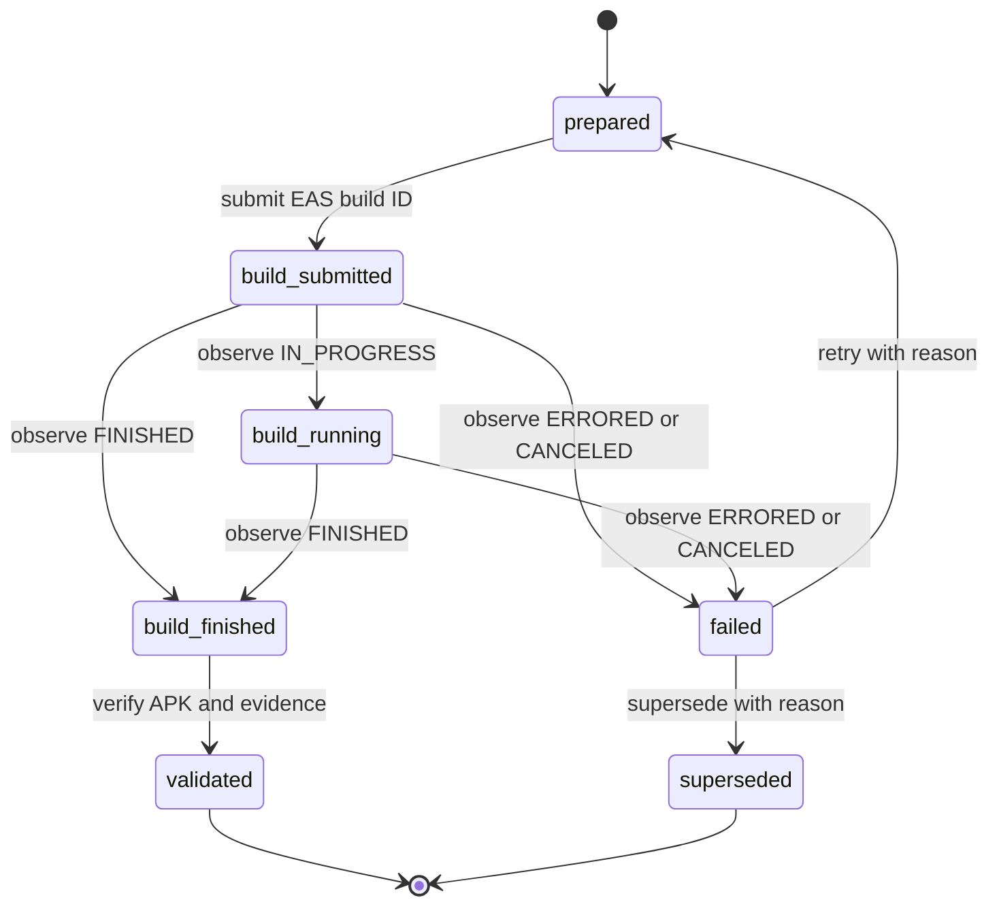

# Compilación, publicación y validación

## Principio operativo

La validación es proporcional al cambio y sus límites importan tanto como sus resultados. En este repositorio hay cuatro clases que no deben confundirse:

1. **Comprobaciones deterministas y sin red:** analizan contratos, archivos generados, tipos o lógica con fixtures. Son la primera señal para cambios locales y deben ser reproducibles tras `npm ci`.
2. **E2E web controlada:** exportan o sirven la aplicación React Native Web y usan Playwright con almacenamiento y respuestas interceptadas. Prueban una proyección web concreta, no Android ni iOS.
3. **Operaciones con credenciales o estado remoto:** promoción de política, EAS y publicación de GitHub. Requieren permisos, environments o secretos y no se sustituyen con una prueba local.
4. **Despliegue o verificación manual:** instalación de un APK y promoción de política son decisiones de producción. La automatización conserva evidencia y bloquea estados inseguros, pero no reemplaza la aprobación explícita ni la prueba en dispositivo.



*El flujo separa señales locales, E2E web y actos remotos protegidos; ninguna flecha convierte la cobertura web en validación nativa.*

## Entradas de compilación

El monorepo npm declara `apps/*` como workspaces. Aunque `package.json` conserva un campo `packageManager` de Yarn, la automatización instala con `npm ci`; trate `package-lock.json` como parte del contrato reproducible. Para una instalación limpia equivalente a CI:

```bash
npm ci
```

La aplicación móvil vive en `apps/mobile`. Sus scripts fijan `APP_ENV=development` para desarrollo y exigen que `app.config.ts` reciba un entorno válido (`development`, `staging` o `production`). Esa configuración deriva nombre, identificador de aplicación, namespace de almacenamiento, canal de política y modo de proveedor; para staging y producción el modo de proveedor es `byok`. Por tanto, no ejecute `expo config`, una exportación o EAS suponiendo que la ausencia de `APP_ENV` usará una variante segura.

```bash
npm run dev:mobile
npm --workspace apps/mobile run web
npm --workspace apps/mobile run android
npm --workspace apps/mobile run ios
npm --workspace apps/mobile run build:web
```

`build:web` hace `expo export --platform web` y genera `apps/mobile/dist`. Es útil para detectar problemas de empaquetado y es la entrada de las E2E web, pero una exportación satisfactoria no valida permisos fusionados, alarmas, notificaciones, SecureStore, intents, audio en segundo plano ni instalación Android/iOS. Para cambios en plugins, permisos, recursos nativos o identificadores, añada compilación nativa y una prueba en dispositivo.

La configuración declarativa de Android permite `FOREGROUND_SERVICE`, `WAKE_LOCK`, `VIBRATE`, `RECEIVE_BOOT_COMPLETED` y `SCHEDULE_EXACT_ALARM`, y bloquea permisos de riesgo, incluidos `USE_EXACT_ALARM`, `REQUEST_INSTALL_PACKAGES`, `RECORD_AUDIO` y `SYSTEM_ALERT_WINDOW`. El comprobador no se limita a `app.json`: inspecciona manifests de dependencias instaladas y detecta deriva de configuración o contribuciones prohibidas. Necesita `node_modules`, de modo que se ejecuta después de `npm ci`.

Consulte también [Validación de permisos Android publicables](android-permissions.md).

## Pruebas deterministas y E2E

| Cambio | Validación focalizada | Alcance y límite |
| --- | --- | --- |
| Agente, prompt integrado o almacenamiento de desarrollo | `npm test` | Ejecuta la suite determinista móvil y los tests del dev store; no es un agregador de todas las pruebas del repositorio. |
| Tipos móviles | `npm --workspace apps/mobile exec tsc --noEmit` | Solo análisis estático. |
| Configuración, permiso o dependencia Android | `npm run check:android-permissions && npm run test:android-permissions` | Contrato, infracciones, vivacidad del escáner y propiedades; no sustituye un manifest generado ni un dispositivo. |
| Catálogos o sus artefactos | `npm run check:catalogs && npm run test:catalogs` | Revisa todos los dominios y que los generados estén al día. |
| Consumidores de catálogos | `npm run test:catalogs:e2e` | E2E de navegador con exportación development y rutas de red simuladas; no consulta servicios externos. |
| Chat/agente web | `npm run test:agent:e2e` | Exporta web cuando no se suministra `AGENT_E2E_URL`, siembra almacenamiento e intercepta dependencias; no prueba capacidades nativas. |
| Entrenamiento web | `npm run test:train:e2e` | Interacción Playwright en la web; no cubre notificaciones ni ejecución en segundo plano. |
| Proxy Python | `npm run test:proxy` | Ejecuta `pytest` con `uv` en el proyecto aislado. |

Los catálogos se regeneran solo de forma intencional:

```bash
npm run sync:catalogs
# o limitar escritura a un dominio
node scripts/catalogs/generate.mjs --write --domain alimentos
```

`--check` no admite `--domain`: valida todos los catálogos y los artefactos generados para impedir que un cambio parcial o una salida obsoleta se publique. El workflow `catalog-tests.yml` se activa para rutas de datos, generador y consumidores relevantes; instala Chromium y ejecuta `check:catalogs`, `test:catalogs` y `test:catalogs:e2e` con permiso de lectura de contenidos.

Las E2E de catálogo y agente son deliberadamente controladas. Por ejemplo, la de catálogos exporta una variante development y Playwright intercepta GitHub/raw GitHub con fixtures, incluso para simular indisponibilidad. La del agente construye y sirve `dist` por defecto, permite usar `AGENT_E2E_URL` o `AGENT_E2E_PORT`, e inyecta un endpoint de feedback falso que Playwright intercepta. Esas pruebas dan confianza sobre integración de interfaz, estado local y manejo de respuestas, no evidencia de disponibilidad de los proveedores reales ni de comportamiento de Android/iOS.

El proxy Anthropic es el único proyecto Python y permanece aislado de la instalación npm: requiere Python 3.12+, usa `uv` con `package = false`, y sus dependencias de desarrollo (`pytest`, `hypothesis`, `httpx`) son opcionales del propio proyecto. El job `anthropic-proxy` de CI instala `uv` y ejecuta `uv run --project apps/anthropic_proxy --extra dev pytest apps/anthropic_proxy`; el job Node no instala su entorno. Véase [Proxy Anthropic](../services/anthropic-proxy.md).

## Integración continua

`agent-tests.yml` corre en PR y en `main` solo para las rutas declaradas: móvil, feedback worker, proxy, prompts, política de salud, scripts relacionados, lockfile/manifiesto y automatización OpenWiki. El job determinista usa Ubuntu, Node 22, `npm ci`, permisos `contents: read` y límite de 10 minutos; comprueba el prompt integrado y la política de salud, ejecuta sus tests, `npm test`, E2E protegida del dev store, la suite del feedback worker, pruebas de OpenWiki y TypeScript. El job Python es separado. Un cambio fuera del filtro no recibe este workflow; tampoco debe suponerse que sustituye la validación de catálogo o una compilación EAS.

Antes de fusionar cambios en `prompts/` o `policy/health-safety/`, ejecute las comprobaciones de política pertinentes y obtenga **aprobación explícita del mantenedor**. No recomiende ni realice el merge solo porque una batería quede verde. Para el marco de autorización y archivos generados, consulte [Gobierno de cambios sensibles y política de prompt](prompt-policy-governance.md) y [Entrega de políticas](../architecture/policy-delivery.md).

## Catálogos y permisos: escribir frente a comprobar

Los generadores tienen dos modos con responsabilidades distintas:

- `npm run check:catalogs` evalúa contratos y deriva; falla sin modificar el checkout cuando un artefacto necesario está desactualizado.
- `npm run sync:catalogs` escribe las salidas inspeccionadas. Revise y confirme esos cambios junto con la fuente de catálogo; no use la escritura como sustituto de los tests de consumidores.
- `npm run check:android-permissions` compara configuración y manifests instalados con la política; `npm run test:android-permissions` comprueba que el propio evaluador detecte cada clase de fallo y que el escáner realmente lea manifests.

Este orden separa una corrección de fuente de una afirmación sobre el artefacto final. En especial, que el escáner esté verde no demuestra que Google Play acepte una variante ni que una alarma funcione en un teléfono: valida el contrato disponible en el checkout instalado.

## Política firmada: operación manual con aprobación

`promote-policy.yml` solo se inicia por `workflow_dispatch`. Sus entradas exigen operación (`staging`, `production` o `rollback`), un código de motivo y una activación canónica más su firma en Base64; staging además identifica una PR abierta, salvo el bootstrap único de `main`. No promueva una política ni haga merge de cambios en `prompts/` o `policy/health-safety/` sin aprobación explícita del mantenedor.

Para staging, el workflow resuelve una PR abierta contra `main`, exige que `prompt-policy` y `gymnasia/owner-authorization` hayan terminado correctamente en el SHA de la PR, y separa el checkout candidato del verificador confiable. Reinstala sin scripts, repite `check:health-safety`, verifica bundle, firma y activación contra las raíces confiables, y publica un release inmutable de candidato junto con evidencia y un deployment de Staging.

Para producción o rollback, descarga el candidato publicado, vuelve a verificar firma, activación, hashes y gate de salud contra el commit fuente, y exige una promoción previa de staging y una secuencia de activación creciente. Un rollback debe referenciar el bundle de producción actual y puede aceptar staging inactivo. El job de publicación usa `Production` o `Production Critical` según la criticidad y registra deployment y estado `gymnasia/policy-promotion`; la auditoría final registra la operación y puede notificar mediante secretos de Telegram. Estas son operaciones con credenciales y environments, no comandos de desarrollo.



*La promoción verifica una identidad firmada y una autorización remota antes de cambiar el canal; no deriva autorización de una prueba local.*

## Release Android de producción

La publicación automática/manual de Android vive en `build-apk.yml`. Los pushes a `main` solo reaccionan a rutas empaquetadas de `apps/mobile` y excluyen scripts, Markdown, `public/` y tests; `workflow_dispatch` permite únicamente `reconcile`, `retry-failed` o `supersede-failed`. La concurrencia global `android-production-release` no cancela una ejecución en curso.

El perfil publicable es `production-apk`, que hereda `production`, usa `APP_ENV=production` y fuerza APK. El perfil `production` produce AAB; no confunda ambos destinos. EAS administra el incremento remoto del `versionCode`, mientras que la versión visible procede de `apps/mobile/app.json` confirmado. Para todo cambio que cuente como ruta empaquetada, el cálculo de versión exige un incremento desde el máximo de la base/release publicada: `feat` incrementa minor, cambios con ruptura incrementan major y el resto patch.

Antes de leer `EXPO_TOKEN` o enviar EAS, el workflow ejecuta `verify:production-source` sobre el SHA exacto. Este verificador comprueba el perfil/tipo de artefacto, checkout limpio y alcanzable desde `main`, reglas y environment de Production, PR fusionada y estados requeridos; después corre, en orden, los gates canónicos de política, permisos, salud, inventario de datos, legal, prompt, tests, OpenWiki, release, tipos, export Android de desarrollo y E2E del agente/entrenamiento. Si un gate ensucia el checkout o falla, la evidencia no es publicable.



*La transacción durable conserva el SHA, perfil, intentos y transiciones: un timeout del runner permite reconciliar, mientras que `ERRORED` o `CANCELED` exige una decisión manual motivada.*

La transacción `AndroidReleaseTransactionV1` se guarda en un draft de GitHub antes de EAS. En reconciliación se adopta como máximo un build existente que coincida con perfil, versión, SHA y mensaje; si no existe, se envía uno. Al terminar EAS, el APK se descarga a cuarentena y se verifica antes de renombrarlo: URL HTTPS, MIME HTTP/local, límites de tamaño, estructura APK frente a AAB, paquete, SDK, versión, permisos bloqueados, configuración de variante, snapshot de política y certificado. Solo entonces se adjuntan `gymnasia.apk`, transacción y evidencias, se vuelve a comprobar identidad, MIME, tamaño y cadena de hashes en el draft y se publica la release.

Los límites actuales para APK/AAB son 50–200 MiB; el APK publicado debe llamarse `gymnasia.apk` y usar `application/vnd.android.package-archive`. Una versión publicada se verifica, no se recompila ni se sobrescribe. Una ejecución que termina en `ERRORED` o `CANCELED` no salta automáticamente a la siguiente: el operador debe reintentar o sustituir exactamente la versión más antigua y aportar un motivo.

Aun con todos los gates verdes, antes de distribuir un APK instálelo en un dispositivo representativo y compruebe versión, migración/conservación de datos, notificaciones, alarmas y comportamiento en segundo plano. El repositorio no implementa un actualizador desde GitHub; la instalación directa es un flujo manual separado de la distribución de Play.

## Selección recomendada

- **Cambio de lógica aislada:** test determinista responsable, después `npm test` y TypeScript si toca el workspace móvil.
- **Cambio de interfaz o almacenamiento web:** exportación y la E2E específica; amplíe a las E2E vecinas si cruza sus contratos.
- **Cambio de catálogo:** `check:catalogs`, tests de catálogo y E2E de consumidores; ejecute `sync:catalogs` solo para actualizar salidas esperadas.
- **Cambio de permisos, plugin Expo o dependencia nativa:** controles de permisos, tipado y exportación; además una compilación nativa/EAS adecuada y prueba manual en dispositivo. Una E2E web no cubre capacidades nativas.
- **Cambio de proxy:** `npm run test:proxy`; no lo mezcle con dependencias npm ni lo convierta en servicio de producción.
- **Cambio sensible de prompt o salud:** controles de política y aprobación explícita del mantenedor antes de merge; la promoción firmada es un acto manual posterior, no una consecuencia automática del merge.
- **Release Android:** no sustituya `verify:production-source`, los controles remotos, el environment de Production ni la inspección del APK por comandos locales.

Para el inventario de repositorios y propiedad de datos, consulte [Repositorios y fuentes de contenido](../content/repositories.md); para inicio local, [Inicio rápido](../quickstart.md); y para el backend de incidencias, [Feedback worker](../services/feedback-worker.md).
