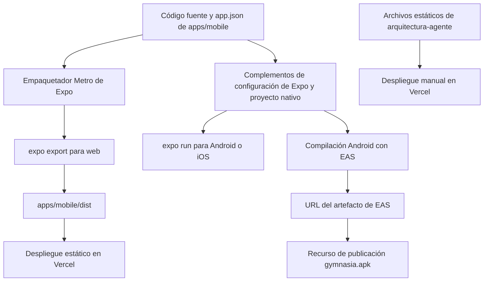
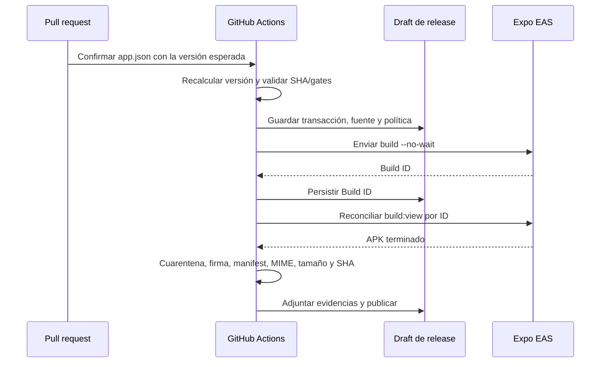

# Compilación, publicación y pruebas

## Alcance

Este repositorio tiene tres entregables operativamente independientes:

1. la aplicación Expo React Native en `apps/mobile`, que se ejecuta en Android, iOS y React Native Web;
2. la exportación web estática de esa aplicación, desplegada desde `apps/mobile/dist`;
3. el tablero estático e independiente de seguimiento en `arquitectura-agente`, servido sin compilación.

El proxy CORS de Anthropic es un servicio de desarrollo, no forma parte de la exportación estática de Expo ni del artefacto Android de EAS. El tráfico de Anthropic desde el navegador puede necesitarlo; el tráfico de proveedores desde entornos nativos no.

## Responsabilidad sobre manifiestos y configuración

El repositorio es un espacio de trabajo npm, a pesar de que los metadatos `packageManager` de la raíz indican Yarn 1. El archivo de bloqueo confirmado y todos los comandos de CI documentados utilizan npm (`npm ci`, `npm --workspace` y `npm run`). No cambie de gestor de paquetes a la ligera: el archivo de bloqueo y la caché de CI son entradas operativas administradas por npm.

| Archivo | Responsabilidad efectiva | Límite importante |
| --- | --- | --- |
| `/package.json` | Declara los espacios de trabajo `apps/*`, los alias de comandos de la raíz y las versiones de Playwright/Vitest/fast-check | Los alias de pruebas de la raíz solo sirven para la orquestación; no implican que todas las baterías se ejecuten en CI |
| `/package-lock.json` | Grafo reproducible de dependencias npm utilizado por `npm ci` | Los cambios de dependencias deben actualizarlo |
| `/apps/mobile/package.json` | Punto de entrada de Expo, scripts de la aplicación, dependencias de ejecución y versión de TypeScript | Su `version: 1.0.0` no es la versión de publicación de Expo que muestra la aplicación |
| `/image-generation/pyproject.toml` | Gestiona el entorno independiente de generación de imágenes con Python 3.12 y sus dependencias `gradio-client`, `httpx`, `python-dotenv` y `websockets` | No es un manifiesto de un espacio de trabajo npm; administre esta utilidad con `uv` desde `image-generation` |
| `/apps/mobile/app.json` | Metadatos canónicos de la aplicación Expo: versión, identificadores, recursos, permisos, complementos e ID del proyecto EAS | La versión debe quedar confirmada en el PR; el workflow de publicación nunca modifica Git |
| `/apps/mobile/eas.json` | Perfiles EAS efectivos cuando los comandos se ejecutan desde `apps/mobile` | La vista previa genera explícitamente un APK de Android; producción no declara `buildType: apk` |
| `/eas.json` | Política EAS similar en la raíz | No es el archivo de perfiles utilizado por el flujo de trabajo incluido, que cambia a `apps/mobile` |
| `/app.json` | Objeto Expo vacío en la raíz | No es la configuración Expo efectiva de la aplicación móvil |
| `/apps/mobile/vercel.json` | Comandos de compilación, salida e instalación de la web móvil | `npm run build:web` se ejecuta en el proyecto móvil y publica `dist` |
| `/arquitectura-agente/vercel.json` | Solo limpieza de URL del tablero | El despliegue del tablero es estático y no tiene compilación |
| `/apps/mobile/vitest.config.mts` | Entorno de pruebas Node e inclusión de `agent/**/*.test.ts` | La batería determinista se centra en el agente, no es una batería unitaria completa de interfaz/dominio |
| `/.github/workflows/agent-tests.yml` | CI determinista y control de TypeScript | Filtrado por rutas para cambios en la aplicación móvil y en el manifiesto/archivo de bloqueo de la raíz |
| `/.github/prompt-policy.json` y `/scripts/prompt-policy/` | Fuente declarativa y generador del gobierno de cambios sensibles | Generan `CODEOWNERS` y el ruleset; consulte [Gobierno de cambios sensibles y política de prompt](prompt-policy-governance.md) antes de editar salidas derivadas. |
| `/scripts/android-permissions/` | Política y comprobador de permisos Android publicables | Contrasta `apps/mobile/app.json` y manifests de dependencias; consulte [Validación de permisos Android publicables](android-permissions.md) al cambiar permisos o dependencias móviles. |
| `/.github/workflows/prompt-policy.yml` y `owner-authorization.yml` | Check obligatorio de política y reconciliación segura de autorización de PR | El primero también verifica la política de permisos Android; el segundo solo procesa metadatos desde el SHA base de confianza y no ejecuta código del head de una PR. |
| `/.github/workflows/build-apk.yml` | Reconciliación transaccional de EAS y publicación de GitHub | Serializa versiones, persiste el build ID y solo publica un APK validado |

Cuando los archivos Expo/EAS duplicados de la raíz y de la aplicación móvil no coincidan, utilice la configuración de `apps/mobile` para los comandos móviles. El flujo de trabajo de publicación lo hace explícito con `cd apps/mobile` antes de `eas build`.

## Topología de compilación



*El código fuente de Expo se bifurca en una exportación web estática y compilaciones nativas, mientras que el tablero de arquitectura omite la canalización de Expo.*

## Desarrollo y compilaciones de plataformas

Instale desde la raíz del repositorio:

```bash
npm ci
```

Utilice `npm install` cuando cambie intencionadamente las dependencias y el archivo de bloqueo; utilice `npm ci` para una verificación limpia que coincida con GitHub Actions.

### Servidor de desarrollo de Expo

```bash
npm run dev:mobile
# equivalente exacto del espacio de trabajo
npm --workspace apps/mobile run start
```

Esto inicia `expo start`. Desde el espacio de trabajo, los comandos explícitos de cada plataforma son:

```bash
npm --workspace apps/mobile run web
npm --workspace apps/mobile run android
npm --workspace apps/mobile run ios
```

- `web` ejecuta `expo start --web` mediante Metro y es un servidor de desarrollo, no un artefacto de despliegue.
- `android` e `ios` ejecutan `expo run:android` y `expo run:ios`; compilan proyectos nativos y requieren el SDK y la cadena de herramientas locales correspondientes.
- Las compilaciones locales para iOS requieren macOS/Xcode. El flujo de trabajo automatizado de publicación solo compila Android.
- `apps/mobile/android` está presente, pero `app.json` sigue siendo la fuente declarada y multiplataforma de permisos/complementos. Los cambios que afecten a complementos nativos, identificadores, permisos, sonidos de notificaciones o recursos requieren validación nativa; una exportación web no puede verificarlos.

La configuración de Expo declara la versión `1.16.0` de la aplicación, el ID de paquete de iOS y el paquete de Android `com.maximofn.gymnasia`, orientación vertical, Metro para la web y complementos de notificaciones/fuentes/SecureStore. Los permisos de Android incluyen servicio en primer plano, bloqueo de activación, vibración, finalización del arranque y permisos de alarmas exactas. Esos valores afectan a la configuración nativa generada y requieren comprobaciones en dispositivos cuando se modifican.

### Contrato de exportación y despliegue web

```bash
npm --workspace apps/mobile run build:web
# comando subyacente exacto
npm --workspace apps/mobile exec expo export --platform web
```

El script del paquete ejecuta `expo export --platform web` y escribe en `apps/mobile/dist`. `apps/mobile/vercel.json` declara:

- `buildCommand`: `npm run build:web`;
- `outputDirectory`: `dist`;
- `installCommand`: `npm install`;
- ningún adaptador de framework.

La exportación incorpora las variables `EXPO_PUBLIC_*` en el momento de la compilación. En particular, `EXPO_PUBLIC_API_BASE_URL` controla el enrutamiento del proxy de Anthropic en el navegador. Trátela como configuración pública, nunca como secreto. Una exportación correcta no demuestra que el proxy configurado exista ni que funcionen las API exclusivas de entornos nativos, como SecureStore, uso compartido, notificaciones, apertura de intents o temporización en segundo plano.

El navegador almacena localmente los datos del usuario y utiliza React Native Web. Las baterías E2E móviles ejercitan esta proyección web porque puede automatizarse con Playwright; no son pruebas integrales de Android/iOS.

## Capas de pruebas y comandos exactos

Elija la prueba más específica que sea responsable del comportamiento modificado y, cuando el cambio atraviese varios contratos, amplíe la validación antes de fusionarlo.

### Comprobaciones específicas

| Cambio | Comando exacto | Qué demuestra |
| --- | --- | --- |
| Esquema, analizador, ejecutor, bucle de proveedor y datos de prueba del agente | `npm test` | Ejecuta la batería determinista de Vitest en `apps/mobile/agent/**/*.test.ts` |
| Un archivo de pruebas del agente | `npm --workspace apps/mobile exec vitest run --config vitest.config.mts agent/path/to/file.test.ts` | Iteración rápida de Vitest sobre un único archivo |
| Código fuente TypeScript/móvil | `npm --workspace apps/mobile exec tsc --noEmit` | Solo tipado estático; no comprueba el paquete ni el comportamiento en tiempo de ejecución |
| Empaquetado/configuración web de Expo | `npm --workspace apps/mobile run build:web` | Metro puede generar la exportación estática `dist` |
| Interfaz de chat/bucle de herramientas del agente | `npm run test:agent:e2e` | Aplicación web exportada más una ida y vuelta simulada de SSE/herramientas de OpenAI |
| Interacción de entrenamiento | `npm run test:train:e2e` | Servidor web de Expo activo más el flujo de trabajo de entrenamiento de Playwright |
| Contrato de JSON/hoja de ruta/grafo del tablero | `npm run test:board` | Invariantes estructurales y semánticas del tablero |
| Renderizado/interacciones/diseño adaptable del tablero | `npm run test:board:e2e` | Servidor estático más comportamiento de Chromium |
| Política de rutas sensibles, artefactos generados y restricciones de workflows | `npm run check:prompt-policy` | La fuente declarativa, `CODEOWNERS`, el ruleset y los workflows cumplen el contrato de gobierno. |
| Clasificación de rutas y autorización de PR por SHA | `npm run test:prompt-policy` | Pruebas unitarias, de contrato y de propiedades de `scripts/prompt-policy/policy.test.mjs`. |
| Permisos Android declarados y aportados por dependencias instaladas | `npm run check:android-permissions` | La lista de Expo coincide con la política y ningún manifest de dependencia aporta un permiso prohibido; requiere `npm ci`. |
| Política y evaluador de permisos Android | `npm run test:android-permissions` | Contrato del repositorio, detección de cada infracción, vivacidad del escáner y propiedades de normalización. |

El comando `npm test` de la raíz es exactamente `npm run test:deterministic`, que delega en `npm --workspace apps/mobile run test:deterministic` y después en `vitest run --config vitest.config.mts`. No es un agregador de pruebas para todo el repositorio: excluye las pruebas del tablero, las baterías de Playwright, las evaluaciones de LLM y las compilaciones nativas.

### Validación amplia previa a la fusión

Para un cambio transversal en la aplicación móvil que afecte al código fuente, al comportamiento del agente o al renderizado web, ejecute:

```bash
npm ci
npm test
npm --workspace apps/mobile exec tsc --noEmit
npm --workspace apps/mobile run build:web
npm run test:agent:e2e
npm run test:train:e2e
```

Para los cambios del tablero, la validación amplia del tablero es independiente:

```bash
npm run test:board
npm run test:board:e2e
```

No hay ningún comando incluido que combine todo lo anterior. Ejecute la secuencia explícita en lugar de asumir que `npm test` tiene un alcance amplio.

### Modos con interfaz visible y reutilización del servidor

```bash
npm run test:board:e2e:headed
npm run test:train:e2e:headed
```

- Las pruebas E2E del tablero utilizan `BOARD_E2E_HEADLESS=0` para el modo con interfaz visible y `BOARD_E2E_PORT` para sustituir el puerto predeterminado `8123`.
- Las pruebas E2E de entrenamiento utilizan `TRAIN_E2E_HEADLESS=0` para el modo con interfaz visible, `TRAIN_E2E_URL` para indicar un servidor explícito, `TRAIN_E2E_REUSE_SERVER=1` para sondear puertos existentes y `TRAIN_E2E_PORT` para sustituir el puerto predeterminado `8090`.
- Las pruebas E2E del agente aceptan `AGENT_E2E_URL` o `AGENT_E2E_PORT` (valor predeterminado: `8091`). Sin una URL, primero realizan una exportación web estática, sirven `dist`, cargan datos iniciales en el almacenamiento local e interceptan las solicitudes al proveedor y de contenido.

Las pruebas E2E del agente son deterministas con respecto al LLM: utilizan datos de prueba SSE incluidos en el repositorio y una ruta de OpenAI falsa. Las pruebas E2E de entrenamiento controlan la interfaz web, pero no representan las notificaciones ni la ejecución en segundo plano nativas.

### Marcador de posición para la evaluación del LLM

```bash
npm run test:llm
```

Este comando delega en `apps/mobile/scripts/run-llm-evals.mjs`, pero el script incluido solo imprime un mensaje informativo y termina: no ejecuta ningún conjunto de datos, llamada a un modelo, aserción, puntuación ni evaluación. Por tanto, una salida correcta solo demuestra que el script de marcador de posición pudo ejecutarse. El mensaje describe un plan futuro para ejecutar evaluaciones desde LangSmith cuando exista un conjunto de datos de observabilidad; dicho plan no está implementado aquí y no está relacionado con el conector de origen de LangSmith de OpenWiki. No considere este comando como cobertura de pruebas ni lo añada a un control hasta que un evaluador real y un contrato explícito de aprobado/reprobado sustituyan el marcador de posición.

## Integración continua

El gobierno de rutas sensibles es un control independiente documentado en [Gobierno de cambios sensibles y política de prompt](prompt-policy-governance.md). `prompt-policy.yml` se ejecuta en cada PR y cada envío a `main`, sin filtros de rutas porque publica un check requerido. Tras `npm ci`, verifica los artefactos y workflows con `npm run check:prompt-policy`, ejecuta `npm run test:prompt-policy`, verifica `npm run check:android-permissions` y `npm run test:android-permissions`, comprueba el snapshot integrado del prompt, la batería determinista del agente, las pruebas de OpenWiki y TypeScript. Su resumen no incluye contenido de prompts, secretos, conversaciones ni datos personales. Para cambios exclusivos de política, los dos comandos de política son la validación focalizada; para permisos o configuración Android, usa los dos controles de [permisos Android](android-permissions.md); no ejecutes toda la batería móvil por defecto.

`owner-authorization.yml` no prueba código de PR: usa `pull_request_target` para reconciliar metadatos de PR frente a la política confiable y publicar `gymnasia/owner-authorization`. Solo tiene lectura de contenidos/PR y escritura de estados. Su resultado y `prompt-policy` son los checks requeridos por el ruleset generado de `main`.

`agent-tests.yml` se ejecuta para solicitudes de incorporación de cambios y envíos a `main` solo cuando cambian `apps/mobile/**`, el manifiesto/archivo de bloqueo de la raíz o ese flujo de trabajo. Utiliza Ubuntu, Node 22, `npm ci`, un tiempo de espera de 10 minutos y permiso de solo lectura para el contenido. Sus controles son:

```bash
npm test
npm --workspace apps/mobile exec tsc --noEmit
```

**No** ejecuta ninguna de las baterías de Playwright, una exportación web, la validación del tablero, la evaluación de LLM, una compilación EAS ni pruebas nativas. Los cambios fuera de sus filtros de rutas pueden no recibir ningún resultado de este flujo de trabajo.

El flujo de publicación de Android vuelve a ejecutar el contrato canónico
`verify:production-source` antes de leer `EXPO_TOKEN`. Ese contrato incluye las
pruebas deterministas, TypeScript, exportación Android y los dos E2E. La versión
confirmada se comprueba además en cada PR dentro del check requerido
`prompt-policy`.

`openwiki-update.yml` no está relacionado con la validación del producto. Se ejecuta diariamente o de forma manual, genera documentación con Node 22/OpenWiki y abre una solicitud de incorporación de cambios de documentación.

## Publicación Android con EAS y flujo de versiones

`Build Production APK & Publish Release` usa exclusivamente `production-apk`.
Los pushes a `main` que cambian código empaquetado y las ejecuciones manuales
entran en la misma cola global `android-production-release`; esa cola nunca
cancela la ejecución anterior.



### Versión confirmada en el PR

`npm run prepare:production-version` calcula la candidata a partir del máximo
entre la versión de la base y las releases publicadas. `feat` incrementa minor,
un Conventional Commit con `!` o `BREAKING CHANGE` incrementa major y el resto
incrementa patch. `prompt-policy` repite el cálculo sobre los SHA del PR y exige
que `apps/mobile/app.json` contenga exactamente ese valor. El workflow de release
no escribe, confirma ni empuja nada a Git.

`appVersionSource: remote` y `autoIncrement: true` siguen administrando el
`versionCode` nativo en EAS; la versión visible `versionName` procede del
`app.json` confirmado.

### Transacción y reconciliación

Cada versión tiene un draft con `AndroidReleaseTransactionV1`. Conserva commit,
perfil, intentos, build ID, estados de EAS y SHA final. La selección siempre toma
la versión semántica pendiente más antigua. Una cancelación o timeout de GitHub
no marca EAS como fallido: una ejecución `reconcile` retoma el mismo build ID y,
si la cancelación ocurrió justo tras el envío, lo adopta por versión, commit y
mensaje estable.

Solo `ERRORED` o `CANCELED` de EAS crean un fallo terminal. Un operador puede
reintentar o sustituir esa versión mediante `workflow_dispatch`, indicando la
versión exacta y un motivo. Una sustitución conserva el draft y su auditoría,
pero permite procesar la siguiente versión. Tras publicar o sustituir, un job
aislado encola la siguiente versión confirmada si existe.

### Publicación de artefactos

El APK se descarga primero como `/tmp/gymnasia.apk.download`. Antes de renombrarlo
se verifica URL HTTPS, MIME HTTP, MIME detectado, límites de 50–200 MiB, estructura
APK (no AAB), paquete, SDK, versión, permisos, snapshot, certificado y SHA-256.
Después se adjunta como `gymnasia.apk` junto con la transacción y ambas evidencias.
El draft vuelve a comprobar commit objetivo, tamaño y MIME de GitHub antes de
convertirse en release pública. Reejecutar una versión ya publicada solo valida
la identidad existente; no sobrescribe ni recompila.

## Riesgos de publicación y de los artefactos

1. **La publicación está cerrada a un APK de Production.** Un AAB para Google
   Play sigue siendo un flujo separado con el perfil `production`.
2. **Un fallo terminal requiere criterio humano.** La automatización no puede
   distinguir una incidencia recuperable de EAS de un defecto de fuente; por eso
   exige reintento o sustitución con motivo.
3. **Los límites de tamaño son política.** Un cambio legítimo que saque el APK de
   50–200 MiB fallará cerrado hasta revisar `scripts/production-release/policy.json`.
4. **La corrección nativa necesita dispositivo.** Los gates verifican artefacto,
   permisos y flujos web, pero no sustituyen instalación, notificaciones,
   alarmas, SecureStore ni comportamiento en segundo plano reales.
5. **Cada cambio móvil empaquetado crea una versión.** Scripts, tests, Markdown y
   `public/` están excluidos; el resto debe llevar incremento confirmado y entra
   en la cola Production al fusionarse.

Antes de publicar una versión de Android para instalación directa, descargue la candidata, verifique que realmente sea un APK, instálela en un dispositivo representativo, confirme la versión mostrada y la conservación de los datos locales, y ejercite las notificaciones y la temporización en segundo plano. La aplicación no contiene un actualizador de GitHub: la instalación de esos APK es un flujo manual separado de Google Play.

## El despliegue del tablero es independiente

La validación del tablero y el despliegue en producción son manuales y no comparten la configuración web de Expo:

```bash
npm run test:board
npm run test:board:e2e
npm exec --yes -- vercel@latest deploy --prod --yes --cwd arquitectura-agente
```

El proyecto del tablero en Vercel sirve directamente los archivos de origen. Un envío a `main` no lo despliega porque su integración de Git con Vercel está inactiva. Consulte [Tablero de arquitectura](../services/architecture-board.md) para conocer su esquema, grafo y guía operativa de actualización.

## Política de validación recomendada

- **Lógica exclusiva del agente:** un archivo específico de Vitest durante la iteración y, después, `npm test` y TypeScript.
- **Comportamiento de la interfaz/dominio móvil:** TypeScript más el flujo de Playwright responsable; añada `build:web` cuando cambie el empaquetado o la configuración.
- **Configuración o dependencia nativa/de Expo:** ejecuta primero `npm run check:android-permissions && npm run test:android-permissions`, después las comprobaciones deterministas/de tipos, exportación web y una compilación nativa local o candidata de EAS y una prueba rápida en un dispositivo. El éxito de la web por sí solo no es suficiente; consulta [Validación de permisos Android publicables](android-permissions.md) para el límite del escáner.
- **Flujo de trabajo de publicación/perfil EAS:** revise ambos archivos efectivos de configuración móvil, ejecute los controles móviles habituales, dispare primero el flujo manualmente e inspeccione el artefacto descargado antes de confiar en la publicación automática provocada por envíos a la rama principal.
- **Datos del tablero:** primero la prueba del contrato de datos; añada las pruebas E2E del tablero para modificaciones sensibles al renderizado.
- **JS/CSS/HTML del tablero:** ambas pruebas del tablero y el despliegue manual en Vercel.
- **Manifiesto/archivo de bloqueo de la raíz:** `npm ci` limpio, batería determinista, TypeScript, baterías E2E pertinentes y cualquier destino de compilación afectado.
- **Política de rutas sensibles, CODEOWNERS, ruleset o autorización de PR:** primero `npm run check:prompt-policy && npm run test:prompt-policy`; regenera con `npm run sync:prompt-policy` solo cuando cambie la fuente declarativa y amplía al snapshot/controles móviles únicamente si el cambio también llega a `prompts/` o `apps/mobile/`. Consulte [Gobierno de cambios sensibles y política de prompt](prompt-policy-governance.md).
