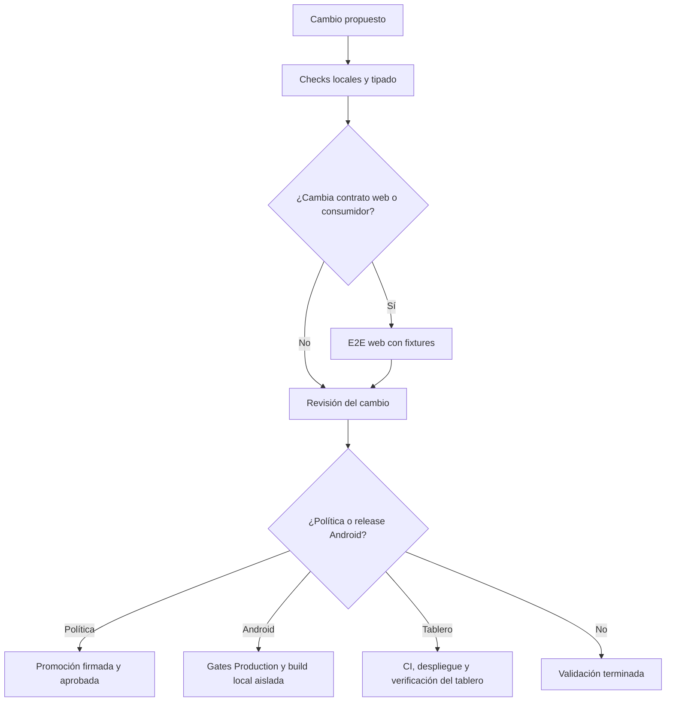
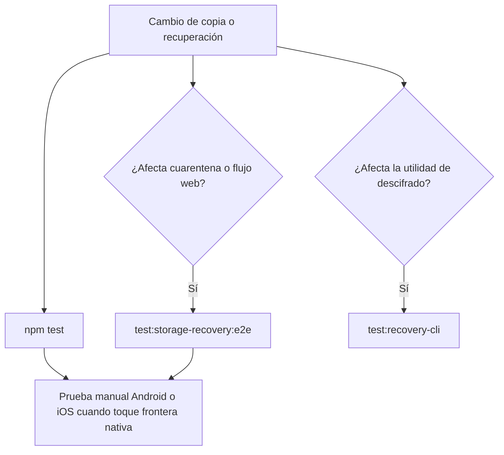
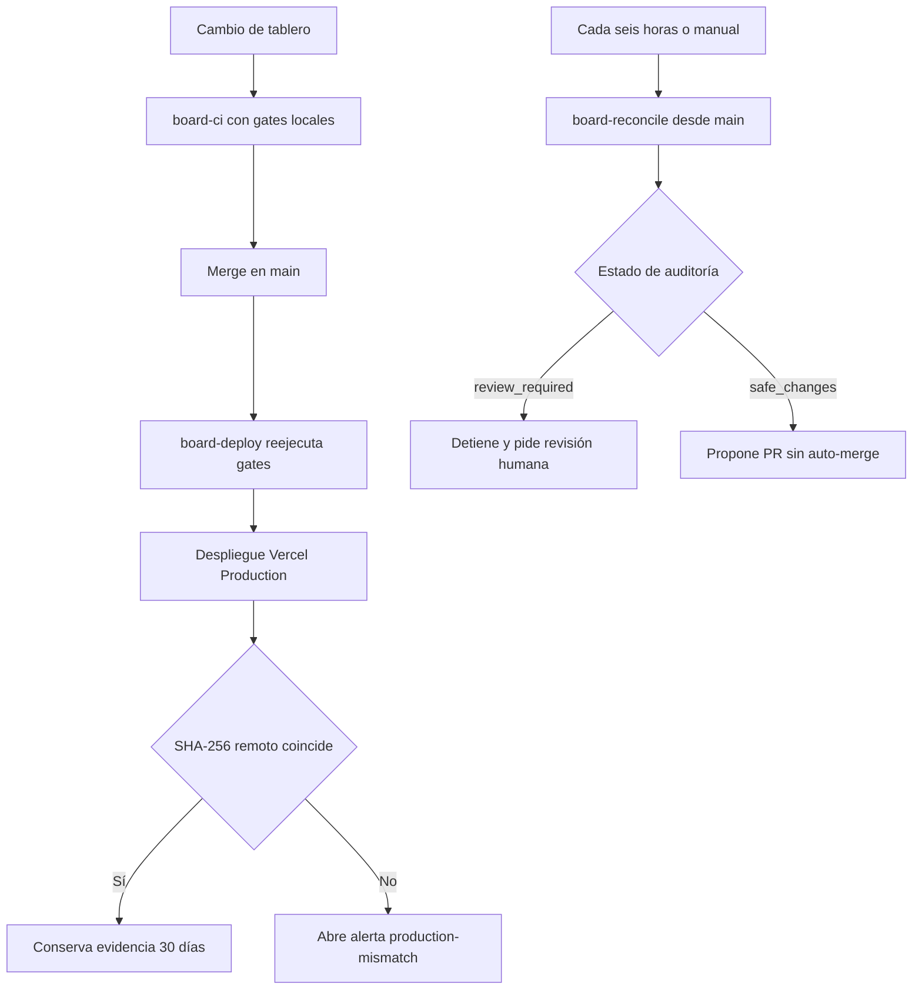
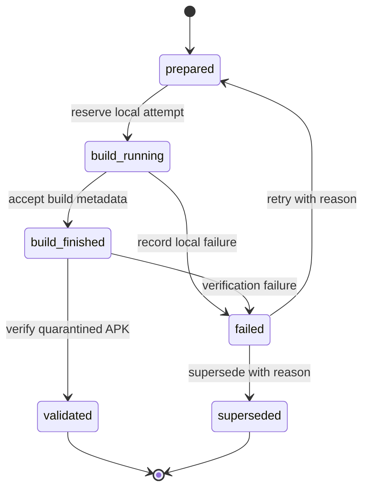

# Build, release y estrategia de validación

## Principio operativo

La validación debe ser proporcional al cambio y al contrato que podría romperse. Este repositorio separa cuatro señales que no son intercambiables:

1. **Checks locales deterministas:** tipos, contratos, artefactos generados y regresiones con fixtures. Son la señal inicial reproducible tras `npm ci`.
2. **E2E web controlada:** exporta React Native Web, sirve `apps/mobile/dist` y usa Playwright. Comprueba interfaz, estado y recuperación bajo respuestas simuladas; no valida Android ni iOS.
3. **Gates de release:** combinan checks locales con controles de identidad, estado de GitHub y evidencia del binario. Se ejecutan para un candidato exacto, no como sustituto de una revisión ordinaria.
4. **Actos protegidos:** el environment de GitHub, el acceso de firma de EAS local, los releases y la promoción de política requieren credenciales y aprobación. No son necesarios para desarrollar ni para que la app funcione localmente.



*El diagrama separa cobertura local y web de decisiones remotas; una E2E web verde no acredita capacidades nativas.*

## Preparar y ejecutar la aplicación

El proyecto npm declara `apps/*` como workspaces y CI usa el lockfile con `npm ci`. Empiece desde una instalación limpia:

```bash
npm ci
npm run dev:mobile
```

Los scripts móviles fijan `APP_ENV=development` para iniciar Expo, Android, iOS y web. `build:web` conserva `APP_ENV` si ya está definido y, si no, exporta development:

```bash
npm --workspace apps/mobile run web
npm --workspace apps/mobile run android
npm --workspace apps/mobile run ios
npm --workspace apps/mobile run build:web
npm --workspace apps/mobile exec tsc --noEmit
```

Asocie cada uno a su riesgo: `expo start` sirve para iterar; `expo run:android` y `expo run:ios` ejercitan un runtime nativo de desarrollo; `build:web` detecta fallos de empaquetado web; y `tsc --noEmit` detecta incompatibilidades estáticas sin ejecutar la app. La exportación genera `apps/mobile/dist`, que reutilizan varias E2E, pero no prueba permisos fusionados, SecureStore, alarmas, notificaciones, intents, audio de fondo ni instalación en un teléfono.

`app.json` define el paquete Android/iOS y la política declarativa de permisos. Declara `WAKE_LOCK`, `VIBRATE`, `RECEIVE_BOOT_COMPLETED` y `SCHEDULE_EXACT_ALARM`, y bloquea `USE_EXACT_ALARM`, `REQUEST_INSTALL_PACKAGES`, `RECORD_AUDIO` y `SYSTEM_ALERT_WINDOW`. Para cambios en plugins Expo, dependencias nativas o permisos, ejecute además los controles de permisos y una compilación/prueba nativa representativa. Véase [Validación de permisos Android publicables](android-permissions.md).

## Matriz de validación mínima

| Cambio | Comando focalizado | Contrato que valida y límite |
| --- | --- | --- |
| Lógica móvil determinista, formato de copia o cifrado portable | `npm test` | Ejecuta la suite Vitest del workspace móvil, el check/tests del dev store y los límites de arquitectura móvil; no ejecuta la E2E web de recuperación ni la CLI. |
| Prompt integrado | `npm run check:chat-prompt` | Detecta que el snapshot generado usado por la app deriva del prompt fuente; `test:deterministic` lo invoca como precheck. |
| Salud, seguridad o prompt de política | `npm run check:health-safety && npm run test:health-safety` y/o `npm run check:prompt-policy && npm run test:prompt-policy` | Comprueba la política canónica, sus generados, contratos y regresiones; requiere además la autorización indicada en [Gobierno de cambios sensibles y política de prompt](prompt-policy-governance.md). |
| Tipos de la app móvil | `npm --workspace apps/mobile exec tsc --noEmit` | Análisis estático del workspace móvil, no una prueba de runtime. |
| Configuración, plugin o dependencia Android | `npm run check:android-permissions && npm run test:android-permissions` | El check contrasta configuración y manifests de dependencias instaladas con la política; los tests prueban que el guard rail detecte fallos. Requiere `node_modules` y no sustituye un dispositivo. |
| Claves locales, destinos HTTPS o impacto de permisos en privacidad | `npm run check:data-inventory && npm run test:data-inventory` | Impide que el inventario publicable deje de describir las claves, hosts y permisos declarados por la app. |
| Texto legal o política de privacidad publicada | `npm run check:legal && npm run test:legal` | Comprueba los artefactos legales generados y sus contratos. Para el sitio publicado, añada `npm run test:privacy:e2e`. |
| Catálogos y sus salidas | `npm run check:catalogs && npm run test:catalogs` | Verifica contratos de todos los dominios y que los generados estén actualizados. |
| Consumidores de catálogos | `npm run test:catalogs:e2e` | Prueba la proyección web con fixtures e indisponibilidad simulada, sin consultar servicios externos. |
| Chat/agente web | `npm run test:agent:e2e` | Ejecuta las E2E de chat y proveedor de desarrollo contra navegador y dependencias interceptadas; no acredita proveedores reales ni funcionalidades nativas. |
| Recuperación de almacenamiento y exportación cifrada en web | `npm run test:storage-recovery:e2e` | Exporta web development, siembra `localStorage` y usa Chromium para comprobar el flujo de cuarentena; no ejecuta almacenamiento, selector de archivos ni compartir nativos. |
| Descifrado externo de una exportación de recuperación | `npm run test:recovery-cli` | Lanza la CLI Node con un fixture cifrado y verifica salida, permisos y errores; no prueba la UI ni un terminal humano. |
| Entrenamiento, dieta o preferencias web | La E2E específica: por ejemplo `npm run test:train:e2e` o `npm run test:diet:e2e` | Seleccione el script que cubra el flujo afectado; son pruebas web explícitas, no un requisito para iniciar Expo localmente. |
| Eliminación local de datos | `npm run test:data-deletion:e2e` | Siembra datos y cachés en el almacenamiento web para comprobar el borrado visible; no demuestra el borrado de un dispositivo nativo. |
| Proxy Anthropic | `npm run test:proxy` | Delega en el workspace Python aislado; no instala ni transforma sus dependencias en dependencias npm. |
| Contrato, datos o interfaz estática del tablero | `npm run test:linear && npm run test:board-automation && npm run test:board && npm run test:board:e2e` | Comprueba el contrato Linear, los guard rails de automatización, los datos y la representación estática en Chromium; no consulta Linear ni verifica el despliegue de producción. |
| Release o despliegue del tablero | Los workflows `board-deploy.yml` y `board-reconcile.yml` | Reejecutan los gates del tablero donde corresponde y verifican bytes de producción; requieren secrets, permisos o revisión humana según la operación. |
| Release Android | `npm run verify:production-source -- --profile production-apk --artifact-type apk --output /tmp/production-source-evidence.json` | Verificador de candidato Production que necesita checkout, GitHub y gates; el workflow es la entrada normal, no un comando local autosuficiente. |

## Copias cifradas y recuperación: señal mínima y límites

Para un cambio en `backup/backupFormat.ts` o `backup/portableEncryption.ts`, la primera señal es `npm test`. El script encadena `test:deterministic`, `test:dev-store` y `test:mobile-boundaries`; el primero ejecuta Vitest en Node e incluye `backup/**/*.test.ts`. Por tanto ejercita, entre otras fronteras, el ZIP v3, lectura explícita de v2/v1, hashes, límites y medios corruptos, además del vector estable del sobre v3, cifrado/descifrado por más de un fragmento, alteración, truncamiento y validación de contraseña. Es evidencia de esos contratos puros y de regresiones deterministas: no abre un navegador, no produce una descarga, no invoca `decrypt-recovery.ts` y no prueba Expo, `SecureStore`, sistema de archivos, selector o diálogo de compartir de Android/iOS.

Al cambiar la pantalla, cuarentena, serialización de recuperación o la descarga web, ejecute también:

```bash
npm run test:storage-recovery:e2e
```

La E2E construye `apps/mobile/dist` con `APP_ENV=development` y `DEV_PROVIDER_MODE=fake`, lo sirve en `127.0.0.1` y usa Chromium. Siembra las claves de `localStorage`, comprueba que un JSON roto se mantiene y no genera llamadas a proveedores de IA; exporta una recuperación, comprueba el prefijo `GYMENC03` y que el texto roto no aparece en ciphertext, y descifra ese resultado con la utilidad Node. También cubre detalle saneado de error, reintento tras reparación, restauración confirmada del snapshot y descarte de `LocalStore` y sesión sin eliminar `personalData` ni preferencias independientes. Esto acredita el recorrido web simulado y su interoperación con la CLI para ese fixture; no acredita la persistencia nativa, `SecureStore`, el selector/compartir de archivos, permisos del sistema ni una recuperación en Android o iOS.

Para cambiar el contrato u operación de la utilidad, ejecute además:

```bash
npm run test:recovery-cli
```

Esta prueba de Node genera un sobre con `encryptPortablePayloadToBytes`, invoca `decrypt-recovery.ts` con `--password-stdin` y verifica que la CLI recupera el JSON, crea el destino con modo `0600`, no escribe en stdout, rechaza sobrescritura y no deja salida ante contraseña errónea. El modo por stdin es una vía reservada a automatización: la operación humana usa `npm run decrypt:recovery -- --input <archivo.gymnasia> --output <destino.json>` y solicita la contraseña sin eco. La suite no comprueba un TTY interactivo real, la interfaz web ni los mecanismos nativos.



*Las tres suites aportan evidencia complementaria de código, navegador y CLI; ninguna sustituye el ejercicio de las fronteras nativas.*

## Checks de privacidad, catálogos y permisos

El inventario de datos es un guard rail sin red: escanea fuentes TypeScript no-test bajo los roots configurados, compara literales de claves de almacenamiento y hosts HTTPS con `scripts/data-inventory/inventory.json`, y toma los permisos permitidos y extras esperados de la política de permisos. También falla si no pudo escanear ningún archivo, para evitar un verde vacío. Cuando añade o retira almacenamiento, un endpoint o un permiso, actualice el inventario y revise la lista de cambios de privacidad; no trate una política legal estática como evidencia de que el código sigue cumpliéndola.

Los generadores de catálogo separan comprobar de escribir:

```bash
npm run check:catalogs
npm run test:catalogs
npm run sync:catalogs
# escritura limitada a un dominio
node scripts/catalogs/generate.mjs --write --domain alimentos
```

`check:catalogs` no modifica el checkout y verifica todos los catálogos y sus artefactos; no acepta `--domain`. `sync:catalogs` o `--write --domain` materializan salidas que deben revisarse y confirmarse junto con su fuente. Después, los tests y la E2E de consumidores comprueban que una salida correcta sea usable; escribir no reemplaza esa validación.

De modo equivalente, `check:android-permissions` revisa `app.json` y los manifests de dependencias instaladas, mientras `test:android-permissions` valida la capacidad del escáner para detectar las clases de infracción. Un check verde valida el contrato del checkout instalado, no la aceptación por Google Play ni el comportamiento de una alarma en hardware.

## E2E: qué representan

Las E2E son scripts Playwright que normalmente exportan web y sirven `dist`; aceptan variables de entorno para reutilizar una exportación o mostrar el navegador en algunos casos. Están diseñadas para ser deterministas: la E2E de privacidad abre cada página en un contexto limpio, sin cookies, almacenamiento ni claves, y compara el contenido y metadatos con la copia legal generada. La de borrado local siembra claves scoped y verifica que el flujo las elimine. Las E2E del agente y catálogos inyectan o interceptan respuestas de proveedores para cubrir estados de éxito, error y recuperación.

Por ello, use una E2E cuando cambie la interfaz, el contrato de almacenamiento o la integración cliente que cubre, pero no la presente como requisito de arranque local ni como prueba de disponibilidad de OpenAI, Anthropic, Google, GitHub u otros servicios. Tampoco sustituye una prueba Android/iOS cuando el cambio toca una capacidad nativa. Para la estrategia del agente y el uso reservado de evals LLM, consulte `docs/testing/agent-testing.md` y [Entrenamiento móvil](../mobile/training.md).

## Integración continua

`agent-tests.yml` se activa en PR y `main` solo para sus rutas declaradas. Su job Node usa Node 22, `npm ci`, permiso `contents: read` y diez minutos para verificar prompt integrado, política sanitaria y sus tests, `npm test`, límites de arquitectura móvil, la E2E Metro del dev store, feedback worker, automatización OpenWiki, los contratos de release Android y TypeScript. Los controladores de build se prueban en un job Ubuntu 24.04 separado, sin credenciales ni acceso al host, mediante sus pruebas de provisión, registro y transporte. El proxy corre en otro job con `uv`, de modo que no forma parte del entorno Node. Un cambio fuera de esos filtros no recibe este workflow.

`catalog-tests.yml` también usa Node 22 y `npm ci`, instala Chromium y ejecuta `check:catalogs`, `test:catalogs` y `test:catalogs:e2e` para rutas de fuentes, generador y consumidores declaradas. Sus resultados no cubren por sí mismos permisos Android ni una release.

## Tablero de arquitectura: gates, despliegue y conciliación

El tablero estático tiene una cadena propia, separada de las E2E de la aplicación móvil. `board-ci.yml` se activa en PR y en `main` solo cuando cambian las rutas del tablero, el contrato Linear, la automatización, el manifiesto o los workflows del tablero. Tras `npm ci` e instalar Chromium, ejecuta `test:linear`, `test:board-automation`, `test:board` y `test:board:e2e`. Tiene únicamente `contents: read` y el test de contrato exige que no reciba secretos ni permisos de escritura: es una barrera para validar contribuciones no confiables, no una operación de sincronización ni de despliegue.

`test:board:e2e` sirve `arquitectura-agente` localmente y abre Chromium. Comprueba que `board.json` se refleje en la interfaz y que el layout responda en navegador; por ello no acredita que Vercel haya publicado la revisión ni que Linear esté disponible. `test:board-automation` también fija contratos de seguridad de los tres workflows: las Actions de terceros han de estar inmovilizadas a un SHA y los flujos evitan `actions/checkout` para no recorrer gitlinks heredados.



*El despliegue verifica que `board.json` publicado coincide byte a byte con el de `main`; la conciliación solo propone cambios mecánicos seguros y no los fusiona.*

El despliegue se dispara manualmente o por cambios en las rutas publicables del tablero sobre `main`, cancela un despliegue anterior del mismo grupo y se ejecuta en el environment `Board Production`. Antes de usar las credenciales Vercel, repite los cuatro gates, resuelve y comprueba el proyecto `gymnasia` esperado y despliega. Después compara el SHA-256 del `board.json` local contra la URL canónica hasta doce veces, cada cinco segundos. Un desajuste genera una incidencia `production-mismatch`; tanto resultado como evidencia se conservan como artefacto durante 30 días.

La conciliación se programa a `17 */6 * * *` y también puede iniciarse manualmente. Parte siempre de `main`, contrasta Linear con el espejo y verifica primero que producción sigue coincidiendo con `main`. Si necesita criterio humano, notifica el problema, cierra propuestas automáticas obsoletas y termina sin cambios parciales. Si solo hay cambios seguros, los aplica, vuelve a ejecutar automatización, datos y E2E, y crea o actualiza una PR `automation/board-sync` con `--force-with-lease`; no hay auto-merge. Necesita `LINEAR_API_KEY` para auditar y `BOARD_SYNC_TOKEN` solo al crear o actualizar la propuesta.

Consulte [Arquitectura del tablero](../services/architecture-board.md) para el modelo del espejo y sus reglas de sincronización.

## Política firmada y release Android

La promoción de política es una operación manual protegida, distinta del merge. Requiere el workflow de promoción, una operación y motivo, una activación firmada y los controles remotos de candidato; para el modelo de autorización, staging, producción y rollback consulte [Gobierno de cambios sensibles y política de prompt](prompt-policy-governance.md). Ningún test local autoriza una promoción.

El perfil EAS `production` tiene `APP_ENV=production` e incremento remoto de versión y produce el formato por defecto de EAS; `production-apk` lo extiende y fuerza `android.buildType: apk`. El workflow Android publica con `production-apk`; no confunda ese destino con el perfil `production` que la política de release clasifica como AAB. La versión visible procede de `apps/mobile/app.json` y un cambio en una ruta empaquetada exige el incremento semántico calculado desde la base o la versión publicada más alta.



*La transacción durable reserva el intento antes de la VM y permite reconciliar un artifact terminado sin recompilar; un fallo requiere una decisión manual motivada.*

`build-apk.yml` se activa por push a `main` en rutas empaquetadas o manualmente con `reconcile`, `retry-failed` o `supersede-failed`; su concurrencia no cancela una ejecución en curso. Antes de usar `EXPO_TOKEN`, valida el SHA exacto y ejecuta todos los `PRODUCTION_GATES`: políticas, permisos, inventario de datos, legal, prompt, pruebas, OpenWiki, tipos, export Android de desarrollo y E2E de agente/entrenamiento. `verify:production-source` también contrasta el origen, alcance desde `main`, ruleset, environment, PR fusionada y estados remotos requeridos. Si un gate falla o ensucia el checkout, el candidato no es publicable.

Después crea o recupera una transacción durable en un draft de GitHub. El workflow reserva el intento antes de despacharlo y compila con `eas build --local` en una VM KVM efímera de wallabot, no mediante una build cloud observada: el único job autoalojado acepta el SHA ya validado, tiene solo `contents: read` y entrega el APK junto con metadatos como artifact de Actions. Un job independiente descarga exactamente esos dos ficheros a cuarentena, los vincula al intento durable y ejecuta `verify:production-artifact`. Este inspecciona estructura, manifest, firma, tamaño, MIME, paquete, SDK, permisos, configuración, snapshot de política, metadatos y progresión de `versionCode` antes de adjuntar `gymnasia.apk`. Solo tras comprobar en el borrador la identidad, los límites y los hashes de APK, transacción y evidencias se publica la release inmutable. La operación exige el environment `Production` y sus controles remotos; una comprobación local no puede reemplazarlos.

Incluso con todos los gates verdes, instale el APK en un dispositivo representativo antes de distribuirlo y compruebe versión, migración/conservación de datos, notificaciones, alarmas y ejecución en segundo plano. La app no implementa un actualizador desde GitHub; la instalación directa es manual y distinta de Play.

## Selección rápida

- **Cambio aislado de lógica:** añada/ejecute el test determinista responsable, `npm test` y typecheck si modifica el workspace móvil.
- **Cambio de UI, persistencia o flujo web:** añada `build:web` y la E2E concreta; amplíe a flujos vecinos cuando comparten el contrato.
- **Cambio de catálogo:** `check:catalogs`, `test:catalogs` y `test:catalogs:e2e`; ejecute escritura solo si debe actualizar salidas.
- **Cambio de privacidad o datos:** `check:data-inventory`, sus tests, checks legales y la E2E de privacidad o borrado cuando modifique la experiencia publicada o de eliminación.
- **Cambio de permiso, plugin o dependencia nativa:** guard rail de permisos, tipado, export y build/prueba nativa; una E2E web no basta.
- **Cambio sensible de prompt o salud:** gates de política más autorización explícita antes de merge; promoción firmada posterior si corresponde.
- **Cambio del tablero:** ejecute los cuatro gates de tablero; el CI de tablero repetirá esa cadena en PR y `main` si la ruta activa el workflow.
- **Despliegue o conciliación del tablero:** deje que los workflows validen proyecto, hash de producción y condiciones de seguridad; una conciliación segura crea una PR y requiere revisión humana para fusionarla.
- **Release Android:** deje que el workflow aplique `verify:production-source`, el environment y la verificación del artefacto; complete con prueba manual en dispositivo.

Para el inventario de repositorios y fuentes de contenido, consulte [Repositorios y fuentes de contenido](../content/repositories.md); para preparar un entorno local, [Inicio rápido](../quickstart.md).
