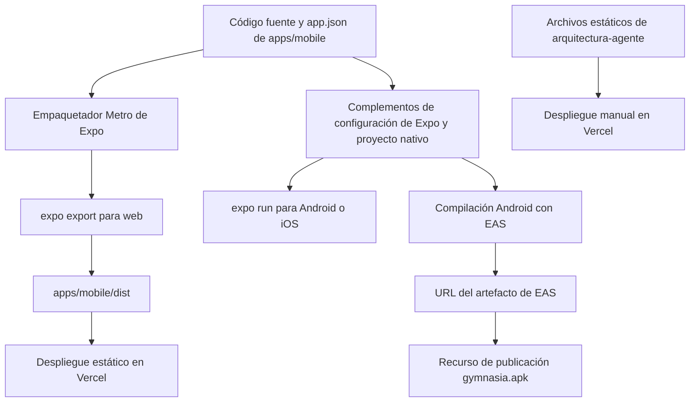
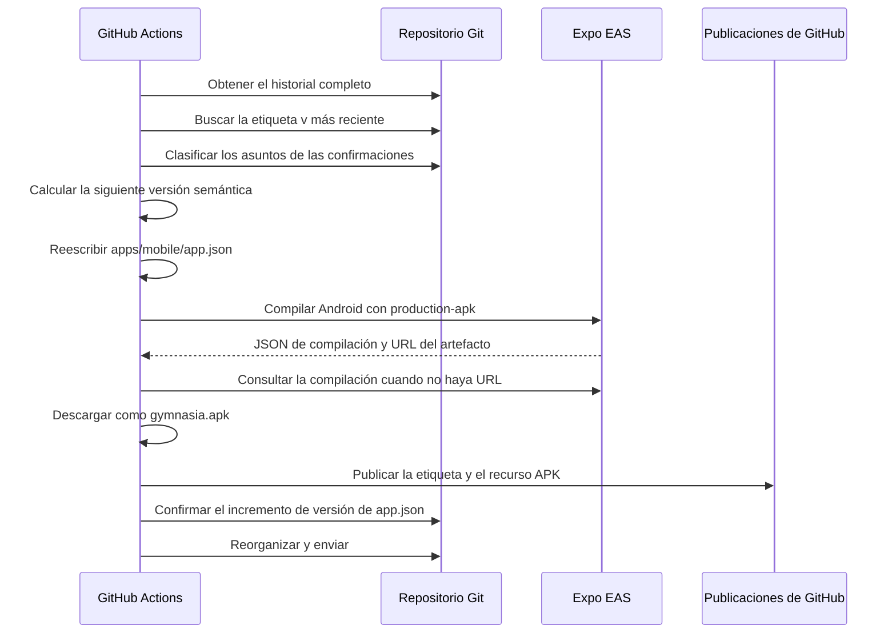

# Compilación, publicación y pruebas

## Alcance

Este repositorio tiene tres entregables operativamente independientes:

1. la aplicación Expo React Native en `apps/mobile`, que se ejecuta en Android, iOS y React Native Web;
2. la exportación web estática de esa aplicación, desplegada desde `apps/mobile/dist`;
3. el tablero estático e independiente de seguimiento en `arquitectura-agente`, servido sin compilación.

El proxy CORS de Anthropic es un servicio de desarrollo, no forma parte de la exportación estática de Expo ni del artefacto Android de EAS. El tráfico de Anthropic desde el navegador puede necesitarlo; el tráfico de proveedores desde entornos nativos no.

## Responsabilidad sobre manifiestos y configuración

El repositorio es un espacio de trabajo npm, a pesar de que los metadatos `packageManager` de la raíz indican Yarn 1. El archivo de bloqueo confirmado y todos los comandos de CI documentados utilizan npm (`npm ci`, `npm --workspace` y `npm run`). No cambie de gestor de paquetes a la ligera: el archivo de bloqueo y la caché de CI son entradas operativas administradas por npm.

| Archivo | Responsabilidad efectiva | Límite importante |
| --- | --- | --- |
| `/package.json` | Declara los espacios de trabajo `apps/*`, los alias de comandos de la raíz y las versiones de Playwright/Vitest/fast-check | Los alias de pruebas de la raíz solo sirven para la orquestación; no implican que todas las baterías se ejecuten en CI |
| `/package-lock.json` | Grafo reproducible de dependencias npm utilizado por `npm ci` | Los cambios de dependencias deben actualizarlo |
| `/apps/mobile/package.json` | Punto de entrada de Expo, scripts de la aplicación, dependencias de ejecución y versión de TypeScript | Su `version: 1.0.0` no es la versión de publicación de Expo que muestra la aplicación |
| `/image-generation/pyproject.toml` | Gestiona el entorno independiente de generación de imágenes con Python 3.12 y sus dependencias `gradio-client`, `httpx`, `python-dotenv` y `websockets` | No es un manifiesto de un espacio de trabajo npm; administre esta utilidad con `uv` desde `image-generation` |
| `/apps/mobile/app.json` | Metadatos canónicos de la aplicación Expo: versión, identificadores, recursos, permisos, complementos e ID del proyecto EAS | Este es el archivo de versión de ejecución/publicación que modifica el flujo de trabajo de publicación |
| `/apps/mobile/eas.json` | Perfiles EAS efectivos cuando los comandos se ejecutan desde `apps/mobile` | La vista previa genera explícitamente un APK de Android; producción no declara `buildType: apk` |
| `/eas.json` | Política EAS similar en la raíz | No es el archivo de perfiles utilizado por el flujo de trabajo incluido, que cambia a `apps/mobile` |
| `/app.json` | Objeto Expo vacío en la raíz | No es la configuración Expo efectiva de la aplicación móvil |
| `/apps/mobile/vercel.json` | Comandos de compilación, salida e instalación de la web móvil | `npm run build:web` se ejecuta en el proyecto móvil y publica `dist` |
| `/arquitectura-agente/vercel.json` | Solo limpieza de URL del tablero | El despliegue del tablero es estático y no tiene compilación |
| `/apps/mobile/vitest.config.mts` | Entorno de pruebas Node e inclusión de `agent/**/*.test.ts` | La batería determinista se centra en el agente, no es una batería unitaria completa de interfaz/dominio |
| `/.github/workflows/agent-tests.yml` | CI determinista y control de TypeScript | Filtrado por rutas para cambios en la aplicación móvil y en el manifiesto/archivo de bloqueo de la raíz |
| `/.github/prompt-policy.json` y `/scripts/prompt-policy/` | Fuente declarativa y generador del gobierno de cambios sensibles | Generan `CODEOWNERS` y el ruleset; consulte [Gobierno de cambios sensibles y política de prompt](prompt-policy-governance.md) antes de editar salidas derivadas. |
| `/scripts/android-permissions/` | Política y comprobador de permisos Android publicables | Contrasta `apps/mobile/app.json` y manifests de dependencias; consulte [Validación de permisos Android publicables](android-permissions.md) al cambiar permisos o dependencias móviles. |
| `/.github/workflows/prompt-policy.yml` y `owner-authorization.yml` | Check obligatorio de política y reconciliación segura de autorización de PR | El primero también verifica la política de permisos Android; el segundo solo procesa metadatos desde el SHA base de confianza y no ejecuta código del head de una PR. |
| `/.github/workflows/build-apk.yml` | Compilación EAS, publicación de GitHub y confirmación de versión | Los detalles del disparador/perfil crean los riesgos de artefactos descritos a continuación |

Cuando los archivos Expo/EAS duplicados de la raíz y de la aplicación móvil no coincidan, utilice la configuración de `apps/mobile` para los comandos móviles. El flujo de trabajo de publicación lo hace explícito con `cd apps/mobile` antes de `eas build`.

## Topología de compilación



*El código fuente de Expo se bifurca en una exportación web estática y compilaciones nativas, mientras que el tablero de arquitectura omite la canalización de Expo.*

## Desarrollo y compilaciones de plataformas

Instale desde la raíz del repositorio:

```bash
npm ci
```

Utilice `npm install` cuando cambie intencionadamente las dependencias y el archivo de bloqueo; utilice `npm ci` para una verificación limpia que coincida con GitHub Actions.

### Servidor de desarrollo de Expo

```bash
npm run dev:mobile
# equivalente exacto del espacio de trabajo
npm --workspace apps/mobile run start
```

Esto inicia `expo start`. Desde el espacio de trabajo, los comandos explícitos de cada plataforma son:

```bash
npm --workspace apps/mobile run web
npm --workspace apps/mobile run android
npm --workspace apps/mobile run ios
```

- `web` ejecuta `expo start --web` mediante Metro y es un servidor de desarrollo, no un artefacto de despliegue.
- `android` e `ios` ejecutan `expo run:android` y `expo run:ios`; compilan proyectos nativos y requieren el SDK y la cadena de herramientas locales correspondientes.
- Las compilaciones locales para iOS requieren macOS/Xcode. El flujo de trabajo automatizado de publicación solo compila Android.
- `apps/mobile/android` está presente, pero `app.json` sigue siendo la fuente declarada y multiplataforma de permisos/complementos. Los cambios que afecten a complementos nativos, identificadores, permisos, sonidos de notificaciones o recursos requieren validación nativa; una exportación web no puede verificarlos.

La configuración de Expo declara la versión `1.16.0` de la aplicación, el ID de paquete de iOS y el paquete de Android `com.maximofn.gymnasia`, orientación vertical, Metro para la web y complementos de notificaciones/fuentes/SecureStore. Los permisos de Android incluyen servicio en primer plano, bloqueo de activación, vibración, finalización del arranque y permisos de alarmas exactas. Esos valores afectan a la configuración nativa generada y requieren comprobaciones en dispositivos cuando se modifican.

### Contrato de exportación y despliegue web

```bash
npm --workspace apps/mobile run build:web
# comando subyacente exacto
npm --workspace apps/mobile exec expo export --platform web
```

El script del paquete ejecuta `expo export --platform web` y escribe en `apps/mobile/dist`. `apps/mobile/vercel.json` declara:

- `buildCommand`: `npm run build:web`;
- `outputDirectory`: `dist`;
- `installCommand`: `npm install`;
- ningún adaptador de framework.

La exportación incorpora las variables `EXPO_PUBLIC_*` en el momento de la compilación. En particular, `EXPO_PUBLIC_API_BASE_URL` controla el enrutamiento del proxy de Anthropic en el navegador. Trátela como configuración pública, nunca como secreto. Una exportación correcta no demuestra que el proxy configurado exista ni que funcionen las API exclusivas de entornos nativos, como SecureStore, uso compartido, notificaciones, apertura de intents o temporización en segundo plano.

El navegador almacena localmente los datos del usuario y utiliza React Native Web. Las baterías E2E móviles ejercitan esta proyección web porque puede automatizarse con Playwright; no son pruebas integrales de Android/iOS.

## Capas de pruebas y comandos exactos

Elija la prueba más específica que sea responsable del comportamiento modificado y, cuando el cambio atraviese varios contratos, amplíe la validación antes de fusionarlo.

### Comprobaciones específicas

| Cambio | Comando exacto | Qué demuestra |
| --- | --- | --- |
| Esquema, analizador, ejecutor, bucle de proveedor y datos de prueba del agente | `npm test` | Ejecuta la batería determinista de Vitest en `apps/mobile/agent/**/*.test.ts` |
| Un archivo de pruebas del agente | `npm --workspace apps/mobile exec vitest run --config vitest.config.mts agent/path/to/file.test.ts` | Iteración rápida de Vitest sobre un único archivo |
| Código fuente TypeScript/móvil | `npm --workspace apps/mobile exec tsc --noEmit` | Solo tipado estático; no comprueba el paquete ni el comportamiento en tiempo de ejecución |
| Empaquetado/configuración web de Expo | `npm --workspace apps/mobile run build:web` | Metro puede generar la exportación estática `dist` |
| Interfaz de chat/bucle de herramientas del agente | `npm run test:agent:e2e` | Aplicación web exportada más una ida y vuelta simulada de SSE/herramientas de OpenAI |
| Interacción de entrenamiento | `npm run test:train:e2e` | Servidor web de Expo activo más el flujo de trabajo de entrenamiento de Playwright |
| Contrato de JSON/hoja de ruta/grafo del tablero | `npm run test:board` | Invariantes estructurales y semánticas del tablero |
| Renderizado/interacciones/diseño adaptable del tablero | `npm run test:board:e2e` | Servidor estático más comportamiento de Chromium |
| Política de rutas sensibles, artefactos generados y restricciones de workflows | `npm run check:prompt-policy` | La fuente declarativa, `CODEOWNERS`, el ruleset y los workflows cumplen el contrato de gobierno. |
| Clasificación de rutas y autorización de PR por SHA | `npm run test:prompt-policy` | Pruebas unitarias, de contrato y de propiedades de `scripts/prompt-policy/policy.test.mjs`. |
| Permisos Android declarados y aportados por dependencias instaladas | `npm run check:android-permissions` | La lista de Expo coincide con la política y ningún manifest de dependencia aporta un permiso prohibido; requiere `npm ci`. |
| Política y evaluador de permisos Android | `npm run test:android-permissions` | Contrato del repositorio, detección de cada infracción, vivacidad del escáner y propiedades de normalización. |

El comando `npm test` de la raíz es exactamente `npm run test:deterministic`, que delega en `npm --workspace apps/mobile run test:deterministic` y después en `vitest run --config vitest.config.mts`. No es un agregador de pruebas para todo el repositorio: excluye las pruebas del tablero, las baterías de Playwright, las evaluaciones de LLM y las compilaciones nativas.

### Validación amplia previa a la fusión

Para un cambio transversal en la aplicación móvil que afecte al código fuente, al comportamiento del agente o al renderizado web, ejecute:

```bash
npm ci
npm test
npm --workspace apps/mobile exec tsc --noEmit
npm --workspace apps/mobile run build:web
npm run test:agent:e2e
npm run test:train:e2e
```

Para los cambios del tablero, la validación amplia del tablero es independiente:

```bash
npm run test:board
npm run test:board:e2e
```

No hay ningún comando incluido que combine todo lo anterior. Ejecute la secuencia explícita en lugar de asumir que `npm test` tiene un alcance amplio.

### Modos con interfaz visible y reutilización del servidor

```bash
npm run test:board:e2e:headed
npm run test:train:e2e:headed
```

- Las pruebas E2E del tablero utilizan `BOARD_E2E_HEADLESS=0` para el modo con interfaz visible y `BOARD_E2E_PORT` para sustituir el puerto predeterminado `8123`.
- Las pruebas E2E de entrenamiento utilizan `TRAIN_E2E_HEADLESS=0` para el modo con interfaz visible, `TRAIN_E2E_URL` para indicar un servidor explícito, `TRAIN_E2E_REUSE_SERVER=1` para sondear puertos existentes y `TRAIN_E2E_PORT` para sustituir el puerto predeterminado `8090`.
- Las pruebas E2E del agente aceptan `AGENT_E2E_URL` o `AGENT_E2E_PORT` (valor predeterminado: `8091`). Sin una URL, primero realizan una exportación web estática, sirven `dist`, cargan datos iniciales en el almacenamiento local e interceptan las solicitudes al proveedor y de contenido.

Las pruebas E2E del agente son deterministas con respecto al LLM: utilizan datos de prueba SSE incluidos en el repositorio y una ruta de OpenAI falsa. Las pruebas E2E de entrenamiento controlan la interfaz web, pero no representan las notificaciones ni la ejecución en segundo plano nativas.

### Marcador de posición para la evaluación del LLM

```bash
npm run test:llm
```

Este comando delega en `apps/mobile/scripts/run-llm-evals.mjs`, pero el script incluido solo imprime un mensaje informativo y termina: no ejecuta ningún conjunto de datos, llamada a un modelo, aserción, puntuación ni evaluación. Por tanto, una salida correcta solo demuestra que el script de marcador de posición pudo ejecutarse. El mensaje describe un plan futuro para ejecutar evaluaciones desde LangSmith cuando exista un conjunto de datos de observabilidad; dicho plan no está implementado aquí y no está relacionado con el conector de origen de LangSmith de OpenWiki. No considere este comando como cobertura de pruebas ni lo añada a un control hasta que un evaluador real y un contrato explícito de aprobado/reprobado sustituyan el marcador de posición.

## Integración continua

El gobierno de rutas sensibles es un control independiente documentado en [Gobierno de cambios sensibles y política de prompt](prompt-policy-governance.md). `prompt-policy.yml` se ejecuta en cada PR y cada envío a `main`, sin filtros de rutas porque publica un check requerido. Tras `npm ci`, verifica los artefactos y workflows con `npm run check:prompt-policy`, ejecuta `npm run test:prompt-policy`, verifica `npm run check:android-permissions` y `npm run test:android-permissions`, comprueba el snapshot integrado del prompt, la batería determinista del agente, las pruebas de OpenWiki y TypeScript. Su resumen no incluye contenido de prompts, secretos, conversaciones ni datos personales. Para cambios exclusivos de política, los dos comandos de política son la validación focalizada; para permisos o configuración Android, usa los dos controles de [permisos Android](android-permissions.md); no ejecutes toda la batería móvil por defecto.

`owner-authorization.yml` no prueba código de PR: usa `pull_request_target` para reconciliar metadatos de PR frente a la política confiable y publicar `gymnasia/owner-authorization`. Solo tiene lectura de contenidos/PR y escritura de estados. Su resultado y `prompt-policy` son los checks requeridos por el ruleset generado de `main`.

`agent-tests.yml` se ejecuta para solicitudes de incorporación de cambios y envíos a `main` solo cuando cambian `apps/mobile/**`, el manifiesto/archivo de bloqueo de la raíz o ese flujo de trabajo. Utiliza Ubuntu, Node 22, `npm ci`, un tiempo de espera de 10 minutos y permiso de solo lectura para el contenido. Sus controles son:

```bash
npm test
npm --workspace apps/mobile exec tsc --noEmit
```

**No** ejecuta ninguna de las baterías de Playwright, una exportación web, la validación del tablero, la evaluación de LLM, una compilación EAS ni pruebas nativas. Los cambios fuera de sus filtros de rutas pueden no recibir ningún resultado de este flujo de trabajo.

El flujo de trabajo de publicación de Android es una canalización de compilación y publicación, no un flujo de trabajo de pruebas: instala las dependencias, pero no ejecuta las pruebas deterministas, TypeScript, E2E ni la exportación web antes de publicar. La protección de ramas y la disciplina humana de publicación deben garantizar que existan resultados de pruebas antes de un envío que dispare una publicación.

`openwiki-update.yml` no está relacionado con la validación del producto. Se ejecuta diariamente o de forma manual, genera documentación con Node 22/OpenWiki y abre una solicitud de incorporación de cambios de documentación.

## Publicación Android con EAS y flujo de versiones

El flujo de trabajo `Build Production APK & Publish Release` puede iniciarse manualmente, pero no ofrece perfiles seleccionables. Tanto esa ejecución como los envíos a `main` que afecten a `apps/mobile/**` —excepto scripts, tests, Markdown y `public/`— usan exclusivamente `production-apk`. Ese perfil hereda `APP_ENV=production`, el package real y el incremento nativo de `production`, y añade `android.buildType: apk` para producir un artefacto instalable. Development, staging y preview nunca se compilan desde este workflow.



*La etiqueta y el artefacto de la publicación se publican antes de que el flujo de trabajo confirme el cambio de versión en la rama.*

### Cálculo de versiones

El flujo de trabajo busca la etiqueta más alta según el orden de versiones que coincida con `v*`, utiliza `0.0.0` como valor predeterminado cuando no existe ninguna e inspecciona los asuntos de las confirmaciones desde esa etiqueta:

- un asunto que contenga `BREAKING CHANGE` o `BREAKING-CHANGE`, o un asunto convencional con `!:`, provoca un incremento de la versión principal;
- `feat:` o `feat(scope):` provoca un incremento de la versión secundaria;
- `fix:` o `fix(scope):` provoca un incremento de la versión de parche;
- si no existe ningún asunto convencional reconocido, el flujo de trabajo sigue utilizando un incremento de parche de forma predeterminada.

Elimina de una etiqueta un sufijo SHA hexadecimal final antes de analizarla, calcula `vMAJOR.MINOR.PATCH` y reescribe `.expo.version` en `apps/mobile/app.json` mediante `jq`. La versión del paquete en `apps/mobile/package.json` no se actualiza.

`apps/mobile/eas.json` establece la CLI de EAS en `>= 18.4.0` y `appVersionSource: "remote"`. `production-apk` extiende el perfil `production`, por lo que conserva `APP_ENV=production` y `autoIncrement: true`, y añade `android.buildType: "apk"`. Los perfiles de desarrollo, staging y preview siguen disponibles para invocaciones locales expresas, pero no para el workflow de publicación. Coexisten dos dimensiones de versión:

- la versión de Expo visible para el usuario, escrita en `app.json` y utilizada para la comparación entre la etiqueta de Git y la actualización;
- los números de compilación nativa remotos administrados por EAS, con incremento automático explícito solo en producción.

### Publicación de artefactos

El flujo de trabajo se ejecuta desde `apps/mobile`:

```bash
eas build --platform android --profile production-apk --non-interactive --json
```

No existe una rama de selección de perfil. El trabajo espera hasta 120 minutos, extrae `artifacts.buildUrl` o `artifacts.applicationArchiveUrl`, recurre a `eas build:view` cuando el JSON inicial no contiene una URL, descarga el resultado como `gymnasia.apk`, comprueba su estructura ZIP y exige `AndroidManifest.xml` sin metadatos de Android App Bundle antes de adjuntarlo a una publicación estable de GitHub. El cuerpo de la publicación contiene hasta 30 asuntos de confirmaciones desde la etiqueta anterior.

El paso final confirma únicamente `apps/mobile/app.json` como `chore(release): bump version to … [skip ci]`, intenta ejecutar `git pull --rebase || true` y realiza el envío.

## Riesgos de publicación y de los artefactos

1. **La publicación está cerrada a un APK de Production.** El workflow fija `production-apk`, prepara el snapshot del canal Production y rechaza tanto un AAB renombrado como un archivo sin `AndroidManifest.xml`. Un AAB para Google Play debe generarse mediante un flujo separado y explícito con el perfil `production`; no amplíe este workflow con perfiles seleccionables porque volvería a permitir que un push distribuyera otra variante.
2. **La ausencia de URL no se rechaza de forma temprana.** Si ambas consultas JSON de EAS devuelven una URL vacía, el paso de descarga sigue llamando a `curl -L ""`. Añada una comprobación explícita de URL no vacía y del tipo/tamaño de archivo antes de la publicación para reforzar la seguridad de la publicación.
3. **La publicación precede a la confirmación de la versión en el código fuente.** La publicación de GitHub se crea antes de actualizar la rama. Un fallo al reorganizar o enviar puede dejar una etiqueta y un APK publicados cuyo cambio de versión no aparezca en `main`.
4. **La condición de carrera del envío se suprime.** `git pull --rebase || true` ignora los fallos de reorganización y continúa con `git push`; los cambios simultáneos en `main` aún pueden hacer que falle el envío final. La publicación permanece publicada porque no existe una reversión.
5. **La cancelación puede dejar trabajo huérfano en EAS.** La concurrencia cancela un flujo de trabajo anterior para la misma referencia, pero una compilación EAS puede continuar de forma remota. El tiempo de espera de 120 minutos se eligió porque la cola del nivel gratuito puede superar los 60 minutos; un tiempo de espera agotado o una cancelación pueden producir un artefacto remoto sin referencia y ninguna publicación de GitHub.
6. **Cada envío válido a la rama principal publica Production.** El disparador de rutas abarca la mayoría de los cambios móviles que no sean scripts, tests, Markdown o `public/`, por lo que los envíos rutinarios de código fuente/configuración pueden crear una publicación de Production y un incremento de parche nuevos. Este control de publicaciones no se activa mediante etiquetas.
7. **No existe un control de pruebas para las publicaciones.** El trabajo de publicación no ejecuta `npm test`, TypeScript, Playwright ni pruebas rápidas nativas antes de publicar.
8. **Divergencia entre etiqueta y versión.** El cálculo de la versión confía en las etiquetas Git, no en el archivo `app.json` confirmado actualmente. Las modificaciones manuales de la versión o los fallos de confirmaciones de versiones anteriores pueden hacer que la transición calculada no coincida con el estado del código fuente.
9. **El análisis convencional solo considera el asunto.** No se inspecciona el texto de cambios incompatibles en el cuerpo de una confirmación, y el comportamiento de combinación o reformulación puede cambiar el incremento seleccionado. Las confirmaciones no reconocidas siempre generan un parche.
10. **La corrección nativa prácticamente no se prueba.** Las pruebas E2E web no pueden validar los permisos de Android, los sonidos de notificaciones, las alarmas exactas, SecureStore, el comportamiento en segundo plano, la instalación del APK, las rutas de actualización ni la configuración de iOS.

Antes de publicar una versión de Android para instalación directa, descargue la candidata, verifique que realmente sea un APK, instálela en un dispositivo representativo, confirme la versión mostrada, pruebe el comportamiento de actualización y la conservación de los datos locales, ejercite las notificaciones y la temporización en segundo plano, y compruebe el actualizador de publicaciones de GitHub integrado en la aplicación.

## El despliegue del tablero es independiente

La validación del tablero y el despliegue en producción son manuales y no comparten la configuración web de Expo:

```bash
npm run test:board
npm run test:board:e2e
npm exec --yes -- vercel@latest deploy --prod --yes --cwd arquitectura-agente
```

El proyecto del tablero en Vercel sirve directamente los archivos de origen. Un envío a `main` no lo despliega porque su integración de Git con Vercel está inactiva. Consulte [Tablero de arquitectura](../services/architecture-board.md) para conocer su esquema, grafo y guía operativa de actualización.

## Política de validación recomendada

- **Lógica exclusiva del agente:** un archivo específico de Vitest durante la iteración y, después, `npm test` y TypeScript.
- **Comportamiento de la interfaz/dominio móvil:** TypeScript más el flujo de Playwright responsable; añada `build:web` cuando cambie el empaquetado o la configuración.
- **Configuración o dependencia nativa/de Expo:** ejecuta primero `npm run check:android-permissions && npm run test:android-permissions`, después las comprobaciones deterministas/de tipos, exportación web y una compilación nativa local o candidata de EAS y una prueba rápida en un dispositivo. El éxito de la web por sí solo no es suficiente; consulta [Validación de permisos Android publicables](android-permissions.md) para el límite del escáner.
- **Flujo de trabajo de publicación/perfil EAS:** revise ambos archivos efectivos de configuración móvil, ejecute los controles móviles habituales, dispare primero el flujo manualmente e inspeccione el artefacto descargado antes de confiar en la publicación automática provocada por envíos a la rama principal.
- **Datos del tablero:** primero la prueba del contrato de datos; añada las pruebas E2E del tablero para modificaciones sensibles al renderizado.
- **JS/CSS/HTML del tablero:** ambas pruebas del tablero y el despliegue manual en Vercel.
- **Manifiesto/archivo de bloqueo de la raíz:** `npm ci` limpio, batería determinista, TypeScript, baterías E2E pertinentes y cualquier destino de compilación afectado.
- **Política de rutas sensibles, CODEOWNERS, ruleset o autorización de PR:** primero `npm run check:prompt-policy && npm run test:prompt-policy`; regenera con `npm run sync:prompt-policy` solo cuando cambie la fuente declarativa y amplía al snapshot/controles móviles únicamente si el cambio también llega a `prompts/` o `apps/mobile/`. Consulte [Gobierno de cambios sensibles y política de prompt](prompt-policy-governance.md).
