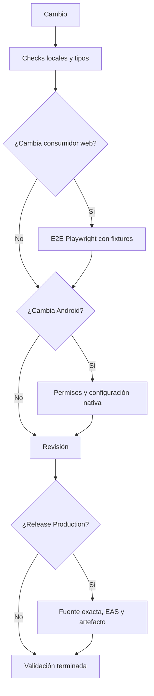
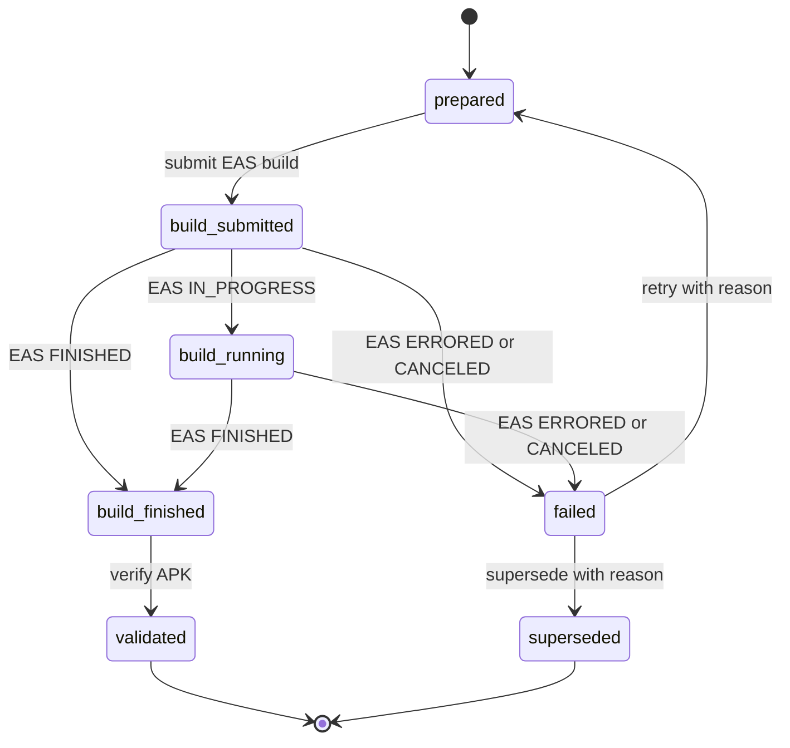

# Compilación, publicación y pruebas

## Principio operativo

La puerta debe ser proporcional al contrato afectado. No equivalen una suite determinista, una E2E web, un build nativo y una publicación: las primeras dan señal reproducible del checkout; la E2E cubre la aplicación exportada en navegador; y la release añade identidad remota, políticas y evidencia criptográfica del binario.



*El flujo separa cobertura web y nativa de los controles remotos requeridos para publicar.*

## Entorno y entradas locales

El repositorio usa workspaces `apps/*`; instale desde el raíz con `npm ci`. Los scripts de Expo de la app móvil fijan `APP_ENV=development`; `build:web` conserva `APP_ENV` ya definido o usa development. `app.config.ts` rechaza una configuración sin `APP_ENV` válido, por lo que no conviene invocar `expo config` o EAS sin declararlo.

```bash
npm ci
npm run dev:mobile
npm --workspace apps/mobile run android
npm --workspace apps/mobile run ios
npm --workspace apps/mobile run build:web
npm --workspace apps/mobile exec tsc --noEmit
```

Los entornos `development`, `staging` y `production` cambian nombre, identificadores iOS/Android, canal de política y namespace de almacenamiento. Development usa proveedor `fake` por defecto y puede elegir `byok`; staging y production siempre usan `byok`. `GOOGLE_FIXTURE_PORT` solo es admisible en development BYOK. Así se evitan tanto la mezcla de datos locales entre variantes como un proveedor de desarrollo accidental en un binario no local.

`build:web` y las E2E no prueban permisos fusionados, SecureStore ni alarmas y notificaciones en hardware. Para cambios de plugin, manifest o dependencia nativa, añada una compilación/prueba representativa en dispositivo además de los guard rails descritos en [Validación de permisos Android publicables](android-permissions.md).

## Seleccionar la validación mínima

| Cambio | Ejecutar | Alcance y límite |
| --- | --- | --- |
| Lógica móvil determinista | `npm test` | Encadena `test:deterministic` y `test:dev-store`; no ejecuta todas las suites del repositorio. |
| Prompt integrado | `npm run check:chat-prompt` | Comprueba que el snapshot usado por la app deriva de su fuente; es precheck de la suite determinista. |
| Tipos móviles | `npm --workspace apps/mobile exec tsc --noEmit` | Detecta incompatibilidades estáticas, no comportamiento de runtime. |
| Política de salud o prompt | `npm run check:health-safety && npm run test:health-safety` y/o `npm run check:prompt-policy && npm run test:prompt-policy` | Valida fuente, generados y regresiones; los cambios sensibles también requieren el flujo de autorización de [Gobierno de cambios sensibles y política de prompt](prompt-policy-governance.md). |
| Permiso, plugin o dependencia Android | `npm run check:android-permissions && npm run test:android-permissions` y `npm run check:android-native-config && npm run test:android-native-config` | Contrasta política/configuración y comprueba los detectores. No reemplaza artefacto ni dispositivo. |
| Almacenamiento, host HTTPS o permiso con impacto de privacidad | `npm run check:data-inventory && npm run test:data-inventory` | Obliga a que el inventario describa claves, hosts y permisos; revise además el texto legal si cambia la declaración pública. |
| Texto legal publicado | `npm run check:legal && npm run test:legal` | Comprueba los generados y contratos legales; añada `npm run test:privacy:e2e` para la experiencia web publicada. |
| Catálogo | `npm run check:catalogs && npm run test:catalogs && npm run test:catalogs:e2e` | Cubre fuentes, artefactos generados y consumidores web aislados. |
| UI o flujo web | La E2E focalizada, por ejemplo `npm run test:train:e2e`, `npm run test:diet:e2e` o `npm run test:storage-recovery:e2e` | Es evidencia de navegador, no de capacidades nativas ni de proveedores reales. |
| Borrado visible de datos locales | `npm run test:data-deletion:e2e` | Siembra almacenamiento web y verifica el flujo de borrado; no demuestra el borrado en un teléfono. |
| Proxy Anthropic | `npm run test:proxy` | Ejecuta el workspace Python mediante `uv`, separado de las dependencias npm. |

El inventario de datos no usa red: recorre TypeScript no-test de sus roots, detecta literales de claves y hosts HTTPS y los compara con el inventario declarado. También debe encontrar fuentes; un escaneo vacío falla para no convertir una configuración rota en un verde vacío.

Para catálogos, comprobar y materializar son operaciones deliberadamente distintas:

```bash
npm run check:catalogs
npm run test:catalogs
npm run sync:catalogs
node scripts/catalogs/generate.mjs --write --domain alimentos
```

`--check` siempre inspecciona todos los dominios y sus salidas sin escribir; por diseño rechaza `--domain`. `--write` puede limitarse a un dominio, pero sus cambios generados se revisan y confirman junto a la fuente. Escribir artefactos no sustituye pruebas de contrato ni de consumidores.

## Permisos y E2E controladas

La configuración Android permite exactamente `WAKE_LOCK`, `VIBRATE`, `RECEIVE_BOOT_COMPLETED` y `SCHEDULE_EXACT_ALARM`, y bloquea `USE_EXACT_ALARM`, `REQUEST_INSTALL_PACKAGES`, `RECORD_AUDIO` y `SYSTEM_ALERT_WINDOW`. El escáner revisa `app.json` y manifests de dependencias instaladas; sus pruebas verifican el contrato real, cada tipo de infracción y la vivacidad del recorrido de manifests. En particular, una directiva `tools:node="remove"` no cuenta como permiso declarado: el contrato relevante para publicar es el manifest fusionado del artefacto.

Las E2E de catálogos exportan explícitamente una variante web development con BYOK y sirven `apps/mobile/dist`. Playwright intercepta `https://api.github.com/**` y `https://raw.githubusercontent.com/**`, entrega fixtures locales o fallos 503 y siembra el almacenamiento del navegador. Cubren consumidores, caché y recuperación sin consultar GitHub; no son una prueba de disponibilidad externa.

El resto de E2E sigue el mismo límite: usa export web y navegador para verificar interfaz, estado y recuperación bajo dependencias controladas. Una E2E verde no acredita integración real de OpenAI, Anthropic, Google o GitHub ni comportamiento Android/iOS.

## CI ordinaria

`agent-tests.yml` se ejecuta en PR y `main` únicamente cuando coinciden sus filtros de rutas. El job Node 22 instala con `npm ci`, comprueba prompt y política de salud, ejecuta `npm test`, la E2E Metro del dev store, tests del feedback worker, automatización OpenWiki y typecheck. El proxy Anthropic es un job Python independiente con `uv`.

`catalog-tests.yml` también está filtrado por rutas y, tras `npm ci` e instalación de Chromium, ejecuta `check:catalogs`, `test:catalogs` y `test:catalogs:e2e`. Ninguno de los dos workflows sustituye la validación del artefacto Android de Production.

## Release Android: fuente, transacción y APK

EAS usa versión remota. El perfil `production` declara `APP_ENV=production`; `production-apk` lo extiende y fija `android.buildType: apk`. La release de GitHub usa exclusivamente `production-apk`, mientras la política clasifica `production` como AAB. Cuando cambian rutas de producción bajo `apps/mobile/`, el verificador de versión exige en `app.json` el incremento semántico calculado a partir de la versión base o publicada y los asuntos convencionales de commits.



*La transacción durable conserva el intento EAS y permite reconciliar una espera agotada sin volver a compilar.*

`build-apk.yml` se activa al hacer push a `main` en rutas de producción o manualmente para `reconcile`, `retry-failed` y `supersede-failed`; su grupo de concurrencia no cancela la ejecución ya en curso. Primero selecciona la transacción durable más antigua y, para construir, hace checkout del SHA inmutable. Antes de configurar EAS ejecuta `verify:production-source` con perfil, tipo, SHA y versión esperados. El verificador confirma checkout limpio, pertenencia a `main`, repositorio y controles remotos de reglas, PR/statuses y environment; después ejecuta en orden todos los gates de Production. Si falla un gate o alguno modifica el checkout, la evidencia resulta no publicable.

La lista canónica incluye política de prompt, permisos Android y configuración nativa, salud y seguridad, inventario de datos, legal, snapshot de chat, pruebas ordinarias y de release, OpenWiki, typecheck, export Android development y E2E de agente y entrenamiento. No reemplace esta puerta por una selección informal de comandos locales.

Para una transacción nueva se crea un borrador de GitHub antes de EAS y se adjuntan el JSON de transacción, evidencia de fuente y snapshot/bundle de política. El workflow adopta como máximo un build EAS que coincida en perfil, versión, SHA y mensaje; de otro modo envía uno y persiste su ID. Solo un estado terminal `ERRORED` o `CANCELED` lleva a `failed`; reintentar o sustituir exige una operación manual y un motivo. `FINISHED` necesita una URL HTTPS antes de pasar a verificación.

El APK se descarga a cuarentena. `verify:production-artifact` calcula SHA-256 y tamaño, inspecciona archivo, manifest, paquete, versión, SDK, permisos, configuración, firma, MIME y sonidos de notificación, y enlaza la evidencia de fuente y el snapshot de política. Para un AAB exige además `bundletool` 1.18.3, validación y firma; para APK usa `apkanalyzer`, `apksigner` y `aapt2`. Solo tras una evidencia pasada se marca `validated`, se adjunta `gymnasia.apk` y se comprueba en el borrador el MIME, límites, digests y cadena de evidencias antes de publicarlo como release inmutable.

Aun con esa cadena verde, instale el APK en un dispositivo representativo antes de distribuirlo y compruebe versión, preservación o migración de datos, alarmas, notificaciones y segundo plano. Una exportación web y una release de GitHub no sustituyen esa validación nativa.

## Selección rápida

- **Cambio de lógica:** prueba responsable, `npm test` y typecheck si toca TypeScript móvil.
- **Cambio de UI, persistencia o flujo web:** `build:web` y la E2E focalizada.
- **Cambio de catálogo:** check, regresiones y E2E; escriba salidas solo cuando deban actualizarse.
- **Cambio de privacidad:** inventario y tests; legal y E2E de privacidad/borrado cuando cambie la declaración o experiencia.
- **Cambio nativo:** permisos y configuración nativa, más build y prueba en dispositivo.
- **Cambio sensible de política:** gates y autorización explícita; la promoción firmada es una operación distinta del merge.
- **Release Android:** deje que el workflow vincule candidato, gates, EAS y evidencia; complete con prueba manual del APK.

Para las fuentes de contenido consulte [Repositorios y fuentes de contenido](../content/repositories.md), y para la preparación local [Inicio rápido](../quickstart.md).
