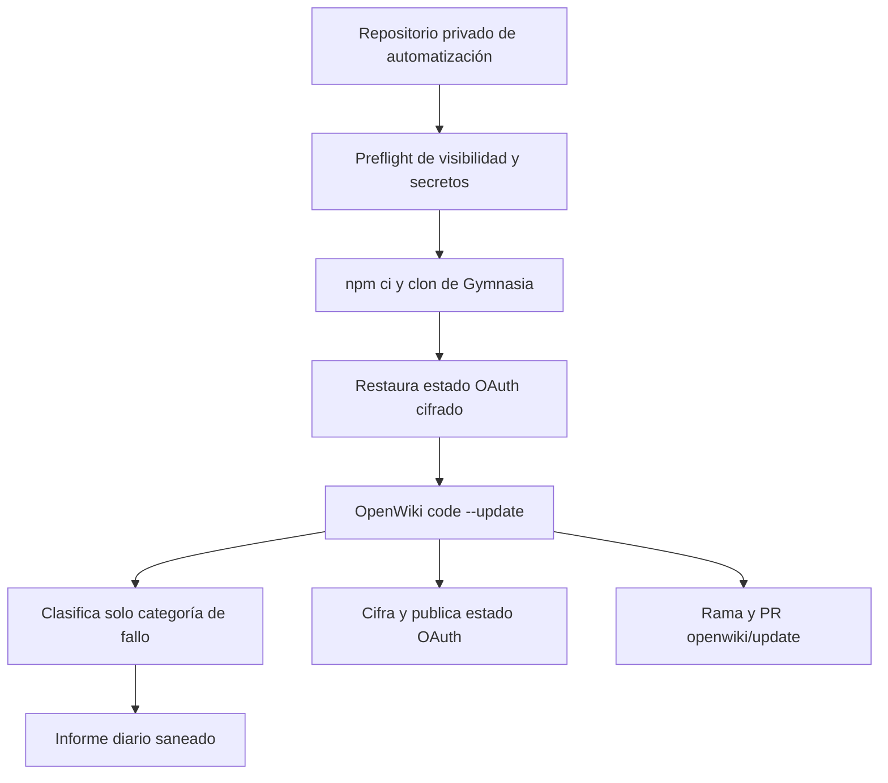

# Automatización privada de OpenWiki

`ops/openwiki-automation-template` es una plantilla de automatización, separada de la aplicación Gymnasia. `openwiki-update.yml` clona Gymnasia en `target`, ejecuta OpenWiki diariamente o bajo demanda y mantiene una rama/PR `openwiki/update`; `openwiki-report.yml` envía un informe de estado saneado cuatro horas después. Esta página documenta la operación de la automatización, mientras que [Evidencia de ejecución](runtime-behavior.md) conserva la señal observada que debe cambiar cómo se depura o modifica este flujo.

## Límites de seguridad y ciclo operativo



*El estado sensible se restaura y cifra fuera del checkout; la notificación recibe estado y categorías, no prompts, trazas ni credenciales.*

`OpenWiki Update` exige repositorio privado y la presencia de secretos antes de instalar o clonar. Inicializa hogares aislados para el código y el estado personal, instala con `npm ci`, crea `target` con `git clone --no-tags` y fuerza la rama de actualización desde `origin/main`. El paso OpenWiki configura `LANGSMITH_HIDE_INPUTS`, `LANGSMITH_HIDE_OUTPUTS` y `LANGSMITH_HIDE_METADATA` como `true`; por tanto, cualquier consulta de trazas debe tratar su contenido como no disponible y documentar solo agregados operativos.

El estado OAuth se recupera desde el último artefacto cifrado (o una semilla de recuperación) y se descifra en el hogar aislado. El workflow evita que scripts de instalación compartan el sistema de archivos con el token en claro. Tras una ejecución correcta, el estado se vuelve a cifrar; no añada archivos `.env`, semillas, artefactos descifrados ni logs a Git.

## Clasificación de fallos y cambio seguro

Cuando OpenWiki falla, `scripts/classify-openwiki-error.mjs::classifyOpenWikiError` recibe el archivo de log y devuelve solamente una categoría de `oauth`, `managed-markers`, `langsmith`, `rate-limit`, `model`, `context-limit`, `network` o `unknown`. El clasificador prioriza señales OAuth fuertes, distingue trazado habilitado de un fallo de trazado y cierra ante errores de lectura. Las pruebas afirman que su salida no reproduce secretos ni texto privado.

Para ampliar una categoría, mantenga el contrato de privacidad: añada patrones dirigidos en el clasificador y casos que demuestren tanto la clasificación como la ausencia de contenido de log en stdout/stderr. No transforme el informe en un canal para prompts o errores sin sanear. Ejecute:

```bash
npm --workspace ops/openwiki-automation-template test
```

El workflow de informe consulta metadatos de ejecuciones/jobs y de la PR, genera el texto con `build-daily-report.mjs` y lo entrega a Telegram solo si los secretos de Telegram están configurados. No ejecuta OpenWiki ni debe convertirse en una fuente de contenido del repositorio objetivo.

## Trazado y operación

La actualización establece `LANGCHAIN_PROJECT: openwiki`, trazado LangSmith y endpoint europeo. El interruptor manual `disable_langsmith_tracing` permite aislar una incidencia diagnóstica sin modificar el workflow. Antes de cambiar el modelo, OAuth, reintentos o la estrategia de observabilidad, consulte [Evidencia de ejecución](runtime-behavior.md): la muestra más reciente mostró fallos previos a herramientas por autenticación/cuota del modelo y una ejecución normal con varias rondas, lo que hace que la preparación de credenciales sea más prioritaria que optimizar las herramientas.

La automatización depende de la configuración indicada en su README, pero los secretos nunca deben aparecer en documentación, salidas ni tests. La aplicación/Worker de Gymnasia no depende de este flujo; el vínculo es de mantenimiento de documentación, no de ejecución del producto. Para la entrega de la aplicación, use [Compilación, publicación y pruebas](build-release-and-testing.md), y para la excepción de escritura de feedback, [Worker de feedback](../services/feedback-worker.md).