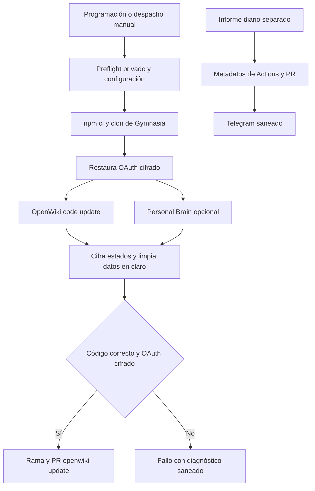

# Automatización privada de OpenWiki

`ops/openwiki-automation-template` es un runner documental privado, separado de la aplicación Gymnasia. Mantiene dos ámbitos: el **Code Brain**, que puede proponer cambios exclusivamente bajo `openwiki/` y `.openwikiignore` en la rama `openwiki/update`, y un **Personal Brain** que permanece privado. Ninguno es una dependencia de ejecución de `apps/mobile`, del agente ni de los Workers del producto. Para el runtime y la entrega de Gymnasia, consulte [Inicio rápido](../quickstart.md) y [Compilación, publicación y validación](build-release-and-testing.md).

La evidencia observada, incluidos métricas, fallos, latencia y coste de la muestra LangSmith, pertenece a [Evidencia de ejecución](runtime-behavior.md). Esta guía documenta el contrato estático, las barreras y los puntos de diagnóstico; no interpreta una muestra como comportamiento garantizado del producto.

## Entradas, cadencia y frontera de publicación

`OpenWiki Update` se programa a las 08:00 UTC y también admite despacho manual. Su ejecución serializa actualizaciones mediante el grupo de concurrencia `openwiki-update`, sin cancelar una actualización ya iniciada, y tiene un límite de 120 minutos. Antes de instalar dependencias, exige que el repositorio de automatización sea privado y que exista su configuración protegida. Después instala el grafo bloqueado con `npm ci`, clona Gymnasia sin tags y crea `openwiki/update` forzada desde `origin/main`.



*El update publica solo documentación generada tras conservar el estado OAuth; el informe es un consumidor separado de metadatos, no de logs ni de contenido de fuentes.*

El checkout no conserva credenciales de GitHub. Antes de invocar OpenWiki, el workflow comprueba que `AGENTS.md` enlaza con `CLAUDE.md`, materializa una copia para la herramienta y, al publicar, restaura ambos archivos desde `origin/main`. El commit indexa únicamente `openwiki` y `.openwikiignore`; la rama se empuja con `--force-with-lease` contra el SHA observado y crea o actualiza una PR contra `main` solo cuando hay cambios preparados. Así se preserva la topología revisada de instrucciones y se evita que el bot publique archivos ajenos a la wiki.

La instalación efectiva requiere Node 22.22.x: tanto el manifiesto como el lockfile fijan el paquete de la plantilla en la versión 1.0.0, Node `>=22.22.0 <23` y las dependencias directas `openwiki` 0.4.3, `jsdom` 29.1.1 y `mermaid` 11.16.1. El lockfile confirma ese grafo para `npm ci`; por sí solo no demuestra un cambio de comportamiento distinto del que declaran el manifiesto y los workflows.

## Estado sensible y ciclo de vida

El runner inicializa dos hogares bajo el temporal del runner: uno para Code Brain y otro para Personal Brain. El OAuth se recupera del artefacto cifrado más reciente asociado a la rama predeterminada; si no está disponible o no se puede descifrar, puede usar una semilla de recuperación configurada fuera del repositorio. Si no hay una fuente recuperable, el update no ejecuta OpenWiki.

El formato OAuth reduce el `.env` a los campos administrados de la sesión ChatGPT y exige los datos mínimos para renovar la sesión. Se cifra con AES-256-GCM, una clave derivada con `scrypt`, sal e IV aleatorios y datos autenticados específicos del formato. Los ficheros restaurados y cifrados se escriben con permisos de propietario. Al terminar —también en rutas de error posteriores a la restauración— el workflow vuelve a cifrar el estado renovado, elimina el `.env` y logs temporales, y solo carga artefactos cifrados con retención de 30 días.

El Personal Brain es opcional y no publica en Gymnasia. Cuando se habilita una fuente seleccionada, requiere una frase de paso propia, restaura un archivo privado cifrado o inicializa un estado nuevo, configura los conectores y ejecuta `openwiki ingest all --scheduled --print` sin trazado LangSmith. Su persistencia empaqueta solo los directorios/configuración privados necesarios y aplica el mismo cifrado autenticado; además, el helper rechaza entradas que superen sus límites de tamaño. Las fuentes configurables se limitan a un export de Linear de solo lectura y metadatos, un repositorio local seleccionado y búsqueda web enfocada; el objetivo de ingestión ordena tratar las fuentes como datos y descartar secretos o contenido que pretenda dar instrucciones.

## Trazado, fallos y diagnóstico seguro

El Code Brain configura el proyecto LangSmith `openwiki` y el endpoint europeo. El trazado está activo por defecto, pero oculta entradas, salidas y metadatos. El único interruptor `workflow_dispatch`, `disable_langsmith_tracing`, lo desactiva para una ejecución diagnóstica concreta; no cambia proveedor, modelo ni crea un mecanismo de recuperación. Por ello, un diagnóstico debe usar estados de pasos, categorías y agregados autorizados, nunca prompts, trazas, URLs de trazas ni logs.

Cuando `openwiki code --update` falla, su salida se guarda en un archivo temporal y `classifyOpenWikiError` emite una sola categoría de una lista cerrada: `oauth`, `managed-markers`, `langsmith`, `rate-limit`, `model`, `context-limit`, `network` o `unknown`. La precedencia evita atribuir a OAuth una mera mención exitosa de trazado o renovación: primero reconoce señales OAuth fuertes, después categorías específicas y finalmente señales OAuth amplias. También cierra a `unknown` si no puede leer el fichero, de modo que ni la ruta ni el contenido del log se propagan al workflow.

La categoría `oauth` cambia el estado abstracto de autenticación y las demás se anuncian como categoría saneada. Para investigar una incidencia, compruebe primero el preflight, la restauración/cifrado OAuth, el estado de pasos y la categoría; consulte después [Evidencia de ejecución](runtime-behavior.md) para la señal renovada que pueda priorizar una hipótesis. No añada impresión de logs, tokens, contenido de fuentes ni campos no confiables como atajo de diagnóstico.

## Informe diario saneado

`OpenWiki Daily Report` es un workflow independiente: se programa a las 12:00 UTC, cancela informes solapados del grupo `openwiki-daily-report` y tiene un límite de 10 minutos. Solo continúa en un repositorio privado si está configurada la entrega Telegram. Lee hasta 30 ejecuciones recientes del workflow de actualización, los jobs de la más reciente y, de estar autorizado, metadatos limitados de la PR `openwiki/update`; no invoca OpenWiki ni descarga logs de ejecución.

`buildDailyReport.mjs` deriva estado global, duración redondeada, racha de fallos, estado de Code Brain, persistencia OAuth, Personal Brain, fuentes confirmadas y resumen de la PR a partir de nombres y conclusiones de pasos y campos seleccionados. Acepta enlaces únicamente si son HTTPS de `github.com`, filtra los destacados a rutas Markdown bajo `openwiki/` y no usa cuerpo o título de PR. El archivo temporal del informe se crea con permisos privados y se transmite a Telegram como formulario; si falla la generación antes de enviar, la notificación de respaldo solo contiene el enlace canónico al workflow.

## Cambio y validación focalizada

Cambie el workflow y sus scripts como una frontera de seguridad, no como código de la aplicación. Al ampliar la clasificación, añada patrones específicos y casos de prioridad, éxito aparente y fallo de lectura; la salida debe seguir siendo una categoría. Al ampliar el informe, limite explícitamente los campos de entrada, valide URLs y pruebe que datos privados inyectados no llegan al mensaje. Al modificar cifrado o persistencia, conserve autenticación, selección mínima de OAuth, permisos restrictivos, limpieza `always()` y el requisito de cifrado antes de publicar documentación.

Ejecute la suite aislada de la plantilla con:

```bash
npm --workspace ops/openwiki-automation-template test
```

Sus pruebas cubren clasificación sin eco de logs, selección y cifrado autenticado del OAuth, rechazo de manipulación o frase de paso errónea, estado privado, configuración de conectores, formato del informe y restricciones estructurales de los workflows. Son pruebas locales de contrato: no prueban disponibilidad de GitHub Actions, Telegram, LangSmith, OAuth ni proveedores remotos. Esas integraciones requieren una ejecución remota controlada y un diagnóstico que preserve las mismas fronteras de privacidad.
