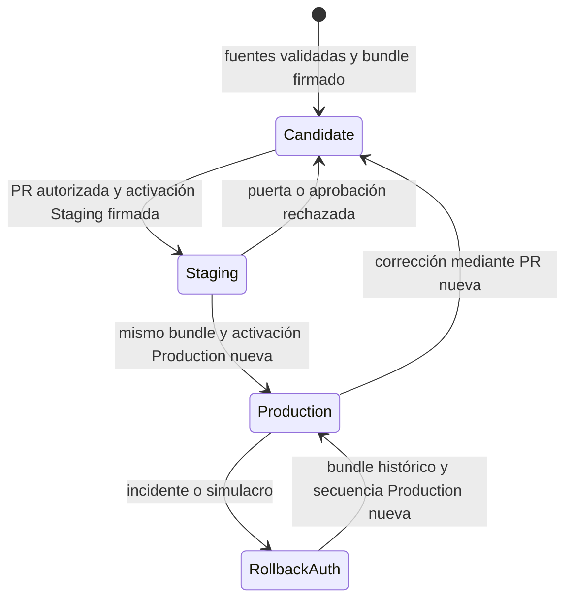

# Promoción y rollback de políticas

Este runbook cubre el plano de publicación de la política firmada. La política se construye a partir del prompt, la política sanitaria de runtime y el contrato de tools; se firma localmente; se prueba como candidato inmutable en `Staging`; y se activa en `Production` sin reconstruirla. Un rollback tampoco reescribe un bundle: autentica una activación nueva hacia un bundle histórico.

La frontera de seguridad es deliberada: Git contiene material público versionado y GitHub Actions verifica y publica; las claves privadas raíz y firmante permanecen en dos elementos de Bitwarden y solo las usa la CLI local. No se deben introducir claves privadas, `BW_SESSION`, identificadores de sesión ni exportaciones del vault en commits, logs, inputs de Actions, artifacts o capturas.

## Modelo e invariantes



_El ciclo conserva el bundle probado, mientras cada cambio de canal o rollback requiere una activación firmada y una secuencia creciente._

Estas condiciones son puertas obligatorias, no recomendaciones:

- **Un candidato es inmutable.** `PolicyBundleV1` es JSON canónico de hasta 256 KiB. Incluye versión, `critical`, protocolo mínimo, tools requeridas, prompt, política sanitaria y sus hashes. Su identificador tiene la forma `policy-vAAAA.MM.N-<sha12>` y deriva de la versión y del SHA-256 del prompt.
- **Bundle y activación se autentican por separado.** Ambos llevan envolturas Ed25519. La activación fija acción, canal, candidato, hash del bundle, criticidad, secuencia y, solo para rollback, `fromBundleId`.
- **La raíz no firma publicaciones cotidianas.** Certifica la clave firmante; la firmante firma bundles y activaciones. El verificador exige una raíz pública confiable, la firma raíz del certificado, la vigencia del certificado y la correspondencia exacta entre firma y bytes.
- **Los canales no se mezclan.** Las únicas activaciones válidas son `Staging` y `Production`; el canal firmado debe coincidir con el canal esperado. Production descarga el asset ya publicado por Staging, no recompone el bundle desde `main`.
- **La secuencia nunca retrocede.** La CLI propone el máximo del canal más uno y Actions exige que una activación de Production supere todas las secuencias Production anteriores. Repetir un deployment antiguo no constituye rollback.
- **Toda operación tiene motivo cerrado.** Solo se aceptan `routine-release`, `critical-policy-fix`, `incident-response` y `rollback-drill`; no hay texto libre.
- **Toda promoción conserva las puertas.** `critical: true` selecciona `Production Critical`, pero no omite Staging, firmas, autorización del propietario, puerta sanitaria, evidencia ni aprobación del environment.
- **Toda ejecución se audita.** El job final corre incluso si la validación o publicación falla. Telegram es un canal de aviso, no un canal de publicación ni una condición para deshacer el resultado.
- **Toda build nueva prepara el snapshot.** El APK de Production debe incorporar el paquete firmado que corresponde a un deployment Production correcto. Si los assets, hashes, firma o evidencia no coinciden, la preparación falla.

## Material público y custodia privada

### Versionado en el repositorio

El repositorio conserva y revisa:

- `policy/signing/bundle.config.json`: versión `AAAA.MM.N`, `critical`, `minClientProtocol` y `requiredTools`;
- `policy/signing/current.bundle.json` y `current.bundle.signature.json`;
- `policy/signing/trusted-roots.json`: exclusivamente raíces públicas;
- `policy/signing/signer-certificate.json`: certificado público del firmante y firma de la raíz;
- `apps/mobile/agent/generated/trustedPolicyRoots.generated.ts`: copia generada de las raíces públicas para verificación en el cliente.

`npm run sync:policy-trust` regenera la copia móvil; `npm run check:policy-trust` falla ante deriva. Una rotación normal crea otro firmante y certificado. Una raíz nueva debe llegar primero en una actualización de la app; las raíces anteriores se conservan mientras haya bundles que todavía deban ser verificables para rollback.

### Solo en Bitwarden

Las claves privadas se almacenan como campos ocultos en dos notas seguras distintas, referenciadas localmente mediante `BITWARDEN_POLICY_ROOT_ITEM_ID` y `BITWARDEN_POLICY_SIGNER_ITEM_ID`. La inicialización se niega a sobrescribir una nota que ya contenga material de firma.

Preparación inicial o rotación, siempre desde una estación operativa controlada:

```bash
bw login
export BW_SESSION="$(bw unlock --raw)"
export BITWARDEN_POLICY_ROOT_ITEM_ID="<id de la nota raíz>"
export BITWARDEN_POLICY_SIGNER_ITEM_ID="<id de la nota firmante>"

npm run policy:key:init-root -- --key-id <id-público-de-raíz>
npm run policy:key:init-signer -- \
  --key-id <id-público-de-firmante> \
  --not-after <fecha-RFC3339-UTC>
npm run sync:policy-trust
```

No ejecute estos comandos dentro de Actions. `BITWARDEN_CLI_JS_ENTRYPOINT` puede señalar localmente la entrada JavaScript de `bw` cuando una instalación de Homebrew necesite usar el mismo Node que `npm`; no es un secreto y no se configura en CI.

## Preparar y firmar un candidato

1. Abra una PR contra `main`. Los paths de política, aplicación, workflows y scripts de promoción están bajo `@maximofn` en `CODEOWNERS`.
2. Modifique las fuentes canónicas. Si cambia el contenido de política, incremente `version` en `policy/signing/bundle.config.json`; ajuste también `critical`, protocolo mínimo o tools cuando corresponda.
3. Con Bitwarden desbloqueado, genere y verifique los artifacts públicos:

   ```bash
   npm run policy:bundle:sign
   npm run policy:bundle:check
   npm run check:policy-trust
   npm run check:prompt-policy
   npm run test:prompt-policy
   npm run check:health-safety
   npm run test:health-safety
   ```

4. Revise y versione en la misma PR el bundle y su firma. `bundle-check` comprueba firma, raíz, certificado, JSON canónico, tamaño, protocolo y tools, y además compara byte a byte el prompt, la política sanitaria y la configuración con sus fuentes.
5. Espere el check `prompt-policy` y el estado `gymnasia/owner-authorization` sobre el SHA exacto de la PR. El workflow `prompt-policy` también valida versión de Production, artifacts generados, tests de contrato y propiedad, política sanitaria, configuración móvil y TypeScript.

No lance Staging si la PR cambió después de las aprobaciones: la promoción resuelve y valida el SHA actual de la cabeza de la PR.

## Promover a Staging

Ejecute desde el checkout que contiene el candidato firmado:

```bash
npm run policy:promote -- \
  --operation staging \
  --pr <número-de-PR> \
  --reason-code routine-release
```

La CLI calcula la próxima secuencia de `Staging`, firma localmente una `PolicyActivationV1`, codifica únicamente la activación y su envoltura públicas, y despacha `promote-policy.yml` sobre `main`. El directorio temporal se elimina al terminar.

El workflow debe completar, en orden:

1. verificar que la ejecución usa `refs/heads/main`, que la PR sigue abierta contra `main`, y que su SHA tiene `prompt-policy` y `gymnasia/owner-authorization` correctos;
2. separar el checkout del candidato del checkout confiable que aporta el verificador desde el SHA de `main` que ejecuta el workflow;
3. ejecutar `npm run check:health-safety` sin secretos;
4. verificar bundle, certificado, raíz, firma, activación reciente, canal `Staging`, protocolo, tools y paridad con las fuentes del SHA candidato;
5. generar `health-safety-report.json` y `promotion-evidence.json`, enlazados por SHA-256 al candidato y al source commit;
6. detenerse en el environment `Staging` para su aprobación;
7. crear una GitHub prerelease inmutable con `policy.bundle.json`, `policy.bundle.signature.json`, `health-safety-report.json` y `promotion-evidence.json`;
8. registrar un deployment `gymnasia-policy`, schema v3, con la activación firmada y estado `success`.

Pruebe exactamente ese candidato en Staging. No edite la Release ni sustituya sus assets; cualquier cambio requiere versión, firma y candidato nuevos.

### Arranque firmado único

Solo para resolver la dependencia circular de la primera raíz, y únicamente antes de que exista cualquier deployment firmado schema v3, Staging admite:

```bash
npm run policy:promote -- \
  --operation staging \
  --bootstrap-main true \
  --reason-code routine-release
```

`--bootstrap-main` y `--pr` son mutuamente excluyentes. El workflow exige que el SHA sea el `main` actual y deshabilita este camino permanentemente tras el primer deployment schema v3. No lo use como excepción operativa posterior.

## Promover el mismo candidato a Production

Después de validar Staging:

```bash
npm run policy:promote -- \
  --operation production \
  --reason-code routine-release
```

Para una promoción normal la CLI usa el bundle firmado actual y crea una activación nueva para `Production`. Actions descarga el candidato desde su Release y vuelve a comprobar firma, fuentes, puerta sanitaria y hashes de `promotion-evidence.json`. Además exige:

- un deployment Staging del candidato con estado `success`;
- que el candidato sea el de mayor secuencia de Staging;
- que no sea ya el bundle Production actual;
- que la nueva secuencia sea mayor que toda secuencia Production previa;
- aprobación de `Production`, o de `Production Critical` cuando el bundle declara `critical: true`.

Al publicar, el workflow registra el deployment Production schema v3 y el estado `gymnasia/policy-promotion` sobre el source commit. La fusión de la PR sigue siendo manual; el estado no reconstruye ni modifica el bundle.

## Rollback autenticado

Un rollback apunta a un bundle histórico que ya tuvo deployments correctos tanto en Staging como en Production. Primero previsualice:

```bash
npm run policy:promote -- \
  --operation rollback \
  --candidate policy-vAAAA.MM.N-<sha12> \
  --reason-code incident-response \
  --dry-run
```

La previsualización consulta el historial, ordena deployments por secuencia, resuelve el Production activo, valida la historia del destino, descarga el bundle histórico y verifica su firma. Muestra candidato, `fromBundleId` y próxima secuencia, pero retorna antes de leer la clave firmante o despachar Actions. Si se proporciona `--rollback-from`, debe coincidir exactamente con el activo resuelto.

Tras revisar el plan, ejecute sin `--dry-run`:

```bash
npm run policy:promote -- \
  --operation rollback \
  --candidate policy-vAAAA.MM.N-<sha12> \
  --reason-code incident-response
```

La CLI firma una activación `rollback` de canal `Production`, con secuencia nueva y `fromBundleId` igual al bundle activo. Actions vuelve a exigir que:

- el destino histórico tenga historia válida en ambos canales;
- el bundle descargado y su firma correspondan al identificador solicitado;
- `fromBundleId` coincida con el Production actual;
- la acción firmada sea `rollback` y no `activate`;
- la secuencia sea mayor que todas las de Production.

No cambie la versión ni vuelva a subir el asset histórico. No reduzca la secuencia, no borre deployments y no intente recuperar repitiendo una activación vieja.

### Secuencia de recuperación de incidente

1. Conserve la Release y el deployment defectuosos como evidencia.
2. Seleccione el último candidato anterior con éxito verificable en Staging y Production.
3. Ejecute el rollback con `--dry-run` y confirme destino, origen y secuencia.
4. Ejecute el rollback real y apruebe el environment de Production que corresponda.
5. Confirme el nuevo deployment `gymnasia-policy`, el registro `gymnasia-policy-audit` y el estado de Telegram.
6. En un dispositivo afectado, use **Ajustes → Trazas → Comprobar actualización** y confirme que la política queda pendiente para el siguiente envío seguro.
7. Corrija el defecto en una PR nueva y repita todo el tránsito Staging → Production con otra activación creciente.

## Auditoría y alertas

`audit-and-notify` usa `if: always()` y produce un deployment separado con task `gymnasia-policy-audit`. Su `PolicyOperationAuditV1` contiene una allowlist: evento, operación, resultado, environment, source commit, candidato y hash si son coherentes, actor, motivo, resultados de validación/publicación, activación y enlaces. No incorpora prompt, conversaciones, claves, inputs, outputs ni datos de salud.

Consulta operativa de los últimos eventos:

```bash
gh api --paginate --slurp \
  'repos/maximofn/gymnasia/deployments?task=gymnasia-policy-audit&per_page=100' \
  | jq 'add | sort_by(.created_at) | reverse | .[:20] | map(.payload)'
```

Los únicos secretos de alerta en GitHub son `POLICY_TELEGRAM_BOT_TOKEN` y `POLICY_TELEGRAM_CHAT_ID`. Deben pertenecer a un bot dedicado y a un chat operativo; nunca van en `.env`, en el bundle móvil o en argumentos locales documentados. El `eventId` es determinista: si ya existe una auditoría marcada `sent`, el reintento queda `duplicate` y no duplica el mensaje. Configuración ausente o error de Telegram queda como `skipped` o `failed` con un código genérico y una advertencia, sin alterar el resultado de publicación.

## Preparar el snapshot de una build

Para una build nueva de Production, después de las comprobaciones de fuente y justo antes de compilar, ejecute:

```bash
node scripts/policy-promotion/prepare-policy-snapshot.mjs --environment production
```

El flujo automatizado de `build-apk.yml` añade `--github-env "$GITHUB_ENV"`. El preparador busca un deployment `gymnasia-policy` correcto del canal solicitado, valida la forma exacta de su payload schema v3, descarga únicamente URLs esperadas de la Release, limita tipos y tamaños, comprueba el SHA-256 y verifica bundle, activación, certificados, raíz, canal, protocolo y tools. También exige que el informe sanitario tenga cero fallos y que `promotion-evidence.json` enlace candidato, commit y hashes.

Solo entonces genera conjuntamente:

- `chatSystemPrompt.generated.ts`;
- `healthSafetyPolicy.generated.ts`;
- `signedPolicySnapshot.generated.ts`, con bundle, firma y activación completos;
- `policySnapshot.generated.json`, con candidato, hashes, versión sanitaria, activación, secuencia y deployment.

Así el prompt y el guardrail sanitario proceden del mismo bundle firmado. Para un retry o supersession de la misma transacción Android, el workflow restaura el archivo de snapshot y el tarball de inputs inmutables de la Release en lugar de volver a resolver la política vigente. Consulte también [Publicación Android](/openwiki/operations/android-release.md).

## Diagnóstico de fallos

| Síntoma | Interpretación y acción obligatoria |
| --- | --- |
| `prompt-policy` o `gymnasia/owner-authorization` no está en éxito | No promover. Actualizar o reautorizar el SHA exacto de la PR. |
| `El bundle firmado no corresponde a sus fuentes canónicas` | Regenerar y firmar después del último cambio de prompt, runtime, configuración o tools; no editar el JSON generado. |
| Firma, raíz o certificado inválidos o fuera de vigencia | Detener la operación. Verificar trust store y certificado público; rotar de forma controlada, nunca omitir la verificación. |
| Activación no reciente | Crear y firmar una activación nueva. El verificador acepta como máximo 24 horas de antigüedad y 5 minutos de adelanto. |
| Canal distinto | No reutilizar una activación Staging en Production ni al revés; firmar una activación nueva del canal correcto. |
| Secuencia no mayor | Recalcular desde todos los deployments schema v3 del canal y firmar una secuencia nueva. No borrar historia. |
| Production no encuentra Staging | Publicar y aprobar primero el mismo candidato en Staging; no construir otro bundle. |
| Rollback sin historia en ambos canales o con origen distinto | Elegir un destino que haya sido exitoso en Staging y Production y volver a resolver el activo. |
| Falla `prepare-policy-snapshot.mjs` | No compilar ni publicar. Reparar deployment, Release o evidencia; no insertar manualmente módulos generados. |
| Telegram `failed` o `skipped` | Revisar los secrets o reintentar la auditoría; no revertir una política correcta por un fallo del aviso. |

## Verificación enfocada antes de cambiar el mecanismo

Los tests de promoción están incluidos en `npm run test:prompt-policy`. En particular cubren alteración de bytes y firmas, raíz no autorizada, certificado vencido, canal/protocolo/tools incompatibles, JSON no canónico, relación rollback/origen, custodia de Bitwarden, motivos cerrados, reutilización exacta entre canales, secuencia, bootstrap único, auditoría con allowlist y deduplicación de Telegram.

Para un cambio en firma, workflows, auditoría o snapshot ejecute como mínimo:

```bash
npm run check:prompt-policy
npm run test:prompt-policy
npm run check:health-safety
npm run test:health-safety
npm run check:policy-trust
```

No sustituya estos checks por una prueba manual de la UI. Para el comportamiento de aplicación y guardrails consulte [Política y seguridad sanitaria](/openwiki/architecture/policy-and-health-safety.md); para la estrategia transversal de pruebas, [Estrategia de validación](/openwiki/testing/validation-strategy.md).
