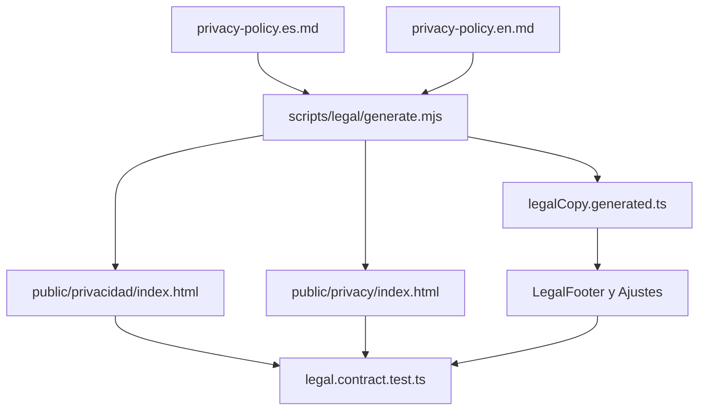

# Política de privacidad y artefactos legales

Consulta esta página al cambiar la política de privacidad, el descargo médico, los enlaces legales de Ajustes o las páginas estáticas publicadas. Es una frontera de privacidad y publicación del cliente local-first, complementaria al almacenamiento descrito en [Estado local y copias de seguridad](../mobile/local-state-and-backup.md) y a los límites de datos del [Worker de feedback](../services/feedback-worker.md).

## Fuente única y superficies derivadas

`docs/legal/privacy-policy.es.md` y `docs/legal/privacy-policy.en.md` son las fuentes revisables. `scripts/legal/generate.mjs` las carga, valida y produce los artefactos de publicación y el módulo de copia que importa la aplicación. No se debe editar una salida para corregir texto: volverá a divergir de la fuente.

*La fuente legal genera tanto la copia de la interfaz como las páginas publicadas, y el contrato comprueba que siguen siendo la misma política.*

`LegalFooter` se monta en Ajustes mediante `App.tsx` y abre el enlace externo a través de `openExternalUrl`, no mediante `Linking.openURL` directo. La copia de seguridad también ofrece su enlace `legal-backup-policy-link` a `#copias`. Conserva los `testID`, `accessibilityRole="link"` y el helper de apertura: son el contrato que protege una vía de información fácil de perder en un refactor.

## Contratos de publicación y privacidad

La batería `apps/mobile/agent/legal.contract.test.ts` comprueba que ambos HTML publiquen los mismos `PRIVACY_POLICY_DIGESTS`, `PRIVACY_POLICY_VERSION`, URL canónica y enlaces `hreflang`, además del mismo `MEDICAL_DISCLAIMER` que la aplicación. También exige que los HTML no tengan scripts, hojas de estilo externas, HTTP ni `noindex`; la política debe ser legible sin ejecutar código ni revelar a terceros quién la consulta.

El contrato evita además que el binario distribuya mediciones históricas ajenas: `createInitialStore()` debe iniciar `measurements: []`, sin `BODY_FAT_HISTORY_DATA` ni migración de datos sembrados. No añadas datos reales, conjuntos fechados ni ejemplos que puedan presentarse como historial del usuario. La política regula datos del usuario; no convierte los datos locales en una copia de seguridad remota.

## Receta de cambio y validación

1. Actualiza las dos fuentes bajo `docs/legal/` de forma coordinada y conserva las secciones/identificadores que el generador valida.
2. Ejecuta `npm run sync:legal`; revisa todos los artefactos generados, incluido `apps/mobile/agent/generated/legalCopy.generated.ts` y las páginas `apps/mobile/public/`.
3. Ejecuta `npm run check:legal && npm run test:legal`. Para iterar en el contrato móvil: `npx vitest run --config apps/mobile/vitest.config.mts apps/mobile/agent/legal.contract.test.ts`.
4. Si cambia la UI, comprueba que Ajustes conserva `LegalFooter` y que la copia de seguridad sigue enlazando a la política. Añade TypeScript y compilación web únicamente si la modificación toca el shell o la exportación, según [Compilación, publicación y pruebas](build-release-and-testing.md).

Un `check:legal` correcto prueba paridad de fuentes y artefactos, no despliega las páginas ni verifica una URL pública real. Esa comprobación es condicional tras cambiar hosting, dominios o la configuración de publicación.
