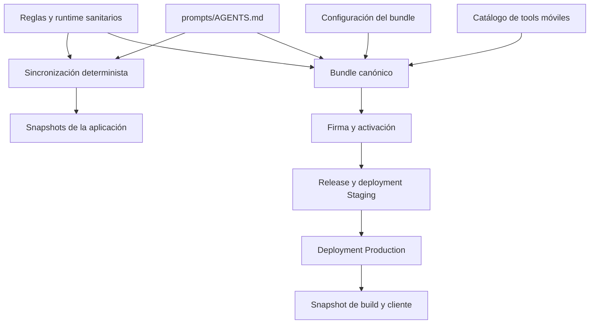

# Gobierno de prompt y política

Las instrucciones que el modelo lee no se tratan como texto de aplicación ordinario. El prompt canónico `prompts/AGENTS.md`, la política declarativa de `policy/health-safety/`, las herramientas requeridas y la configuración de firma forman una superficie de seguridad. Esta página explica el mecanismo **vigente** para cambiarla, revisar su contenido, crear un bundle firmado y hacerlo disponible en los canales de política. Para el consumo del bundle en el cliente, véase [Entrega y activación de políticas firmadas](../architecture/policy-delivery.md); para el uso del lease en un turno de chat, [Runtime del agente](../agent/runtime.md).

## Regla humana no eludible

**Si un cambio toca `prompts/` o `policy/health-safety/`, hay que detenerse, avisar en lenguaje natural y obtener aprobación explícita del mantenedor antes de promoverlo o fusionarlo.** El aviso debe explicar, sin limitarse al diff:

- qué podía o no podía hacer el agente antes;
- qué podrá o dejará de poder hacer después;
- qué consecuencia práctica puede tener para la persona usuaria.

Una aprobación genérica sobre otro asunto no sirve. No se debe iniciar `promote-policy.yml`, fusionar la PR ni mover el cambio a otra rama para evitar esta puerta hasta recibir esa aprobación explícita. El requisito aplica tanto a una edición directa del prompt como a una regla sanitaria que se inyecta en él; los checks deterministas y una firma válida aportan evidencia técnica, pero no sustituyen la decisión humana.

## Fuentes canónicas y salidas derivadas

La política sanitaria se compone de un manifiesto versionado, reglas, casos, esquemas JSON, una evaluación LLM únicamente informativa y `runtime.json`. El manifiesto fija categorías y reglas publicables obligatorias, la versión de la release y que el cierre requiera revisión profesional. Una regla `approved` exige esa revisión profesional; las reglas `provisional` también se publican para proteger al usuario, mientras que los borradores no se incorporan al prompt.

`scripts/health-safety/sync.mjs` genera de forma determinista el bloque delimitado por `<!-- HEALTH-SAFETY:START -->` y `<!-- HEALTH-SAFETY:END -->` en `prompts/AGENTS.md`, además del snapshot de runtime de la app. Por tanto, no se edita ese bloque a mano. El prompt completo se convierte asimismo en el snapshot que consume la aplicación; si cualquiera de las salidas ya no corresponde a su fuente, las comprobaciones fallan en vez de aceptar deriva.

El bundle firmado toma como entradas el prompt normalizado, `policy/health-safety/runtime.json` y `policy/signing/bundle.config.json`. Esta última declara versión, criticidad, protocolo mínimo y las tools requeridas. La construcción rechaza una tool requerida que no figure en `AGENT_TOOL_DEFINITIONS`, de modo que no se puede promocionar una política que el cliente no anuncie.



*Las fuentes controlan tanto los snapshots locales como el candidato firmado; Staging precede a Production.*

## Puertas locales y de PR

`npm run check:health-safety` valida esquemas y referencias, IDs únicos, cobertura de categorías, fuentes y revisión de reglas publicadas, equivalencia de reglas publicadas con el runtime, casos/fixtures/tools y el bloque gestionado. También rechaza patrones de exfiltración en política o prompt y exige que los informes LLM sean no autorizantes. Después compara el prompt y runtime con los snapshots móviles y ejecuta los casos seguros contra fixtures sin red, secretos ni evaluación LLM autorizadora.

La fuente declarativa `.github/prompt-policy.json` separa dos ámbitos:

- **Rutas sensibles:** requieren la autorización de propietario cuando una PR externa las modifica. Incluyen Actions, instrucciones de repositorio, aplicación móvil, `policy/`, `prompts/` y los scripts que aplican estos controles.
- **Rutas de promoción:** son `prompts/` y `policy/health-safety/`. Además de ser sensibles, obligan al estado `gymnasia/policy-promotion` para el SHA exacto.

El generador de política deriva `CODEOWNERS` y el payload versionado del ruleset de `main`; `npm run sync:prompt-policy` materializa esas salidas y `npm run check:prompt-policy` detecta deriva y revisa las restricciones de workflows. El ruleset requiere los estados `prompt-policy`, `gymnasia/owner-authorization` y `gymnasia/policy-promotion`, resolución de conversaciones y PR; bloquea borrado y avance no rápido. No exige una revisión CODEOWNERS por sí misma: para rutas sensibles, la autorización efectiva se publica como estado.

`owner-authorization.yml` usa `pull_request_target` exclusivamente para reconciliar metadatos con el SHA base confiable. Tiene permisos de solo lectura sobre contenido, PR y deployments, y escritura solo de estados; no hace checkout ni ejecuta el head de una PR, no instala dependencias y no recibe secretos. Para una PR sensible, el autor configurado queda autorizado si coinciden su login e ID numérico; una PR externa queda `pending` hasta que la última revisión decisiva del propietario para el SHA actual sea `APPROVED`. Una aprobación de un commit anterior, una solicitud posterior de cambios o una revisión desestimada no autoriza el head. Las PR sin rutas sensibles pasan este check, pero el merge sigue siendo manual.

El check `gymnasia/policy-promotion` queda `success` automáticamente si la PR no cambia rutas de promoción. Si las cambia, queda `pending` hasta que exista para el mismo SHA un deployment exitoso `gymnasia-policy` en `Production`. Esta señal técnica no elimina la regla humana anterior: la promoción debe partir de una explicación y aprobación explícitas.

## Firma, publicación y promoción

La firma usa JSON canónico, SHA-256 y Ed25519. Las raíces públicas autorizadas se versionan en `policy/signing/trusted-roots.json`; el certificado del firmante tiene propósito `gymnasia-policy`, está firmado por una raíz y tiene vigencia delimitada. Las claves privadas no se guardan en el repositorio: los comandos de firma las leen localmente desde Bitwarden CLI. `npm run policy:bundle:sign` construye y firma los inputs actuales; `npm run policy:bundle:check` verifica firma y que el bundle aún coincide con sus fuentes.

Una activación firmada vincula bundle, digest, canal (`Staging` o `Production`), criticidad, acción y secuencia positiva. El verificador rechaza JSON no canónico, tamaños o codificación inválidos, firmas/certificados/raíces inválidos, canal o digest incoherentes, tools desconocidas y un protocolo mínimo que el cliente no soporte. Así, tener una release o conocer una URL no basta para que un paquete sea aceptable.

La entrada operativa es `npm run policy:promote -- --operation staging|production|rollback ...`. La operación necesita un motivo de un catálogo cerrado. Para Staging exige exactamente una PR abierta a `main` que haya pasado `prompt-policy` y `gymnasia/owner-authorization`, salvo el bootstrap único y explícito desde el `main` protegido. El workflow vuelve a ejecutar `npm run check:health-safety` sobre el commit candidato sin secretos, verifica artefactos mediante código confiable de `main` y publica una release prerelease inmutable con bundle, firma, informe sanitario y evidencia de promoción.

Production descarga ese candidato inmutable y vuelve a ejecutar la puerta sanitaria y la verificación contra el código fuente exacto. Para una activación normal exige que sea el candidato más reciente de Staging, que no sea ya el activo y que su secuencia supere todas las de Production. Las operaciones se serializan por canal; una política crítica usa el entorno protegido `Production Critical`. Solo tras publicar el deployment exitoso de Production se escribe el estado `gymnasia/policy-promotion` del commit fuente.

Un rollback es también una nueva activación firmada: el destino debe ser un bundle histórico distinto del activo que haya tenido éxito en Staging y Production. Conserva una secuencia nueva y declara `fromBundleId`, por lo que restaurar contenido anterior no rebaja la monotonía anti-rollback.

## Auditoría y fallos operativos

Al terminar —incluso si la validación o publicación falla— el workflow ejecuta `audit-and-notify`. Registra un deployment distinto con task `gymnasia-policy-audit`, resultado, motivo, actor, commit, candidato y activación cuando sean válidos. El payload se limita a metadatos operativos: no debe contener el prompt, mensajes, claves, entradas, salidas ni datos de salud. La alerta de Telegram es idempotente; si falta configuración o falla el envío, queda reflejado en auditoría y no cambia por sí solo el resultado de política.

No existe bypass documentado del ruleset. Si un check falla, se debe reparar o reejecutar la PR, conservar el SHA y registrar el incidente y los comandos ejecutados; no se corrige con un push directo a `main`. Tras un cambio de gobierno, compruebe también en GitHub que el ruleset remoto y los emisores de estados son los esperados: el JSON versionado describe la configuración deseada, no acredita por sí solo su aplicación remota.

## Procedimiento de cambio vigente

1. Determine si el cambio toca `prompts/` o `policy/health-safety/`. Si es así, comunique el impacto en lenguaje natural y espere aprobación explícita antes de fusionar o promover.
2. Modifique la fuente canónica. Para reglas sanitarias, mantenga los esquemas, referencias, casos y runtime consistentes; no edite el bloque gestionado ni snapshots a mano.
3. Si cambia la política sanitaria, ejecute `npm run sync:health-safety`, que también sincroniza el prompt móvil. Si cambia la política de rutas o workflows, ejecute `npm run sync:prompt-policy` y revise las salidas generadas.
4. Ejecute las puertas focalizadas:

```bash
npm run check:health-safety
npm run test:health-safety
npm run check:chat-prompt
npm run check:prompt-policy
npm run test:prompt-policy
npm run policy:bundle:check
npm run check:policy-trust
```

5. Abra una PR y espere los estados obligatorios. La promoción a Staging/Production es una operación manual separada del merge y necesita la aprobación humana ya descrita, además de sus environments y firmas.
6. Para producir una build firmada, deje que el flujo de release prepare el snapshot desde el deployment de Production; no sustituya ese paso por copiar un prompt local. Véase [Build, release y estrategia de validación](build-release-and-testing.md).

## Cobertura de pruebas y extensión segura

Las pruebas de `scripts/health-safety` cubren validación de política, revisión profesional de reglas aprobadas, exfiltración, deriva del bloque gestionado, referencias, tools y fixtures, corpus determinista e invariantes de generación. Las pruebas de promoción y firma ejercitan bundles/activaciones canónicos, alteraciones, certificados no autorizados o fuera de vigencia, incompatibilidad de canal/protocolo/tools, rollback y los contratos del workflow, incluida la separación entre Staging y Production.

Al ampliar esta superficie, trate como cambio coordinado cualquier ajuste de esquema, regla, runtime, tool requerida, fuente del bundle o workflow. Añada casos y pruebas que demuestren el nuevo invariante, conserve la generación determinista y no convierta una evaluación LLM, un informe o una notificación en una autorización. La aprobación humana, la firma verificable y los checks de PR cubren capas distintas y deben mantenerse independientes.

## Contexto histórico

Los despliegues y bundles antiguos son evidencia histórica o candidatos explícitos de rollback, no fuentes alternativas desde las que copiar instrucciones al cliente. Los comentarios de incidentes, simulacros y procedimientos anteriores no sustituyen el flujo vigente descrito aquí. Para un cambio presente de prompt o salud, siempre prevalecen la explicación en lenguaje natural, la aprobación explícita, las fuentes canónicas y las comprobaciones ejecutables actuales.
