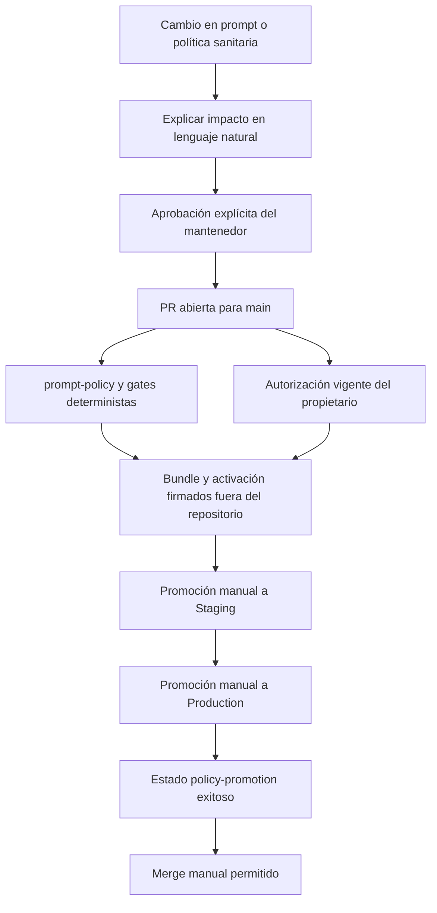

# Gobierno de cambios sensibles y política de prompt

Gymnasia es local-first en la aplicación móvil, pero el prompt del agente y la política sanitaria son instrucciones privilegiadas: cambian lo que el agente puede hacer y el comportamiento que recibe la persona usuaria. Por ello `prompts/` y `policy/health-safety/` son rutas de promoción además de rutas sensibles. La política de repositorio exige que, al tocarlas, se explique el cambio en lenguaje natural —qué se permitía o prohibía antes, qué cambia ahora y cuál es la consecuencia para la persona usuaria— y se espere una **aprobación explícita para ese cambio** antes de promover, fusionar o intentar llevarlo por otra rama. No se puede eludir esta puerta de aprobación.

Este documento trata el control ejecutable actual, no planes históricos. El runtime consume el resultado como un bundle firmado y un lease inmutable; véanse [Entorno de ejecución del agente](../agent/runtime.md) y [Ciclo de vida de la política firmada](../agent/signed-policy-lifecycle.md) para el consumo móvil y su degradación.

## Dos puertas complementarias

`.github/prompt-policy.json` es la fuente declarativa de los límites. Fija `main`, el propietario, los checks requeridos, las rutas sensibles y las rutas que necesitan promoción. `validatePolicy` rechaza un esquema, propietario, check o frontera obligatoria distinto; además, toda ruta de promoción debe estar cubierta por una ruta sensible. Actualmente las rutas promocionables son `prompts/` y `policy/health-safety/`.

El ruleset generado para `main` requiere tres estados: `prompt-policy`, `gymnasia/owner-authorization` y `gymnasia/policy-promotion`. Esto separa tres preguntas que no deben confundirse:

1. **¿Es coherente el cambio de repositorio?** `prompt-policy` ejecuta los generadores, contratos y gates de CI.
2. **¿La PR sensible tiene autorización del propietario para el SHA actual?** `gymnasia/owner-authorization` reconcilia ese estado.
3. **¿El commit que alteró contenido de política ya llegó a Production?** `gymnasia/policy-promotion` permanece pendiente hasta que exista un deployment de Production exitoso para ese `sourceCommit`.



*El flujo exige explicación y aprobación humana antes de la promoción; los checks automatizados verifican condiciones técnicas, pero no sustituyen esa decisión ni hacen merge.*

No basta una aprobación vaga ni una conversación sobre otro asunto. Si cambia el contenido o el efecto del prompt o de `policy/health-safety/`, detén el flujo hasta tener el sí explícito. No lances `promote-policy.yml`, no fusiones y no uses una rama alternativa para convertir una aprobación pendiente en un detalle técnico.

## Autorizar una PR sin ejecutar código no confiable

`owner-authorization.yml` se dispara para PR contra `main`, cada cinco minutos y manualmente. Hace checkout únicamente del SHA base confiable y ejecuta el reconciliador desde esa base; sus permisos se limitan a lectura de contenidos, PR y deployments, más escritura de estados. Es una excepción deliberadamente restringida de `pull_request_target`, no un entorno de CI para el head de una contribución.

La evaluación clasifica los archivos modificados con las fronteras declaradas. Si no hay ruta sensible, devuelve éxito pero el merge sigue siendo manual. Si el autor es el propietario, debe coincidir tanto `login` como ID numérico. Para cualquier otro autor, solo cuenta la última revisión decisiva del propietario que sea `APPROVED`, esté asociada al `headSha` actual y no haya sido sustituida por `CHANGES_REQUESTED` o `DISMISSED`; de lo contrario el estado es `pending`.

El validador de workflows prohíbe secretos y permisos de escritura en workflows de `pull_request`; también limita `pull_request_target` a este workflow de metadatos y le prohíbe checkout, `npm ci`, secretos y referencias al head de la PR. No añadas pruebas, checkout del head ni lógica aportada por la PR a esa autorización: trasladaría código no confiable a una frontera con capacidad de publicar estados.

## Gates deterministas y artefactos derivados

El workflow `prompt-policy` corre en PR y push a `main`, sin filtros de ruta porque es un estado requerido. Comprueba la versión de Production comprometida, la deriva de la política generada y workflows, sus pruebas, permisos Android, política sanitaria, inventario de datos, documentación legal, snapshot de prompt, batería determinista del agente, automatización OpenWiki y TypeScript móvil. El resumen de CI solo comunica el resultado de los controles y declara que no incluye contenido de prompt, secretos, conversaciones ni datos personales.

Para cambios locales de gobierno, la base mínima es:

```bash
npm run check:prompt-policy
npm run test:prompt-policy
```

`check:prompt-policy` comprueba que `CODEOWNERS` y `.github/rulesets/protect-main.json` correspondan a `.github/prompt-policy.json`, y llama a la política de workflows. Si modifica la fuente declarativa, usa `npm run sync:prompt-policy` para regenerar esos dos destinos; no edites las salidas a mano. Para prompt o salud añade al menos:

```bash
npm run check:health-safety
npm run test:health-safety
npm run check:chat-prompt
```

El gate sanitario es determinista: valida la política y su bloque gestionado en el prompt, detecta patrones de exfiltración, exige que los snapshots móvil de prompt y runtime correspondan a sus fuentes y valida el informe de evaluación. No usa red, secretos ni una evaluación LLM autorizadora. Un informe LLM de ejemplo es informativo y no puede autorizar el gate.

## Bundle firmado: qué se verifica y qué no se publica

El bundle agrupa el prompt normalizado, el runtime de salud, versión, criticidad, protocolo mínimo y herramientas requeridas. La construcción exige que las herramientas requeridas existan en el catálogo móvil; el verificador comprueba que el bundle firmado siga correspondiendo exactamente a las fuentes canónicas. La confianza publicada se limita a raíces **públicas** Ed25519 y certificados públicos; la validación criptográfica exige firma, digest, certificado encadenado a una raíz, vigencia y formatos canónicos.

La firma y la creación de activaciones ocurren fuera del repositorio y de GitHub Actions. El workflow recibe únicamente el bundle, sus firmas y una activación firmada ya preparada; no contiene material privado de firma. No copies ni publiques claves privadas, sesiones, firmas de activación, tokens o valores codificados en documentación, chat, issues o logs. La operación de firma es una responsabilidad de mantenedores autorizados mediante el mecanismo local aprobado; este documento no describe cómo extraer, copiar o reconstruir ese material.

`verify-artifacts.mjs` verifica bundle, firma, activación y firma de activación contra `trusted-roots.json`, el canal esperado y las herramientas anunciadas. Además exige una activación reciente y un certificado vigente en el momento de verificación; cuando recibe `--source-root`, compara el bundle con las fuentes de ese commit. Un fallo detiene la promoción, no se degrada a un artefacto sin verificar.

## Promoción manual por canal

`promote-policy.yml` solo se activa manualmente y serializa operaciones por canal sin cancelar una que ya está en curso. Sus operaciones son `staging`, `production` y `rollback`, y todas deben declarar uno de cuatro motivos operativos cerrados: `routine-release`, `critical-policy-fix`, `incident-response` o `rollback-drill`.

**Staging** toma una PR abierta contra `main` —salvo un bootstrap único y estrictamente limitado desde el HEAD protegido de `main`— y exige éxito de `prompt-policy` y de la autorización de propietario para el SHA de la PR. Descarga el candidato y el verificador confiable desde checkouts separados, ejecuta `npm ci --ignore-scripts` y el gate sanitario sin secretos, y verifica la activación `Staging`. Solo entonces publica una release prerelease inmutable, sus artefactos verificados, el informe sanitario y evidencia que une candidato, commit, hashes y ejecución.

**Production** no vuelve a construir un candidato: descarga la release inmutable de Staging, reejecuta el gate sanitario y verifica firmas, hashes, evidencia y fuentes del commit exacto. Una promoción normal debe usar el último candidato exitoso de Staging, no puede repetir el bundle activo de Production y requiere una secuencia de activación mayor que la máxima previa. Las políticas críticas pasan por el entorno `Production Critical`; las demás, por `Production`. Tras publicar el deployment exitoso, el workflow crea el estado `gymnasia/policy-promotion` sobre el commit fuente.

**Rollback** también es una promoción manual con una activación nueva de secuencia mayor; no rebaja la secuencia ni reutiliza una activación anterior. El candidato histórico debe constar exitoso en Staging y Production, no ser el activo actual y declarar como origen el bundle activo de Production. El workflow repite esas comprobaciones antes de publicar el deployment.

El job final registra una auditoría de la operación incluso cuando falla. Su resultado distingue éxito, rechazo de validación y fallo de publicación. Puede notificar por Telegram mediante secretos configurados, pero una notificación ausente, duplicada o fallida no cambia el resultado de la política; la auditoría se conserva como deployment separado.

## Operación segura y extensiones

- Antes de modificar una ruta sensible, comprueba si debe figurar en `sensitivePaths`; usa rutas relativas, directorios con `/` final y archivos sin ella. Una nueva ruta de promoción debe estar también bajo una frontera sensible.
- Cambiar formato de bundle, herramientas requeridas, protocolo mínimo, raíces públicas o contrato de activación exige coordinación con validadores, consumidor móvil, snapshots y pruebas. Una raíz nueva debe llegar primero en una release de cliente que la incorpore.
- Trata el JSON versionado del ruleset como payload generado: la aplicación efectiva del ruleset se comprueba en GitHub. `CODEOWNERS` no fuerza por sí solo una revisión de code owner, porque el ruleset no exige esa opción; el estado de autorización y el de promoción son los controles efectivos adicionales.
- Ningún check aprueba semánticamente el cambio por la persona responsable. Explicación comprensible, aprobación explícita, PR y promoción manual son invariantes operativos aunque los gates estén verdes.

La arquitectura global y las validaciones de release se resumen en [Arquitectura general](../architecture/overview.md), [Compilación, publicación y pruebas](build-release-and-testing.md) y [Quickstart](../quickstart.md).
