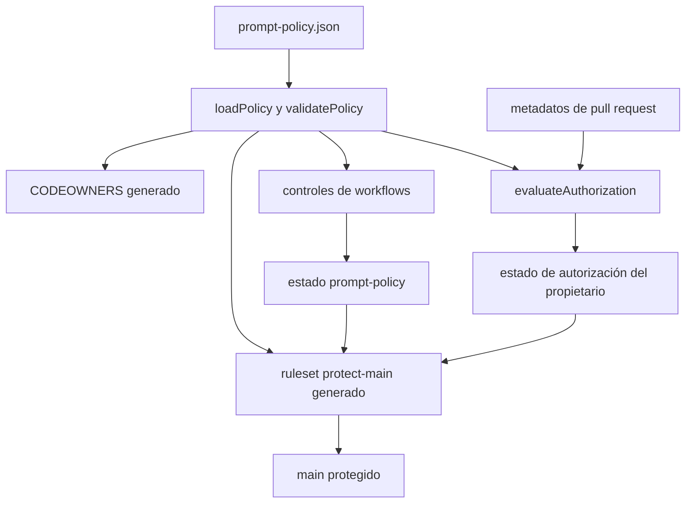

# Gobierno de cambios sensibles y política de prompt

Consulta esta página al modificar la política del prompt, GitHub Actions, `apps/mobile`, instrucciones para agentes, la automatización de OpenWiki, los manifiestos npm o cualquier otra ruta sensible. Es un control del repositorio, no parte del entorno de ejecución local-first de la aplicación: protege, entre otras cosas, la fuente remota `prompts/AGENTS.md` que el [entorno de ejecución del agente](../agent/runtime.md) carga como texto privilegiado.

## Fuente de verdad y superficie generada

`.github/prompt-policy.json` es la fuente declarativa. Define `schemaVersion`, la rama `main`, el propietario, los nombres de checks requeridos y cada frontera sensible con su tipo (`directory` o `file`). `scripts/prompt-policy/policy.mjs::loadPolicy` la lee y `validatePolicy` exige el propietario, la rama, los checks y las fronteras obligatorias antes de usarla.

La política produce dos artefactos que no se editan manualmente:

| Origen | Relación | Destino | Contrato |
| --- | --- | --- | --- |
| `.github/prompt-policy.json` | `renderCodeowners` genera | `.github/CODEOWNERS` | Cada ruta sensible queda asignada al `codeowner` de la política. |
| `.github/prompt-policy.json` | `createRuleset` y `renderRuleset` generan | `.github/rulesets/protect-main.json` | Protege la rama por defecto contra borrado y avance no rápido, exige resolución de hilos y requiere `prompt-policy` y `gymnasia/owner-authorization`. |
| Política y workflows | `assertWorkflowPolicy` verifica | workflows de `.github` y de la plantilla de OpenWiki | Las acciones se fijan por SHA, las PR no leen secretos ni tienen permisos de escritura y el único `pull_request_target` permitido es el de autorización. |



*La política declarativa genera los límites de propiedad y de rama; la autorización evalúa solo metadatos de la PR y ambos estados forman parte de la protección de `main`.*

La sincronización es intencional y estrecha:

```bash
npm run sync:prompt-policy
npm run check:prompt-policy
```

`sync:prompt-policy` ejecuta `scripts/prompt-policy/generate.mjs --write` y reescribe únicamente `CODEOWNERS` y el ruleset. `check:prompt-policy` usa `--check`: detecta deriva de esos archivos y también llama a `assertWorkflowPolicy`. Si cambia el esquema, una ruta o los checks, actualiza primero la fuente declarativa, regenera los artefactos y confirma la validación; no corrijas una salida generada a mano.

## Autorización de una pull request

`.github/workflows/owner-authorization.yml` usa `pull_request_target`, programación cada cinco minutos y ejecución manual. Comprueba el SHA base de confianza, nunca el head de la PR, y ejecuta `scripts/prompt-policy/reconcile-owner-authorization.mjs`. El script consulta mediante la API de GitHub el autor, el SHA head, los archivos y las revisiones; después `evaluateAuthorization` publica el estado configurado por `checks.ownerAuthorization`.

| Caso | Estado publicado | Invariante |
| --- | --- | --- |
| La PR no toca una ruta sensible | `success` | El merge sigue siendo manual; este check no aprueba ni fusiona. |
| El autor es el propietario configurado y toca rutas sensibles | `success` | La identidad se comprueba por `login` **e** ID numérico. |
| Autor externo con rutas sensibles y sin aprobación vigente | `pending` | No queda autorizado hasta una revisión del propietario. |
| Autor externo con `APPROVED` del propietario para el SHA head actual | `success` | Una aprobación de un SHA anterior no cuenta. |
| La última revisión decisiva del propietario para ese SHA es `CHANGES_REQUESTED` o `DISMISSED` | `pending` | La última decisión decisiva prevalece; los comentarios no cambian el resultado. |

El workflow tiene solo `contents: read`, `pull-requests: read` y `statuses: write`. El validador rechaza que un workflow de PR lea secretos o tenga permisos de escritura, y rechaza que el workflow privilegiado ejecute checkout de código no confiable. No añadas checkout del head, `npm ci`, secretos ni lógica procedente de una PR a `owner-authorization.yml`: cambiaría su límite de confianza.

## Receta de cambio

1. Localiza si la ruta debe ser sensible en `.github/prompt-policy.json::sensitivePaths`. Mantén rutas relativas; los directorios terminan en `/` y los archivos no.
2. Si cambia la política, conserva `schemaVersion: 1`, `defaultBranch: "main"`, el propietario y el catálogo de checks que `validatePolicy` exige, salvo que el código y las pruebas de la política cambien de forma coordinada.
3. Ejecuta `npm run sync:prompt-policy`; revisa el diff de `.github/CODEOWNERS` y `.github/rulesets/protect-main.json` como salidas derivadas.
4. Ejecuta `npm run check:prompt-policy` y `npm run test:prompt-policy`. La segunda batería cubre clasificación de rutas, descendientes, falsos prefijos, autorización por autor/revisión/SHA, determinismo de artefactos y restricciones de workflows.
5. Si cambias `prompts/AGENTS.md`, además sigue la receta de [Seguridad sanitaria y transparencia de IA](../agent/health-safety.md): sincroniza y verifica el snapshot integrado con `npm run sync:chat-prompt` y `npm run check:chat-prompt`; ejecuta también `npm run check:health-safety` porque el prompt contiene su bloque sanitario gestionado. La protección de la ruta no prueba la paridad ni el comportamiento del prompt.
6. Para un cambio que alcance `apps/mobile` o el prompt integrado, añade los controles del agente que correspondan en [compilación, publicación y pruebas](build-release-and-testing.md); `check:prompt-policy` solo verifica gobierno y configuración.

## Límites y riesgos

- La protección efectiva del ruleset se aplica en GitHub; el JSON versionado es su payload generado, no una prueba de que la configuración remota esté aplicada. Tras un cambio de política, comprueba el ruleset y los estados reales en GitHub.
- `CODEOWNERS` se genera, pero el ruleset no exige `require_code_owner_review`; la autorización efectiva de cambios sensibles procede del estado `gymnasia/owner-authorization` y su evaluación del SHA.
- El check de autorización no fusiona PR, no concede permisos de contenido y no lee secretos. Evita convertirlo en un ejecutor de pruebas: esa separación reduce el riesgo de `pull_request_target`.
- La política cubre todo `apps/mobile/` porque el shell contiene la composición y el cargador del prompt. No infieras que una ruta aparentemente ajena al prompt es pública sin actualizar la política y sus pruebas.
- La página de gobierno existente `docs/security/prompt-policy-governance.md` aporta el procedimiento humano de emergencia y seguridad de la cuenta; este documento es la guía técnica navegable y basada en código. Ante discrepancia, la política, los scripts y las pruebas ejecutables prevalecen.

## Validación proporcional

| Alcance | Comando mínimo | Cuándo ampliar |
| --- | --- | --- |
| Cambio en la política, generador, artefactos o workflow de gobierno | `npm run check:prompt-policy && npm run test:prompt-policy` | Añade `npm test` y TypeScript si la modificación también alcanza `apps/mobile` o el prompt integrado. |
| Solo `prompts/AGENTS.md` | `npm run check:chat-prompt` | Añade `npm test` si cambia contratos/herramientas o pruebas del agente. |
| Cambio de seguridad que afecta a los controles obligatorios | `npm run check:prompt-policy && npm run test:prompt-policy` | En CI se ejecutan además snapshot del prompt, batería determinista, OpenWiki y TypeScript; no son necesarios para una iteración exclusiva de la política. |

Las comprobaciones amplias y la configuración de CI se detallan en [compilación, publicación y pruebas](build-release-and-testing.md).