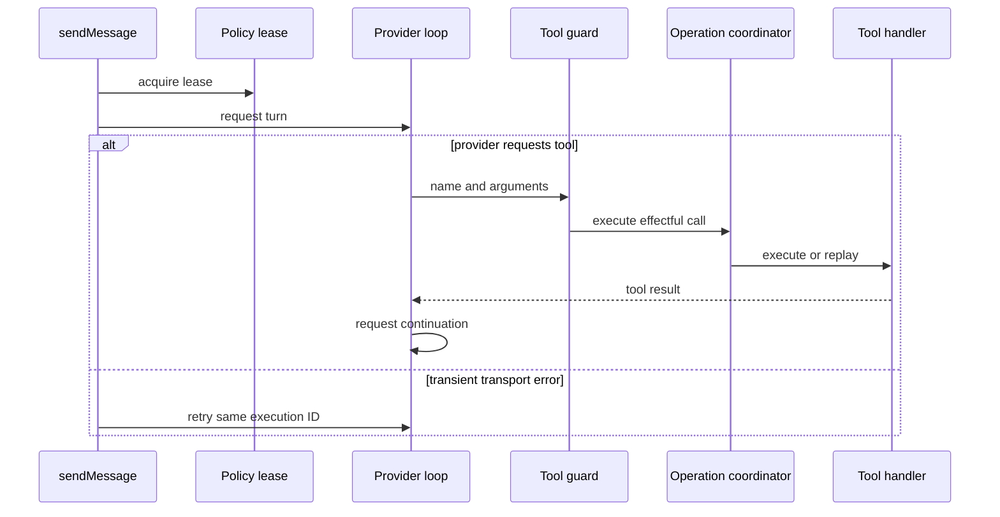

# Comportamiento en ejecución y oportunidades

Esta página es la única vista consolidada para contrastar la evidencia LangSmith del agente móvil con su implementación. No sustituye [Runtime del agente y herramientas](../agent/runtime.md), que documenta el contrato estático; enlaza además con [Streaming de proveedores](../agent/provider-streaming.md), [Configuración BYOK de proveedores](../agent/provider-configuration.md), [Estado local y copias](../mobile/local-state-and-backup.md) y el [Worker de feedback](../services/feedback-worker.md).

## Contrastes anclados en código

Antes de interpretar latencia, tokens o repeticiones, compruebe estos límites y supuestos ejecutables:

- **Forma y tamaño de contexto Google.** Aunque `sendMessage` entrega a Google todo el historial filtrado, `prepareGoogleInteractionRequest` lo divide por entradas de usuario, conserva como máximo los diez intercambios más recientes, retira imágenes de intercambios anteriores y limita la petición a 512 KiB sin imágenes y 19 MB totales. Si ni un único intercambio cabe, rechaza la petición antes de red. Por tanto, atribuir tokens o tamaño a «todo el historial» es incorrecto: el informe de contexto es la frontera efectiva. [Código: `prepareGoogleInteractionRequest`](repo://apps/mobile/agent/googleContextBudget.ts#L181-L271), [envío desde `sendMessage`](repo://apps/mobile/App.tsx#L4886-L4887).
- **Reintento de turno, no de efecto.** El chat prueba hasta tres intentos solo para firmas transitorias de transporte y espera 2 s y 4 s antes de los intentos segundo y tercero. Reutiliza el id del mensaje de usuario como `executionId`; las escrituras se coordinan por esa identidad. Una multiplicidad de llamadas remotas puede ser reintento o continuación y no prueba una multiplicidad de mutaciones. [Código: `sendMessage`](repo://apps/mobile/App.tsx#L4911-L4945), [identidad de operación](repo://apps/mobile/agent/toolOperationLedger.ts#L147-L168).
- **Fallback instalado.** En React Native, la ruta Google de XHR con progreso vuelve a solicitar el turno mediante XHR buffered solo si falla antes de emitir contenido visible; no aplica tras empezar a mostrar contenido. Es una segunda llamada posible que una traza de proveedor puede revelar, y no debe confundirse con una ronda de tools. [Código: `requestGoogleInteraction`](repo://apps/mobile/agent/googleStreamTransport.ts#L28-L80).
- **Supuesto de rondas.** Cada proveedor ejecuta secuencialmente las calls de una ronda. El máximo por defecto es `MAX_TOOL_ROUNDS = 10`; Google lanza error si sigue pendiente, mientras OpenAI y Anthropic retornan el último turno cuando agotan su bucle. OpenAI necesita `responseId`; Google rechaza reutilizar IDs de tool entre rondas nuevas. [Código: `providerToolLoop`](repo://apps/mobile/agent/providerToolLoop.ts#L8-L71), [OpenAI](repo://apps/mobile/agent/providerToolLoop.ts#L117-L161), [Anthropic](repo://apps/mobile/agent/providerToolLoop.ts#L186-L227).
- **Efecto durable y recuperación.** Solo una llamada del handler a `markEffectCommitted` genera estado `committed`; una excepción se convierte en resultado controlado y queda como `failed_before_commit`, salvo que el handler ya hubiera marcado commit o indeterminación. Para escrituras, el ledger se prepara y verifica antes del efecto; una lectura corrupta o fallida impide llegar al handler. [Código: `createDetailedAgentToolExecutor`](repo://apps/mobile/agent/toolExecutor.ts#L731-L781), [coordinación](repo://apps/mobile/agent/toolOperationLedger.ts#L576-L665).



*El diagrama resume fronteras de control verificadas; no representa una traza ni contenido conversacional.*

## Muestra LangSmith y privacidad

La configuración apunta al endpoint europeo y declara `gymnasia-app-agent`, `gymnasia-food-agent` y `openwiki`; esa configuración no demuestra tráfico. [Configuración](repo://openwiki/.langsmith.json#L1-L18).

### Observado

No hay ítems crudos de LangSmith legibles mediante los recursos disponibles en esta actualización. Por ello no se publican conteos de llamadas, latencias, tokens, coste, URLs de trazas, secuencias ni repeticiones; tampoco se observó una clase de fallo, outlier o capacidad sin ejercitar. No se infieren resultados desde el código ni desde la configuración.

Cuando haya dump autorizado, registre únicamente agregados: ventana, filtros, número de runs, proveedor/ruta/estado, llamadas, latencia por tool, tokens de entrada/salida, coste y repeticiones por `executionId`, tool y ocurrencia. Nunca copie prompts, entradas, salidas, argumentos de tools ni razonamiento.

La extracción usa buckets `error`, `outlier` y `baseline`: su composición está sesgada por diseño y no es una tasa de flota. Las medianas de `baseline` solo son referencia normal de esa muestra, no objetivo ni garantía.

### Correlacionado

- `sendMessage` adquiere un único `AgentPolicyLease` antes de clasificar y preparar el turno. El lease profundo-congelado contiene prompt, política sanitaria, contexto y estado; una política sanitaria firmada incompatible falla al crear el lease. [Código: `sendMessage`](repo://apps/mobile/App.tsx#L4773-L4783), [`acquireAgentPolicyLease`](repo://apps/mobile/agent/agentPolicyRuntime.ts#L108-L123), [`createSignedAgentPolicyLease`](repo://apps/mobile/agent/agentPolicyRuntime.ts#L126-L171).
- Una decisión sanitaria bloqueante evita contactar al proveedor. Para cada tool, `executeGuardedTool` obtiene su efecto y reclasifica nombre y argumentos; una tool desconocida o no autorizada devuelve un bloqueo y no alcanza el coordinador ni el ejecutor. El evaluador remoto opcional vence a los 10 s y, ante error o respuesta inválida, conserva la decisión local. [Código: `callProviderChatAPIWithTools`](repo://apps/mobile/App.tsx#L1626-L1709), [`evaluateHealthSafetyWithProvider`](repo://apps/mobile/App.tsx#L1564-L1623).
- OpenAI y Anthropic reciben los últimos 20 mensajes tras excluir divulgaciones locales. Google parte del historial completo filtrado en este nivel, pero su adaptador impone el presupuesto indicado arriba; compare proveedor, intercambio enviado y tamaño efectivo antes de diagnosticar tokens de entrada. [Código: `sendMessage`](repo://apps/mobile/App.tsx#L4886-L4887), [presupuesto Google](repo://apps/mobile/agent/googleContextBudget.ts#L193-L271).
- Las escrituras se deduplican por versión, `executionId`, proveedor, nombre, argumentos JSON canónicos y ocurrencia, sin `providerCallId`; el coordinador une ejecuciones simultáneas y reproduce commits desde memoria o ledger. Las lecturas no se deduplican. El ledger mantiene hasta 256 entradas y los commits duran siete días; los estados no resueltos se conservan y bloquean expulsión por capacidad. [Código: identidad](repo://apps/mobile/agent/toolOperationLedger.ts#L147-L168), [coordinador](repo://apps/mobile/agent/toolOperationLedger.ts#L460-L665), [retención](repo://apps/mobile/agent/toolOperationLedger.ts#L76-L79), [pruebas](repo://apps/mobile/agent/toolOperationLedger.test.ts#L205-L285).

### Hipótesis de diagnóstico

1. **Latencia o coste alto con múltiples llamadas:** separar reintentos de transporte, fallback buffered de Google y continuaciones de tools por `executionId`, proveedor y ronda antes de optimizar un handler.
2. **Tool repetida con un solo efecto durable:** verificar si fue unión `inFlight`, replay de memoria o replay del ledger. `no_effect` y `failed_before_commit` se pueden ejecutar de nuevo porque descartan el `prepared`.
3. **Error tras una escritura:** revisar primero el recibo de dominio y la reconciliación. Un fallo en el registro final no prueba rollback; el coordinador reconcilia y, si no confirma, devuelve estado indeterminado para evitar duplicar.
4. **Tokens de Google inesperados:** inspeccionar el `GoogleContextReport` agregado —intercambios enviados, bytes y razones—, no el contenido. Una aproximación a 10 intercambios, 512 KiB o 19 MB justifica cambiar presupuesto o UX; sin ella, no atribuya causalidad al adaptador.

## Runtime findings & opportunities

No hay hallazgos priorizados basados en trazas en esta actualización: no hay evidencia agregada legible que permita emparejar una observación con código e implicación. En particular, no se afirman fallos, outliers, límites alcanzados, coste ni capacidades no ejercitadas.

Al refrescar la muestra, ordenar solo hallazgos que incluyan:

1. **Observado:** agregado volátil de traza —bucket, llamadas, latencia, tokens, coste o repetición— sin contenido sensible.
2. **Correlacionado:** archivo y símbolo leídos que establecen una ruta o límite relevante.
3. **Hipótesis:** causalidad propuesta, marcada como tal si la traza no la prueba.
4. **Implicación:** prueba, instrumentación o frontera concreta que quien modifique esa zona debe preservar.

## Cambios seguros y validación focalizada

1. Mantenga el lease como snapshot único del turno; no combine prompt, política sanitaria o `PolicyContext` de selecciones distintas.
2. Al cambiar Google, preserve el informe de contexto y pruebe tanto reducción como rechazo; no quite el fallback XHR sin una prueba de plataforma que cubra fallo previo a contenido visible.
3. Una tool nueva requiere definición, efecto, handler, adaptación de continuación y reconciliador si escribe. Marque el commit inmediatamente después de la mutación durable y su recibo.
4. No incorpore `providerCallId` a la identidad ni elimine `occurrence`: el primero cambia con reintentos remotos y el segundo distingue calls idénticas intencionales.
5. Instrumente solo agregados de proveedor, ruta, rondas, duración, reporte de contexto y estado de commit; nunca contenido sensible ni razonamiento.

Ejecute desde la raíz:

```bash
npx vitest run --config apps/mobile/vitest.config.mts apps/mobile/agent/agentPolicyRuntime.test.ts apps/mobile/agent/googleInteractions.test.ts apps/mobile/agent/providerToolLoop.test.ts apps/mobile/agent/toolExecutor.test.ts apps/mobile/agent/toolOperationLedger.test.ts
```

Estas pruebas fijan contratos locales de lease, presupuesto Google, loops, commits e idempotencia; no prueban disponibilidad, latencia ni coste de proveedores remotos.
